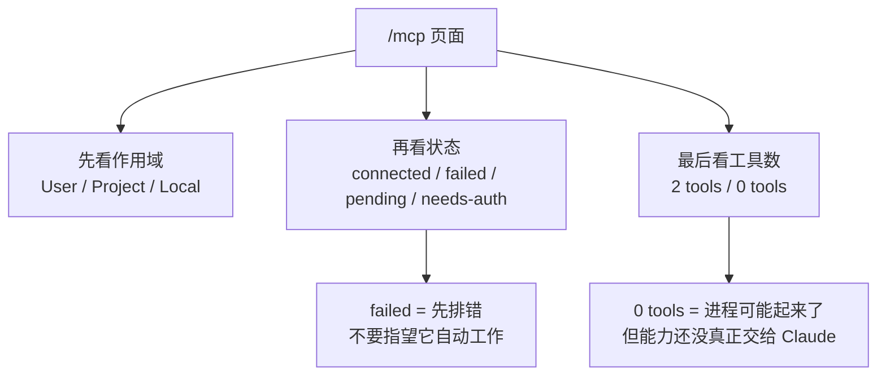
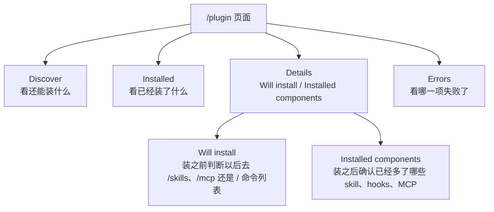
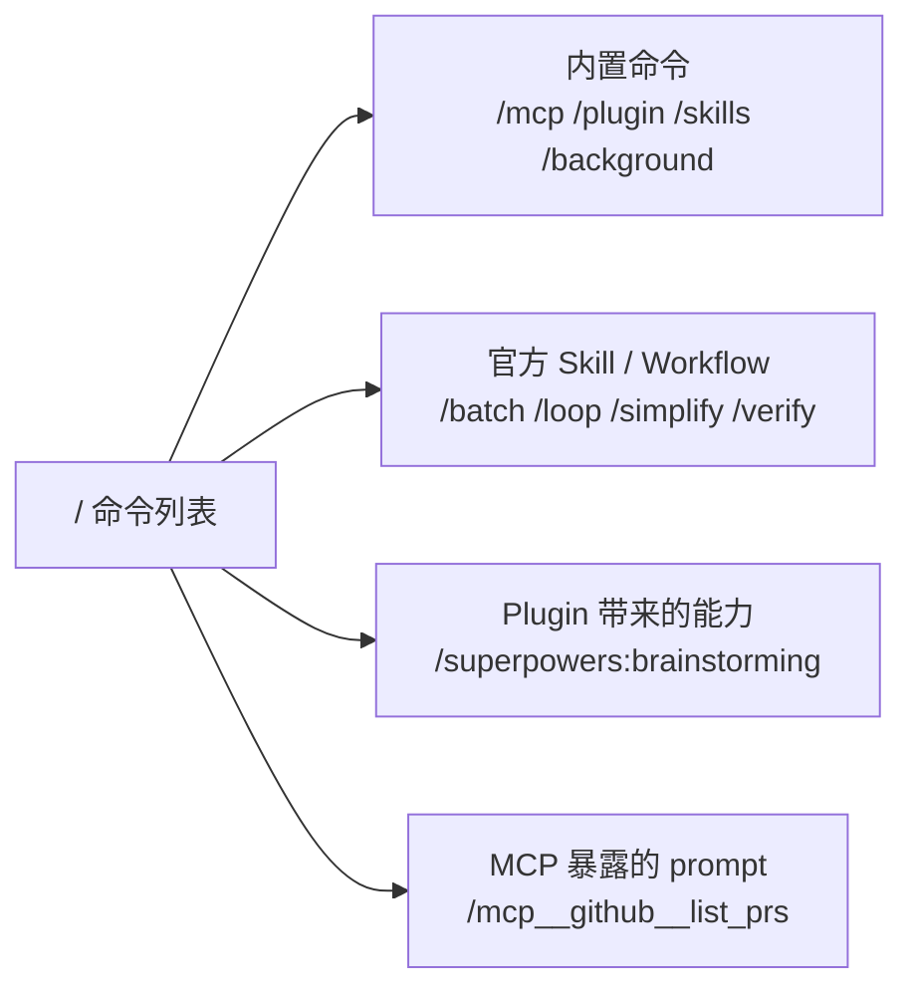
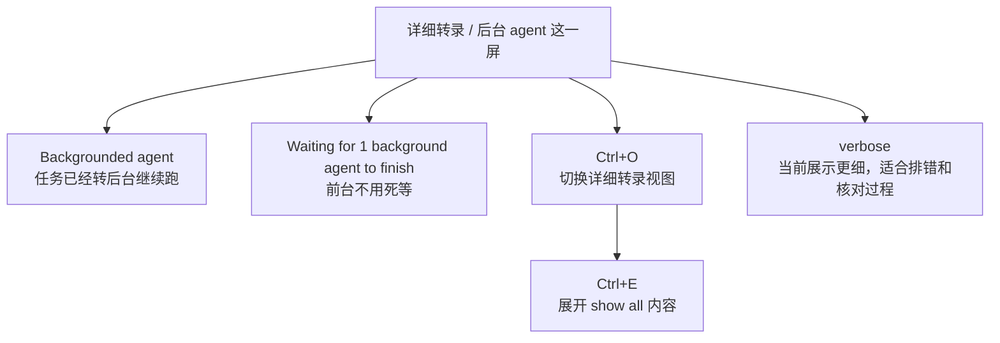

# 第六篇：Claude Code 的 Skills、MCP、Plugin 界面怎么读、命令怎么用与怎么排错

> 这一篇不是再给你讲一遍抽象概念。  
> 这一篇是专门解决一种很真实的程序员状态：东西装上了，终端也能打开，但满屏英文、状态词、命令名、插件名，看着像都认识，合起来就是不知道自己现在到底能不能用、该怎么用。

[[toc]]

---

## 这篇到底帮你解决什么

如果主人现在的感受是下面这种：

- 我装了 MCP、skills、plugins
- `/` 一敲出来一堆命令，但不知道哪些是官方内置，哪些是我后来装出来的
- `/mcp` 里看见 `connected`、`failed`、`2 tools`，不知道分别说明什么
- `/skills` 里看见 `plugin`、`locked by plugin`、`~40 tok`，不知道这些英文到底在表达什么
- `/plugin` 里又有 `Discover`、`Installed`、`Marketplaces`、`Errors`，更懵

那这篇就是给这个状态写的。

你先记住一句总判断：

- `/mcp` 看“外部工具连没连上”
- `/skills` 看“Claude 现在知道哪些技能”
- `/plugin` 看“这些能力是从哪装进来的、有没有启用、有没有报错”
- `/` 命令列表看“这一局会话里你现在到底能直接敲什么”

---

## 先用一句人话，把这三层分开

你之前并不是不懂概念，而是实际界面里它们挤在一起了。

### MCP

MCP 可以理解成“Claude 新接上的外部工具接口”。

比如：

- 查官方文档
- 连浏览器
- 连 GitHub
- 连数据库

所以 `/mcp` 本质上是在看：这些外部能力活没活着。

### Skill

Skill 可以理解成“Claude 的一套可复用工作套路”。

比如：

- 前端重构怎么拆步骤
- 系统化排错怎么问
- 验证完成前该检查什么

所以 `/skills` 本质上是在看：Claude 当前有哪些“套路卡片”可用。

### Plugin

Plugin 可以理解成“把 skill、MCP、hooks、agents 打包安装进来的容器”。

所以 `/plugin` 本质上是在看：这些扩展是谁带进来的、是否启用、是否有错误。

---

## 一、`/mcp` 页面怎么读

你截图里最关键的几行，实际上已经把信息说得很清楚了，只是它用的是终端式英文。

先用一张文字图，把 `/mcp` 页面真正的阅读顺序固定下来：



### `Manage MCP servers`

意思是：

- 管理 MCP 服务器

这里的 server 不要脑补成“远程大服务器”。  
在 Claude Code 语境里，它就是一个对外能力入口。它可以是：

- 本地启动的进程
- 远程 HTTP 服务
- 需要 OAuth 登录的连接器

### `2 servers`

意思是：

- 当前 Claude Code 发现了 2 个 MCP 服务

注意这是“发现了两个服务”，不是“两个命令”，更不是“两次连接”。

### `User MCPs (C:\Users\HN246\.claude.json)`

这行特别重要。

它告诉你两件事：

- 这一组 MCP 是 `User` 作用域，不是项目级
- 它们的配置来自你的用户配置文件 `C:\Users\HN246\.claude.json`

按 Claude Code 官方文档，MCP 常见有三种作用域：

- `User`：你这个账号下所有项目都能用
- `Project`：当前仓库可用，通常会写进项目根目录的 `.mcp.json`
- `Local`：只对你当前这个项目私有可见

所以以后你看见这一行，第一反应就该是：

- 原来这不是项目自带的，是我自己账户层装进去的

### `chrome-devtools · failed`

这行的意思不是“你装错了”，而是：

- 这个 MCP 项已经被识别到了
- 但当前会话里它没有成功连上或启动成功

`failed` 在这里可以简单理解成：

- 启动失败
- 连接失败
- 初始化失败

按官方排障文档，最常见的几类原因是：

- 启动命令本身有问题
- 路径写错了
- 相对路径是相对你启动 `claude` 的目录，而不是相对 `.mcp.json`
- 服务进程起来了，但没正确返回工具列表

如果你看到的是浏览器类 MCP 失败，那对你最直接的影响就是：

- 页面打开
- DOM 检查
- 截图
- 浏览器自动化验收

这类能力这局基本就别指望它正常出手了，先修连接问题。

### `context7 · connected · 2 tools`

这一行是“好消息”。

它表示：

- `context7` 这个 MCP 已经连接成功
- 它当前向 Claude 暴露了 2 个可调用工具

`2 tools` 不要理解成“两个页面”或“两个插件功能页”，它更准确的意思是：

- 这个 MCP server 现在提供了 2 个工具能力给 Claude 调用

所以这行翻成大白话就是：

- `context7` 现在是活的，而且 Claude 已经拿到它的两个可用工具了

如果你的目标是“查官方文档再改代码”，那看到 `context7 · connected`，就说明这一类能力已经通了。

### `Run claude --debug to see error logs`

这句的意思是：

- 用调试模式启动 Claude Code，去看更详细的错误日志

对程序员来说，这句话很实用，因为它不是废话提示，它是在告诉你：

- 现在这个 UI 只告诉你“失败了”
- 真正失败原因要去 debug log 里看

最常用的就是：

```bash
claude --debug
```

如果你怀疑就是 MCP 层的问题，官方排障文档也建议进一步看：

```bash
claude --debug mcp
```

### `/mcp` 里常见状态词速读

- `connected`：已连上，可以用了
- `failed`：没连成，先排错，别指望它自动工作
- `pending`：正在连接中，别急着下结论
- `needs-auth`：服务本身没坏，但还缺登录或 OAuth 授权
- `disabled`：当前被禁用，Claude 不会用它

### 你看到 `/mcp` 后最该怎么判断

只看三件事就够了：

1. 它在哪个作用域
2. 它现在是 `connected` 还是 `failed`
3. 它后面有没有工具数量，比如 `2 tools`

如果一项是：

```text
server-name · connected · 0 tools
```

那就说明：

- 服务进程可能起来了
- 但没有把工具列表正确交给 Claude

这时不要误以为“已经好了”，它其实还是半残状态。

---

## 二、`/skills` 页面怎么读

`/skills` 不是“我安装了哪些插件”的页面。  
它更像是：

- Claude 当前能看到哪些技能
- 这些技能现在对 Claude 可见到什么程度

### `14 skills`

意思是：

- 当前会话一共发现了 14 个 skills

这里的 14，不一定都来自你手动写的 `.claude/skills`。

它们可能来自：

- Claude 自带
- 你用户目录下的 skill
- 当前项目里的 skill
- 某个 plugin 打包带进来的 skill

### `superpowers:brainstorming`

这类带冒号的名字，程序员一眼就该警觉：

- 这是带命名空间的 skill

按官方插件文档，plugin 提供的 skill 会带上插件命名空间，例如：

```text
/my-plugin:hello
```

所以你这里的：

```text
superpowers:brainstorming
```

基本就表示：

- 这是 `superpowers` 这个插件带进来的一个 skill
- skill 名是 `brainstorming`

也就是说，它不是 Claude Code 原生内置命令。

### `plugin`

这不是让你“安装插件”的按钮说明，而是在告诉你这个 skill 的来源：

- 这个 skill 来自 plugin

你可以把它理解成一个来源标签。

它在回答的问题是：

- 这是系统自带的，还是插件带来的

### `locked by plugin`

这句是很多人第一次看最懵的地方。

把它翻译成人话就是：

- 这个 skill 不归 `/skills` 单独管理
- 它是由 plugin 托管的
- 你如果要启用、禁用、卸载它，要去 `/plugin`

Claude Code 官方文档明确说了：

- `/skills` 里对 skill 可见性的切换，会写入 `skillOverrides`
- 但 plugin skills 不受这个机制控制
- plugin skills 要通过 `/plugin` 去管理

所以你看到 `locked by plugin` 时，不要继续在 `/skills` 里折腾，它已经在提示你“去上层容器处理”了。

### `~40 tok`、`~80 tok` 到底什么意思

这个词官方没有在 `/skills` 页面说明里逐字解释到每一行，但结合官方两处文档可以基本确定它的用途：

- `/skills` 支持按 `token count` 排序
- `/plugin details` 会展示插件组件的大致 token 成本

所以这里更合理的理解是：

- 这是这个 skill 的大致上下文成本估算

你可以把它先粗暴理解成：

- 这个 skill 被 Claude 认识和使用时，大概会占掉多少上下文预算

它不是：

- 你手动输入这条命令要额外充值多少
- 最终回答一定输出多少 token

它更像一个“这张技能卡有多重”的估算值。

### `Space to cycle, Enter to save, / to search, t to sort, Esc to cancel`

这行是终端交互提示，不是正文说明。

逐项读就行：

- `Space to cycle`：按空格，在几种可见性状态之间切换
- `Enter to save`：按回车，保存你刚才的切换
- `/ to search`：按 `/`，搜索 skill
- `t to sort`：按 `t`，按 token 成本排序
- `Esc to cancel`：按 `Esc`，取消退出

对于程序员来说，这一行真正有价值的是：

- `/skills` 不是只读页面，它是可配置页面

### 你按空格切换时，实际在改什么

按官方文档，`/skills` 会把结果写进：

```text
.claude/settings.local.json
```

对应的是 `skillOverrides` 配置。

常见状态有四种：

- `on`：名字和描述都对 Claude 可见，也会出现在 `/` 菜单里
- `name-only`：Claude 只看到名字，看不到完整描述
- `user-invocable-only`：Claude 不会自动调用，但你还能手动从 `/` 菜单里调用
- `off`：Claude 看不到，你也不能从 `/` 菜单里调

所以 `/skills` 不是拿来看热闹的，而是在调“Claude 平时能看到多少技能上下文”。

### `Plugin skills are managed via /plugin`

这句其实就是上面那句 `locked by plugin` 的正式说明版。

翻成大白话：

- 这些由插件带进来的 skills，不归 `/skills` 这个页面管
- 你要管它们，去 `/plugin`

所以你如果装了一个前端插件，然后在 `/skills` 里看见它的 skill，但怎么按都不对，那大概率不是你手残，是你找错入口了。

---

## 三、`/plugin` 页面怎么读

`/plugin` 是主人现在最该熟的页面，因为它正好处在“我明明装了很多东西但不知道它们有没有真的进入工作流”的交界层。

先看这一张文字图，先把 `/plugin` 里几块最容易混的入口拆开：



### `Discover`

意思是：

- 浏览可安装插件

注意：

- 这不是“已安装列表”
- 这是“插件市场浏览页”

官方文档里把 marketplace 类比成 app store。  
你加了市场，不等于你装了里面所有插件。

### `Installed`

意思是：

- 已安装插件列表

这个页最适合回答三个问题：

- 这个插件到底装没装
- 当前是不是启用状态
- 它带来的 MCP 或 skill 有没有报错

### `Marketplaces`

意思是：

- 你当前加了哪些插件市场目录

这一页管的是“商店来源”，不是具体插件本体。

所以程序员要分清两个动作：

- `add marketplace`：只是加一个可浏览的插件目录
- `install plugin`：才是真把某个插件装进来

### `Errors`

意思是：

- 插件加载错误列表

这页非常值得看，因为很多时候你以为“插件装好了但不会用”，实际情况是：

- 插件装上了
- 但其中某个 MCP server 或依赖没正常启动

于是最后表现出来就是：

- 你能看见插件名字
- 但实际能力失灵

### `chrome-devtools MCP · failed`

这一行很容易被误读成“chrome-devtools 这个插件彻底坏了”。  
更准确的读法是：

- 这个插件或插件组件里带来的 MCP 服务，目前失败了

所以你该想到的是：

- 问题可能在这个 MCP 组件
- 不一定是整个插件完全不可见

### `superpowers Plugin · enabled`

这一行就比较直接：

- `superpowers` 这个 plugin 已安装
- 当前是启用状态

如果你前面在 `/skills` 里看到了很多 `superpowers:*`，那这里就是来源对上了。

### `context7 MCP · connected`

这说明：

- `context7` 这一项在插件管理视角里也是正常的
- 它的 MCP 连接已经建立成功

如果你是做开发时想先查官方文档，这一项正常，就意味着这一类工作流可以放心写进 prompt 里。

### `claude-plugins-official`

这是官方插件市场。

按 Claude Code 官方文档，它默认就会出现在安装里。  
所以你看到它，不是异常，而是正常。

它的意思是：

- 这是 Anthropic 官方提供的插件市场目录
- 你可以在 `Discover` 里直接浏览官方维护的插件

### `/plugin` 页面真正该怎么用

如果你安装完一个插件，却不知道“到底多了什么能力”，最稳的顺序是：

1. 进 `Discover` 或 `Installed`
2. 选中这个插件，按 `Enter`
3. 看它的详情页

官方文档明确说，插件详情页会展示：

- `Context cost`：大致会增加多少上下文成本
- `Will install`：它会带来哪些 commands、agents、skills、hooks、MCP、LSP

这一步特别关键，因为它能直接回答：

- 这个插件安装后，我以后到底该敲什么命令
- 它是给我加了 skill，还是加了 MCP，还是只加了某个 LSP

这里正好对应你截图里的两个高频判断：

- `Will install`：这是装之前最该看的，决定你后面到底去 `/skills`、`/mcp` 还是 `/` 命令列表
- `Installed components`：这是装之后最该看的，决定你现在已经多了哪些 skill、hooks、MCP 组件

### 什么时候需要 `/reload-plugins`

按官方文档：

- 你在会话中途安装、启用、禁用插件后
- 要运行 `/reload-plugins`

这样 Claude Code 才会在不重启终端的情况下把变化重新载入。

所以如果你刚装完插件就说“怎么没出来”，先别急着怀疑人生，先看看有没有 reload。

---

## 四、斜杠命令列表到底怎么看

你最容易混乱的地方，恰恰就是 `/` 一敲出来的那一大坨命令。

其实你只要先分来源，就不难了。

先把 `/` 命令列表按来源看成这 4 类：



### 第一类：Claude Code 内置命令

这类命令是 CLI 自己写死的功能。

典型例子：

- `/mcp`
- `/plugin`
- `/skills`
- `/agents`
- `/background`
- `/effort`
- `/export`
- `/status`
- `/permissions`
- `/doctor`
- `/init`

这类命令的特点是：

- 它们本身不是你后来安装某个插件才出现的
- 它们主要负责“管理、查看、切换、诊断”

### 第二类：Claude 官方自带的 skill 或 workflow

官方命令文档里明确区分了两类特殊命令：

- `Skill`
- `Workflow`

意思是有些看起来像命令的东西，本质上也是一种技能或工作流封装。  
比如某些 review、research、run、verify 类能力，就属于这一路。

所以你看到一个命令，不要默认它全都是“硬编码内置功能”。

### 第三类：插件带进来的命令或 skill

这类最常见的识别特征是：

- 名字带插件命名空间
- 或者你能在 `/plugin` 里找到它的来源

例如：

```text
/superpowers:brainstorming
```

这种一看就是插件技能，不是 Claude Code 原生命令。

### 第四类：MCP 暴露出来的 prompt 命令

官方 MCP 文档明确说：

- MCP server 可以暴露 prompts
- 这些 prompt 会出现在 `/` 命令列表里
- 格式通常是 `/mcp__servername__promptname`

所以如果你以后看到这种名字：

```text
/mcp__github__list_prs
```

你就应该立刻知道：

- 这不是内置命令
- 这是某个 MCP server 暴露出来的 prompt 入口

### 你现在这批奇怪命令，大概率是什么来路

你截图里像下面这类：

- `/using-superpowers`
- `/dispatching-parallel-agents`
- `/systematic-debugging`
- `/verification-before-completion`

它们大概率不是 `/mcp` 这种 CLI 管理命令。  
更像是：

- 某个插件带来的 skill / command
- 或某套工作流型能力暴露出来的入口

这时最稳的排查方式不是猜，而是反查来源：

1. 先到 `/plugin` 里看当前安装了哪些插件
2. 再到 `/skills` 里看有没有同名或同一命名空间的 skill
3. 再到 `/` 命令列表里搜索这个名字

只要这三处能对上，你就知道这条命令是谁带进来的了。

---

## 四点五、主人截图里这些命令哪些是官方的

这一段我专门去对了 2026-05-30 的 Claude Code 官方文档，主要看的就是：

- `commands`
- `sub-agents`
- `agents`
- `agent-view`
- `interactive-mode`

先给结论，不绕：

- 你截图里这批东西，大部分确实是官方的
- 但它们不全属于同一层
- 有的是官方内置命令
- 有的是官方自带 bundled skill
- 有的是后台会话的 shell 子命令

官方命令页还特别提醒了一句：

- 不是每个用户都会看到完全一样的命令列表
- 是否显示，取决于平台、套餐、环境和当前能力开关

所以你以后看见“我这里有，别人那里没有”，先别急着怀疑是插件冲突，也可能只是官方按环境做了显隐。

### 第一类：这些是官方内置命令

下面这些，官方命令总表里都能直接对上：

- `/add-dir <path>`
- `/agents`
- `/background [prompt]`
- `/effort [level|auto]`
- `/export [filename]`
- `/insights`
- `/tasks`

你可以这样理解它们：

### `/add-dir <path>`

这是官方内置命令，不是插件命令。

它的作用是：

- 给当前会话额外添加一个可访问目录

但这里有一个很容易踩坑的官方细节：

- 它主要增加的是文件访问权限
- 不是说你加了这个目录，里面的 `.claude/` 配置、subagent、skill 就会自动被发现

所以你看到它弹出输入路径的界面，本质上就是在问：

- 你要再给 Claude 临时开放哪个目录

### `/agents`

这是官方内置命令，不是第三方插件命令。

官方 `sub-agents` 和 `agents` 文档把它说得很明确：

- `/agents` 打开的是当前会话里的 subagent 管理界面

而且这个界面分两栏：

- `Running`：当前这一局里正在跑的 subagent
- `Library`：当前可用的 subagent 库

`Library` 那一栏官方文档明确写了会包含：

- built-in
- user
- project
- plugin

所以你截图里看到的：

- `Built-in (always available)`

正确读法就是：

- 这是 Claude Code 自带、始终可用的 subagent
- 不是你后来装插件才出现的

也就是说，如果你在这栏里看到 `claude`、`general-purpose`、`Plan` 这一类名字，不要先入为主地理解成“某个插件搞出来的”。

### `/background [prompt]`

这是官方内置命令，别把它归到 skill 里。

官方命令页的定义很直接：

- 把当前会话脱离当前终端，作为 background agent 继续运行
- 释放你当前这个终端

而且官方还明确写了：

- 它的别名是 `/bg`
- 后续用 `claude agents` 去监控这个后台会话

所以你截图里的：

- `Backgrounded agent`
- 后面出现一串 session id

这不是某个神秘插件行为，而是官方后台会话机制本身。

### `/effort [level|auto]`

这也是官方内置命令。

主人截图里那几个档位，官方命令页是直接写出来的：

- `low`
- `medium`
- `high`
- `xhigh`
- `max`
- `ultracode`

所以你看到 `low / medium / high / xhigh / max` 这种选择器，不是第三方扩展乱加的，是官方 effort 控制界面。

程序员最该记住两点：

- 它本质上是在调 Claude 这轮推理投入多少
- 不带参数时，官方会打开一个交互式 slider，让你左右切换档位

`auto` 的意思则是：

- 恢复模型默认 effort

### `/export [filename]`

这也是官方内置命令。

官方命令页写得很清楚：

- 它把当前对话导出为纯文本
- 如果你直接给文件名，就直接写入文件
- 如果你不带文件名，就会打开一个对话框，让你选择复制到剪贴板或保存到文件

所以你截图里 `/export` 下面那两个选项，正好就是官方这条命令的标准行为。

### `/insights`

这同样是官方内置命令。

官方给它的定义是：

- 生成一份 Claude Code 会话分析报告
- 里面会看项目区域、交互模式、摩擦点

所以它不是“灵感面板”那种泛泛概念，而是一个官方分析入口。

### `/tasks`

这也是官方内置命令。

它的定位是：

- 查看并管理当前会话里已经转到后台的任务

如果你前面已经用了：

- `/background`
- 后台 subagent
- 某些持续运行的任务

那 `/tasks` 就是当前会话层的观察口。

---

### 第二类：这些也是官方，但它们属于 bundled skill

下面这两个，官方命令页明确标成了 `Skill`，所以它们不是“第三方插件技能”，但也不完全等同于硬编码内置命令：

- `/loop [interval] [prompt]`
- `/simplify [target]`

### `/loop [interval] [prompt]`

这是官方 bundled skill。

官方定义很明确：

- 让一个 prompt 在当前会话里重复运行

几个实战点你最该记：

- 不写 `interval`，Claude 会自己控制两轮之间的节奏
- 不写 `prompt`，在支持的场景里，它会跑内置 maintenance prompt，或者去读 `.claude/loop.md`
- 官方示例就是：

```text
/loop 5m check if the deploy finished
```

所以你截图里那种：

- `/loop 5m check the deploy`

不是野生插件语法，而是官方 skill 的标准用法思路。

### `/simplify [target]`

这也是官方 bundled skill。

官方命令页对它的描述是：

- 对你改过的代码做一次“清理型 review”
- 会并行跑多个 review agent
- 重点看复用、简化、效率、抽象层次

还有一个非常关键的官方更新点：

- 从 `v2.1.154` 开始，`/simplify` 不再以“找 correctness bug”为主
- 如果你要查 bug，应该用 `/code-review`

所以程序员阅读它时，脑子里要分开：

- `/simplify`：更偏整理、瘦身、抽象层级
- `/code-review`：更偏 correctness 和问题发现

---

### 第三类：这些是官方后台会话的 shell 子命令

你截图里这一组：

- `claude agents`
- `claude attach <id>`
- `claude logs <id>`
- `claude stop <id>`

也是官方，不是插件产物。

官方 `agent-view` 文档甚至直接给了和你截图几乎同样的示例块。

它们分别表示：

- `claude agents`：打开 agent view，看所有后台会话
- `claude attach <id>`：把某个后台会话重新接回当前终端
- `claude logs <id>`：查看这个后台会话最近输出
- `claude stop <id>`：停止这个后台会话

这一组最容易和 `/agents` 混。

你一定要硬记住这个区别：

- `/agents`：当前会话里的 subagent 面板
- `claude agents`：全局后台 session 的 agent view

它们名字像，但官方文档明确说了：

- 这是两套不同入口

---

### 第四类：主人截图里这些英文标签到底是什么意思

有几组词，主人以后看到可以直接秒翻译。

### `Running`

在 `/agents` 里表示：

- 当前这局会话里，正在运行的 subagent

### `Library`

在 `/agents` 里表示：

- 你当前可用的 subagent 总库

这库里会混着：

- 内置的
- 用户级的
- 项目级的
- 插件带来的

### `Built-in (always available)`

这句最关键。

它的意思不是：

- 官方推荐你一直打开它们

而是：

- 这些 subagent 属于 Claude Code 自带
- 不依赖插件安装
- 默认总是可用

---

### 第五类：`Skill(update-config)` 这种权限提示到底该怎么读

这一项我得说得诚实一点：

- 我本轮没有在官方命令总表里找到一个公开给用户直接敲的 `/update-config`

所以它不适合被你记成：

- “又一个我要背的斜杠命令”

更稳的理解是：

- 这是某个 skill 在执行过程中触发的“更新配置”动作名
- Claude 现在正因为它要写配置文件，所以向你申请权限

这是我根据截图行为和官方配置相关文档做的推断。  
为什么这么推断？因为官方确实存在会改配置的 skill，例如：

- `/fewer-permission-prompts`

官方命令页明确写了它会：

- 扫描你的 transcript
- 然后往项目 `.claude/settings.json` 里添加 allowlist
- 用来减少权限弹窗

所以你以后再看到类似：

- `Skill(update-config)`

不要先把它理解成“我又安装了个我不会调用的新东西”，而更应该理解成：

- 某个 skill 现在想改配置
- Claude 正在问你允不允许它写设置文件

---

### 主人以后怎么最快判断“这个到底是不是官方”

现在你可以用一个很稳的四步法：

1. 先看它能不能在官方 `commands` 页直接搜到
2. 如果能搜到，再看它后面有没有被标成 `Skill` 或 `Workflow`
3. 如果是 `agents` 相关，再去 `sub-agents` 或 `agent-view` 对照它属于哪一层
4. 如果官方页有定义，但你当前机器没显示，不要先下结论，先想想是不是平台、套餐或环境开关不同

这样你以后看到一个新命令，就不会再停留在：

- 我大概见过
- 但我不知道这是官方的，还是插件加的

而能比较快地落到：

- 这是官方内置命令
- 这是官方 bundled skill
- 这是后台会话 shell 子命令
- 这只是某个 plugin 或 MCP 暴露出来的能力

---

## 五、`Ctrl+O` 详细转录、后台 agent 和 `verbose` 到底在看什么

这是主人这次补图里另一个特别有价值的点。  
很多人会用 Claude Code，但从来不看详细转录，所以总觉得它“像玄学”。

先把这一屏的阅读逻辑压成一张文字图：



这张图里最重要的几行，按官方 `interactive-mode`、`commands` 和 `fullscreen` 文档，可以这样理解：

### `Backgrounded agent`

意思是：

- 这个任务已经不在前台死等了
- 它正在后台继续跑

对应的官方命令主线一般是：

- `/background`
- 或把当前运行中的任务放后台

### `Waiting for 1 background agent to finish`

意思是：

- 当前还有 1 个后台 agent 没跑完
- 你现在可以继续做别的事，不必盯着这一屏

### `Showing detailed transcript`

意思是：

- 你现在看到的是详细过程视图
- 不是只看最终答案的简版视图

这是主人最该养成的习惯之一。  
因为很多“它到底有没有调用 skill / MCP / plugin”这种问题，只有在详细转录里最容易看清。

### `ctrl+o to toggle`

按官方 `interactive-mode` 文档：

- `Ctrl+O` 用来切换 transcript viewer

你可以把它简单理解成：

- 在“简版会话视图”和“详细过程视图”之间来回切

### `ctrl+e to show all`

按官方 `interactive-mode` 文档：

- `Ctrl+E` 用来在 transcript viewer 里切换 `show all content`

翻成人话就是：

- 本来折叠的过程内容，再给我展开一点

所以主人以后如果觉得：

- 我好像还是没看全
- 只看到摘要，没看到全部细节

那就先按：

- `Ctrl+O`
- 再按 `Ctrl+E`

### `verbose`

这不是单独一个插件名。  
你这里更适合理解成：

- 当前展示粒度偏详细
- 这屏更适合排错、核对过程、看 agent 真做了什么

---

## 六、你看到英文后，最快的三步判断法

---

以后不要一屏一屏地发愣，直接按这三步走。

### 第一步：先看“状态词”

先看它后面跟的是不是这些词：

- `connected`
- `failed`
- `enabled`
- `disabled`
- `needs-auth`
- `pending`

这一步回答的是：

- 它现在活不活

### 第二步：再看“来源词”

再看它旁边是不是这些词：

- `plugin`
- `MCP`
- `Skill`
- `Workflow`
- `marketplace`

这一步回答的是：

- 它到底属于哪一层

### 第三步：最后看“操作入口”

再看底部提示或页面说明，判断它该在哪一层处理：

- `/mcp` 里报错，就去看连接和授权
- `/skills` 里锁住，就去 `/plugin`
- `/plugin` 里装完没生效，就 `/reload-plugins`
- `/` 列表里能搜到，就代表你可以直接手动调用

这三步一走，大部分“这到底是啥”的焦虑就会立刻下降很多。

---

## 七、结合你这几张图，你当前真实状态是什么

这个部分我直接替你翻译成结论。

### 结论一：你的文档检索能力其实已经通了

因为你这里有：

```text
context7 · connected · 2 tools
```

这表示：

- `context7` 当前是可用的
- 它已经给 Claude 暴露了工具

所以以后你完全可以在 prompt 里明确写：

```text
先用 context7 查官方文档，再结合当前仓库给我修改方案。
```

### 结论二：你的浏览器能力当前没通

因为你这里有：

```text
chrome-devtools · failed
```

这表示：

- 浏览器相关 MCP 至少在当前会话没成功接起来

所以如果你让 Claude：

- 打开页面
- 看 DOM
- 做浏览器验收
- 截图

这类动作大概率不会顺畅，或者压根用不了。

### 结论三：你确实已经装了插件型技能，不是错觉

因为你在 `/skills` 里看到了很多：

```text
superpowers:xxx
```

而且旁边还有：

- `plugin`
- `locked by plugin`

这就说明：

- 这些不是你脑补出来的“概念”
- 它们确实已经进入 Claude Code 了
- 只是它们受插件层管理，不该在 `/skills` 里单独折腾

### 结论四：你现在真正缺的不是“继续安装”，而是“学会反查来源”

因为你眼前的问题已经不是“有没有扩展能力”，而是：

- 这个能力是哪来的
- 当前活没活
- 该去哪一层调用

这才是你说的那种“装完一脸懵”的本质。

---

## 八、装完之后，到底该怎么调用

这一段最重要，我尽量写成你以后可以直接照做的动作。

### 场景一：我想知道一个插件装完后到底多了什么

直接这样走：

1. `/plugin`
2. 进 `Installed`
3. 选中插件按 `Enter`
4. 看详情里的 `Will install`

如果里面写的是：

- skills
- commands

那你后面主要是在 `/` 命令列表里调用。

如果里面写的是：

- MCP servers

那你后面主要是在 `/mcp` 里确认连接状态，然后在自然语言 prompt 里让 Claude 用它。

### 场景二：我知道装了 skill，但不知道怎么叫它出来

直接这样走：

1. `/skills`
2. 搜这个 skill 名字
3. 看它是不是 `on`
4. 再回到 `/` 命令列表里搜索它

如果它是 plugin skill，注意名字可能带命名空间，例如：

```text
/plugin-name:skill-name
```

不要只搜后半截。

### 场景三：我知道装了 MCP，但不知道有没有真的能用

直接这样走：

1. `/mcp`
2. 看状态是不是 `connected`
3. 看后面有没有 `N tools`

只要不是 `connected`，就不要再指望它自动发挥。  
先修连接，再谈调用。

### 场景四：我就是不知道该怎么在 prompt 里说

这时不要只说：

```text
帮我改一下这个页面
```

你应该把“先用什么能力”说出来。

比如查文档：

```text
先用 context7 查这个库的官方文档，再结合当前仓库给我修改方案。
```

比如做页面验收：

```text
先用浏览器相关能力打开页面并检查首屏布局，再给我修改建议。
```

比如想强行触发某个 skill：

```text
请优先使用 systematic-debugging 这一类排错 skill，先列出假设，再给我最小验证步骤。
```

对你现在这个阶段来说，显式说出来，远比赌它自动猜中要稳得多。

---

## 九、主人现在最该背下来的英文词对照

- `connected`：连上了，可以用
- `failed`：失败了，先排错
- `pending`：还在连，先等等
- `needs-auth`：缺授权，不是功能坏了
- `disabled`：被关掉了
- `enabled`：已经启用
- `plugin`：来源是插件
- `marketplace`：插件市场目录
- `Discover`：浏览可安装项
- `Installed`：已安装列表
- `Errors`：错误列表
- `tools`：这个 MCP 暴露给 Claude 的工具数
- `locked by plugin`：这项不归 `/skills` 单独管，要去 `/plugin`
- `~40 tok`：大致上下文成本估算，不是“收费按钮”
- `Will install`：这个插件准备带进来什么能力
- `Installed components`：这个插件现在已经带进来什么能力
- `verbose`：当前过程展示更细，适合排错

---

## 十、以后你每次装完新东西，最小检查清单就按这个跑

1. 先去 `/plugin` 看它到底装进来了什么
2. 如果它带 skill，就去 `/skills` 看名字、状态和命名空间
3. 如果它带 MCP，就去 `/mcp` 看是否 `connected`
4. 回到 `/` 命令列表里搜一遍，确认有没有直接可调用命令
5. 真正开工时，把“先用哪个能力做什么”写进 prompt

你只要把这 5 步养成习惯，以后装 skill、MCP、plugin 就不会再是“看上去很强，但我不知道怎么调”的状态。

---

## 参考资料

- Claude Code 官方命令文档：https://code.claude.com/docs/en/commands
- Claude Code 官方 Skills 文档：https://code.claude.com/docs/en/skills
- Claude Code 官方 MCP 文档：https://code.claude.com/docs/en/mcp
- Claude Code 官方插件文档：https://code.claude.com/docs/en/plugins
- Claude Code 官方插件市场文档：https://code.claude.com/docs/en/discover-plugins
- Claude Code 官方 Subagents 文档：https://code.claude.com/docs/en/sub-agents
- Claude Code 官方并行 Agents 总览：https://code.claude.com/docs/en/agents
- Claude Code 官方 Agent View 文档：https://code.claude.com/docs/en/agent-view
- Claude Code 官方交互模式文档：https://code.claude.com/docs/en/interactive-mode
- Claude Code 官方 Model / Effort 文档：https://code.claude.com/docs/en/model-config
- Claude Code 官方 Scheduled Tasks 与 `/loop` 文档：https://code.claude.com/docs/en/scheduled-tasks
- Claude Code 官方配置排障文档：https://code.claude.com/docs/en/debug-your-config
