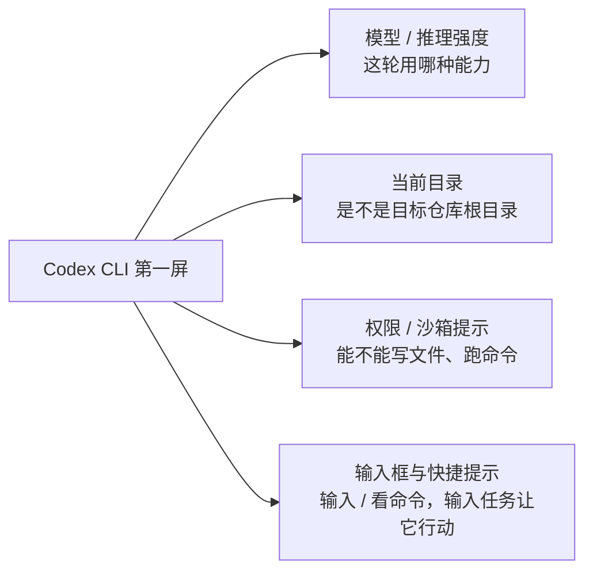
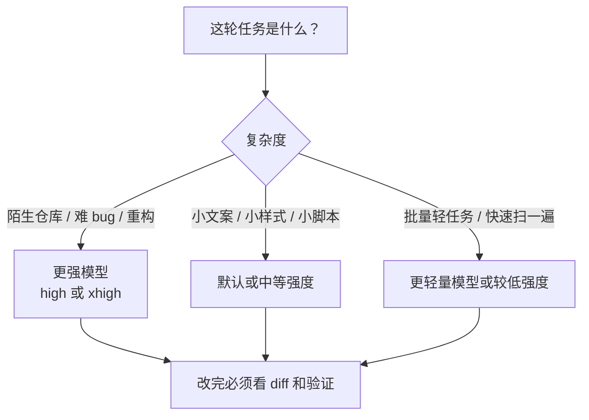
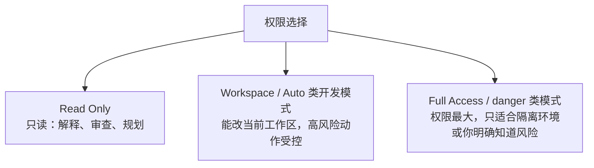
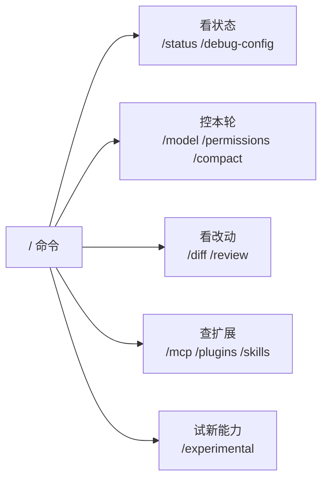
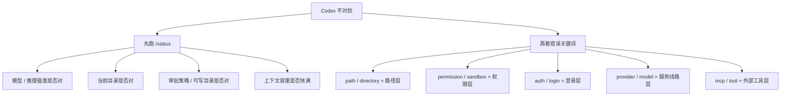
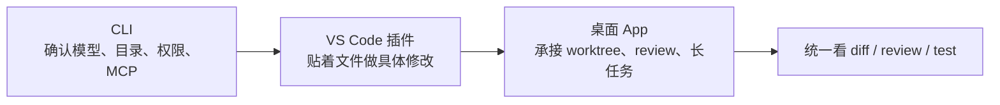

# 第一篇：Codex CLI 第一日开发实战

> 这篇只解决 4 件事：怎么确认装对、怎么进仓库、怎么看第一屏、怎么完成第一轮真实开发。  
> 配置字段、第三方线路、MCP 细节、桌面 App 深挖，都先放到后面的专题里查。

[[toc]]

---

## 先给结论

Codex CLI 对程序员来说，不是“聊天工具”，而是一个会读仓库、会调工具、会改文件、会跑命令的终端代码代理。

第一天最稳的路线不是背配置，而是先跑顺这条主线：

1. 确认当前生效的是哪一份 `codex`
2. 进入真实仓库启动，而不是在空目录里试
3. 看懂第一屏里的模型、目录、权限和提示
4. 先让它读项目，再做一个小改动
5. 改完看 `/diff`、跑测试、再决定是否继续放权

后面遇到字段再查字段，遇到线路再查线路。  
这比第一天就研究一整套 `config.toml` 稳得多。

---

## 1. 先确认安装与当前生效路径

安装或升级：

```bash
npm i -g @openai/codex@latest
codex --version
```

Windows 下再查一次路径：

```powershell
where.exe codex
```

macOS / Linux / WSL：

```bash
which codex
```

这一步很程序员，也很必要。  
因为后面很多“配置不生效”，根因不是配置错，而是 PATH 里跑的根本不是你以为的那一份 CLI。

如果你是在本博客仓库里执行 Node / npm / Vite 脚本，还要先跑一次项目预检：

```powershell
pwsh -File scripts/checkNodeRuntime.ps1
```

它是为了先排除当前代理终端里的 Node 加密提供程序异常。  
如果预检失败，不要重复敲 `npm`，先按仓库 `AGENTS.md` 里的运行时排障规则处理。

---

## 2. 第一次启动：别在空目录里学

Codex 真正有价值的地方在真实仓库里。

推荐这样：

```bash
cd your-project
codex
```

不推荐第一天在桌面空文件夹里反复问：

```text
你会做什么？
```

那样学不到 Codex 的核心能力。  
Codex 的手感来自“读项目 -> 定位文件 -> 修改 -> 验证”这条链。

---

## 3. 第一屏不用截图，用文字图抓重点

以后看到 Codex CLI 首页，先看这 4 块：



不要把欢迎语当正文读。  
真正影响第一轮任务的只有这些：

1. 模型是不是你想用的
2. 当前目录是不是目标仓库
3. 权限是不是足够但不过度
4. 你准备输入的是开发任务，不是普通闲聊

第一天养成一个习惯：  
每次启动 Codex，先扫模型、目录和权限，再输入任务。

---

## 4. 第一句 prompt：先读，不改

第一轮不要让它直接“大改项目”。  
先用这句：

```text
先不要修改任何文件。
请先阅读这个仓库，然后告诉我：
1. 这是个什么项目
2. 主要目录怎么分工
3. 开发入口、路由入口和构建脚本在哪里
4. 如果我要改首页或笔记详情页，先看哪几个文件
```

这句 prompt 的目的不是让 Codex 表演，而是验证三件事：

1. 它有没有读到正确仓库
2. 它有没有抓到项目结构
3. 它有没有乱猜入口文件

如果它第一轮就把项目说偏了，后面不要急着让它改。  
先纠正上下文。

---

## 5. 模型和推理强度：按任务切，不要背死

Codex 里用 `/model` 可以切模型；部分模型也会暴露推理强度选择。  
官方 slash commands 文档里，`/model` 的定位就是选择当前模型，以及在可用时选择 reasoning effort。

把它理解成这张文字图就够：



不要把某个模型名写死成永远答案。  
官方模型列表、账号能力、第三方网关开放模型都会变，落地前看当前 CLI 的 `/model`、`/status` 和服务商后台。

---

## 6. 权限模式：先稳，再快

第一天只记三层：



程序员日常最适合的心智是：

```toml
approval_policy = 'on-request'
sandbox_mode = 'workspace-write'
```

翻成人话：

1. Codex 可以改当前工作区
2. 真要做敏感命令、高风险动作、越界访问时先问你

如果只是让 Codex 看项目、解释代码、做 review，用只读就够。  
如果已经明确要它改文件，用工作区写权限。  
如果涉及删除、移动、安装依赖、跨目录访问、联网或全局替换，先停一下，看清提示再确认。

---

## 7. 第一天最该会的 slash 命令

先不要背完整命令表。  
第一天最常用的是下面这些：

| 命令 | 什么时候用 |
|---|---|
| `/status` | 看当前模型、审批策略、可写目录、上下文容量 |
| `/model` | 临时切模型或推理强度 |
| `/permissions` | 临时调权限 |
| `/diff` | 看 Codex 已经改了什么 |
| `/review` | 让 Codex 审查当前工作树 |
| `/mcp` | 看外部工具有没有连上 |
| `/plugins` | 看插件和插件来源 |
| `/skills` | 看当前可用的工作套路 |
| `/experimental` | 看实验能力，别默认全开 |
| `/debug-config` | 配置和策略不符合预期时看层级诊断 |
| `/compact` | 长会话压缩上下文 |

把命令按用途分，会比硬背轻松很多：



看到陌生命令时，不要猜来源。  
先去 `/status`、`/plugins`、`/skills`、`/mcp` 反查它属于哪一层。

---

## 8. 第一轮真实任务怎么练

按下面 4 步走，第一天就能建立正确手感。

### 8.1 先解释，不改

```text
先不要修改文件。
请解释首页是从哪里渲染出来的，涉及哪些路由、组件、数据文件和样式文件。
```

### 8.2 再定位一个小改动

```text
请只定位首页标题、副标题和列表数据的来源。
先不要修改，告诉我应该改哪几个文件，以及每个文件为什么相关。
```

### 8.3 再允许小范围修改

```text
现在开始修改：
1. 只改首页副标题文案
2. 不要改样式
3. 不要顺手重构
4. 改完后告诉我如何验证
```

### 8.4 最后看 diff 和验证

```text
请展示这次改动的 diff，并告诉我应该运行哪条测试或构建命令验证。
```

这套节奏比“帮我优化整个项目”稳定得多。  
程序员用 Codex，关键不是把任务一次性丢大，而是让边界清楚、验证闭环清楚。

---

## 9. `/status` 和错误提示：排错先定位层级

官方文档里 `/status` 用来确认当前模型、审批策略、可写目录和上下文容量。  
所以你觉得 Codex “不对劲”时，第一反应不是重装，而是先看 `/status`。



常见关键词可以这样翻：

| 关键词 | 优先怀疑 |
|---|---|
| `path` / `directory` | 路径不存在、Windows / WSL 路径混用 |
| `permission` / `sandbox` | 权限模式或沙箱限制 |
| `auth` / `login` | 登录态、API key、keyring |
| `provider` / `model` | 模型提供方或模型名不匹配 |
| `mcp` / `tool` | 外部工具启动失败或没授权 |
| `node` / `npm` | Node 运行时、PATH、代理终端环境 |

排错顺序：

1. `/status`
2. `/debug-config`
3. 当前目录和权限
4. 用户 `~/.codex/config.toml`
5. 项目 `.codex/config.toml`
6. 登录态、provider、MCP
7. 最后才考虑重装或升级

---

## 10. VS Code 插件、脚手架和桌面 App 怎么放进主线

主人平时 CLI、VS Code 插件、脚手架、桌面 App 都会用，建议这样分工：

| 入口 | 最适合干什么 | 不适合干什么 |
|---|---|---|
| CLI | 排错、读仓库、看状态、跑命令、核配置 | 长时间管理多条并行任务 |
| VS Code 插件 | 贴着代码改文件、引用当前编辑器上下文、处理局部 TODO | 脱离项目做大范围资料整理 |
| 脚手架 / 插件体系 | 把固定能力打包复用，比如 skills、MCP、项目模板 | 替代基础权限和配置理解 |
| 桌面 App | Worktrees、Review、内置终端、浏览器预览、长任务和本地/云端切换 | 忽略 Git 状态后直接全自动大改 |

最推荐的日常开发流：



如果三端表现不一致，先查这 4 个：

1. 三边打开的是不是同一个仓库
2. CLI 在 Windows-native 还是 WSL
3. `CODEX_HOME` 是否一致
4. 桌面 App 是否在 worktree，而 CLI 在原目录

---

## 11. 程序员第一周最容易踩的坑

1. 装了多份 Codex，却不知道 PATH 里哪份生效
2. 第一轮就让它大改，不让它先读项目
3. 没看 `/status`，就开始改 `config.toml`
4. 把“模型不合适”“权限不够”“路径不对”“MCP 没连上”混成一个问题
5. 改完只看回答，不看 `/diff` 和测试结果
6. 一上来研究第三方线路，反而没跑通基础工作流

---

## 12. 读完这篇后下一步看什么

如果主人刚跑通第一轮任务，下一步按这个顺序：

1. [第二篇：Codex CLI 英文终端界面翻译与排错](#/note/AI工具/02_终端Agent流/Codex/02_Codex_CLI英文终端界面翻译与排错)  
   解决“终端里这些英文、菜单、插件、skills、错误提示到底怎么看”。
2. [第三篇：Codex 配置总手册](#/note/AI工具/02_终端Agent流/Codex/03_Codex配置总手册)  
   解决“为什么配置会覆盖、为什么改了不生效”。
3. [第六篇：Codex 命令与配置文件速查](#/note/AI工具/02_终端Agent流/Codex/06_Codex命令与配置文件速查)  
   当命令和字段速查表用。
4. [第五篇：Codex CLI / 插件 / App 三端联动实战](#/note/AI工具/02_终端Agent流/Codex/05_Codex_CLI插件App三端联动实战)  
   解决 CLI、VS Code 插件、桌面 App 之间怎么联动。

第三方线路、rpcod、Packy、yunyi 这些不要放在第一天主线里硬背。  
等你真的要切线路时，直接去看第四篇这篇合并后的线路总手册就够了。

---

## 参考资料

- Codex CLI：<https://developers.openai.com/codex/cli>
- CLI Slash Commands：<https://developers.openai.com/codex/cli/slash-commands>
- Codex 配置：<https://developers.openai.com/codex/config-basic>
- Codex MCP：<https://developers.openai.com/codex/mcp>
- AGENTS.md：<https://developers.openai.com/codex/guides/agents-md>
- Codex use cases：<https://developers.openai.com/codex/use-cases>
