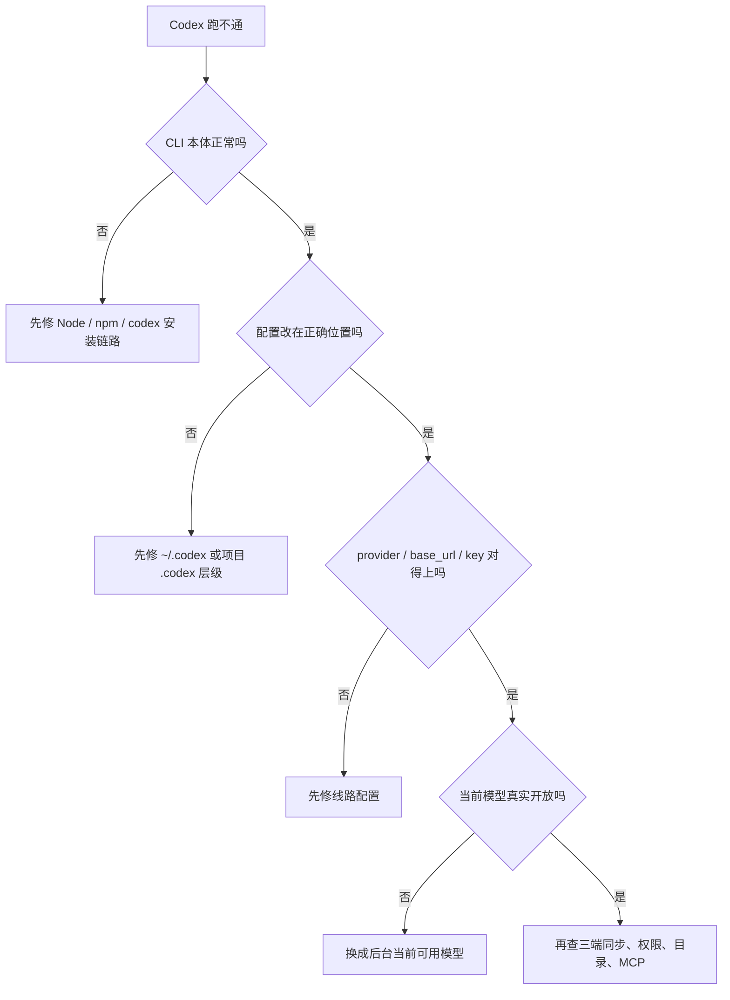
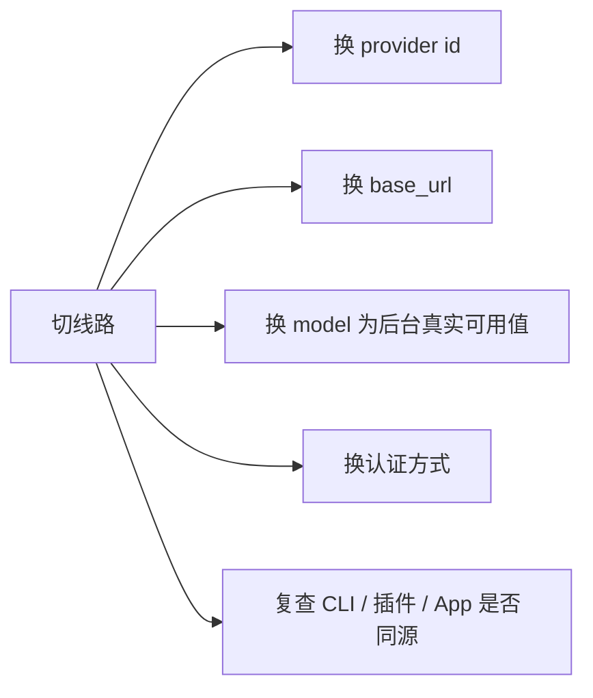

# 第四篇：Codex 多线路接入与迁移总手册

> 更新时间：2026-05-31  
> 定位：线路总手册。专门解决“我要走哪条线路、配置该怎么落、切线路时最容易在哪翻车”这些问题。  
> 前置建议：先读第一篇、第三篇、第五篇。先把 CLI 主线、配置层级和三端差异搞清，再来看线路，判断会稳很多。  
> 精简说明：rpcod 线路补充内容已经合并到本篇，专题不再单独保留历史跳转页。  
> 使用方式：不要从头硬背。先看第 1、2、3 节做选路，再跳到自己实际在用的 provider 模板与排错小节。

[[toc]]

---

## 1. 先讲结论：为什么现在应该把几篇线路文合成一篇

主人前面提得很对，线路文最容易写碎，结果就是：

1. 一篇讲官方
2. 一篇讲 Packy
3. 一篇讲 yunyi
4. 一篇单独讲 rpcod
5. 每篇都重复 Node、CLI 安装、`config.toml` 路径、`auth.json`、权限组合

这样不利于真实使用。  
真正开发时，主人要解决的其实只有 4 个问题：

1. 我现在该走官方还是第三方线路
2. 我这条线路最小可用配置长什么样
3. 我从一条线路切到另一条时，哪些字段必须跟着换
4. 如果不生效，到底是 provider、模型、认证、目录还是三端同步问题

所以这篇合并版只做一件事：  
把“选路、配置、迁移、排错”放在同一篇里讲完整。

---

## 2. 先分清：线路问题和配置问题不是一回事

很多人觉得自己“线路不行”，其实根因并不在线路本身。

更稳的判断顺序是：

1. CLI 本体有没有装好
2. 当前生效的是哪份 `codex`
3. `config.toml` 是不是改在对的位置
4. `model_provider`、`base_url`、key 是否匹配
5. 当前 provider 后台到底开放了哪些模型
6. CLI、VS Code 插件、桌面 App 是不是跑在同一套环境里

所以主人以后看到“切线路后不能用”，先别一口咬定是服务商问题。  
先按下面这张图判断：



---

## 3. 线路到底怎么选

如果主人不想看一堆背景，先记这 4 句：

1. 官方路线最标准，最适合先建立正确心智
2. Packy 更像 OpenAI-compatible 网关，适合已经明确走聚合 provider 的人
3. yunyi / rpcod 更像第三方中转样例，能不能稳定用，取决于服务商后台当前开放能力
4. 第三方线路永远不能写成“长期固定答案”，只能写成“当前示例”

### 3.1 官方路线

适合：

1. 第一次系统学 Codex
2. 想先对齐官方默认工作流
3. 不想一开始就被中转配置带偏

优点：

1. 文档口径最标准
2. 出问题最容易对照官方资料
3. 模型、权限、App、IDE、CLI 的描述最一致

注意：

1. 具体可用能力仍要看你的账号类型
2. 不是所有桌面 App / 云任务能力都等价开放给所有登录方式

### 3.2 Packy 路线

适合：

1. 已经习惯 OpenAI-compatible provider 配置方式
2. 要在 CLI 和 IDE 里统一一个网关地址
3. 想把 key 管理放进环境变量

优点：

1. provider 结构清晰
2. 比较适合工程化迁移
3. CLI 和插件侧都容易解释

注意：

1. 模型名不要照抄文章示例
2. 以你后台当前显示的可用模型为准

### 3.3 yunyi 路线

适合：

1. 已经确定要走这条第三方线路
2. 能接受它和官方资料之间会有偏差
3. 知道自己是在维护一条“服务商样例”，不是官方通用默认值

注意：

1. bearer token、provider 名、base URL 都容易写混
2. 某些激活器脚本只适合作为临时辅助，不适合作为长期原理理解

### 3.4 rpcod 路线

适合：

1. 你已经在用 rpcod 后台和套餐
2. 你只想把 Codex CLI 接上这条具体线路
3. 你愿意按服务商当前开放模型自己核对

注意：

1. 本篇里保留 rpcod 的实操，是为了方便落地
2. 但它不再是整组 Codex 文档的第一篇入口
3. 以后主人再维护，也别把 rpcod 样例写成“多数人默认第一步”

---

## 4. 所有线路都先做这 5 个基础检查

这部分不展开一堆基础概念，只保留线路切换前最小检查清单。

### 4.1 Node 与 npm

```bash
node -v
npm -v
```

确认：

1. Node 能正常执行
2. npm 能正常执行

如果你是在本博客仓库里跑脚本，按仓库规则先做：

```powershell
pwsh -File scripts/checkNodeRuntime.ps1
```

### 4.2 Codex CLI

```bash
npm i -g @openai/codex
codex --version
```

### 4.3 当前到底跑的是哪一份 `codex`

Windows：

```powershell
where.exe codex
```

macOS / Linux / WSL：

```bash
which codex
```

### 4.4 配置文件位置

用户级：

1. Windows：`C:\Users\你的用户名\.codex\config.toml`
2. macOS / Linux：`~/.codex/config.toml`

项目级：

1. `<repo>/.codex/config.toml`

### 4.5 最小安全默认组合

主人日常更推荐：

```toml
approval_policy = 'on-request'
sandbox_mode = 'workspace-write'
```

除非你非常清楚风险，否则不要一开始就把第三方样例里的高权限组合抄进去。

---

## 5. 线路切换时，只盯这 6 个关键点

从一条 provider 切到另一条时，最常变的是这几项：

1. `model_provider`
2. `model`
3. `[model_providers.<id>]`
4. `base_url`
5. 鉴权方式：`env_key` / `experimental_bearer_token` / `auth.json`
6. 额外行为：`requires_openai_auth`、`wire_api`、`preferred_auth_method`

把它理解成这张迁移图就够：



很多人切线路失败，就是只换了 `base_url`，没换 `model_provider` 或认证方式。

---

## 6. 四条路线的最小可用模板

这里统一强调一次：

1. 模型名只作当前示例
2. 真正落地前，以当前 provider 后台真实开放模型为准
3. 如果后台没开放示例模型，不要硬填

### 6.1 官方路线

```toml
model_provider = 'openai'
model = 'gpt-5.5'
model_reasoning_effort = 'medium'
approval_policy = 'on-request'
sandbox_mode = 'workspace-write'
web_search = 'cached'
```

这套适合：

1. 第一次跑官方标准主线
2. 先把 CLI、IDE、App 的心智跑顺

### 6.2 Packy 路线

```toml
model_provider = 'packy'
model = 'gpt-5.5'
model_reasoning_effort = 'high'

[model_providers.packy]
name = 'packy'
base_url = 'https://api.packyapi.com/v1'
env_key = 'PACKY_API_KEY'
```

PowerShell 环境变量示例：

```powershell
[Environment]::SetEnvironmentVariable('PACKY_API_KEY', '你的PackyKey', 'User')
```

最重要的 3 个点：

1. provider id 要一致
2. `base_url` 要对
3. key 放环境变量里更稳

### 6.3 yunyi 路线

```toml
model_provider = 'yunyi'
model = 'gpt-5.5'
model_reasoning_effort = 'medium'
disable_response_storage = true
preferred_auth_method = 'apikey'

[model_providers.yunyi]
name = 'yunyi'
base_url = 'https://yunyi.rdzhvip.com/codex'
wire_api = 'responses'
experimental_bearer_token = '这里填卡号或令牌'
requires_openai_auth = true
```

如果你走激活器样例：

```bash
npx yunyi-activator
```

但要知道：

1. 这更像辅助脚本
2. 不等于理解了配置原理
3. 真排错时还是得回到 provider、base URL、认证和模型本身

### 6.4 rpcod 路线

rpcod 这部分现在直接并入本篇，不再单独放一篇长文重复讲。

更稳的最小写法建议是：

```toml
model = 'gpt-5.5'
model_reasoning_effort = 'xhigh'
disable_response_storage = true
approval_policy = 'on-request'
sandbox_mode = 'workspace-write'
file_opener = 'vscode'
model_provider = 'codex'
web_search = 'cached'

[history]
persistence = 'save-all'

[model_providers.codex]
name = 'codex'
base_url = 'https://ai.rpcod.com'
wire_api = 'responses'
requires_openai_auth = true
```

`auth.json` 示例：

```json
{
  "OPENAI_API_KEY": "sk-这里填你后台生成的密钥"
}
```

这里我刻意没有继续沿用旧文里那组：

```toml
sandbox_mode = 'danger-full-access'
approval_policy = 'never'
```

因为那更像高风险样例，不适合作为主人日常开发默认起步配置。

---

## 7. rpcod 实操里真正还值得保留的内容

rpcod 线路里真正有长期价值的不是“再讲一遍安装”，而是下面这些。

### 7.1 账号与套餐这层只属于 rpcod 本身

这不是 Codex 官方通用流程。  
所以现在只保留结论：

1. 注册、兑换、套餐刷新规则都属于 rpcod 后台逻辑
2. 这些信息只在你确定走 rpcod 时才需要
3. 不该再放进第一篇主线入口里

### 7.2 首次打通时的检查顺序

rpcod 路线真正影响成败的，是这 4 件事：

1. Node / npm 正常
2. Codex CLI 正常
3. `config.toml` 里的 provider、base URL、model 对得上
4. 凭据有效

### 7.3 首次启动验证

```bash
codex
```

然后按这个顺序看：

1. `codex --version` 能输出版本
2. 启动后没有鉴权报错
3. `/status` 里模型、provider、权限符合预期
4. 能在当前仓库正常读写

---

## 8. 从官方切到第三方，或者从第三方切回官方，怎么迁移最稳

这里给主人一套最实用的迁移顺序。

### 8.1 先备份当前可用配置

先把当前能跑通的配置留一份：

1. 当前 `config.toml`
2. 当前 provider 名
3. 当前模型名
4. 当前登录或 key 方式

### 8.2 一次只改一层

不要一口气同时改：

1. provider
2. base URL
3. 模型
4. 鉴权
5. 权限模式
6. 运行环境

更稳的做法是：

1. 先换 provider 与 base URL
2. 再换模型
3. 再换鉴权
4. 最后再看要不要换 WSL / Windows / App / 插件环境

### 8.3 每改一次就做最小验证

每改完一层，至少做：

1. `codex --version`
2. `codex`
3. `/status`
4. 仓库里提一个只读问题

### 8.4 切回官方时最容易漏什么

最容易漏的是：

1. 忘了把 `model_provider` 改回 `openai`
2. 忘了删第三方专用字段
3. 仍然沿用第三方模型名
4. App / 插件里还留着旧 provider 配置

---

## 9. CLI、插件、桌面 App 三端为什么经常“看起来像同一个，其实又不一样”

这块在第五篇有完整展开，这里只保留和线路相关的那一层。

最常见的 4 个差异源头：

1. CLI 跑在 Windows-native，IDE 跑在 WSL，App 又跑在 worktree
2. 三边并不共用同一个 `CODEX_HOME`
3. CLI 改了 `~/.codex/config.toml`，插件里还是旧 provider
4. rpcod / Packy 的 key 只在某一边配置了

所以主人看到“CLI 能用，插件不行”时，不要先怀疑模型。  
先看：

1. 当前仓库是不是同一个
2. 运行环境是不是同一边
3. provider、base URL、key 是否在三边一致

---

## 10. 常见错误速查

### 10.1 模型显示不全或不能选

优先看：

1. 当前 provider 后台是否真的开放
2. `model` 是否写成了历史示例
3. `model_provider` 是否指向了错的 provider 块

### 10.2 `stream disconnected before completion`

优先看：

1. `base_url` 是否填错
2. 当前节点是否可达
3. key 是否有效

### 10.3 改了配置不生效

优先看：

1. 改的是用户级还是项目级
2. 当前会话是否跑在另一个环境里
3. trust / 覆盖链是否影响了结果

### 10.4 API key 报错

优先看：

1. key 是否过期
2. 是否有空格或换行
3. 放在了对的字段里没有

### 10.5 CLI 能用，插件或 App 不一致

优先看：

1. `CODEX_HOME`
2. Windows / WSL 差异
3. 当前 worktree 与原项目目录是否混了

---

## 11. 给主人的一套更稳的新手默认线路策略

如果主人现在要从零开始，我更建议这样走：

1. 先跑官方路线，建立正确心智
2. 再按实际服务商切到 Packy / yunyi / rpcod
3. 切线路后先只保证 CLI 能跑
4. 再同步 VS Code 插件和桌面 App
5. 最后再处理高权限、自动化、云任务和长期 profile

一句话说，就是：

先把原理跑顺，再折腾线路；  
先让一端稳定，再追求三端统一。

---

## 12. 合并后，这篇和其他文章怎么分工

以后主人可以这样记：

1. 第一篇：第一天怎么开工
2. 第三篇：配置总手册和字段总查
3. 第四篇：不同 provider 路线怎么选、怎么迁移、怎么排错
4. 第五篇：CLI / 插件 / App 为什么会表现不一致
5. 第六篇：命令、slash command、配置文件名速查
6. 第七篇：今天真正常用的功能入口与进阶工作流

rpcod 线路补充内容已经并到这里。  
以后除非主人特意要保留历史快照，否则不建议再把同类线路拆出很多独立长文。

---

## 参考来源

1. OpenAI Codex 官方文档  
   <https://developers.openai.com/codex/>
2. PackyAPI Codex 配置文档  
   <https://docs.packyapi.com/docs/cli/3-codex.html>
3. 飞书：Codex 使用大全  
   <https://ncnnujysujcj.feishu.cn/wiki/KaQZwRaE6ivzlOku5rwcRdTHnPf>
4. 飞书：Codex CLI / VS Code 插件版教程  
   <https://dcnp82fx8qqw.feishu.cn/wiki/Iq8KwRLF7i9pg4kN83HckdOVnUc>
