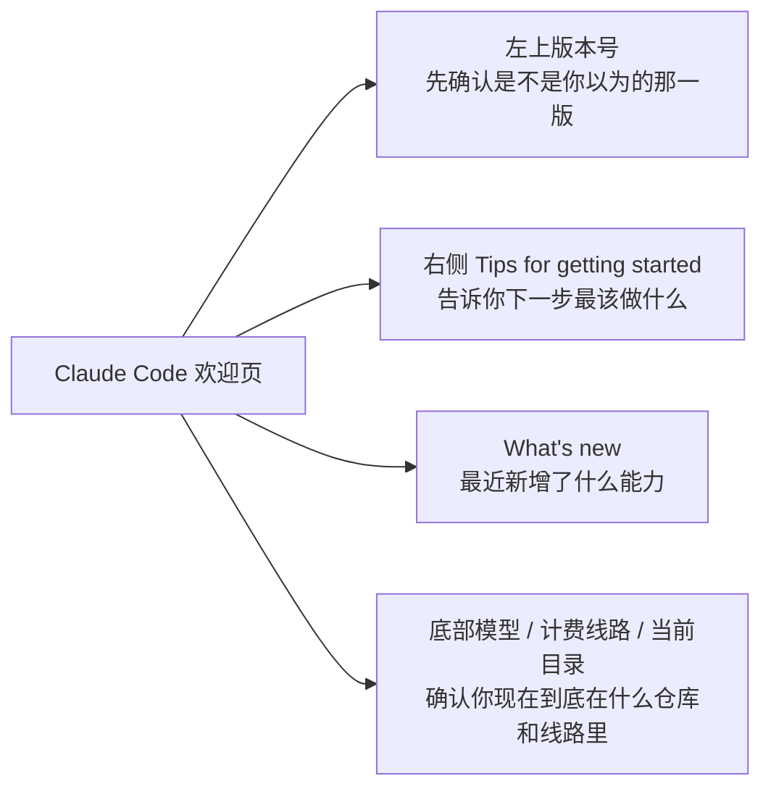
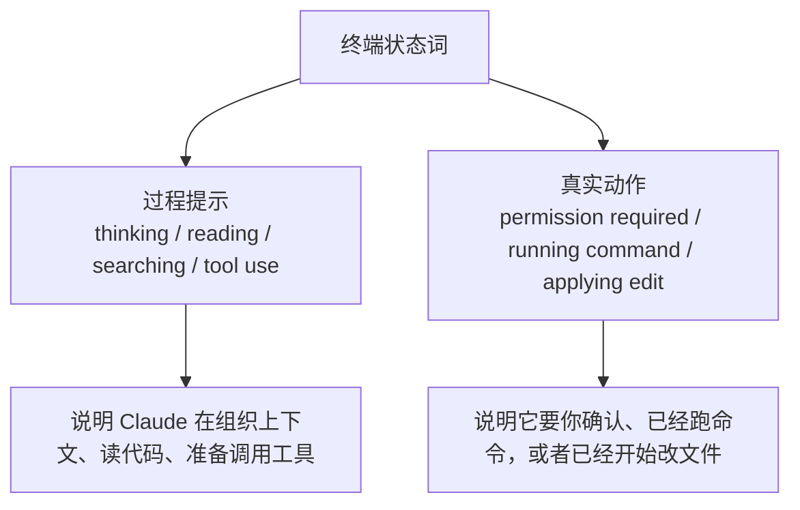
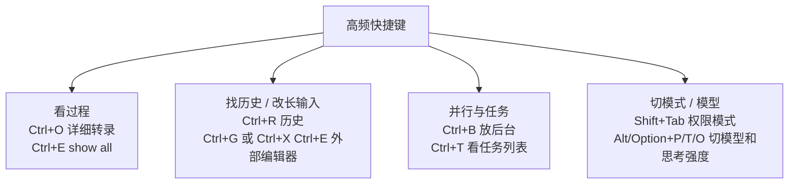

# 第一篇：Claude Code 快速上手、npm 安装更新与终端工作原理（程序员版）

> 这篇只解决 4 件事：怎么装、怎么更新、怎么看终端、怎么开始第一轮真实任务。  
> 如果主人是程序员，先把这 4 件事跑顺，比先学一堆高级能力更重要。

[[toc]]

---

## 先给结论

把 Claude Code 理解成一个会读仓库、会调工具、会改文件的终端代码代理就够了。  
第一天最重要的不是背命令，而是先跑顺这条主线：

1. 用 `npm` 装好
2. 知道怎么更新
3. 看得懂终端提示
4. 先让它读项目，再做一个小改动

---

## 1. 程序员最常用的主线：`npm` 安装与更新

如果面向程序员写 Claude Code，`npm` 不能只是顺带一提。  
按 2026-05-30 我复核的官方文档，`npm` 现在仍然是官方支持的常用安装方式之一。

### 安装

```bash
npm install -g @anthropic-ai/claude-code
```

官方当前要求是 `Node.js 18+`。  
另外有个关键点要知道：虽然你是通过 npm 安装，但拉下来的不是“纯 JS 小脚本”，而是对应平台的 Claude Code 二进制。

### 更新

如果你走的是 npm 线路，最稳的更新命令是：

```bash
npm install -g @anthropic-ai/claude-code@latest
```

不要默认用：

```bash
npm update -g @anthropic-ai/claude-code
```

因为它不一定把你带到最新版本。

### 实战提醒

1. 不要混用多种安装渠道
2. 更新异常先看 `claude doctor`
3. 如果版本不对，先查 PATH 里到底哪一份 `claude` 在生效

---

## 2. 装完先确认：当前跑的是哪一份 Claude

这一步很程序员，也很有必要。

Windows：

```powershell
where.exe claude
```

macOS / Linux / WSL：

```bash
which claude
```

然后进 Claude Code 里看：

```text
/status
```

这样可以避免后面出现这种错觉：

- 你以为更新了，其实跑的还是旧版本
- 你以为自己用的是 npm 安装，结果 PATH 指到了别的渠道

---

## 3. 第一次启动：别在空目录里学

Claude Code 真正的价值在真实仓库里。  
所以别只在桌面空文件夹里敲：

```bash
claude
```

更推荐这样：

```bash
cd your-project
claude
```

### 先认欢迎页，不然第一屏信息白白浪费了

> 下面不用截图，直接用一张 Mermaid 文字图把欢迎页最该看的信息抽出来。  
> 主人以后复习时，看这几块就能立刻想起官方界面在说什么。



你以后看到欢迎页，先抓 3 个点：

- 左上：版本号，排查问题和确认更新时先看它
- 右侧：`Tips for getting started` 和 `What's new`，告诉你下一步做什么、最近刚加了什么
- 底部：当前模型 / 计费线路 / 当前目录，决定你到底在哪个仓库、哪条线路里工作

第一轮不要让它直接大改，先让它解释项目：

```text
先不要修改任何文件。
请先阅读这个仓库，然后告诉我：
1. 这是个什么项目
2. 主要目录怎么分工
3. 入口文件在哪里
4. 如果我是第一次接手，先看哪几个文件
```

---

## 4. 终端里常见英文提示，主人至少要看懂这些

很多人不是不会用，而是根本没读懂终端在说什么。

先看这一张文字图，先把“过程提示”和“真实动作”分开：



### `thinking`

表示 Claude 在组织回答或规划，不代表已经执行了动作。

### `reading` / `searching`

表示它在读文件、查代码、建上下文。

### `tool use`

表示它准备调用工具，比如读文件、搜代码、跑命令、改文件。

### `permission required`

表示这一步需要你确认。  
这不是“卡你”，而是在告诉你：它要开始做真实动作了。

### `running command`

表示它正在执行终端命令。

### `applying edit`

表示它已经开始改文件。

你真正要养成的习惯是：  
不要只看它“说了什么”，也要看它“做了什么”。

记忆法可以压成一句话：

- `thinking`、`reading`、`tool use` 更像过程提示
- `running command`、`applying edit` 才是已经进入真实动作

---

## 5. 权限模式，前期先记这几个就够

前期不用把所有模式都记全，先知道这 4 个就够：

### `default`

最稳，适合第一次进项目和先分析后改动。

### `acceptEdits`

适合已经愿意让它频繁改文件，但还不想放得太开的时候。

### `plan`

适合大改前只做分析和计划，这个模式很值得长期保留。

### `auto`

更偏效率推进，但不是每个人都会看到。  
如果主人平时没见过 `auto`，大概率是你的账号或运行场景本来就不显示它。

再补一个非常实用的官方快捷键：

- `Shift+Tab`：循环切换权限模式

按 Claude Code 官方 `permission-modes` 和 `interactive-mode` 文档，CLI 里可以直接用 `Shift+Tab` 在：

- `default`
- `acceptEdits`
- `plan`
- 以及你启用过的 `auto`、`bypassPermissions`

这些模式之间切换。

---

## 6. 第一天最该会的命令

前期先记最有用的几条：

- `/help`：看命令列表
- `/status`：看当前状态
- `/resume`：恢复会话
- `/compact`：压缩上下文
- `/doctor`：排查安装和环境问题
- `/skills`：看当前能发现的 skills / commands
- `/mcp`：看当前 MCP 状态

你不需要第一天把命令背全，但至少要知道遇到问题先去哪看。

### 再记一组最常用快捷键，真的能省很多事

先不要背整本键位表，先记这几类最高频动作：



我建议先记这几组：

- `Ctrl+O`：打开详细转录，专门看工具调用过程、MCP 调用和执行细节
- `Ctrl+E`：在转录视图里切换 `show all`，把隐藏内容展开
- `Ctrl+R`：搜索你过去写过的命令和 prompt
- `Ctrl+B`：把 bash 命令或 agent 放到后台继续跑
- `Ctrl+T`：显示或隐藏任务列表
- `Ctrl+G` 或 `Ctrl+X Ctrl+E`：把当前 prompt 打开到外部编辑器里
- `Alt+P` / `Option+P`：切模型
- `Alt+T`、`Alt+O` / `Option+T`、`Option+O`：切 extended thinking、切 fast mode

再强调两个边界：

- `Ctrl+E` 不是任何时候都能按，它主要是你已经进入 `Ctrl+O` 的详细转录视图后才有意义
- macOS 下部分 `Option` 快捷键要先把终端的 `Option` 配成 `Meta`

---

## 7. 第一轮最小任务，怎么练最有手感

第一轮别做大任务，按这个顺序练：

### 先让它解释

```text
先不要修改文件。
请解释首页是从哪里渲染出来的，涉及哪些组件、路由和数据来源。
```

### 再让它定位一个小改动

```text
请只定位首页标题和副标题的来源，先不要修改。
告诉我应该改哪几个文件。
```

### 最后再放权给一个小改动

```text
现在开始修改：
1. 只改首页标题文案
2. 不要顺手改样式
3. 改完后告诉我如何验证
```

然后你自己再做一轮验证。  
这是第一天最值得练的节奏。

---

## 8. 程序员第一周最容易踩的坑

1. 装了多个渠道，自己不知道哪份在生效
2. 第一轮就让它大改
3. 没看懂终端提示，就一路确认
4. 只看回答，不看真实改动和验证
5. 一上来沉迷 skills、MCP、plugins，却没跑通基础主线

---

## 9. 读完这篇后，主人马上该做什么

1. 先用 `npm install -g @anthropic-ai/claude-code` 跑通安装
2. 记住更新命令是 `npm install -g @anthropic-ai/claude-code@latest`
3. 用 `where.exe claude` 或 `which claude` 看当前生效路径
4. 进一个真实仓库运行 `claude`
5. 先解释、再小改、再验证，做完第一轮最小任务

如果这一步已经跑顺，下一篇最值得读的是：

- [第三篇：Claude Code 常见工作流、Prompt 模板与最佳实践（程序员深度版）](#/note/AI工具/02_终端Agent流/ClaudeCode/第三篇_ClaudeCode常见工作流与最佳实践_2026-03)
- [第四篇：Claude Code 设置、CLAUDE.md 与个性化配置（程序员深度版）](#/note/AI工具/02_终端Agent流/ClaudeCode/第四篇_ClaudeCode设置与个性化_2026-03)

---

## 参考资料

- https://docs.anthropic.com/en/docs/claude-code/getting-started
- https://docs.anthropic.com/en/docs/claude-code/installation
- https://code.claude.com/docs/en/interactive-mode
- https://code.claude.com/docs/en/commands
- https://code.claude.com/docs/en/permission-modes
- https://code.claude.com/docs/en/how-claude-code-works
