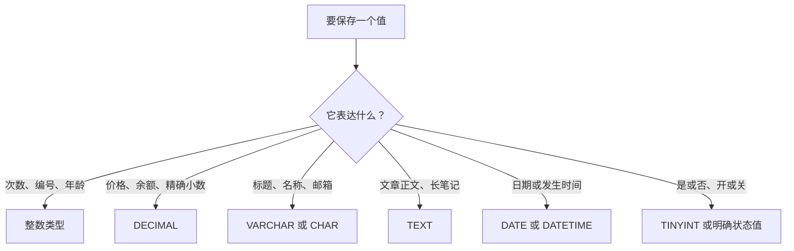

# 04 字段类型，每一列应该装什么

## 1. 本节目标：先学会挑抽屉，再去造柜子

上一章已经创建了 `mysql_learning` 数据库。第 05 章我们要创建 `learning_notes` 表，但建表之前还有一个重要问题：**每一列该用什么类型保存？**

数据库不是把所有内容都当作一段文字塞进去。它会先问：这是一个数量、标题、金额、时间，还是一篇很长的正文？不同答案，对应不同字段类型。

这一章会学会：

1. 为什么字段必须有类型。
2. 常用整数类型和 `UNSIGNED`、`AUTO_INCREMENT` 的含义。
3. 为什么金额用 `DECIMAL`，不要用 `FLOAT` 或 `DOUBLE`。
4. `CHAR`、`VARCHAR`、`TEXT` 各适合什么。
5. `DATE`、`DATETIME`、`TIMESTAMP` 分别表达什么时间。
6. `NULL`、`NOT NULL` 和 `DEFAULT` 如何表达业务规则。
7. 为什么新数据库应统一使用 `utf8mb4`。

你不需要背完整类型手册，更不需要记住所有字节范围。目标是面对一个字段时，能说出“它保存什么、为什么选这个类型、什么情况下不能这么选”。

## 2. 先有画面：字段类型就是抽屉标签

把一张表想成一组有标签的抽屉。一个抽屉写着“数量”，就应该放数字；一个抽屉写着“创建时间”，就应该放时间；不能因为“文字也能写 123”就把数量放进文字抽屉。



类型主要解决四件事：

| 类型带来的规则 | 举例 |
| --- | --- |
| 限制能放什么 | `view_count` 不应放“很多” |
| 限制范围或长度 | 标题不能无限长，状态不能随便写超长正文 |
| 让数据库知道怎样计算 | 金额可以求和，时间可以按日期筛选 |
| 让查询和存储更合理 | 数字按数字排序，而不是按文字字符排序 |

例如把浏览量存成字符串，`'100'`、`'20'`、`'3'` 按文字排序的结果会和数字大小不一致；而使用整数类型，数据库知道它们是可比较、可加减的数量。

## 3. 写字段定义时，你其实在说什么

第 05 章会出现类似这行 SQL：

```sql
view_count INT UNSIGNED NOT NULL DEFAULT 0
```

它不是一串要硬背的咒语，而是在给“浏览量”下规则：

| 片段 | 人话解释 |
| --- | --- |
| `view_count` | 栏目名字叫“浏览次数” |
| `INT` | 它装整数 |
| `UNSIGNED` | 不允许负数 |
| `NOT NULL` | 每条笔记都必须有浏览量 |
| `DEFAULT 0` | 新笔记没传浏览量时，从 0 开始 |

读字段定义时，从左到右依次看“名字、类型、可不可以没有、没填时是什么、还有没有附加规则”，会比整行死记容易得多。

## 4. 整数类型：编号、次数、数量应该装在这里

### 4.1 整数是什么

整数就是没有小数点的数字，例如 `0`、`12`、`-3`。学习笔记里常见的整数有：笔记编号、浏览量、排序序号、年龄、库存数量。

MySQL 常用整数类型可以先这样认识：

| 类型 | 大致能装多少 | 入门阶段适合什么 |
| --- | --- | --- |
| `TINYINT` | 非常小的整数 | 0/1 开关、少量状态码 |
| `SMALLINT` | 小一些的整数 | 数量不大的编号或等级 |
| `INT` | 普通整数 | 浏览量、普通计数、排序值 |
| `BIGINT` | 很大的整数 | 表的主键 ID、超大计数 |

你不必立刻背每一种的精确范围。只要先记住一个实用选择：**普通计数通常用 `INT`；长期增长的主键 ID 常用 `BIGINT`。**

### 4.2 有符号和无符号：能不能出现负数

整数默认既能装正数，也能装负数，叫做“有符号”（signed）。加上 `UNSIGNED` 后，只能装 0 和正数，因此正数上限会更大。

```sql
-- 浏览量不可能是负数，所以使用无符号整数
view_count INT UNSIGNED NOT NULL DEFAULT 0
```

不要把 `UNSIGNED` 理解成“更高级”。它只是一个业务限制：

| 字段 | 可能为负数吗 | 是否考虑 `UNSIGNED` |
| --- | --- | --- |
| `view_count` 浏览量 | 不可能 | 是 |
| `stock_count` 库存数量 | 一般不应该 | 是 |
| `sort_order` 排序值 | 可能有负排序策略，也可能没有 | 按业务决定 |
| `temperature` 温度 | 可能 | 否 |
| `balance_change` 余额变动 | 可能是收入或支出 | 否 |

### 4.3 AUTO_INCREMENT：让 MySQL 自动发编号

每插入一条笔记都手写一个新编号，既麻烦又容易重复。`AUTO_INCREMENT` 的作用是让 MySQL 为新行自动分配下一个整数编号：

```sql
id BIGINT UNSIGNED NOT NULL AUTO_INCREMENT
```

想象超市取号机：第一位顾客拿到 1，下一位拿到 2。你在 `INSERT` 时不写 `id`，MySQL 会帮你产生编号。

注意两点：

1. 自增编号的核心作用是唯一定位一行，不是给用户展示连续的“排名”。删除一行后，编号出现空缺很正常。
2. `AUTO_INCREMENT` 常与主键搭配使用，但“自动递增”和“主键”是两个不同概念：前者负责生成，后者负责唯一标识。

### 4.4 `INT(11)` 是不是只能放 11 位数字

不是。旧教程中常出现 `INT(11)`，括号里的 `11` 曾经是**显示宽度**相关信息，不是存储长度，也不改变 `INT` 的取值范围。在 MySQL 8.0.17 起，这个显示宽度已经被弃用并逐步移除。

所以不要因为想存 11 位数字就写 `INT(11)`。选择 `INT` 还是 `BIGINT`，要看需要的数值范围；是否允许负数，再决定是否加 `UNSIGNED`。

## 5. 小数：什么时候用 FLOAT/DOUBLE，什么时候一定用 DECIMAL

### 5.1 为什么小数不能只看“有没有小数点”

有两类小数：

| 小数类型 | 例子 | 你关心的是什么 |
| --- | --- | --- |
| 近似值 | 经纬度、科学测量、机器学习结果 | 快速计算，允许极小误差 |
| 精确值 | 订单金额、账户余额、税额 | 每一分都必须准确 |

`FLOAT` 和 `DOUBLE` 是二进制浮点数。它们适合近似计算，但很多十进制小数在二进制中不能被精确表示。`0.1` 在人看来很简单，计算机内部却可能只能保存一个非常接近它的值。

因此，下面的原则请直接记住：

> 金额、余额、积分中有小数且必须精确的业务，使用 `DECIMAL`；不要使用 `FLOAT` 或 `DOUBLE`。

### 5.2 DECIMAL(M, D) 怎么读

```sql
price DECIMAL(10, 2) NOT NULL
```

`DECIMAL(M, D)` 中：

| 符号 | 含义 | `DECIMAL(10, 2)` 的解释 |
| --- | --- | --- |
| `M` | 总共最多几位十进制数字，不含小数点 | 最多 10 位数字 |
| `D` | 小数点后保留几位 | 保留 2 位小数 |

因此 `DECIMAL(10, 2)` 可以表达类似 `99999999.99` 的金额：小数点前最多 8 位，小数点后固定保留 2 位。

下面是一张极简商品表的字段片段：

```sql
-- 商品价格：最多 10 位数字，其中 2 位是小数
price DECIMAL(10, 2) NOT NULL DEFAULT 0.00
```

不要误读成“最多 10 位小数”或“总共 10 个字符”。它说的是十进制数字的位数规则。

### 5.3 FLOAT 和 DOUBLE 是不是永远不能用

不是。它们适合允许近似值的领域，例如统计计算、传感器测量或地理坐标。只是它们不适合用来表示“必须一分不少”的钱。

本课程中的 `learning_notes` 表没有金额字段，所以不会为了展示而硬加一个 `price`。当你的业务确实有价格、余额或折扣金额时，再选择 `DECIMAL`。

## 6. 短文本：CHAR 和 VARCHAR

### 6.1 VARCHAR：长度会变化的普通文字

标题、用户名、邮箱、城市、状态值，通常长度不固定，适合使用 `VARCHAR`：

```sql
title VARCHAR(120) NOT NULL
```

这句话表示标题最多允许 120 个字符。`VARCHAR` 是变长字符串，实际内容短时不会强行按 120 个字符塞满。

| 值 | 用 `VARCHAR(120)` 保存时的直觉 |
| --- | --- |
| `SQL` | 只保存实际短内容和少量长度信息 |
| `认识 MySQL 的第一天` | 按实际内容保存 |
| 超过 120 个字符的标题 | 数据库会拒绝或按 SQL 模式给出错误/警告，不能把它当成正常输入 |

`VARCHAR(255)` 很常见，但 255 不是魔法数字。标题就按产品允许的标题长度设，例如课程中选 `VARCHAR(120)`；邮箱常见上限可设到 254 或 255；地址可能需要更长。长度来自业务规则，不是“越大越保险”。

### 6.2 CHAR：固定长度、格式稳定的字符值

`CHAR(N)` 适合长度稳定、较短的文本，例如国家代码 `CN`、固定长度的哈希结果，或规则明确的固定编码。

```sql
country_code CHAR(2) NOT NULL
```

它表达“国家代码恰好有两个字符”的业务意思。对于普通标题、昵称、地址，优先用 `VARCHAR`，不要因为 `CHAR` 看起来短就随便使用它。

手机号经常用 `CHAR` 或 `VARCHAR` 保存，而不是整数：手机号虽然全由数字组成，但你通常不会拿它做加减法，还可能有前导 0、国家区号、加号或格式变化。它更像“编码”，不是“数量”。

### 6.3 字符、字节和中文：不要混为一谈

`VARCHAR(120)` 中的 120 指的是字符长度限制；但 MySQL 在磁盘和一行中实际占用的空间还会受到字符集影响。`utf8mb4` 下一个汉字通常会占多个字节，emoji 最多可占 4 个字节。

你现在不需要自己计算每一行占了多少字节。只需避免两个误解：

- `VARCHAR(120)` 不是“最多 120 字节”。
- `VARCHAR` 的最大值不是所有表都能机械地设成 65535；一行还有其他列、字符集和行大小限制，实际设计要合理。

## 7. 长文本：文章正文为什么使用 TEXT

笔记正文、文章正文、富文本内容可能远超过标题长度。它们适合 `TEXT`：

```sql
content TEXT NOT NULL
```

`TEXT` 表达的业务意思是“这是可能较长的一段文字”，而不是“我不知道长度，先随便用最大的类型”。

选择时可以按这张表判断：

| 内容 | 优先选择 | 原因 |
| --- | --- | --- |
| 文章标题 | `VARCHAR` | 短、需要明确长度 |
| 用户名 | `VARCHAR` | 短、长度受规则限制 |
| 文章摘要 | `VARCHAR` 或 `TEXT` | 取决于产品规定的最大长度 |
| 笔记正文 | `TEXT` | 可能是长篇内容 |
| 图片文件本身 | 不建议作为正文类字段存入表 | 通常存文件服务，表里存 URL 或资源 ID |

MySQL 的 `TINYTEXT`、`TEXT`、`MEDIUMTEXT`、`LONGTEXT` 容量逐级增加。它们的容量上限按**字节**计算，且实际选择还要考虑应用和传输限制。小白阶段先掌握：普通正文用 `TEXT` 已经足够常见；不要把所有短字段都改成 `TEXT`。

## 8. 日期和时间：先问“我想记录哪一种时间”

时间字段不是只要“能显示年月日时分秒”就行。先问业务问题：

| 你要记录什么 | 例子 | 常见选择 |
| --- | --- | --- |
| 只有日期 | 生日、开课日期 | `DATE` |
| 一段时长或一天里的时间 | 课程时长、营业时间 | `TIME` |
| 某件事发生的日期和时刻 | 创建时间、下单时间 | `DATETIME` |
| 需要按时区表示同一个瞬间 | 全球用户的事件时间 | `TIMESTAMP`，需明确时区策略 |

### 8.1 DATE：只关心哪一天

```sql
published_on DATE NULL
```

如果你只关心“2026 年 8 月 3 日”，而不关心上午还是下午，就不要用带时分秒的类型。生日就是典型例子：只存日期，不应该因为用户时区不同变成前一天或后一天。

### 8.2 DATETIME：业务中最常见的“年月日时分秒”

```sql
created_at DATETIME(3) NOT NULL DEFAULT CURRENT_TIMESTAMP(3)
```

逐段读：

| 片段 | 含义 |
| --- | --- |
| `created_at` | 创建时间这个字段 |
| `DATETIME(3)` | 保存年月日时分秒，并保留 3 位毫秒 |
| `NOT NULL` | 创建时间不能没有 |
| `DEFAULT CURRENT_TIMESTAMP(3)` | 新增记录时没传时间，就使用当前时间 |

`(3)` 的意思是保留毫秒，例如 `2026-08-03 14:30:12.345`。如果业务不需要毫秒，可以使用 `DATETIME`；统一使用 `DATETIME(3)` 则能给以后更精细的排序留出空间。

对多数单一业务时区的后台系统，把创建时间、更新时间保存为 `DATETIME` 是清晰的入门选择：表中看到的值就是你写入的年月日时分秒。

### 8.3 TIMESTAMP：理解它和时区的关系

`TIMESTAMP` 也能显示为日期时间，但它会按照连接会话的时区进行转换。它适合“同一个绝对瞬间，要让不同时区的人看见各自当地时间”的场景；与此同时，也要求团队明确服务器、数据库连接和应用的时区规则。

`TIMESTAMP` 的可表示范围还受 2038 年限制，因此不适合需要表达很久远未来日期的通用业务时间。对刚入门的个人项目，不要因为它看起来更短就默认使用它。

不是所有项目都“禁止 `TIMESTAMP`”。关键是先分清：你记录的是一个固定的业务日历时间，还是一个需要随时区转换的瞬间。未建立时区规范前，课程中的业务时间字段选择 `DATETIME(3)`，更容易读懂和排查。

### 8.4 不要急着用整数时间戳

有些接口会传递 `1710000000` 一类 Unix 时间戳。它并非错误，但对初学者直接查看数据库很不友好，也更容易混淆秒和毫秒。课程表中优先保存 `DATETIME(3)`，需要和外部接口转换时再处理。

## 9. 是或否、状态和 ENUM：值的种类少，也不能乱放

### 9.1 布尔开关在 MySQL 中怎么表示

MySQL 的 `BOOLEAN`/`BOOL` 本质上是 `TINYINT(1)` 的别名，不会自动神奇地只允许 true 或 false。课程里可以清晰地使用 0 和 1：

```sql
is_pinned TINYINT UNSIGNED NOT NULL DEFAULT 0
```

约定：`0` 表示否，`1` 表示是。若业务需要数据库层面严格限制，还可以在 MySQL 8 中加 `CHECK` 约束；小白阶段更重要的是先让程序和文档都使用同一套含义。

### 9.2 状态字段为什么先使用 VARCHAR

学习笔记的状态可以是：`draft`、`active`、`archived`。课程使用：

```sql
status VARCHAR(20) NOT NULL DEFAULT 'draft'
```

原因不是 `VARCHAR` 永远最好，而是状态词直接可读，之后增加新状态时不需要立刻改字段类型定义。后端还应验证只接受允许的状态值，数据库中的默认值只是其中一层保护。

MySQL 还提供 `ENUM('draft', 'active', 'archived')`，它能限制只取其中一个值，但后续增加或调整选项通常要改表结构。初学阶段先理解状态“必须有统一词汇”，不要为了节省一点空间过早把业务写死在 `ENUM` 中。

## 10. NULL、NOT NULL 和 DEFAULT：它们是在写业务规则

字段类型解决“值是什么形状”，`NULL`、`NOT NULL`、`DEFAULT` 解决“这个值什么时候必须有”。

### 10.1 NOT NULL：缺了这项，这条记录还成立吗

```sql
title VARCHAR(120) NOT NULL
```

意思是：没有标题，就不能算一条有效学习笔记。MySQL 不应接受没有标题的记录。

### 10.2 NULL：这件事还没发生，所以目前没有值

```sql
archived_at DATETIME(3) NULL
```

意思是：笔记可以暂时没有归档时间。没有归档时，这一格是 `NULL`；真的归档后，再写入一个实际时间。

不要把“还没归档”写成空字符串或 `0`。这两个值分别是“空文本”和“数字零”，都会让时间筛选和业务表达变得含糊。

### 10.3 DEFAULT：没明确填写时，使用合理初始值

```sql
view_count INT UNSIGNED NOT NULL DEFAULT 0
status VARCHAR(20) NOT NULL DEFAULT 'draft'
```

它们不是为了让程序员少写几个字段，而是在声明两条业务规则：

- 一篇刚创建的笔记，浏览量从 0 开始。
- 一篇刚创建、尚未明确发布状态的笔记，默认是草稿。

设计默认值时要问：**当调用方忘了传这个字段时，什么值仍然符合业务逻辑？**如果没有可靠答案，就不要硬加默认值。

## 11. 字符集：为什么统一用 utf8mb4

字符集决定 MySQL 如何把文字编码成字节保存。新建数据库和表时，课程统一用 `utf8mb4`：

```sql
DEFAULT CHARSET = utf8mb4
```

它可以保存中文、英文、常见符号和 emoji。MySQL 中历史名称为 `utf8` 的字符集最多只能保存 3 字节字符，遇到部分 emoji 会失败；不要把它和完整 UTF-8 混为一谈。

如果数据库默认已经设置了 `utf8mb4`，新表通常会继承该设置。第 05 章仍会在建表语句尾部明确写出来，目的不是让 SQL 更长，而是让表的字符规则一眼可见。

## 12. 先认识但暂不滥用的类型

课程会用到的核心类型已经足够完成基础项目。下面这些类型知道存在即可：

| 类型 | 用途 | 当前建议 |
| --- | --- | --- |
| `JSON` | 保存结构不固定的 JSON 数据 | 先学会正常建表；不要把本该拆列、拆表的数据全塞 JSON |
| `BLOB` | 二进制大对象 | 图片、文件通常放对象存储/文件服务，表里存 URL 或资源 ID |
| 空间类型 | 经纬度、地理形状 | 需要地图功能时再学 |
| `SET` | 一列可选多个固定值 | 日常业务较少优先使用，不作为入门主线 |

知道“不现在使用”也是设计能力。把所有信息堆进一个万能字段，会让以后查询、约束和维护都更难。

## 13. 回到学习笔记表：字段怎么选才有理由

现在把本章结论落到下一章要创建的表上：

| 字段 | 它表达什么 | 类型和规则 | 为什么这样选 |
| --- | --- | --- | --- |
| `id` | 笔记内部编号 | `BIGINT UNSIGNED ... AUTO_INCREMENT` | 长期唯一、不允许负数、由 MySQL 自动生成 |
| `title` | 笔记标题 | `VARCHAR(120) NOT NULL` | 是长度明确的短文本，且不可没有 |
| `content` | 笔记正文 | `TEXT NOT NULL` | 可能较长，且不可没有 |
| `status` | 草稿/正常/归档状态 | `VARCHAR(20) NOT NULL DEFAULT 'draft'` | 可读且有合理初始状态 |
| `view_count` | 浏览次数 | `INT UNSIGNED NOT NULL DEFAULT 0` | 是不会为负的整数计数 |
| `archived_at` | 归档发生的时间 | `DATETIME(3) NULL` | 归档前确实没有这个时间 |
| `created_at` | 创建时间 | `DATETIME(3) NOT NULL DEFAULT CURRENT_TIMESTAMP(3)` | 自动记录创建时刻 |
| `updated_at` | 最后修改时间 | `DATETIME(3) ... ON UPDATE ...` | 更新一行时自动刷新 |

这不是“企业万能模板”。这是针对学习笔记这个业务做出的具体选择。换成订单、课程、聊天消息时，字段和类型都应该重新从业务含义出发判断。

## 14. 本节练习：先解释，再选择

### 练习一：给字段选类型

请为下列信息选择类型，并写出理由：

| 信息 | 你的类型选择 | 你的理由 |
| --- | --- | --- |
| 用户昵称，最多 30 字符 |  |  |
| 商品价格，保留两位小数 |  |  |
| 用户生日，只关心日期 |  |  |
| 是否已阅读 |  |  |
| 一篇 5000 字的文章正文 |  |  |
| 评论点赞数 |  |  |

### 练习二：判断对错

1. `VARCHAR(255)` 一定比 `VARCHAR(50)` 更好。对还是错？为什么？
2. 金额可以用 `DOUBLE`，只要最后格式化成两位小数就行。对还是错？
3. “还未归档”的时间字段更适合写 `NULL` 还是空字符串？
4. 手机号看起来全是数字，为什么通常不把它当作可计算的整数？
5. `utf8mb4` 为什么比 MySQL 历史上的 `utf8` 更适合新项目？

能够解释这些选择后，你就准备好进入第 05 章：把字段定义组合成真正的第一张表。
