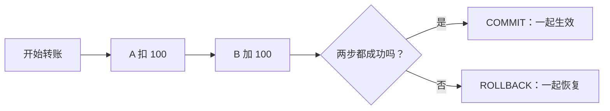

# 11 事务和锁，多步操作不能做一半

## 1. 本节目标：把几步相关操作当成一个整体

前面执行过一条 `INSERT` 或一条 `UPDATE`。一条 SQL 成功或失败通常很直观，但真实业务常常包含多步：

- 给文章从草稿改成已发布。
- 创建文章后，绑定多个标签。
- 用户转账时，一个账户扣钱，另一个账户加钱。
- 创建订单后，扣减库存，再写一条订单记录。

如果第一步成功、第二步失败，数据就处于“做了一半”的状态。事务（transaction）就是让数据库把一组相关操作当成一个整体的机制：**要么一起提交，要么一起撤销。**

本章的重点不是背 ACID 四个字母，而是每次遇到多步写操作时，能判断“这里要不要事务”“别人同时操作时会不会冲突”。

## 2. 先看一个失败的故事：为什么“每句 SQL 都成功过”仍然不对

假设账户 A 要给账户 B 转 100 元：

```text
步骤 1：A 余额减 100       成功
步骤 2：B 余额加 100       服务器断开或 SQL 失败
```

如果没有事务，A 的钱已经少了，B 却没有收到，系统总金额不再正确。真正需要的是：



事务不保证“业务一定正确”，也不替你判断转账金额是否合法；它保证你明确放进同一事务的数据库改动，不会只留下半套结果。

## 3. 自动提交：为什么你以前改完就已经生效

先运行：

```sql
SELECT @@autocommit;
```

常见结果是 `1`，表示 MySQL 当前连接开启了自动提交。它意味着像下面这样的一条写操作，成功后通常就立即成为正式结果：

```sql
UPDATE learning_notes
SET view_count = view_count + 1
WHERE id = 1;
```

自动提交非常适合独立的一条操作，例如“浏览量加一”。但它不适合需要多条 SQL 一起成功的动作，因为第一条执行完就已经无法通过下一条 SQL 的 `ROLLBACK` 自动撤回。

不要为了学习事务而把全局 `autocommit` 永久关掉。需要一组操作时，明确使用 `START TRANSACTION`，范围更清晰，也不容易忘记提交。

## 4. 最小事务语法：开始、检查、提交或撤销

先在练习表中做一次可撤销修改：

```sql
START TRANSACTION;

UPDATE learning_notes
SET status = 'active'
WHERE id = 1
  AND status = 'draft';

SELECT id, title, status
FROM learning_notes
WHERE id = 1;

ROLLBACK;

SELECT id, title, status
FROM learning_notes
WHERE id = 1;
```

请将 `id = 1` 换成你自己的一条草稿笔记编号。代码的过程是：

| 顺序 | 命令 | 当前发生什么 |
| --- | --- | --- |
| 1 | `START TRANSACTION` | 开始一个可提交、可撤销的工作单元 |
| 2 | `UPDATE` | 修改暂时只存在于这个事务的改动中 |
| 3 | 第一次 `SELECT` | 当前连接能看见刚才的临时修改 |
| 4 | `ROLLBACK` | 放弃事务开始后尚未提交的改动 |
| 5 | 第二次 `SELECT` | 状态恢复为事务开始前的样子 |

如果确认修改是对的，把 `ROLLBACK` 改成：

```sql
COMMIT;
```

`COMMIT` 表示确认提交。提交之后，这些改动才成为其他事务能稳定看到的正式数据；通常也不能再用一个简单的 `ROLLBACK` 找回来。

## 5. 事务边界：什么能撤销，什么不能指望撤销

事务只能撤销**当前事务中、尚未提交的、支持事务的表上的数据修改**。课程使用的 InnoDB 引擎支持事务。

以下三种误解要避开：

| 误解 | 实际情况 |
| --- | --- |
| “我执行了 UPDATE 后，任何时候都能 ROLLBACK” | 自动提交或已经 COMMIT 的改动，不能靠后续 ROLLBACK 撤销 |
| “任何 SQL 都能被事务撤销” | 很多 DDL，例如 `CREATE TABLE`、`ALTER TABLE`、`DROP TABLE`，会隐式提交，不适合当作可撤销练习 |
| “事务能修复代码把错误数据算出来的问题” | 事务只能保证一起成功/失败，业务规则仍需在应用和 SQL 条件中写对 |

所以建表、改字段等结构操作和数据写操作要分开思考。真实生产中做 DDL 之前仍应备份和评估影响，不能期待“出了事就 ROLLBACK”。

## 6. ACID：四个词分别在防什么问题

ACID 是事务常见的四个特性。先把它们翻译成它们保护的场景：

| 名称 | 人话 | 转账例子 |
| --- | --- | --- |
| 原子性 Atomicity | 一组操作不留下半成品 | A 扣钱、B 加钱要么都发生，要么都不发生 |
| 一致性 Consistency | 提交前后仍遵守数据规则 | 余额不应无缘无故少 100；外键、非空、唯一规则不应被破坏 |
| 隔离性 Isolation | 多个人同时办事时，过程不会随意互相看乱或改乱 | 两个转账不会把中间状态混在一起 |
| 持久性 Durability | 提交成功后，数据不会因为普通崩溃凭空消失 | 收到“转账成功”后，记录应可靠保存 |

不要把“一致性”理解成“数据库自动懂你的所有业务”。例如“不允许用户一天发超过 5 篇文章”属于业务规则，仍要由应用逻辑、约束或事务中的查询与更新共同实现。

## 7. 多步业务事务：先展示完整形状，不要求你现在运行

下面是一个概念性转账示例，表名 `wallet_accounts` 仅用于说明流程，不是本课程已创建的表：

```sql
START TRANSACTION;

UPDATE wallet_accounts
SET balance = balance - 100.00
WHERE id = 10
  AND balance >= 100.00;

-- 应用程序需要检查：这一句是否正好影响了 1 行。
-- 若影响 0 行，表示账户不存在或余额不足，应当 ROLLBACK。

UPDATE wallet_accounts
SET balance = balance + 100.00
WHERE id = 20;

-- 两步都成功，才提交。
COMMIT;
```

这里既有事务，也有重要的条件更新：`AND balance >= 100.00`。它要求扣款时数据库自己确认余额够不够，避免“程序刚查到够，另一个请求已经先扣走”的时间差。

在后端代码中，通常会这样处理：开始事务，执行第一条更新，检查影响行数；若不是 1 就回滚并报业务错误；执行第二条更新；全部成功才提交；任何异常都回滚。第 12 章会把同一模式用在“创建文章并绑定标签”上。

## 8. 并发：两个人同时改同一份数据会怎样

“并发”就是多个请求在时间上重叠。网站有两个用户，或者同一用户连续点了两次按钮，都可能发生。

### 8.1 容易丢失更新的做法

假设浏览量现在是 10：

```text
请求 A：SELECT 得到 10
请求 B：SELECT 也得到 10
请求 A：程序算出 11，UPDATE 写回 11
请求 B：程序也算出 11，UPDATE 写回 11
```

明明发生两次浏览，最终却只从 10 变成 11。这叫丢失更新。

### 8.2 让数据库在一条语句中完成“在旧值基础上加一”

```sql
UPDATE learning_notes
SET view_count = view_count + 1
WHERE id = 1;
```

这条 SQL 不先把数字取到应用程序再写回，而是让 MySQL 直接基于当前值加 1。对很多简单计数器，这已经比“查-算-写”安全得多。

### 8.3 用状态写进 WHERE，避免重复处理

发布草稿笔记时，常常不必先锁住再查询，可以直接写：

```sql
UPDATE learning_notes
SET status = 'active'
WHERE id = 1
  AND status = 'draft';
```

再检查 `ROW_COUNT()`：

- 影响 1 行：这次确实把草稿变为正常。
- 影响 0 行：可能不存在、已经发布，或状态不符合；不应当继续当作“发布成功”。

这种“把前置状态写在更新条件里”的方式，常被称为乐观并发控制的一种简单形式。你不必先记这个名词，先掌握它避免重复提交的效果。

## 9. 锁是什么：不要把它想成永久封门

锁是 MySQL 为了协调同时修改而使用的控制机制。可以把它想成资料室里某份档案正在被修改，其他冲突操作需要等待或改走别的规则。

重要的边界：锁不是“打开事务就锁整张表”。在 InnoDB 中，实际锁定范围会受到执行的 SQL、查询条件、是否使用合适索引、隔离级别等影响。条件越明确、索引越合适，通常越容易把影响范围限制在真正需要的数据上。

普通 `SELECT` 在 InnoDB 的常见隔离级别下通常是非锁定的一致性读取，不会因为你看了一眼就堵住别人写入。真正需要排他处理时，才使用锁定读或写操作。

## 10. SELECT ... FOR UPDATE：先锁住，再基于它做决定

当业务必须“先读出当前状态，再依据它做多步决定”，可以在事务中使用锁定读：

```sql
START TRANSACTION;

SELECT id, title, status, archived_at
FROM learning_notes
WHERE id = 1
FOR UPDATE;

-- 在应用程序中根据读到的状态做判断，再执行对应 UPDATE。
UPDATE learning_notes
SET status = 'archived',
    archived_at = CURRENT_TIMESTAMP(3)
WHERE id = 1
  AND status = 'active';

COMMIT;
```

`FOR UPDATE` 表示对符合条件的记录进行锁定读取，直到当前事务 `COMMIT` 或 `ROLLBACK` 才释放相关锁。它必须放在显式事务中才有持续意义；自动提交模式下，语句结束事务就结束，锁也立刻释放。

### 用两个终端亲眼看一次等待

仅在你的 `mysql_learning` 练习库中操作：

1. 终端 A：执行 `START TRANSACTION;`，再执行上面的 `SELECT ... FOR UPDATE`，先不要提交。
2. 终端 B：尝试对同一个 `id` 执行 `UPDATE learning_notes SET ... WHERE id = ...;`。
3. 终端 B 可能会等待，因为终端 A 持有冲突锁。
4. 回到终端 A 执行 `COMMIT;` 或 `ROLLBACK;`。
5. 终端 B 才能继续执行或根据超时规则报错。

这个实验的目的不是让你在项目里到处加 `FOR UPDATE`，而是理解“事务不结束，锁可能不会释放”。事务里不要等待用户输入、调用慢接口、下载文件或做很长的计算。

## 11. 隔离级别：先认识“看见别人数据”的三个现象

多个事务同时运行时，关键问题是“我能否看到别人的中间修改”。常见现象如下：

| 现象 | 人话例子 |
| --- | --- |
| 脏读 | A 读到了 B 尚未提交的修改，随后 B 回滚，A 读到的是从未正式存在过的数据 |
| 不可重复读 | A 的同一事务内两次读取同一行，B 在中间提交了修改，A 两次看到的内容不同 |
| 幻读 | A 两次按同一条件查询，B 在中间插入或删除符合条件的行，A 看到行数变化 |

查看当前会话隔离级别：

```sql
SELECT @@transaction_isolation;
```

MySQL InnoDB 默认通常是 `REPEATABLE READ`。初学时不要为了“解决问题”就随意修改隔离级别；更实用的优先级是：写清条件、让事务短、使用合适索引、检查影响行数，并在真正出现并发问题时基于业务需求选择方案。

不同数据库、不同隔离级别、普通读与锁定读的具体表现并不完全相同。先理解它们都在处理“并发时看到什么、允许什么变化”即可。

## 12. 死锁：两边互相等待时，MySQL 会让其中一边重试

死锁不是“数据库彻底坏了”。它像两个人在窄路上各自占住一边，又都要等对方先让：

```text
事务 A 已锁住笔记 1，接着要锁笔记 2
事务 B 已锁住笔记 2，接着要锁笔记 1
```

双方都无法继续。InnoDB 会检测这种环路，主动回滚其中一个事务，并给应用返回死锁错误。应用应该捕获这类可预期的并发错误，在有限次数内重试整个事务，而不是把半截操作当成功。

降低死锁概率的实用做法：

1. 多行更新时，所有业务都按同一顺序处理，例如 id 从小到大。
2. 事务只包含必要的数据库操作，尽量短。
3. `WHERE` 条件明确，并为常用条件提供合适索引，避免锁定范围过大。
4. 对死锁和锁等待超时记录日志，重试时重新从头开始事务，不在失败事务上硬继续。

死锁无法在有真实并发的系统中保证“永远不发生”。正确目标是减少概率，并让应用能够安全恢复。

## 13. 可选工具：SAVEPOINT，事务里的小书签

较长事务中，有时希望撤回其中一小段而不是全部撤回，可以使用保存点：

```sql
START TRANSACTION;

-- 前面的操作确认保留
SAVEPOINT before_optional_step;

-- 尝试一段可选操作
ROLLBACK TO SAVEPOINT before_optional_step;

COMMIT;
```

`ROLLBACK TO SAVEPOINT` 只撤回保存点之后的改动，事务本身仍在继续。初学项目大多数情况下只需要完整 `COMMIT` 或 `ROLLBACK`，知道保存点存在即可，不要用它把本该拆清楚的业务流程变得复杂。

## 14. 本节行动清单

当你看到一段“先做 A，再做 B，A、B 要么同时成功、要么都不发生”的业务描述时，按下面判断：

1. 这些步骤是否都在同一个 InnoDB 数据库中？
2. 是否明确从 `START TRANSACTION` 开始？
3. 每条关键更新是否有精确的 `WHERE` 和影响行数检查？
4. 任何失败路径是否会 `ROLLBACK`？
5. 成功路径是否只在全部完成后 `COMMIT`？
6. 事务中是否避免了外部网络调用、用户等待和长耗时工作？
7. 出现死锁时，应用是否能从头重试整个事务？

练习：在 `mysql_learning` 中选一条草稿笔记，分别用 `ROLLBACK` 和 `COMMIT` 完成状态修改；再用两个终端体验一次 `SELECT ... FOR UPDATE` 的等待。下一章会把这些知识组装成一个真正的博客数据库设计。
