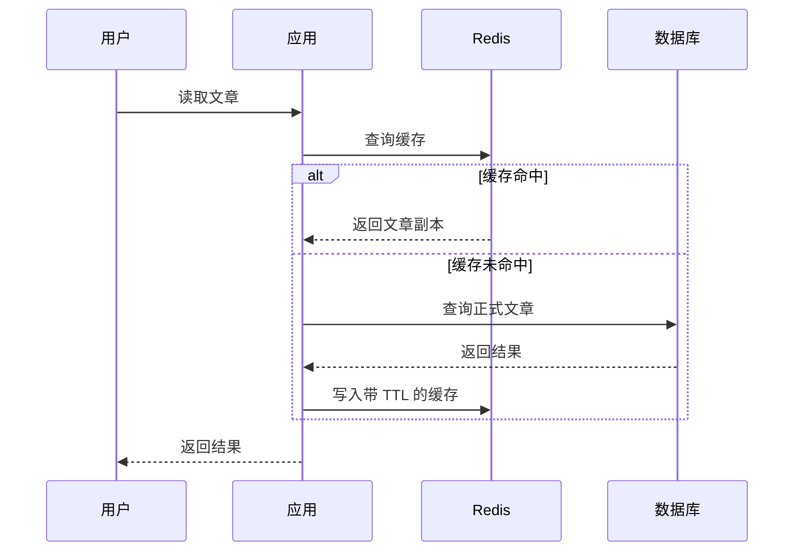
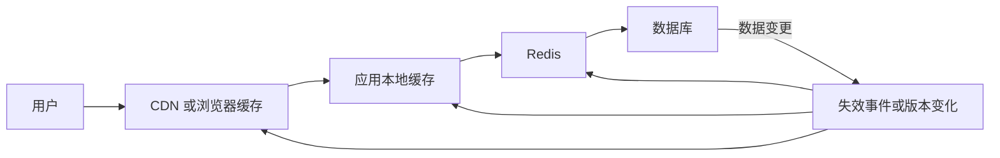
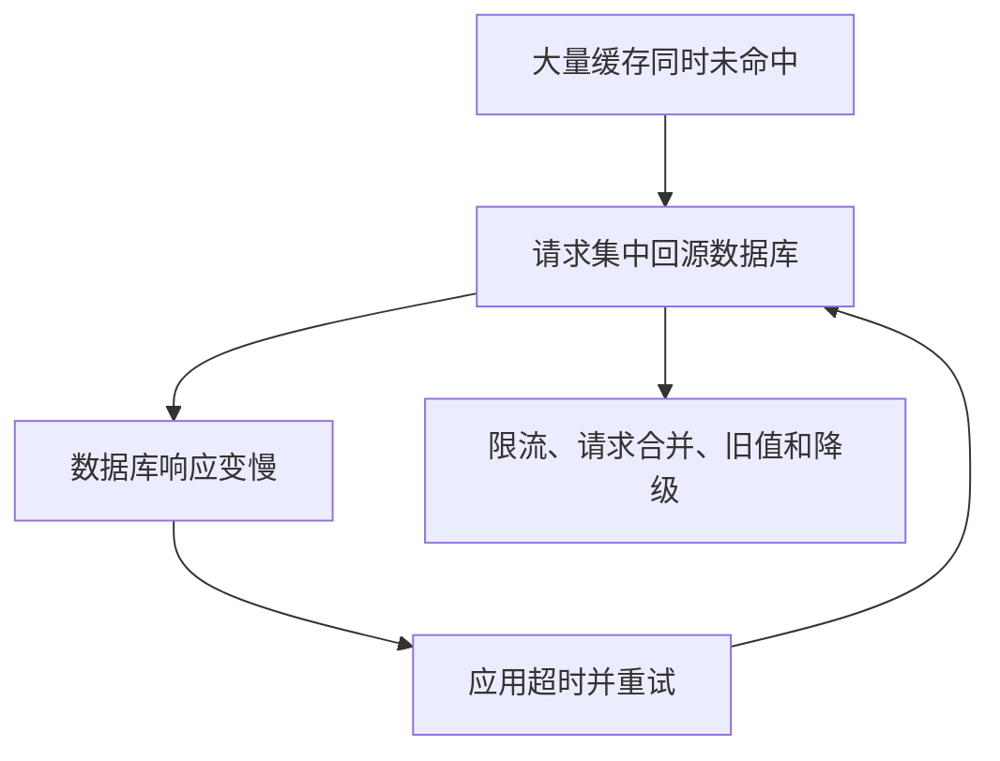
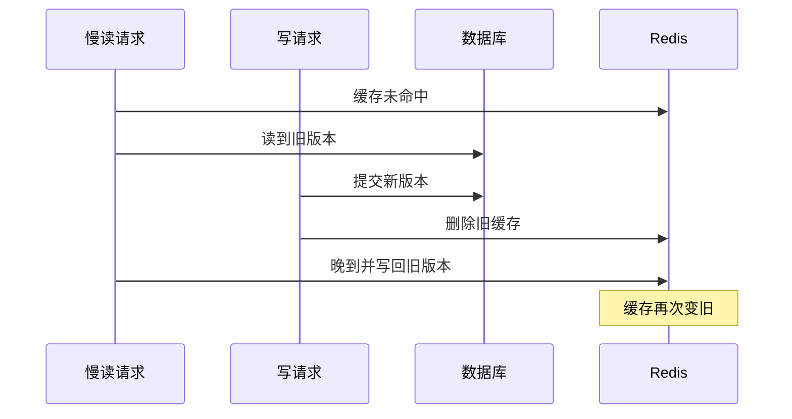
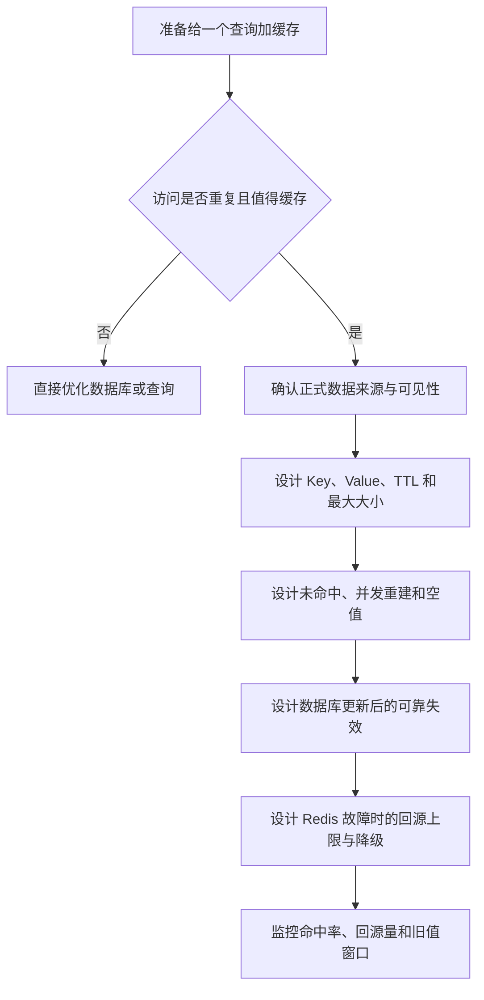

# 05 缓存问题与数据库一致性

> 阅读定位：这是整套文章里最实用的一篇。你不需要自己写缓存框架，但需要看懂“先查 Redis、未命中查数据库、更新后删缓存”这条主线，以及穿透、击穿、雪崩为什么不是同一个问题。

## 先用餐厅理解缓存

一家餐厅把所有菜都等客人下单后才去市场买原料，结果一定很慢。更合理的方式是把高频菜品提前备在操作台：

- 操作台有成品或半成品，立即出餐，这叫缓存命中。
- 操作台没有，才去仓库或后厨准备，这叫缓存未命中和回源。
- 菜品放太久会不新鲜，需要 TTL 或变更失效。
- 所有预制菜同时用完，后厨会突然被订单压垮，这就是缓存雪崩的直觉。

Redis 缓存不是为了让数据库永远不被访问，而是让大量重复读取在更近、更快的地方结束。

## 缓存真正难的不是读写

缓存的基础流程很简单：先查 Redis，命中就返回，未命中就查数据库并回填。真正困难的是缓存过期后并发回源、数据库更新后旧缓存没有删除、Redis 故障时数据库被流量压垮。

缓存适合读多写少、生成成本较高、访问有重复、允许短暂旧值并且能够重建的数据。低频查询、强实时结果和高度个性化权限数据，缓存收益可能不高。

### 不是所有查询都值得缓存

| 问题 | 适合缓存的信号 | 不适合或要谨慎的信号 |
| --- | --- | --- |
| 是否重复访问 | 同一文章、分类树被大量重复读取 | 每次查询参数几乎都不同 |
| 生成成本 | 查询或聚合较慢 | 数据库本身已经很快且流量很低 |
| 新鲜度 | 允许几秒或几分钟旧值 | 余额、库存结算、即时权限必须准确 |
| 数据体积 | 结果较小且可控 | 单个结果很大或包含大文件 |
| 恢复能力 | 可从数据库重建 | Redis 丢失后无法恢复事实 |

缓存本身也有成本：内存、序列化、失效逻辑、监控、冷启动和故障降级。命中率很低的缓存，可能只是给系统增加一层复杂度。

## Cache-Aside 是最常见模式

Cache-Aside 可以翻译为“缓存放在旁边”。应用同时认识 Redis 和数据库，并自己决定先查谁、何时回填、数据更新后何时失效。



第一次请求和第二次请求的区别：

1. 第一次请求查 Redis，没有缓存。
2. 应用查询数据库，拿到正式数据。
3. 应用把副本写入 Redis，并设置 TTL。
4. 第二次相同请求查 Redis，直接命中。

注意：数据库不会主动把查询结果送进 Redis，Redis 也不会主动替应用访问数据库。编排者通常是应用服务。

下面是一个简化的 ioredis 风格示意，重点是顺序，不是可直接复制的生产代码：

```javascript
async function getArticle(id) {
  const key = `cache:article:${id}`
  const cached = await redis.get(key)

  if (cached === '__NULL__') return null
  if (cached !== null) return JSON.parse(cached)

  const article = await database.findArticle(id)
  if (!article) {
    await redis.set(key, '__NULL__', 'EX', 60)
    return null
  }

  await redis.set(key, JSON.stringify(article), 'EX', 600)
  return article
}
```

这里展示了命中、回源和空值缓存。使用 `cached !== null` 是因为 Redis 中的空字符串也是合法值，不能只靠真假判断。真实项目还需要避免空值标记与业务值冲突，并处理序列化版本、超时、请求合并、随机 TTL、日志脱敏和 Redis 降级。

### 把这段代码逐段看懂

第一段生成 Key 并读取 Redis：

- `cache:article:` 表示它是一份文章缓存。
- id 区分不同文章。
- `redis.get` 返回字符串或 null，不会自动变成文章对象。

第二段处理两种命中：

- 值等于 `__NULL__`，表示之前已经确认数据库里没有这篇文章，直接返回 null。
- 其他非 null 值是序列化文章，通过 JSON.parse 还原。

第三段在未命中时查询数据库：

- 数据库没有文章，就缓存一个短期空值。
- 数据库有文章，就序列化并缓存十分钟。
- 无论 Redis 回填是否成功，当前请求已经有数据库结果，可以根据业务策略继续返回。

这仍然只是教学骨架。生产代码至少还要决定：

- Redis 读取超时是直接回源，还是快速失败。
- 数据库也失败时返回什么。
- 同一个热点未命中时，是否允许几千个请求同时回源。
- JSON 结构升级后，旧缓存怎样识别。
- 文章是否对当前用户可见，能否共享同一个缓存。
- 日志中是否会输出敏感正文或 Key。

### 三种失败要分开处理

| 失败位置 | 发生了什么 | 常见处理方向 |
| --- | --- | --- |
| Redis 读取失败 | 不知道缓存是否存在 | 限速回源、使用本地短缓存或降级 |
| 数据库读取失败 | 正式事实也拿不到 | 不要缓存成“不存在”，应返回错误或旧值降级 |
| Redis 回填失败 | 当前已有数据库结果，但下次仍会未命中 | 当前请求可返回，记录指标并防止持续回源 |

## 其他缓存模式

下面这些名字不需要背。它们只是说明“谁负责加载”和“写入先到哪里”可以有不同安排。

| 模式 | 基本思路 | 主要边界 |
| --- | --- | --- |
| Cache-Aside | 应用负责查询、回填和失效 | 最灵活，也最容易重复实现 |
| Read-Through | 缓存层负责未命中加载 | 缓存组件需要理解数据源 |
| Write-Through | 写缓存时同步写主存储 | 写延迟更高，仍不是天然跨系统事务 |
| Write-Behind | 先写缓存，稍后批量落库 | 未落库数据可能丢失或重复 |
| Refresh-Ahead | 热点到期前后台刷新 | 可能浪费资源刷新冷数据 |

Write-Behind 适合可聚合阅读量和非关键统计，不应轻易用于余额、支付和正式订单。

对普通 Web 项目而言，先把 Cache-Aside 做稳通常已经足够。不要因为看到更多模式就同时引入，否则故障时很难判断哪一层拥有最新值。

## 多级缓存

浏览器或 CDN、应用本地缓存、Redis 和数据库可以形成多级缓存。越靠近用户越快，但失效传播越复杂。

它像一份文件的多级副本：

- 用户浏览器手里可能有一份。
- CDN 边缘节点有一份。
- 每台应用进程内存有一份。
- Redis 有一份共享缓存。
- 数据库保留正式版本。

副本越多，读取越快；但文章下架时，需要让更多地方停止使用旧副本。



公开静态文章适合 CDN，极热小配置适合本地缓存，多个应用共享的动态结果适合 Redis。包含用户隐私和权限差异的数据不能错误共享。

Redis 还支持服务端辅助客户端缓存：Redis 跟踪客户端读取过哪些 Key，Key 变化后向客户端推送失效通知。它比固定 TTL 更及时，但客户端断线可能错过通知，重连后应清理无法确认的新旧本地副本。

多级缓存最危险的不是“某一层没命中”，而是权限或可见性发生变化后，外层仍返回旧内容。公开内容、登录用户内容和管理员内容必须使用不同缓存边界，不能只依赖前端隐藏。

## 缓存穿透

穿透表示请求的数据根本不存在，每次都绕过缓存查询数据库。恶意请求随机 ID 时，数据库会持续承压。

生活比喻是：有人每天拿一串随机书名去前台询问。前台的热门书架永远没有这些书，只能每次都让档案员查完整仓库，最后发现根本不存在。

常见处理：

- 缓存短期空值，但不能把数据库超时当成“不存在”。
- 使用 Bloom Filter 挡掉明显不存在的 ID。
- 对用户、网络来源和接口做限流。
- 对查询参数做格式和范围校验。

Bloom Filter 可能把不存在误判为可能存在，因此最终仍要查数据库；新增数据时也要及时更新过滤器。

空值缓存要区分两种结果：

- 数据库明确返回“没有这条记录”，可以短期缓存为空。
- 数据库超时或报错，只能说明“这次没查成功”，不能缓存成不存在。

否则一次数据库故障会被错误地固化成大量假空值。

## 缓存击穿

击穿表示一个热点 Key 刚好过期，大量并发请求同时回源同一份数据。

它像一家店最受欢迎的一份菜单突然从前台丢失。正常情况下只需一个员工去后厨取新菜单；如果所有顾客都亲自冲进后厨询问，后厨就会被同一件事淹没。

可以使用：

- 请求合并：只有一个请求负责重建，其他请求等待或复用结果。
- 短租约：让一个实例获得缓存重建权。
- 逻辑过期：允许短时间返回旧值，后台刷新。
- 提前刷新：热点到期前更新。

互斥重建必须有超时，不能让第一个重建者崩溃后所有请求永久等待。

请求合并也不等于让其他请求无限等待。可以根据业务选择：

- 短暂等待重建结果。
- 返回上一版旧值。
- 返回简化内容。
- 超过等待上限后快速失败。

对于公开热门文章，短时间返回旧内容往往比让数据库失去服务更可控；对于权限和余额，旧值可能不可接受。

## 缓存雪崩和冷启动

雪崩表示大量 Key 同时失效或 Redis 整体不可用，数据库突然承受完整流量。冷启动则是部署、清空或版本变化后缓存大面积未命中。

击穿只围绕一个热点 Key，雪崩则是很多 Key 或整层 Redis 同时失效。冷启动不一定是事故，也可能是新环境第一次上线，但它产生的回源压力与雪崩很像。

常见防护包括：

- TTL 加随机抖动。
- 核心热点分批预热。
- 限制数据库回源并发。
- 本地短缓存和旧值降级。
- 熔断非核心功能。
- Redis 高可用，但不能只依赖高可用。

重试会放大雪崩。客户端、应用、网关如果各自重试三次，一次用户请求可能变成几十次依赖调用。



### 三个缓存问题一眼区分

| 问题 | 缓存中原本有什么 | 主要流量形态 | 第一反应 |
| --- | --- | --- | --- |
| 穿透 | 请求的数据从来不存在 | 大量随机不存在 Key | 参数校验、空值、Bloom Filter、限流 |
| 击穿 | 一个极热 Key 刚失效 | 并发集中回源同一数据 | 请求合并、互斥重建、逻辑过期 |
| 雪崩 | 大量 Key 或整个缓存同时不可用 | 广泛回源多种数据 | TTL 打散、回源限流、预热、降级 |

高可用 Redis 可以降低“整层服务不可用”的概率，却不能消除大量 TTL 同时到期，也不能替数据库设置回源上限。因此“上了集群”不是缓存雪崩的完整答案。

## 数据库和缓存为什么会不一致

数据库和 Redis 是两个独立系统，无法依靠普通本地事务同时提交。无论先更新哪一边，中间都可能失败或被并发请求穿插。

数据库中的文章是原件，Redis 中的文章是复印件。原件改完以后，复印件不会凭空感知变化。应用必须删除旧复印件、更新复印件，或者让版本变化使旧复印件不再被读取。

### 常见写入顺序为什么选“先数据库、后删缓存”

| 做法 | 看起来怎样 | 主要问题 |
| --- | --- | --- |
| 先更新缓存，再更新数据库 | 用户很快看到新值 | 数据库失败后缓存出现不存在的正式结果 |
| 先删缓存，再更新数据库 | 简单 | 数据库更新期间，读请求可能回填旧值 |
| 同时更新数据库和缓存 | 直观 | 聚合缓存难以完整更新，任一步失败都会分叉 |
| 先更新数据库，再删缓存 | 常见 Cache-Aside | 删除失败仍需重试和版本兜底 |

最常见的 Cache-Aside 写入顺序是：

1. 更新数据库。
2. 数据库成功后删除缓存。
3. 下次读取从数据库重建。

通常删除缓存比直接更新缓存简单，因为缓存可能是多表聚合、分页结果或不同权限版本，很难一次更新完整。

删除之后，下次读取会从数据库重建。这样可以把“如何生成缓存”的逻辑集中在读取路径，减少写入路径同时维护几十种缓存形态。

但“常见”不等于绝对正确。强一致、极高写入、复杂聚合等场景可能需要版本、事件、事务消息或直接不缓存。方案必须说明允许旧多久。

## 仍然可能出现旧值回填

一个慢读请求先发现缓存未命中并查询到旧数据库值；此时另一个请求更新数据库并删除缓存；慢读请求最后又把旧值写回 Redis，形成“旧请求晚到”。



这个时序中每个单独动作都没有报错，最终仍然得到旧缓存，原因是慢读请求拿着旧结果晚到。并发一致性问题不能只靠“失败重试”解决，因为这里没有明显失败。

解决方向包括版本化 Key、缓存值携带数据库版本、写入前比较版本、缩短 TTL，以及通过可靠变更事件再次失效。不要把延迟双删当成所有场景的万能答案，它只是在特定时序下缩小窗口。

版本化 Key 的思路是：读取路径先获得当前内容版本，例如 42，再读取 `cache:article:1001:v42`。文章更新后版本变为 43，旧的 v42 即使暂时没删，也不会再被新请求使用，最后自然过期。代价是要可靠获得当前版本，并清理历史副本。

## 删除缓存失败怎么办

数据库已经成功、Redis 删除失败时，旧缓存会继续存在。成熟系统需要可重试记录，而不是只在日志里打一行错误。

日志只能告诉人“曾经失败”，不能保证系统最终补做。夜间无人查看时，旧缓存可能一直存在到 TTL 结束。

常见方案：

- Outbox：在数据库事务中同时记录一条待处理变更事件，后台可靠地删除缓存。
- CDC：监听数据库变更日志，驱动缓存失效和搜索索引更新。
- 消息队列：发布带业务版本的变更事件，消费者幂等处理。

事件本身也可能重复，所以失效操作应幂等，并监控积压和失败。

### 用 Outbox 理解可靠失效

Outbox 像数据库事务旁边的一张“待办单”：

1. 修改文章和写入待办事件放在同一个数据库事务中。
2. 只要文章修改成功，待办单就一定存在。
3. 后台工作者读取待办单，删除 Redis 缓存并更新搜索索引。
4. 失败可以重试，成功后记录处理状态。

它不能让数据库和 Redis 变成一个事务，但能避免“数据库已改、应用崩溃、没人知道还要删缓存”的永久遗漏。

## 缓存策略卡

每个缓存至少写清：数据来源、Key 组成、Value 版本、TTL、随机范围、最大大小、重建者、失效事件、允许旧多久、命中率目标和 Redis 故障时的降级。

### 以知识库文章为例

| 项目 | 设计问题 |
| --- | --- |
| 正式来源 | 只从数据库中已发布、当前可见文章生成 |
| Key | 是否包含文章 ID、语言、租户和内容版本 |
| TTL | 基础 TTL 多长，随机抖动范围多大 |
| 权限 | 公开缓存能否被登录态或管理员页面复用 |
| 失效 | 发布、修改、下架分别删除哪些详情、列表和目录缓存 |
| 重建 | 热点未命中时谁负责重建，其他请求怎样等待或降级 |
| Redis 故障 | 数据库最多允许多少并发回源 |
| 旧值 | 哪些页面允许短暂旧内容，最长允许多久 |

## 小白应建立的缓存思考顺序



## 本章小结

缓存读取很简单，缓存治理却涉及穿透、击穿、雪崩、冷启动、多级失效和数据库一致性。最常见写入方向是数据库成功后删除缓存，再通过重试、Outbox、CDC 或版本控制缩小失败窗口。

开发者不必手写一套通用缓存框架，但应能看懂代码为什么先查缓存、为什么缓存空值、为什么删除而不是更新，以及 Redis 失败后数据库是否有流量保护。
