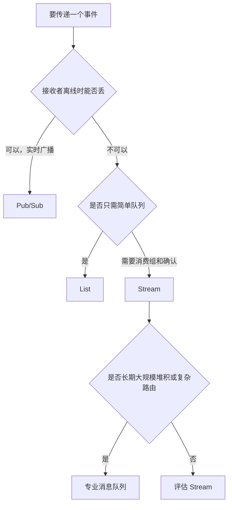
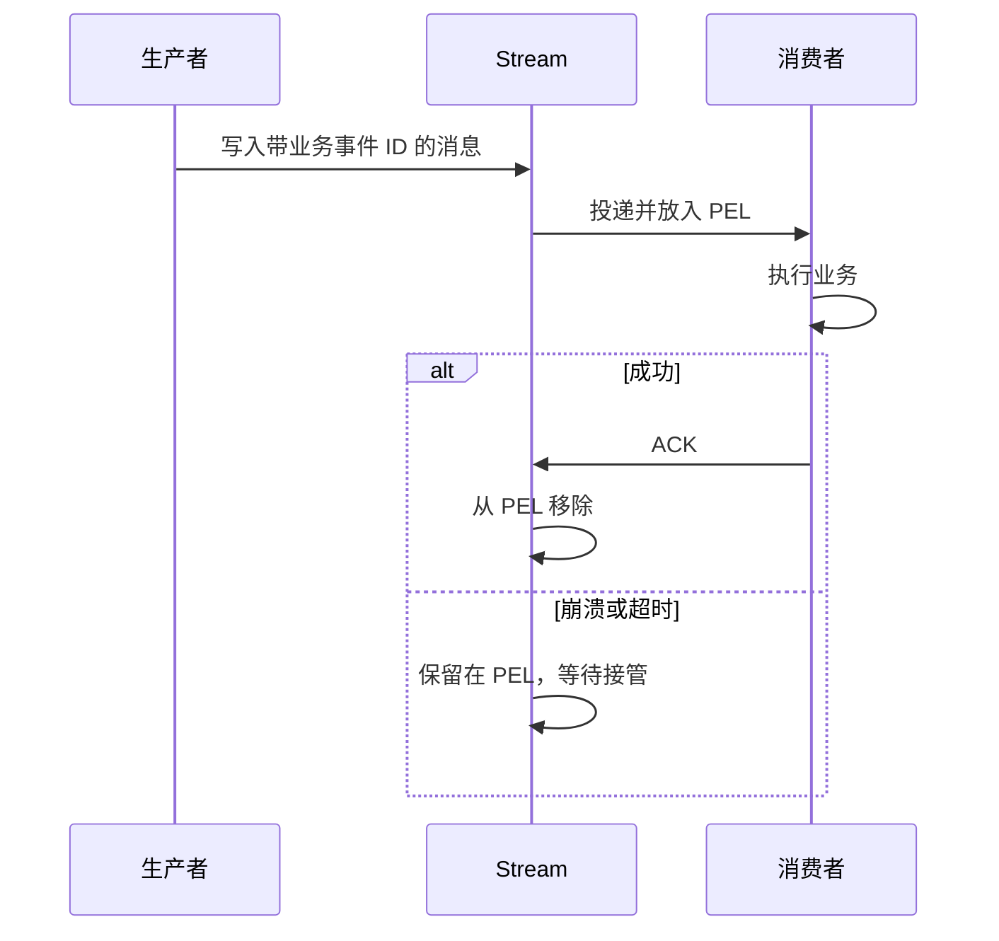
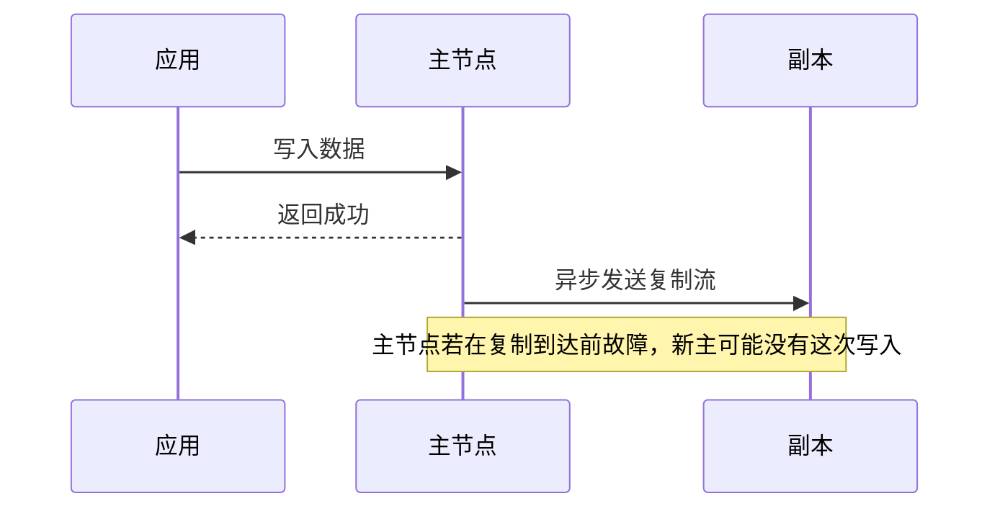
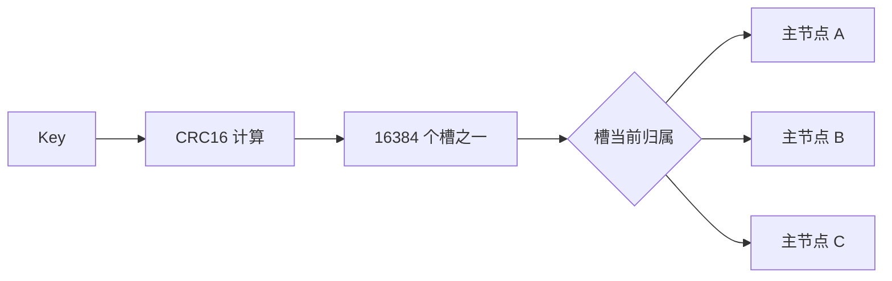

# 07 消息、持久化与高可用

> 阅读定位：这一篇术语较多，但主线只有三条。消息机制解决“任务交给谁、失败能否再来”，持久化解决“进程重启后数据怎样回来”，高可用解决“当前节点坏了由谁接班”。三条线不能互相替代。

## 先区分三张安全网

很多人会把 Stream、AOF、复制和 Cluster 全部理解成“防丢数据”，结果越学越乱。它们保护的对象不同：

| 安全网 | 主要问题 | 不能自动解决 |
| --- | --- | --- |
| 消息确认与重试 | 消费者拿到任务后崩溃怎么办 | Redis 节点自身的数据是否还在 |
| RDB、AOF 和备份 | Redis 重启或磁盘故障后怎样恢复 | 服务是否能立即自动切换 |
| 复制、Sentinel、Cluster | 当前主节点故障后谁继续服务 | 已确认写入是否绝对零丢失 |

可以把它们想成快递公司的三套制度：签收记录负责包裹有没有送完，账本备份负责系统重启后还能查记录，备用网点负责当前网点停业后继续营业。

## 先区分通知和任务

商场广播属于通知，没在线的人可以错过；订单打包属于任务，工作人员离线不能让任务消失。

Redis 提供 List、Pub/Sub 和 Stream 等消息能力，但它们的可靠性不同。



选择消息方案前先问：

1. 接收者离线时，消息能不能错过？
2. 消费失败后，是否必须重试？
3. 是否需要多个消费者分担同一组任务？
4. 消息要保留多久，最多可能堆积多少？
5. 是否需要复杂路由、跨地域和成熟死信治理？

前两个问题已经能把 Pub/Sub 和可靠任务明显区分开。

## Pub/Sub：在线广播

发布者向频道发送消息，Redis 推送给当时在线的订阅者。断线期间没有历史补发，也没有业务 ACK，通常按“至多一次”理解。

它像商场广播：广播时在商场里的人能听到，已经离开的人不会在第二天收到补播。

最小概念示意：

```redis
SUBSCRIBE article-updates
PUBLISH article-updates "article-1001-published"
```

一个客户端订阅频道，另一个客户端发布消息。发布命令返回的接收者数量只说明当时有多少订阅者收到推送，不代表每个订阅者都完成了业务处理。

它适合低价值实时通知、缓存失效提示和在线配置刷新，不适合支付、订单和导入任务。

慢订阅者读取速度跟不上发布速度时，服务端输出缓冲会增长，超过限制后连接可能被关闭。

Redis 7 起提供 Cluster 分片 Pub/Sub，减少传统频道在集群中的全局传播成本，但它仍然没有离线历史和确认。

如果缓存失效通知只靠 Pub/Sub，某台应用断线期间可能错过消息。重连后应清空无法确认的本地缓存，或者用版本号再次校验，而不是假设通知永远送达。

## Stream：带编号和待确认记录的日志

Stream 中每条消息有一个递增意义的 ID，可以按位置读取。消费组让多个消费者分担任务。

把 Stream 想成一本只能向后追加的值班日志。每条记录有页码，消费者可以记住自己读到哪里；使用消费组时，任务交给某个消费者后还会留下“待确认”记录。

```redis
XADD article-events * type published articleId 1001
XGROUP CREATE article-events indexers 0 MKSTREAM
XREADGROUP GROUP indexers worker-1 COUNT 10 STREAMS article-events >
XACK article-events indexers 1710000000000-0
```

这几行表达的是写入事件、创建消费组、消费者领取新消息和处理成功后确认。实际 ID 由读取结果获得。

逐行理解：

1. XADD 向 article-events 追加一条“文章已发布”事件，星号让 Redis 生成消息 ID。
2. XGROUP CREATE 创建名为 indexers 的消费组，MKSTREAM 表示流不存在时一起创建。
3. XREADGROUP 让 worker-1 从消费组领取最多 10 条从未分配的新消息。
4. XACK 使用真实读取到的消息 ID，告诉 Redis 这条消息已经成功处理。

消费组中的多个消费者是在分担任务，不是每个消费者都收到一份。若搜索索引和通知服务都需要各自处理同一事件，通常为它们建立不同消费组。

消息交给消费者但尚未确认时，会进入 Pending Entries List，简称 PEL。消费者崩溃后，消息仍在 PEL，其他消费者可以在超时后接管。

PEL 可以理解为“已经领走但还没交回完成单的任务清单”。它让系统知道哪些消息可能卡在已故障消费者手里。



最危险的情况是数据库已经写成功，但 ACK 前进程崩溃。消息会再次投递，所以 Stream 通常提供“至少一次”方向的能力，业务仍需要幂等。

这段时序非常重要：

1. 消费者收到消息。
2. 消费者成功更新数据库。
3. 进程在发送 ACK 前崩溃。
4. 其他消费者接管并再次处理同一消息。

如果业务没有使用事件 ID、数据库唯一约束或状态机幂等，就可能重复发送通知、重复创建记录或重复扣减。

重试次数、退避、毒消息、死信和人工重放通常由应用设计。Stream 确认后原始条目不会自动删除，还要设置按长度或最小 ID 裁剪，避免无限增长。

“ACK 了”只表示从 PEL 中移除待确认状态，不等于删除 Stream 中的原始历史。日志保留和任务确认是两件事。

裁剪也要考虑慢消费者。如果历史删得太快，落后消费者可能失去需要的数据；保留太久，Stream 会无限增长。应根据最大离线时间、消息量和重放需求规划。

### Stream 适合与不适合

| 更适合 | 需要谨慎或评估专业消息队列 |
| --- | --- |
| 已经使用 Redis 的轻量任务 | 长期堆积海量消息 |
| 简单消费组和失败接管 | 复杂主题路由与跨区域复制 |
| 中小规模事件驱动 | 严格顺序、成熟死信平台和大量运维工具 |
| 可由业务实现幂等和重试 | 团队不准备维护 PEL、接管和裁剪 |

## RDB：给内存拍快照

RDB 保存某一时点的数据集，文件紧凑，恢复较快。两次快照之间的变化可能丢失，因此它有明确的数据丢失窗口。

它像每隔一段时间给白板拍一张照片：

- 照片能快速还原拍照时的内容。
- 拍照后新写的内容，如果还没拍下一张就断电，可能没有出现在照片里。
- 拍照频率越高，磁盘和 CPU 成本也会增加。

生成快照通常会 fork 子进程。父子进程最初共享内存页，主进程继续写入时，操作系统复制被修改的页，这叫写时复制。大实例高写入期间可能出现额外内存峰值和延迟。

fork 不会在一开始完整复制全部内存，但页表和后续写时复制仍有成本。实例越大、写入越密集，持久化期间越需要关注延迟、物理内存和 COW 指标。

## AOF：记录可重放变化

AOF 持续记录写操作。常见刷盘策略大致是每次写、每秒或交给操作系统安排。

它像给白板旁边放一本操作日记：写了什么、删了什么都按顺序记下来。恢复时重新执行这些有效操作，重建当前状态。

每次写尽量同步，数据窗口小但延迟成本高；每秒同步常在性能和风险之间折中；交给系统安排可能丢失更长一段数据。任何策略都不应宣传为绝对零丢失。

AOF 会增长，因此需要重写，把大量历史操作压缩成能够恢复当前状态的较小集合。

例如一个计数器先增加一万次，AOF 不需要永远保留一万条历史 INCR。重写可以根据当前结果生成更紧凑的恢复表示。

现代 Redis 使用多部分 AOF 思路：基础文件表示基准状态，增量文件记录之后变化，清单文件说明哪些文件属于当前有效集合。具体格式和默认行为依版本而异。


同时启用 RDB 和 AOF 时，启动恢复通常会优先使用更完整的 AOF 路径，具体行为仍应以实际版本和配置为准。不要只看“配置已开启”，还要确认最近一次保存、重写和启动加载是否成功。

复制不是备份。误删除和错误写入会同步到副本；备份应保存在独立故障域，具备历史版本、权限控制和恢复演练。

这句话值得反复看：副本像实时复印机，主节点删错一页，副本也会跟着删；备份像保留昨天、上周和上月的密封档案，可以回到错误发生前。

### RDB、AOF 和备份怎样分工

| 能力 | 主要价值 | 典型风险 |
| --- | --- | --- |
| RDB | 文件紧凑、恢复快、适合周期快照 | 两次快照之间可能丢变化 |
| AOF | 数据变化记录更连续 | 文件、刷盘、重写和磁盘延迟成本 |
| 复制 | 节点故障时有可切换副本 | 异步复制落后，错误也会传播 |
| 独立备份 | 应对误操作、损坏和历史恢复 | 不演练就不知道能否真正恢复 |

## RPO 和 RTO

RPO 表示故障时最多能接受丢多久的数据，RTO 表示恢复服务最多能接受多长时间。

举例：

- RPO 为 1 分钟，表示业务接受最多丢失故障前约 1 分钟变化。
- RTO 为 5 分钟，表示希望故障后 5 分钟内恢复可用服务。

RPO 越接近零，通常需要更强同步、更多副本或业务日志；RTO 越短，通常需要自动切换、预备容量和成熟演练。两者都意味着成本。

纯缓存可以空实例启动后限速预热；保存会话、计数增量和 Stream 任务时，要单独定义丢失影响。备份能否恢复，必须通过演练验证。

一个 Redis 实例里混着缓存、会话和任务时，不能只写一个统一 RPO。缓存丢失只是回源，会话丢失可能让用户退出，任务丢失可能造成业务遗漏，影响完全不同。

## 主从复制

主节点执行写入后，通常异步把复制流发送给副本。副本可能短暂落后，因此读副本可能返回旧值，故障切换也可能丢失尚未复制的写入。



应用收到主节点成功响应，只表示主节点已经接受写入，不一定表示所有副本都已持有这次变化。

主节点和副本通过复制标识、偏移量和积压缓冲区判断同步位置。短暂断线且缺口仍在缓冲区时，可以部分同步；缺口过大或历史不匹配时，需要全量同步。

等待一定数量副本确认和限制健康副本数量，可以降低写丢失概率，但不等于强一致事务。

读副本也有一致性代价。刚写完主节点立刻去副本读取，可能看到旧值。需要“写后立刻读到自己写入”的接口，通常应读主节点或采用明确的一致性方案。

## Sentinel：监控和自动选主

Sentinel 用于单主数据集的主从高可用。一个 Sentinel 认为主节点不可达叫主观下线；足够多个 Sentinel 同意后形成客观下线。

Sentinel 本身不保存业务数据，它像一组值班主管，持续检查主节点和副本：

- 主节点是否还能连接。
- 哪个副本同步得更接近。
- 是否达到共同判断故障的条件。
- 谁负责发起本次故障转移。

quorum 用于客观下线判断，真正执行故障转移的 Sentinel 通常还要获得 Sentinel 集合多数授权。两个概念不能混成同一个数字。

故障转移会选择较健康、同步较新的副本提升为新主，其他副本改为跟随新主，客户端重新发现地址。旧主恢复后通常成为新主的副本。

一次切换大致经历：

1. 多个 Sentinel 判断原主不可用。
2. 某个 Sentinel 获得执行故障转移的授权。
3. 选择合适副本提升为新主。
4. 让其他副本改为跟随新主。
5. 客户端通过 Sentinel 发现新地址并重连。
6. 旧主恢复后重新加入复制关系。

切换需要时间，也可能丢失异步复制尚未到达新主的数据。客户端必须支持 Sentinel 发现和幂等重试，不能把旧主地址永久写死。

自动切换期间，部分请求会超时或连接断开。客户端重试写命令前必须考虑“原命令可能已经成功，只是响应丢了”，否则可能重复产生副作用。

## Cluster：分片和内置故障转移

Redis Cluster 把 Key 映射到 16384 个哈希槽，再把槽分配给多个主节点。它解决单个主节点容量和总吞吐不足的问题。

可以把 16384 个槽想成固定编号的储物柜区。Redis 先根据 Key 算出它属于哪个柜区，再根据当前槽位分配表找到具体主节点。



Cluster 客户端维护槽到节点的映射。MOVED 表示槽已经正式属于其他节点，客户端应更新映射；ASK 表示槽正在迁移，本次请求临时访问目标节点。

普通客户端若不理解 MOVED 和 ASK，就会把重定向当成错误。部署 Cluster 必须使用真正支持 Cluster 拓扑的客户端模式。

多个 Key 要在同一个原子命令、事务或脚本中操作时，通常必须位于同一槽。哈希标签可以让相关 Key 共槽，但过度使用会造成数据倾斜。

例如 `order:{1001}:detail` 和 `order:{1001}:items` 中花括号里的 1001 可以作为相同哈希标签，让两个 Key 落在同一槽。这样便于必要的多 Key 操作，但如果所有 Key 都使用同一个标签，就会全部挤到一个节点。

新增节点后还要迁移槽和槽内 Key，并控制迁移速度。大 Key 和热 Key 会让迁移更困难。Cluster 也无法自动拆开单个热 Key。

Cluster 通常只使用逻辑数据库 0。即使在单节点里可以 SELECT 不同逻辑库，也不应把逻辑库编号当成强隔离；生产环境的项目、环境和权限隔离更适合使用独立实例、集群和账号。

## Sentinel 和 Cluster 怎么选

| 条件 | 更合适的方向 |
| --- | --- |
| 数据可放单主，依赖多 Key 操作，希望简单 | 主从加 Sentinel |
| 单主内存、网络或吞吐不足，需要水平扩容 | Cluster |
| 只需要可重建小缓存，能接受短时中断 | 单节点或托管基础规格 |
| 跨地域灾备 | 独立备份、复制和恢复方案，不是简单拉远节点 |

Sentinel 和 Cluster 解决不同问题，不是低级和高级的关系。Cluster 已经有自己的副本与故障转移机制，不需要再用 Sentinel 管理 Cluster 主节点。

### 选型时不要只看节点数量

| 问题 | Sentinel 方向 | Cluster 方向 |
| --- | --- | --- |
| 单份数据是否能放进一个主节点 | 可以 | 已经不够或预计很快不够 |
| 多 Key 操作是否很多 | 相对简单 | 需要考虑同槽限制 |
| 运维复杂度 | 较低 | 槽位、迁移、拓扑更复杂 |
| 横向扩容 | 不能把一份数据自动分到多主 | 核心能力 |
| 故障转移 | Sentinel 负责 | Cluster 自身负责 |

托管产品可能隐藏部分运维细节，但容量、分片边界、客户端模式、慢迁移和数据一致性仍需要应用团队理解。

## 高可用不等于灾备

同一机房内的自动切换解决的是节点故障。整个区域断电、账号误删、错误脚本批量删除、勒索攻击等问题，需要独立备份、跨故障域方案和恢复演练。

高可用关注“尽快继续服务”，灾备还关注“较大范围故障后从哪里恢复”。两者不能用一个副本数量替代。

## 第一次读完后记住这张地图

| 名词 | 一句话 |
| --- | --- |
| Pub/Sub | 在线广播，离线错过，没有业务 ACK |
| Stream | 追加日志，有消费组、PEL 和 ACK，业务仍要幂等 |
| RDB | 某个时点的快照 |
| AOF | 可重放的写操作记录 |
| 备份 | 独立保留历史版本，用于误操作和灾难恢复 |
| 复制 | 主节点把变化发送给副本，通常存在延迟 |
| Sentinel | 单主数据集的监控和自动选主 |
| Cluster | 16384 槽分片到多个主节点，并自带故障转移 |
| RPO | 最多能接受丢多少数据 |
| RTO | 最多能接受中断多久 |

## 本章小结

Pub/Sub 是在线广播，Stream 提供历史、消费组、PEL 和 ACK，但业务幂等、重试和死信仍由应用负责。RDB 是快照，AOF 是可重放日志，两者都需要理解数据丢失窗口。

复制提供副本，Sentinel 为单主数据集自动切换，Cluster 提供多主分片。高可用的真实含义是缩短中断和减少损失，不是永不宕机、永不旧读或绝不丢数据。
