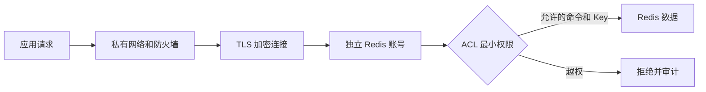
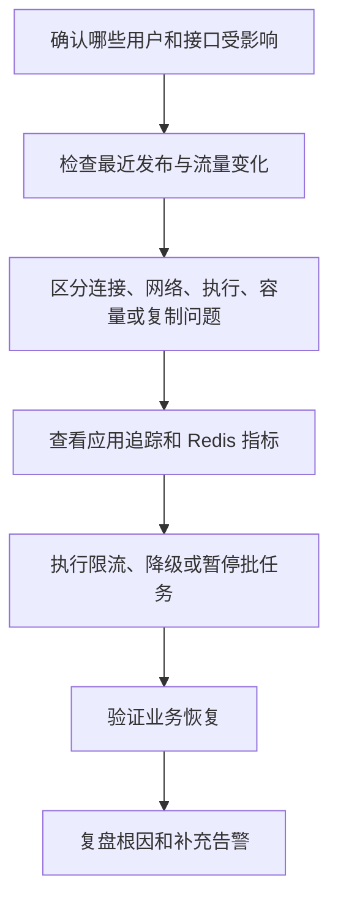
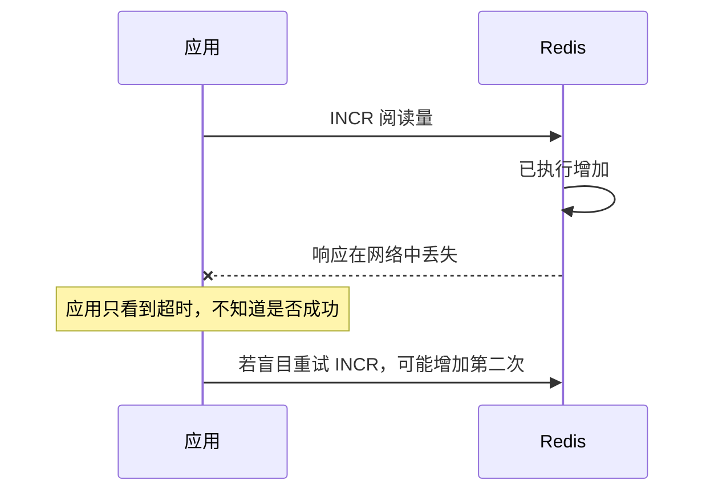
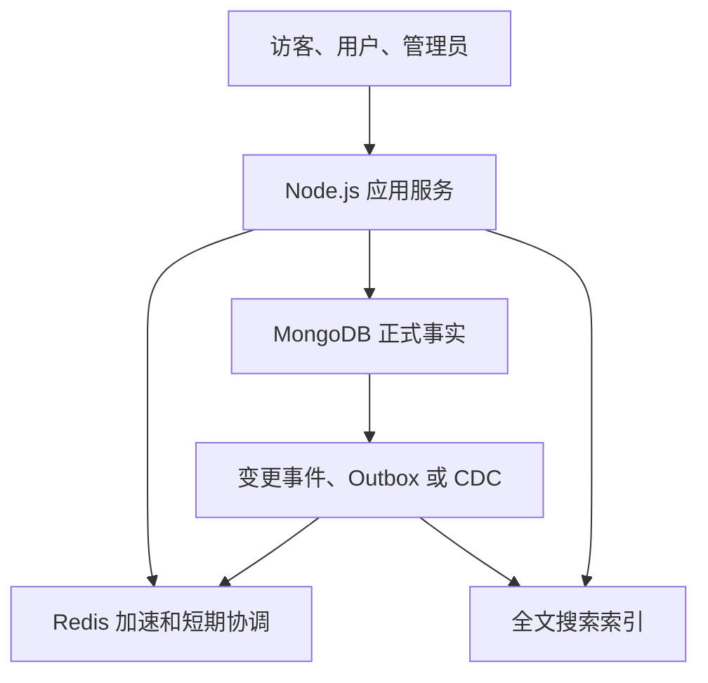
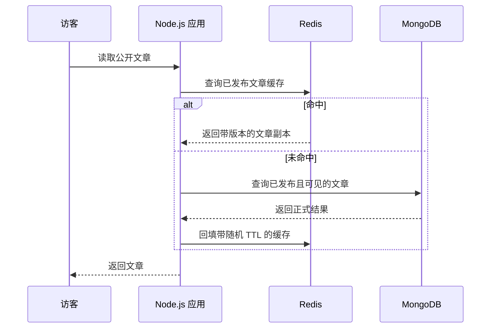
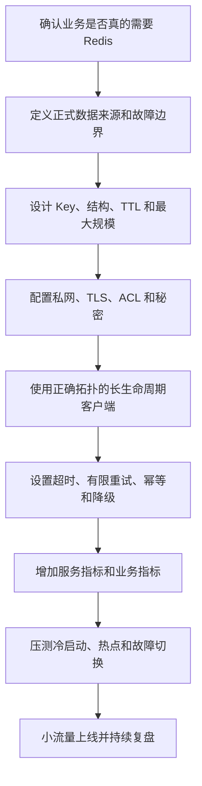

# 08 安全监控、ioredis 与项目应用

> 阅读定位：最后一篇把 Redis 从“知识点”放回真实 Node.js 项目。你不需要自己维护 Redis 内核，但要知道连接怎样复用、超时和重试为什么危险、哪些指标值得看，以及知识库中哪些数据可以缓存、哪些必须以数据库为准。

## 从“能连上”到“能上线”差了什么

本地开发时，只要地址正确、GET 和 SET 能运行，看起来就已经接入 Redis。生产环境还要继续回答：

1. 谁能通过网络访问 Redis？
2. 每个服务允许执行哪些命令、访问哪些 Key？
3. 密码和证书放在哪里，怎样轮换？
4. Redis 变慢或断开时，应用会等待多久、重试几次？
5. 内存、复制、持久化和 Stream 是否健康？
6. Redis 完全不可用时，核心业务怎样降级？

这些问题决定系统能否长期运行，重要性不低于选 String 还是 Hash。

## 生产 Redis 不只是设置密码

Redis 安全至少包含网络隔离、身份认证、最小权限、传输加密、秘密管理、备份保护和操作审计。

安全要像多道门，而不是只依赖一个密码：

- 第一层让 Redis 只存在于私有网络或受控网络。
- 第二层用防火墙、安全组限制来源。
- 第三层用 TLS 防止链路被窃听或篡改。
- 第四层用独立 ACL 账号认证。
- 第五层限制账号能执行的命令和访问的 Key。
- 第六层保护备份、日志和秘密管理系统。



Redis 不应直接暴露到公网。“设置了密码”不能替代网络不可达，因为认证仍可能被暴力尝试，软件漏洞和配置错误也可能扩大暴露面。

ACL 可以给不同服务设置独立账号、命令范围和 Key 范围。文章缓存服务不需要配置、复制和清空数据库权限；监控账号也不需要业务写权限。

例如：

| 服务 | 需要的权限方向 | 不应拥有 |
| --- | --- | --- |
| 文章读取服务 | 读取和写入文章缓存前缀 | FLUSHALL、复制配置、任意管理命令 |
| 会话服务 | 访问会话前缀和过期命令 | 读取文章正文或其他业务 Key |
| Stream 消费者 | 指定 Stream 和消费组命令 | 清空实例和修改持久化配置 |
| 监控采集 | 读取必要状态指标 | 修改业务数据 |

独立账号的价值不仅是防外部攻击，也是在某个应用配置泄露或代码出错时限制影响范围。

连接地址、用户名、密码和证书应由秘密管理或受控环境变量提供，不能写进源码、文章、镜像和日志。轮换凭证前要验证客户端能平滑重连。

日志中也不能打印完整 Redis URL，因为 URL 可能包含用户名和密码。错误上报、启动日志和监控标签都应脱敏。

清空数据、修改配置、建立复制关系和全量诊断等危险操作应依赖 ACL、审批和审计。命令改名只能作为附加措施，不能当作主要安全边界。

RDB 和 AOF 备份也可能包含会话和敏感业务值，需要加密、访问控制、保留周期和下载审计。

安全还包括数据最小化。验证码、会话令牌、用户位置等数据即使只存几分钟，也要避免明文日志、过长保留和无关服务访问。

## 需要监控哪些指标

监控不是为了收集一面墙的数据，而是尽早回答四个问题：还能不能接请求、会不会很快撞满、数据副本是否健康、用户是否已经受到影响。

| 方向 | 关键指标 | 说明 |
| --- | --- | --- |
| 内存 | used memory、RSS、碎片、maxmemory | 判断数据增长、碎片和系统余量 |
| 生命周期 | expired、evicted keys | 区分自然过期和内存淘汰 |
| 请求 | OPS、延迟分位数、命中率 | 判断负载与缓存价值 |
| 客户端 | 连接数、拒绝连接、blocked clients、输出缓冲 | 发现连接风暴和慢消费者 |
| 复制 | 主从状态、偏移差、延迟、全量同步 | 判断副本是否可用于切换 |
| 持久化 | 快照、AOF、fork、COW、磁盘和重写错误 | 判断重启恢复风险 |
| 消息 | Stream PEL、最老待确认时间、死信 | 判断消费者是否卡住 |
| 业务 | 回源量、限流拒绝、会话失败、降级次数 | 连接 Redis 指标和用户影响 |

### 单个指标不能单独下结论

- used memory 上升，可能是业务增长，也可能是 Key 没有 TTL。
- RSS 高于逻辑内存，可能是正常分配器行为，也可能是碎片持续恶化。
- 命中率下降，可能是故障，也可能是发布后冷启动。
- 连接数上升，可能是流量增长，也可能是每个请求错误创建新连接。
- 副本延迟上升，可能影响切换后的数据新鲜度。

因此要看基线、趋势、持续时间和业务流量，而不是从网上抄一个固定阈值用于所有实例。

命中率下降不一定是 Redis 故障，也可能是发布后冷启动、TTL 过短、流量结构变化或大量不存在查询。全局平均值还可能掩盖某个核心缓存已经失效，应按业务域拆分。

慢日志只记录服务端命令执行阶段，不包含等待连接、网络传输、输出缓冲和客户端解析。因此接口很慢而慢日志为空并不矛盾。

建议把监控分成三层：

| 层次 | 例子 | 解决的问题 |
| --- | --- | --- |
| 基础设施 | CPU、内存、磁盘、网络 | 机器是否有资源 |
| Redis 服务 | 命令延迟、连接、淘汰、复制、持久化 | Redis 自身是否健康 |
| 业务 | 命中率、回源量、登录失败、任务积压 | 用户和业务是否受影响 |

只有三层一起看，才知道是 Redis 导致业务慢，还是业务流量变化让 Redis 指标变化。

## 一套简单排障顺序



不要看到延迟就直接重启。重启可能触发缓存冷启动、全量复制和故障转移，还会丢失现场证据。

### 用“文章接口变慢”走一遍

1. 先确认只有文章详情慢，还是登录、搜索和后台都慢。
2. 查看最近是否发布了大文章、修改了 TTL 或上线了重试逻辑。
3. 在应用追踪中拆分连接等待、Redis 调用、数据库回源和 JSON 解析时间。
4. 如果命中率突然下降，检查 Key 命名或版本是否变化。
5. 如果 Redis 服务端延迟上升，检查慢命令、大 Key、fork、AOF 和复制。
6. 如果大量请求回源，先限制并发并启用旧值或非核心降级，保护数据库。
7. 业务恢复后再做根因修复，不在高峰期随意执行全量扫描。

告警应结合持续时间、趋势和业务 SLO。瞬间内存尖峰和持续预计十分钟后撞满，需要不同级别；一个副本短暂重连和所有副本断开也不能使用同一告警。

告警还要能行动。收到“内存 80%”后，如果没人知道应该扩容、清理哪类 Key、还是调整淘汰策略，这条告警只是噪声。每类关键告警最好附带负责人、仪表盘和处理手册。

## Node.js 项目怎样使用 ioredis

ioredis 是 Node.js 常见 Redis 客户端，支持单节点、Sentinel、Cluster、Pipeline、事务、Lua、Pub/Sub 和 Stream。

普通命令应复用长生命周期客户端，不要每个 HTTP 请求都新建连接。Pub/Sub 订阅和阻塞式 List/Stream 读取需要专用连接，避免把普通命令堵在等待连接后面。

可以把 Redis 连接想成应用到 Redis 的长期专线。每个 HTTP 请求都重新连接，就像每送一份文件都重新修一条路：握手、认证和资源开销会迅速放大。

通常按职责拆连接：

- 普通 GET、SET 等命令共享一个或少量长生命周期客户端。
- Pub/Sub 订阅使用专用连接，因为进入订阅模式后用途不同。
- 阻塞式队列或 Stream 读取使用专用连接，避免长时间等待占住普通命令通道。
- 管理和诊断操作不应复用普通业务账号随意执行。

一个最小连接示意如下：

```javascript
import Redis from 'ioredis'

const redis = new Redis(process.env.REDIS_URL, {
  lazyConnect: true,
  connectTimeout: 5000,
  commandTimeout: 2000,
  maxRetriesPerRequest: 1,
  enableOfflineQueue: false,
  retryStrategy(times) {
    return Math.min(times * 200, 3000)
  }
})

await redis.connect()
```

这段代码只展示关键概念，实际项目还要监听连接事件、记录脱敏指标并处理启动失败。

### 逐项看这段连接配置

`process.env.REDIS_URL` 表示连接信息来自环境，不写死在源码中。环境变量本身也不是绝对安全，生产中应由受控秘密系统注入，并限制谁能读取进程环境。

- lazyConnect：由应用显式控制什么时候连接。
- connectTimeout：限制建立连接等待时间。
- commandTimeout：限制命令等待时间。
- maxRetriesPerRequest：避免一条 Web 请求被内部重试困住太久。
- enableOfflineQueue：连接未就绪时是否暂存命令。
- retryStrategy：控制断线后的重连节奏。

重连策略应加入退避和随机抖动，避免所有应用实例同时冲击刚恢复的 Redis。认证错误和永久配置错误不能依赖无限重试自愈。

`maxRetriesPerRequest: 1` 不代表这是所有项目的固定答案。Web 请求通常有明确响应时间，适合较少内部重试；后台任务可能允许更长等待，但必须结合任务幂等和上层重试。超时预算要从用户接口总时限倒推。

`enableOfflineQueue: false` 表示连接未就绪时不把普通命令无限堆在客户端内存里。这样更容易快速暴露依赖不可用，但要求业务明确捕获错误并降级。

实际应用还应监听连接、就绪、错误、关闭和重连事件。错误日志必须脱敏，并转成指标；不能只打印一行后继续假装 Redis 永远可用。

## 离线队列和重试的风险

离线队列可以吸收短暂断线，但旧请求可能在用户已经收到超时后才执行。写命令超时也不代表服务端一定没有成功，再次重试可能重复增加计数或重复入队。

这叫“不确定结果”：客户端没收到响应，不等于服务端没执行。



读取通常更容易重试，写入要根据是否幂等分类。设置同一个最终值比“增加一次”更容易安全重试；非幂等操作需要业务请求 ID、数据库唯一约束或原子去重。

| 操作 | 重试直觉 | 仍需注意 |
| --- | --- | --- |
| GET | 通常可以重试 | 可能读到更新后的不同值 |
| SET 同一个最终值 | 相对容易重试 | TTL 和条件参数是否一致 |
| INCR | 不能盲目重试 | 第一次可能已成功 |
| XADD | 不能盲目重试 | 可能写入重复消息 |
| 删除缓存 | 通常幂等 | 删除后并发回填和失效事件仍要设计 |

客户端内部、应用和网关不能各自无限重试，否则一次请求会指数放大。

每层重试都应共享总时间预算，并有最大次数、退避和随机抖动。上层已经会重试时，客户端内部往往应更克制。

## Standalone、Sentinel 和 Cluster 客户端模式

普通单节点客户端只知道一个固定地址。部署 Sentinel 时，应配置 Sentinel 地址和主节点名称，让客户端重新发现新主。部署 Cluster 时，应使用 Cluster 客户端，让它维护槽位拓扑并处理 MOVED 和 ASK。

后台部署了 Sentinel 或 Cluster，不代表普通固定地址客户端会自动获得高可用能力。

这就像公司搬家：Sentinel 模式需要客户端向前台询问“当前总部联系地址”，Cluster 模式需要客户端维护“不同业务柜台分别在哪栋楼”。只记住旧地址，基础设施再高可用也没用。

部署形态改变时，还要重新验证：

- 客户端是否真正以对应模式初始化。
- DNS、TLS 证书和 ACL 是否覆盖所有节点。
- 故障切换后是否能重连。
- Cluster 多 Key 操作是否同槽。
- Pub/Sub、阻塞连接和脚本是否符合新拓扑。

## 序列化和统一服务层

对象写入 Redis 前需要序列化。缓存值最好携带结构版本、生成时间和来源版本。反序列化失败的可重建缓存可以删除并重新加载，而不是反复命中坏值。

一个缓存值在概念上可以包含：

| 字段 | 用途 |
| --- | --- |
| schemaVersion | 告诉应用按哪个结构解析 |
| generatedAt | 便于判断缓存年龄和排障 |
| sourceVersion | 与数据库内容版本比较 |
| data | 真正的业务内容 |

这不表示每个小计数器都要包一层 JSON。只有序列化对象和复杂缓存需要根据收益设计版本信封。

业务代码不应到处拼 Key 和 TTL。可以建立轻量 Redis 服务层，统一管理命名、序列化、TTL、错误、降级和指标，但不需要把 ioredis 的每个方法重新包装一次。

好的服务层统一“业务规则”，例如文章缓存 Key、TTL、空值标记和失效；不好的服务层只是把 `redis.get` 改名成 `getRedisValue`，没有减少任何复杂度。

进程关闭时，先停止接收新请求和领取新消息，再等待有限时间完成在途工作，最后优雅关闭连接。消费者未确认消息会留在 PEL，后续需要接管。

启动顺序也要明确。若 Redis 只是公开文章缓存，连接失败可以让应用降级启动；若 Redis 保存高风险会话撤销状态，管理接口可能必须在依赖就绪前保持不可用。健康检查应区分“进程活着”和“关键依赖可服务”。

## 知识库项目中的 Redis 设计

下面把前面知识放入一个公开门户、登录控制台和管理后台组成的知识库。



| 数据 | Redis 中的角色 | 正式来源 | 故障时处理 |
| --- | --- | --- | --- |
| 公开文章详情 | String 缓存 | MongoDB 已发布文章 | 限速回源并使用本地短缓存 |
| 分类目录树 | 版本化快照 | 分类和挂载关系 | 返回最近快照或限速重建 |
| 搜索热门页 | 短期结果缓存 | 搜索服务 | 直接查询或隐藏非核心推荐 |
| 用户会话 | 临时安全状态 | 用户与登录事实 | 按接口风险降级或拒绝 |
| 权限版本 | 快速撤销判断 | 数据库角色与授权 | 高风险操作谨慎失败 |
| 阅读增量 | 分片计数 | 数据库累计值 | 允许有限误差或暂停统计 |
| 点赞收藏缓存 | 查询加速 | 数据库唯一关系 | 直接回源数据库 |
| 日榜周榜 | Sorted Set | 可重算事件或统计 | 返回最近结算快照 |
| 导入幂等标记 | 短期去重 | 数据库批次唯一键 | 依赖数据库最终约束 |
| API 限流 | 短期额度 | 无长期事实 | 按接口选择保守放行或拒绝 |

这张表的核心不是“给所有功能都加 Redis”，而是每一行都同时写了正式来源和故障处理。只有角色明确，Redis 才是加速层而不是隐藏风险的数据孤岛。

公开文章缓存只能由“已发布且可见”的数据库查询生成，不能缓存草稿后依赖前端隐藏。权限相关结果必须区分租户、角色或权限版本，防止管理员缓存泄露给普通用户。

文章发布、修改和下架后，需要失效详情、列表、目录、本地缓存和搜索索引。删除失败应由 Outbox、CDC 或消息重试，不能只依赖长 TTL。

阅读量允许短暂误差，可以 Redis 分片累计并异步幂等落库；点赞和收藏关系必须以数据库为准；导入任务使用数据库唯一键防止重复，Redis 锁只减少并发处理。

### 公开文章读取链路



这里不能先查询任意文章再由前端隐藏草稿。缓存生成查询本身就必须带上“已发布且可见”的条件，避免草稿内容进入公共缓存。

### 文章发布或下架链路

1. 数据库事务提交文章新状态。
2. 写入可靠变更事件或 Outbox。
3. 删除详情、列表、目录和本地缓存。
4. 更新全文搜索索引。
5. 失败任务重试并监控积压。
6. TTL 作为最终保险回收漏删副本。

一个文章变化可能影响多种缓存，因此只删除详情 Key 通常不够。应建立“业务事件影响哪些派生数据”的明确清单。

## 故障降级矩阵

| 故障 | 建议方向 |
| --- | --- |
| Redis 不可用 | 公开内容限速回源，非核心功能降级，高风险权限谨慎失败 |
| 数据库不可用 | 已缓存公开内容短时只读，禁止正式写入和权限变更 |
| 热门文章 | CDN、本地短缓存、请求合并和边缘限流 |
| 冷启动 | 分批预热、随机 TTL 和数据库回源并发上限 |
| 角色撤销 | 提高权限版本，旧会话重新校验，不等待自然过期 |
| 主从切换 | 限制重试、保证幂等并校验关键短期状态 |

降级不是等故障发生后临时写 `try/catch`。它应提前定义开关、最大回源并发、旧值期限、哪些接口拒绝、哪些功能隐藏，并通过演练确认数据库不会被击穿。

### 不同接口的失败方向

| 接口 | Redis 不可用时的倾向 | 原因 |
| --- | --- | --- |
| 公开文章详情 | 限速回源或短时旧值 | 内容可从数据库重建 |
| 推荐和热榜 | 隐藏或返回最近快照 | 非核心功能 |
| 登录验证码 | 暂停或明确失败 | 无法安全校验一次性状态 |
| 管理员改权限 | 谨慎失败 | 无法确认撤销与权限版本时风险高 |
| 阅读量统计 | 暂停增量或接受有限丢失 | 不应拖垮正文读取 |

## 最后记住什么

对于日常开发，不需要背完 Redis 命令，也不需要自己实现 Sentinel 或 Cluster。更重要的是能判断：

- 这份数据是正式事实还是缓存副本。
- 使用哪种数据结构，是否会无限增长。
- TTL、淘汰和 Redis 故障后会发生什么。
- 并发重试是否会重复产生副作用。
- 缓存更新后如何失效。
- 客户端是否复用连接，并使用正确的拓扑模式。
- 关键数据是否有数据库、备份和恢复方案。

## 一套最小落地顺序



这个顺序避免一上来只写 `new Redis()`，等上线后才发现缓存无法失效、重试会重复、Redis 一断数据库就被打满。

## 本章小结

生产 Redis 需要网络隔离、ACL、TLS、秘密管理、监控、告警和恢复演练。ioredis 负责连接和协议，但连接复用、超时、重试、离线队列、幂等和降级仍由项目决定。

知识库中 Redis 最适合公开文章缓存、目录树、会话、阅读增量、榜单、限流和短期幂等；文章、权限、点赞、收藏和导入结果的正式事实仍然保存在数据库。知道这个边界，就足以在多数开发场景中正确理解和使用 Redis。
