# 第二篇：Codex CLI 英文终端界面翻译与排错

> 更新时间：2026-07-26（按本机当前 Codex CLI 0.146 系列界面与命令复核）
> 这一篇不是再讲 Codex 是什么。
> 它专门解决一个真实问题：终端里全是英文菜单、状态词、权限词、插件词和错误词，看着都认识，合起来却不知道下一步该怎么判断。

[[toc]]

---

## 这篇到底帮你解决什么

如果主人现在的状态是下面这样：

1. `/` 一敲出来一堆命令，但不知道哪些是内置、哪些是插件、哪些是 MCP 带来的
2. `/status` 里能看到模型、approval、sandbox、context，但不知道哪项和当前问题有关
3. `/mcp`、`/plugins`、`/skills` 看着都像“扩展能力”，但不知道该先查谁
4. 看到 `Read Only`、`Full Access`、`failed`、`enabled`、`experimental` 这类词时会迟疑
5. 红色错误出现后，不知道该改路径、改权限、改登录，还是改 provider

那这篇就是给这个状态写的。

你先记住一句总判断：

1. `/status` 看“当前会话到底处在什么状态”
2. `/permissions` 看“Codex 现在能不能动手”
3. `/mcp` 看“外部工具连没连上”
4. `/plugins` 看“能力从哪里装进来”
5. `/skills` 看“当前有哪些可复用工作套路”
6. `/debug-config` 看“配置为什么没有按预期生效”
7. `codex doctor` 看“CLI 还没进入会话时，安装、认证、MCP、网络和本地状态哪一层坏了”

---

## 先用一张文字图，把阅读顺序固定下来

以后看到任何 Codex CLI 英文界面，先按这个顺序看：

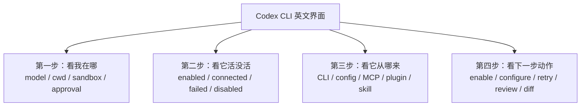

这 4 步比逐字翻译更重要。
终端界面不是英语考试，它是在告诉你当前会话能做什么、不能做什么、为什么失败。

---

## 1. CLI 首页：先确认自己在哪

Codex 首页可以用这张文字图理解：

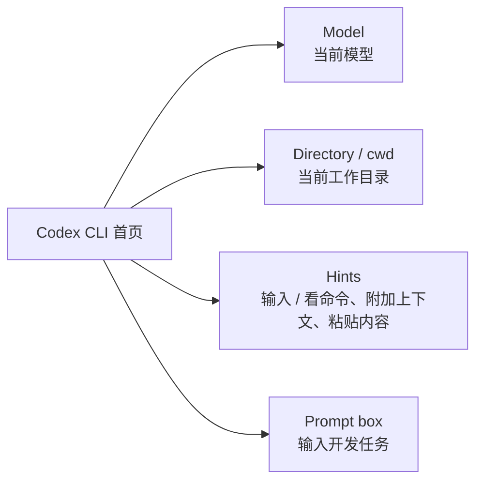

这一屏最重要的不是欢迎语，而是 4 个信号：

1. `model`：当前这轮会话用哪个模型
2. `directory` / `cwd`：Codex 正在哪个项目里工作
3. `hints`：告诉你可以输入 `/`、附加上下文、粘贴内容
4. 输入框：你接下来给的是“开发任务”，不是普通闲聊

判断法：

1. 如果目录不对，先退出，切到正确仓库再进
2. 如果模型不对，先用 `/model` 改
3. 如果你还没让它读项目，不要直接让它改文件
4. 如果当前环境是 WSL / Windows 混用，先确认路径是不是同一套

---

## 2. `/model`：模型和推理强度不是一回事

`/model` 页面一般解决两个问题：

1. 这轮用哪个模型
2. 如果当前模型支持，推理强度怎么调

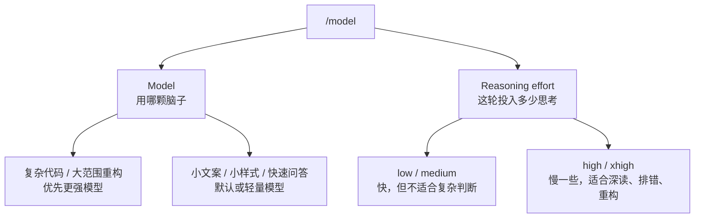

主人记住这句就够：

1. 模型决定能力底座
2. 推理强度决定这轮任务投入多少思考
3. 两者都要跟任务复杂度匹配

不要把文章里的某个模型名当长期固定答案。
官方模型、账号能力、第三方线路开放列表都会变，当前可用项以 `/model`、`/status` 和服务商后台为准。

---

## 3. `/permissions`：别把效率和安全混成一件事

权限页最容易被误读。
它不是“越开放越高级”，而是在回答：Codex 能不能动手、动手前要不要问你、能不能越过工作区。

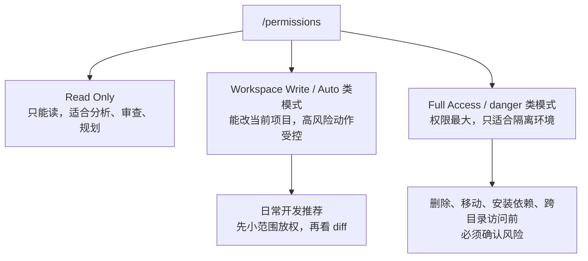

英文词速读：

| 英文 | 人话 |
|---|---|
| `Read Only` | 只读，不改文件 |
| `workspace-write` | 可以写当前工作区 |
| `Full Access` | 权限很大，别在脏工作区里随便开 |
| `approval` | 哪些动作需要主人确认 |
| `sandbox` | Codex 被限制在哪个范围内活动 |
| `trusted` | 当前目录被信任，策略可能更宽 |
| `untrusted` | 当前目录不被信任，限制会更严 |

建议：

1. 新项目第一轮先只读
2. 小范围修改用工作区写权限
3. 删除、移动、安装依赖、联网、全局替换前认真看提示
4. 真要开 Full Access，最好在隔离 worktree 或可回滚环境里做

---

## 4. Slash 菜单：先按来源分类，不要挨个背

`/` 菜单出来以后，先别慌。
它可以先分成 5 类：

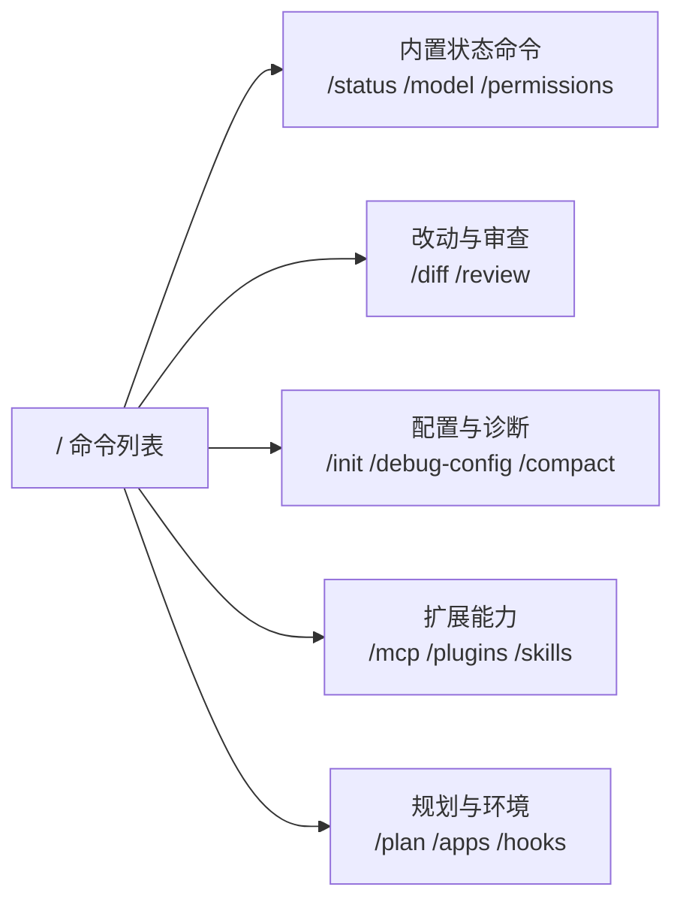

第一天真正高频的是：

| 命令 | 你要问自己的问题 |
|---|---|
| `/status` | 我当前在哪个模型、目录、权限、上下文里 |
| `/model` | 这轮任务的模型和推理强度合适吗 |
| `/permissions` | Codex 现在能不能改，改之前问不问 |
| `/diff` | 它到底改了哪些文件 |
| `/review` | 当前工作树有没有明显风险 |
| `/mcp` | 外部工具连上了吗 |
| `/plugins` | 能力从哪个插件来 |
| `/skills` | 现在有哪些工作套路可用 |
| `/debug-config` | 配置层级哪里覆盖了我 |
| `/plan` | 大任务先规划，不急着改 |

看到某个命令不知道来源时，别猜。
先用 `/plugins`、`/skills`、`/mcp` 反查。

---

## 5. `/status`：排错第一入口

官方文档里 `/status` 的作用很明确：查看当前会话配置和 token 使用情况。
实际排错时，它就是第一入口。

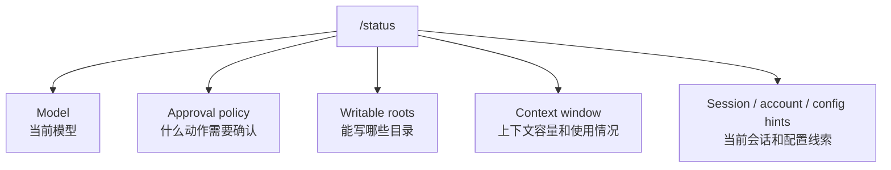

你觉得“不对劲”时，先看这些：

1. 当前模型和推理强度是不是对
2. 当前工作目录是不是目标仓库
3. `approval policy` 有没有挡住命令
4. `writable roots` 有没有包含你要改的目录
5. 上下文是不是快满了，需要 `/compact`
6. 当前账号、provider、config 是否和你预期一致

常见误判：

1. 你以为改了用户配置，其实项目配置覆盖了
2. 你以为在 Windows 路径，实际 agent 跑在 WSL
3. 你以为能写整个磁盘，其实只放开了当前工作区
4. 你以为模型不可用，其实是 provider 或模型名不匹配

---

## 6. `/debug-config`：配置不生效时先看它

如果你的问题是“我明明改了配置，但 Codex 没按我想的走”，比起盲改 `config.toml`，更应该看 `/debug-config`。

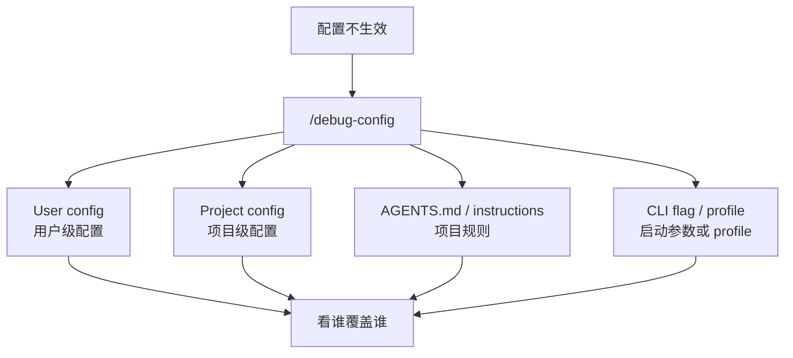

重点不是“哪个文件最长”，而是谁最后生效。

常见问题：

1. `~/.codex/config.toml` 写了，但项目 `.codex/config.toml` 覆盖了
2. 你切了 profile，但当前会话不是用那个 profile 启动
3. AGENTS.md 里有项目规则，影响了 Codex 的操作方式
4. CLI 启动参数临时覆盖了文件配置

这类问题不要靠记忆排。
用 `/debug-config` 看实际链路。

---

## 7. `/mcp`：看外部工具活没活

MCP 不是“插件列表”。
它更像 Codex 接上的外部工具接口，比如浏览器、文档检索、GitHub、数据库、本地脚本等。

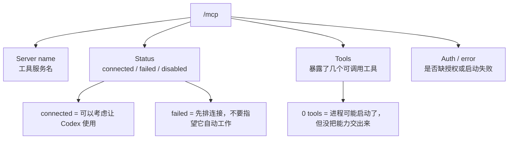

状态词速读：

| 英文 | 人话 |
|---|---|
| `connected` | 连上了，可以用 |
| `failed` | 没连上，先排错 |
| `disabled` | 当前禁用 |
| `pending` | 正在连接中 |
| `needs-auth` | 缺授权，不是服务一定坏了 |
| `tools` | 这个 MCP 暴露给 Codex 的工具数 |
| `timeout` | 启动或响应超时 |

看到 `/mcp` 后只看三件事：

1. 服务名是不是你预期的那个
2. 状态是不是 `connected`
3. 后面有没有工具数

如果是：

```text
server-name · connected · 0 tools
```

不要立刻以为好了。
这更像“进程起来了，但能力没有真正交给 Codex”。

---

## 8. `/plugins`：看能力从哪里装进来

Plugin 是打包分发层。
它可能带来 skills、MCP、命令、模板或其他组件。

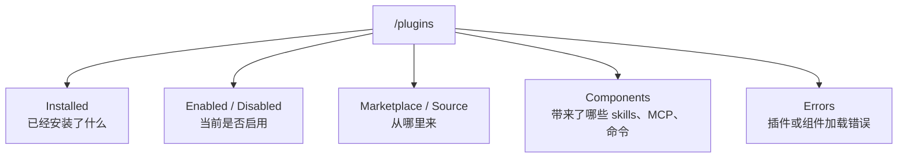

英文词速读：

| 英文 | 人话 |
|---|---|
| `installed` | 已安装 |
| `enabled` | 当前启用 |
| `disabled` | 当前禁用 |
| `marketplace` | 插件市场来源 |
| `official` | 官方来源 |
| `community` | 社区来源，使用前更要看权限 |
| `upgrade` | 可升级 |
| `remove` | 可移除 |
| `components` | 这个插件带进来的组件 |
| `errors` | 加载错误 |

装完插件后不要直接以为它能用了。
最小检查顺序：

1. `/plugins` 看插件是否 installed / enabled
2. `/skills` 看有没有带进 skill
3. `/mcp` 看有没有带进工具
4. `/` 菜单里搜索有没有可直接调用的命令

一句话：

1. 工具活没活，看 `/mcp`
2. 能力从哪装来，看 `/plugins`
3. 能不能作为工作套路调用，看 `/skills`

---

## 9. `/skills`：看当前有哪些工作套路

Skill 不是模型，也不是外部工具。
它更像“给 Codex 的可复用工作方法”。

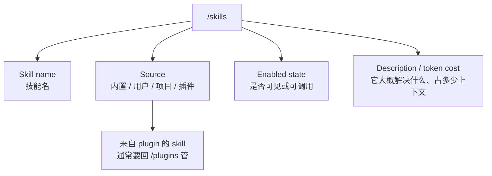

你看到 skill 时，先问：

1. 这是内置的、项目写的，还是插件带来的
2. 当前是不是启用
3. 它是自动可用，还是需要我手动点名
4. 它解决的是流程问题、排错问题、设计问题，还是写作问题

如果一个 skill 来自 plugin，通常不要只在 `/skills` 里折腾。
它的启用、禁用、卸载和来源更应该回 `/plugins` 看。

---

## 10. 功能开关与版本差异：新能力先理解，再启用

不同 Codex 版本、插件和账号能力会让 `/` 菜单出现差异。
关键词不是“高级”，而是“当前环境是否真的有这项能力”。

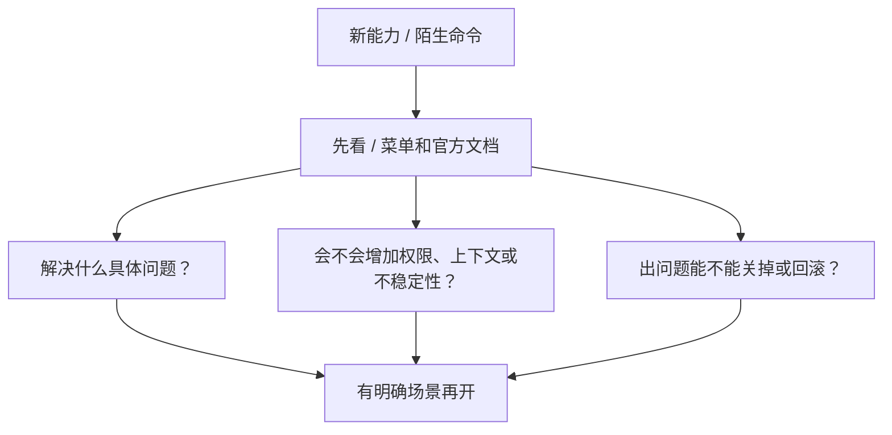

看到新能力时，先问三件事：

1. 它解决我现在的哪个具体问题
2. 它会不会增加权限、上下文或不稳定性
3. 出问题时我能不能回滚

不要默认全部打开，也不要因为旧截图里有某个入口就强行寻找。
程序员真正需要的是稳定工作流，不是把所有开关都点亮。

---

## 11. 红色错误：先看类型，不要先重装

红色错误出现时，先提取关键词。

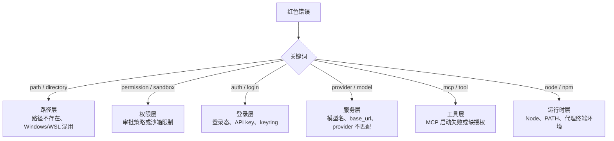

排错顺序：

1. CLI 无法正常进入会话时，先运行 `codex doctor --summary`
2. 已经进入会话时看 `/status`
3. 用 `/debug-config` 查覆盖链；启动时也可以加 `--strict-config` 检查未知字段
4. 看当前目录和权限
5. 看 `~/.codex/config.toml`
6. 看项目 `.codex/config.toml`
7. 看登录状态和 provider
8. 看 `/mcp`、`/plugins`、`/skills`
9. 最后才考虑重装或升级

这一步很重要。
“失败了”不是一个问题类型，它只是结果。关键词才告诉你该查哪一层。

---

## 12. 会话中断：先保存判断，再继续

看到 `conversation interrupted`、`interrupted`、`summary`、`resume` 这类词时，不要直接说“继续”。

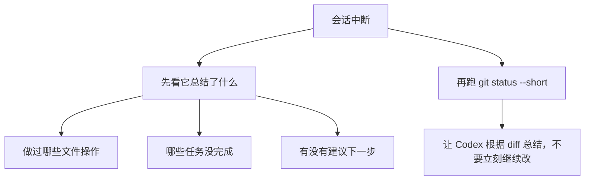

建议先在终端看：

```bash
git status --short
```

然后回到 Codex 里问：

```text
请根据当前 git diff 总结刚才已经完成了什么、还剩什么。
先不要继续修改。
```

这比直接说“继续”稳。
因为中断后最怕的是上下文不完整，还继续大改。

---

## 13. 英文词典：主人最该背下来的这些

### 状态词：回答“活没活”

| 英文 | 人话 |
|---|---|
| `enabled` | 已启用 |
| `disabled` | 已禁用 |
| `installed` | 已安装 |
| `connected` | 已连上 |
| `failed` | 失败了，先排错 |
| `pending` | 还在处理中 |
| `trusted` | 当前环境被信任 |
| `untrusted` | 当前环境不被信任 |
| `experimental` | 实验能力，可能变化 |

### 来源词：回答“从哪来”

| 英文 | 人话 |
|---|---|
| `CLI` | Codex 自己的命令 |
| `config` | 来自配置文件 |
| `project` | 项目级 |
| `user` | 用户级 |
| `local` | 本地私有 |
| `MCP` | 外部工具接口 |
| `plugin` | 插件带来的 |
| `skill` | 工作套路 |
| `marketplace` | 插件市场 |

### 动作词：回答“下一步能做什么”

| 英文 | 人话 |
|---|---|
| `configure` | 去配置 |
| `enable` | 启用 |
| `disable` | 禁用 |
| `install` | 安装 |
| `upgrade` | 升级 |
| `remove` | 移除 |
| `retry` | 重试 |
| `review` | 审查 |
| `diff` | 看改动 |
| `compact` | 压缩上下文 |

只要这三类词能分开，Codex CLI 就不会再像一整屏黑盒。

---

## 14. 和 VS Code 插件、桌面 App 怎么互相验证

主人如果 CLI、VS Code 插件、桌面 App 都用，三边表现不一致时按这个顺序排：

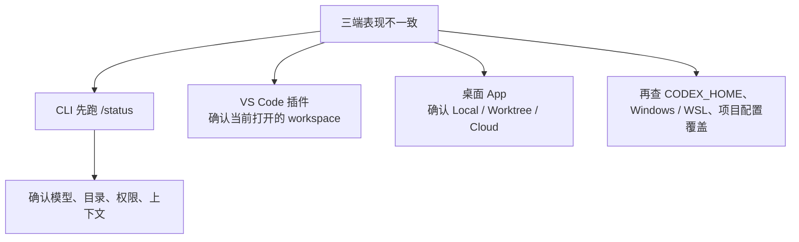

最常见的坑：

1. CLI 在 WSL，App 在 Windows-native，两边不是同一个 `~/.codex`
2. VS Code 打开的是子目录，CLI 在仓库根目录
3. 桌面 App 在 worktree，CLI 在原目录
4. 插件用了项目配置覆盖，CLI 你看的却是用户配置
5. MCP 在 CLI 能连，App 或插件环境里没有同样的进程和环境变量

---

## 15. 最小检查清单

每次 Codex 变得“不对劲”，按这张表走：

1. `codex --version`
2. `where.exe codex` 或 `which codex`
3. 进入项目后看 `/status`
4. 看 `/permissions`
5. 看 `/debug-config`
6. 看 `/mcp`
7. 看 `/plugins`
8. 看 `/skills`
9. 看 `git status --short`
10. 再决定是否改 `config.toml`

如果涉及本仓库的 Node / npm / Vite 脚本，先跑：

```powershell
pwsh -File scripts/checkNodeRuntime.ps1
```

这一步能避免把代理终端环境异常误判成项目代码坏了。

---

## 参考资料

- Codex CLI：<https://developers.openai.com/codex/cli>
- CLI Slash Commands：<https://developers.openai.com/codex/cli/slash-commands>
- Codex 配置：<https://developers.openai.com/codex/config-basic>
- Codex MCP：<https://developers.openai.com/codex/mcp>
- AGENTS.md：<https://developers.openai.com/codex/guides/agents-md>

`/plugins`、`/skills`、`/apps`、`/hooks` 这类入口的具体显示会跟 CLI 版本、插件安装状态和账号能力有关。最稳的核对方式不是记某个静态截图，而是在当前 Codex CLI 里用 `/`、`/status`、`/plugins`、`/skills`、`/mcp` 反查实际可用项。
