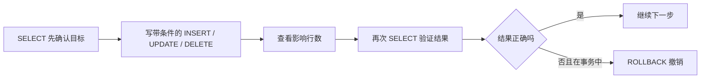

# 06 添加、修改、删除数据

## 1. 本节目标：让空表开始有内容，但不“手滑”改错数据

第 05 章只创建了表的外壳。空表像一本已经印好表头的登记册，现在要学习往里面添加、修改和删除记录。

本章的三条主要命令是：

| 命令 | 它做什么 | 它会改变数据吗 |
| --- | --- | --- |
| `INSERT` | 新增一行 | 会 |
| `UPDATE` | 修改已有行 | 会 |
| `DELETE` | 删除已有行 | 会 |

所有会改变数据的操作，都按同一套路走：先看目标，再执行，再核对结果。这个习惯比记住命令更重要。



## 2. 练习前检查：你现在操作的是哪张表

每次开始先执行：

```sql
SELECT DATABASE();
SHOW TABLES;
```

确认数据库是 `mysql_learning`，且列表中有 `learning_notes`。如果表还没创建，请先完成第 05 章；不要在不确定的项目库中练习写操作。

## 3. INSERT：添加第一条笔记

先执行这段最小示例：

```sql
INSERT INTO learning_notes (
  title,
  content,
  status
)
VALUES (
  '认识 MySQL',
  'MySQL 是用来长期保存和管理数据的数据库系统。',
  'active'
);
```

### 3.1 从外到内读这条 INSERT

| SQL 片段 | 意思 |
| --- | --- |
| `INSERT INTO` | 我要新增一条记录到某张表 |
| `learning_notes` | 目标表是学习笔记表 |
| `(title, content, status)` | 我这次只主动提供这三个字段 |
| `VALUES` | 下面开始按相同顺序写每个字段的值 |
| 三个括号中的值 | 分别对应标题、正文、状态 |

字段列表和 `VALUES` 列表必须一一对应：第一个值给第一个字段，第二个值给第二个字段。不要靠“看起来差不多”省略字段名。

本例没有写以下字段，但插入后它们仍然会有值：

| 字段 | 插入时为什么不用写 | MySQL 会怎样处理 |
| --- | --- | --- |
| `id` | 有 `AUTO_INCREMENT` | 自动分配新编号 |
| `view_count` | 有 `DEFAULT 0` | 填入 `0` |
| `archived_at` | 允许 `NULL` | 保持 `NULL` |
| `created_at` | 默认当前时间 | 填入执行时刻 |
| `updated_at` | 默认当前时间 | 填入执行时刻 |

### 3.2 立刻验证，不要只相信“Query OK”

执行后运行：

```sql
SELECT
  id,
  title,
  status,
  view_count,
  archived_at,
  created_at,
  updated_at
FROM learning_notes;
```

你应该能看到一行标题为“认识 MySQL”的数据。重点观察：

- `id` 是否由 MySQL 自动生成。
- `view_count` 是否为 `0`。
- `archived_at` 是否为 `NULL`。
- 两个时间字段是否已经被自动填写。

这一步同时验证了第 04、05 章的字段规则真的在工作。

## 4. LAST_INSERT_ID()：怎样拿到“我刚插入的编号”

在同一个连接中，紧接着运行：

```sql
SELECT LAST_INSERT_ID();
```

它会返回当前连接最近一次成功插入的自增 ID。例如返回 `1`，表示刚才新增的笔记编号是 1。

为什么不推荐用下面的写法拿“刚插入的 ID”？

```sql
-- 不要把 MAX(id) 当成“我刚插入的 id”
SELECT MAX(id)
FROM learning_notes;
```

在只有你一个人练习时，它可能正好看起来正确；但真实系统中，另一个请求可能在你查询前插入了一行，`MAX(id)` 就变成了别人的编号。`LAST_INSERT_ID()` 是按当前连接记录的，更符合“我刚刚插入”的语义。后端数据库驱动通常也有对应的插入 ID 返回方式。

## 5. 一次插入多条：每一对括号就是一行

现在补充三条用于后续查询练习的数据：

```sql
INSERT INTO learning_notes (
  title,
  content,
  status
)
VALUES
  ('学习 SELECT', 'SELECT 用来从表中查询数据。', 'active'),
  ('整理 JOIN 问题', 'JOIN 用来把多张有关联的表一起查看。', 'draft'),
  ('复习字段类型', '字段类型决定每一列能保存什么数据。', 'active');
```

`VALUES` 后面有三组 `(...)`，所以会新增三行。第一组是第一条笔记，第二组是第二条，第三组是第三条。组和组之间使用英文逗号，整条 SQL 最后才用分号结束。

插入后立即确认：

```sql
SELECT id, title, status, view_count
FROM learning_notes
ORDER BY id ASC;
```

`ORDER BY id ASC` 的完整含义在第 07 章会讲；这里先理解为“按编号从小到大显示”，方便你看到每次新增加了哪些行。

## 6. UPDATE：修改前先定位，修改后先检查

假设“整理 JOIN 问题”已经写完，要从草稿变成正常状态。**不要先写 UPDATE。**先找出要改的行：

```sql
SELECT id, title, status
FROM learning_notes
WHERE title = '整理 JOIN 问题';
```

如果结果显示的是你想修改的那一行，记下它的 `id`。然后再执行：

```sql
UPDATE learning_notes
SET status = 'active'
WHERE id = 3
  AND status = 'draft';
```

请把 `3` 换成你刚才实际查到的 ID，不要假设每台电脑上的 ID 都一样。

逐段解释：

| SQL 片段 | 意思 |
| --- | --- |
| `UPDATE learning_notes` | 我要修改学习笔记表 |
| `SET status = 'active'` | 把命中的行的状态改为 active |
| `WHERE id = 3` | 只允许改编号为 3 的一行 |
| `AND status = 'draft'` | 再加一道保护：它必须当前仍是草稿 |

`WHERE` 后的条件决定会改到哪些行。少写 `WHERE` 是数据库操作中最危险的初级错误之一：

```sql
-- 危险：会把整张表每一行的状态都改为 active
UPDATE learning_notes
SET status = 'active';
```

课程不会让你执行这条危险示例。请把它当成“为什么写前要先 SELECT”的提醒。

## 7. ROW_COUNT()：这次到底改到了几行

紧接在 `UPDATE` 后执行：

```sql
SELECT ROW_COUNT();
```

它返回前一条数据修改语句影响的行数。对上面的更新，通常这样理解：

| 返回值 | 可能代表什么 |
| --- | --- |
| `1` | 正好改到一条，符合预期 |
| `0` | ID 不存在、它已不是 draft，或新旧值相同 |
| 大于 `1` | 条件可能写得太宽，必须马上检查 |

注意：有些客户端对“值没变化”的计数展示可能有所区别。不要只看数字就盲信，最可靠的确认方式仍然是再 `SELECT` 一次目标行：

```sql
SELECT id, title, status, updated_at
FROM learning_notes
WHERE id = 3;
```

同样，把 `3` 换成你的实际编号。

## 8. 在数据库中直接加 1：不要先读到程序再写回去

给某条笔记增加一次浏览量：

```sql
UPDATE learning_notes
SET view_count = view_count + 1
WHERE id = 1;
```

这里右侧的 `view_count` 表示旧值，左侧的 `view_count` 表示要写回的字段。若原来是 5，执行后会变成 6。

这种写法比“先查询浏览量，程序中加 1，再把结果写回”可靠得多。两个用户同时阅读时，数据库能在一条更新中完成“在当前值基础上加一”，减少丢失更新的风险。

执行后验证：

```sql
SELECT id, title, view_count
FROM learning_notes
WHERE id = 1;
```

## 9. DELETE：删除前的检查要比 UPDATE 更严格

假设你只是想删除一条临时练习笔记，先查询：

```sql
SELECT id, title, status
FROM learning_notes
WHERE id = 2;
```

确认无误后才执行：

```sql
DELETE FROM learning_notes
WHERE id = 2;
```

它的读法是：从 `learning_notes` 这张表中，删除 `id = 2` 的行。执行后立刻做两件事：

```sql
SELECT ROW_COUNT();

SELECT id, title
FROM learning_notes
WHERE id = 2;
```

第二条查询没有结果，才说明目标行确实已删除。

绝对不要把下面这句当作“删除第几条”的简写：

```sql
-- 危险：没有 WHERE，会删除表中的所有行
DELETE FROM learning_notes;
```

这不是只删一条，也不会弹出“确定吗”的二次确认。数据库会按命令字面意思执行，所以要用 `WHERE` 把范围写得足够小。

## 10. 软删除：有些“删除”只是让它不再显示

真实系统中的文章、订单、用户资料常常不能立即物理删除，因为之后可能要恢复、审计或统计。这时可以用“软删除”：保留数据，只记录一个删除时间。

本课程在原来的归档时间之后增加 `deleted_at` 字段：

```sql
ALTER TABLE learning_notes
  ADD COLUMN deleted_at DATETIME(3) NULL AFTER archived_at;
```

这一章不要求你完全理解 `ALTER TABLE`，它只是“给已经存在的表加一个新栏目”。然后用下面的更新表示删除：

```sql
UPDATE learning_notes
SET deleted_at = CURRENT_TIMESTAMP(3)
WHERE id = 1
  AND deleted_at IS NULL;
```

它没有删除任何行，只是在 `deleted_at` 留下删除时刻。以后查询正常可见笔记时，应加入：

```sql
WHERE deleted_at IS NULL
```

软删除不是每张表都必须有，但你要能区分：`DELETE` 是物理移除一行；软删除是保留一行、改变它的可见状态。

## 11. 事务练习：先改一改，再决定是否保留

现在先用一个很安全的练习体验“撤销”。执行下面整段时，不要插入 `COMMIT`：

```sql
START TRANSACTION;

UPDATE learning_notes
SET view_count = view_count + 10
WHERE id = 1;

SELECT id, title, view_count
FROM learning_notes
WHERE id = 1;

ROLLBACK;

SELECT id, title, view_count
FROM learning_notes
WHERE id = 1;
```

你会看到第一次 `SELECT` 中浏览量临时增加了 10；执行 `ROLLBACK` 后，第二次 `SELECT` 中它恢复为原值。可以把事务理解为“先把几步改动放在可撤销的购物篮里，确认才结算”。

事务和多人同时操作的锁，会在第 11 章完整讲解。这里先建立一个重要观念：对于不确定的练习性修改，先在事务中执行和检查，比误改后才着急补救更好。

## 12. 本节安全清单和练习

每次写 `UPDATE` 或 `DELETE` 前，默念下面四步：

1. 我当前在哪个数据库？
2. 我先用同样的 `WHERE` 做过 `SELECT` 吗？
3. `WHERE` 是否能只命中我要操作的行？
4. 执行后我是否查看了影响行数和最终数据？

练习：

1. 插入一条标题由你自己决定的笔记，只提供 `title` 和 `content`，观察默认状态。
2. 使用 `LAST_INSERT_ID()` 获得刚插入的编号。
3. 先查询，再把这条笔记的状态从 `draft` 改为 `active`。
4. 让它的 `view_count` 连续增加两次，每次都查询确认结果。
5. 用 `START TRANSACTION`、`UPDATE`、`ROLLBACK` 完成一次可撤销修改。
6. 用自己的话说：物理删除和软删除有什么差别？

下一章开始专门学习 `SELECT`，把“先查再改”所需要的筛选、排序和分页都讲清楚。
