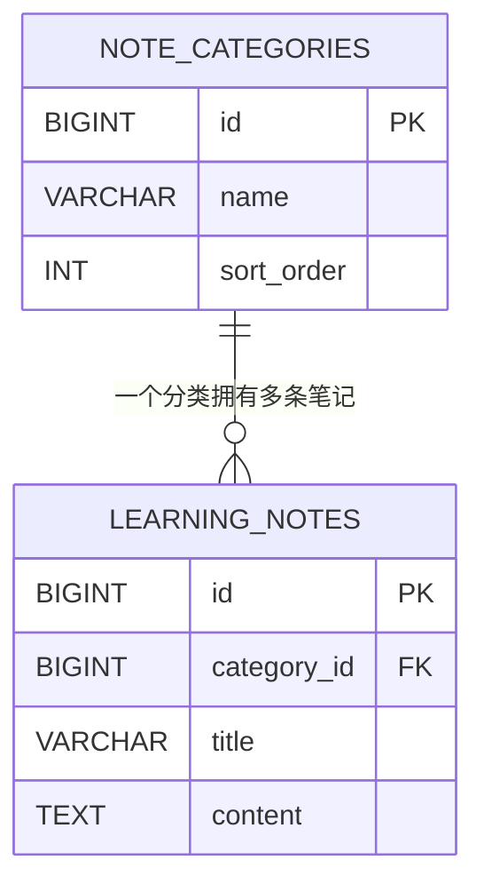
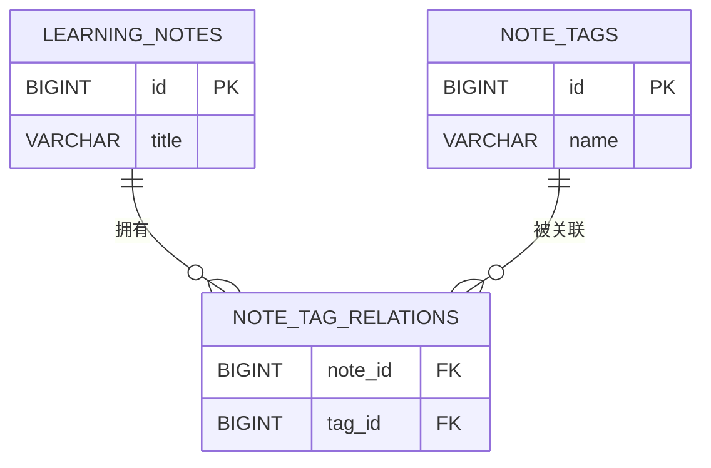

# 08 两张表的关系和 JOIN

## 1. 本节目标：让两本登记册通过编号对得上

到现在为止，所有信息都在 `learning_notes` 一张表里。现实项目中，笔记需要分类，分类本身也有名称、描述、排序等信息。把它们全部重复写在笔记表里，时间久了会越来越乱。

本章只增加第二张表：`note_categories`。你会学到：

1. 为什么“分类”要单独建表。
2. 什么是一对多关系。
3. `category_id` 为什么放在笔记表里。
4. 普通关联字段和真正的外键约束有什么区别。
5. `INNER JOIN`、`LEFT JOIN` 如何把两张表一次查出来。

## 2. 问题从这里开始：重复保存分类名字会发生什么

假设直接在笔记表添加 `category_name`：

| id | title | category_name |
| --- | --- | --- |
| 1 | 认识 MySQL | 数据库 |
| 2 | 学习 SELECT | 数据库 |
| 3 | 学习 CSS | 前端 |

一开始看似简单，但很快出现问题：

| 情况 | 重复写名称时的麻烦 |
| --- | --- |
| 名称写法不统一 | 可能出现“数据库”“数据 库”“DB”三种值 |
| 分类要改名 | 要找出许多笔记并逐行修改 |
| 分类需要描述和排序 | 这些信息会在每条笔记上重复 |
| 分类被删除 | 很难确认哪些笔记依赖它 |

更好的方式是：分类独立成一张表；笔记只保存“自己属于哪个分类的编号”。



图中的 `1` 对 `N` 可以读成：一个分类可以对应零条或多条笔记；一条笔记在当前课程的设计中，最多属于一个分类。

## 3. 先创建分类表：每一行是一种分类

创建前确认当前数据库：

```sql
USE mysql_learning;
SELECT DATABASE();
```

然后创建 `note_categories`：

```sql
CREATE TABLE note_categories (
  id BIGINT UNSIGNED NOT NULL AUTO_INCREMENT,
  name VARCHAR(60) NOT NULL,
  sort_order INT NOT NULL DEFAULT 0,
  created_at DATETIME(3) NOT NULL DEFAULT CURRENT_TIMESTAMP(3),
  PRIMARY KEY (id),
  UNIQUE KEY uk_note_categories_name (name)
) ENGINE=InnoDB DEFAULT CHARSET=utf8mb4 COLLATE=utf8mb4_0900_ai_ci;
```

这张表的每一行代表“一种笔记分类”，不是一条笔记。逐项看：

| 字段或规则 | 为什么需要它 |
| --- | --- |
| `id` | 分类自己的唯一编号，供笔记表引用 |
| `name` | 显示给人看的分类名称 |
| `sort_order` | 页面需要按自定义顺序显示时使用，默认 0 |
| `created_at` | 知道分类何时创建 |
| `UNIQUE KEY ... (name)` | 不允许出现两个同名分类 |

`sort_order` 可以是负数，所以这里使用普通 `INT`，没有加 `UNSIGNED`。这体现了第 04 章的原则：类型不是照抄模板，而是根据业务含义选择。

## 4. 插入分类，并先看清它们的编号

```sql
INSERT INTO note_categories (name, sort_order)
VALUES
  ('数据库', 10),
  ('后端', 20),
  ('前端', 30);
```

执行后不要假设“数据库一定是 id 1”。马上查询：

```sql
SELECT id, name, sort_order
FROM note_categories
ORDER BY sort_order ASC, id ASC;
```

你会得到实际的 `id`。如果这是全新练习库，常见结果是 1、2、3；如果之前已经插入或删除过分类，编号可能不同。后续示例中的数字请以你自己的查询结果替换。

如果误插入了重复的 `数据库`，唯一约束会阻止这次插入。这正是数据库规则在保护数据一致性。

## 5. 在笔记表中增加 category_id：关系字段放在哪一边

一对多关系中，关系字段放在“多”的那一方：一个分类有很多笔记，因此每条笔记记录自己属于哪个分类。

先给已有的 `learning_notes` 表增加这个栏目：

```sql
ALTER TABLE learning_notes
  ADD COLUMN category_id BIGINT UNSIGNED NULL AFTER id;
```

逐行解释：

| SQL 片段 | 意思 |
| --- | --- |
| `ALTER TABLE learning_notes` | 修改已存在的学习笔记表结构 |
| `ADD COLUMN category_id` | 增加一个叫 category_id 的新字段 |
| `BIGINT UNSIGNED` | 类型与分类表的 id 相同，且不允许负数 |
| `NULL` | 允许笔记暂时没有分类 |
| `AFTER id` | 只影响字段显示顺序，让它排在 id 后面；不影响关系本身 |

这里允许 `NULL`，因为旧笔记在增加这个字段之前没有分类，新建笔记也可能先不选择分类。业务如果要求“发布前必须分类”，可以由后端在发布动作中验证。

## 6. 先更新几条笔记，再确认关联没有写错

假设你查询到“数据库”分类的 `id` 是 1，把数据库相关笔记分到它下面：

```sql
UPDATE learning_notes
SET category_id = 1
WHERE title LIKE '%MySQL%'
   OR title LIKE '%SELECT%';
```

执行前请把 `1` 换成你实际查到的“数据库”分类编号。执行后验证：

```sql
SELECT id, title, category_id
FROM learning_notes
ORDER BY id ASC;
```

此时 `category_id` 只是一个数字。人看不出 1、2、3 分别是什么名字，所以需要 `JOIN` 把两个表配对查看。

## 7. 关联字段与外键约束：像“写了编号”和“系统核验编号”

`category_id` 这个字段本身只是“我们约定它应当填写分类 ID”。如果不加约束，有人仍可能写入一个不存在的值，例如 `99999`。这种不存在对应分类的值叫“孤儿数据”。

MySQL 的**外键约束**可以要求：`learning_notes.category_id` 只要不是 `NULL`，就必须在 `note_categories.id` 中真实存在。

先检查有没有孤儿数据：

```sql
SELECT n.id, n.title, n.category_id
FROM learning_notes AS n
LEFT JOIN note_categories AS c
  ON n.category_id = c.id
WHERE n.category_id IS NOT NULL
  AND c.id IS NULL;
```

这条查询没有结果，才表示可以安全增加外键。随后执行：

```sql
ALTER TABLE learning_notes
  ADD CONSTRAINT fk_learning_notes_category
  FOREIGN KEY (category_id)
  REFERENCES note_categories (id)
  ON DELETE SET NULL
  ON UPDATE RESTRICT;
```

把它理解成“给关联编号加核验规则”：

| 片段 | 意思 |
| --- | --- |
| `ADD CONSTRAINT fk_learning_notes_category` | 增加一条名为 fk_learning_notes_category 的约束 |
| `FOREIGN KEY (category_id)` | learning_notes 的 category_id 是受约束的关联字段 |
| `REFERENCES note_categories (id)` | 它引用分类表的 id |
| `ON DELETE SET NULL` | 删除一个分类时，原来属于它的笔记不删，但分类编号清空 |
| `ON UPDATE RESTRICT` | 不允许随意修改被引用的分类 id |

外键不是所有团队都在数据库层使用的唯一答案。有些大型系统会把关系一致性放在应用层和服务边界管理。但作为学习者，你必须理解：外键是一种由数据库执行的、用来阻止错误关联的规则；它不能替代后端的权限和业务校验。

## 8. INNER JOIN：只看两边都对得上的记录

现在查询笔记时同时显示分类名称：

```sql
SELECT
  n.id,
  n.title,
  n.category_id,
  c.name AS category_name
FROM learning_notes AS n
INNER JOIN note_categories AS c
  ON n.category_id = c.id;
```

把每一行拆开：

| 片段 | 人话 |
| --- | --- |
| `learning_notes AS n` | 把笔记表临时简称为 n |
| `note_categories AS c` | 把分类表临时简称为 c |
| `INNER JOIN` | 两边必须能配对上才显示 |
| `ON n.category_id = c.id` | 一条笔记的分类编号等于某个分类的 id 时，它们属于同一组 |
| `c.name AS category_name` | 从分类表取 name，并在结果中叫 category_name |

`AS n`、`AS c` 是表别名。不是改表名，只是在这条很长的 SQL 里用短名字明确“这个字段来自哪张表”。

如果某条笔记的 `category_id` 为 `NULL`，它找不到匹配分类，`INNER JOIN` 不会显示这条笔记。这正是“只看两边都对得上”的含义。

## 9. LEFT JOIN：以左边的笔记表为准，一个也不丢

如果你想在列表页看到所有笔记，包括“还未分类”的笔记，使用 `LEFT JOIN`：

```sql
SELECT
  n.id,
  n.title,
  n.category_id,
  c.name AS category_name
FROM learning_notes AS n
LEFT JOIN note_categories AS c
  ON n.category_id = c.id
ORDER BY n.id ASC;
```

“左”指的是 `FROM learning_notes AS n` 中先写出来的表。它的每一行都会保留：

| 笔记有分类吗 | `INNER JOIN` | `LEFT JOIN` |
| --- | --- | --- |
| 有，且能匹配分类 | 显示 | 显示 |
| 没有分类，`category_id` 是 NULL | 不显示 | 显示，`category_name` 是 NULL |
| 分类编号错误且没有匹配行 | 不显示 | 显示，`category_name` 是 NULL |

有了外键后，第三种错误情况通常会被阻止；但“笔记暂时没有分类”仍然是合理状态，所以列表查询常用 `LEFT JOIN`。

## 10. ON 和 WHERE：一个负责配对，一个负责筛选结果

先记住最实用的规则：

| 位置 | 主要负责什么 |
| --- | --- |
| `ON` | 说明两张表用什么条件配对 |
| `WHERE` | 对配对后的结果再进行筛选 |

例如，查询正常且未删除的笔记，并带上分类：

```sql
SELECT
  n.id,
  n.title,
  c.name AS category_name
FROM learning_notes AS n
LEFT JOIN note_categories AS c
  ON n.category_id = c.id
WHERE n.status = 'active'
  AND n.deleted_at IS NULL;
```

关系条件 `n.category_id = c.id` 放在 `ON`；“这条笔记是否正常、未删除”是针对最终笔记列表的筛选，所以放在 `WHERE`。

### 一个 LEFT JOIN 的进阶提醒

如果你写：

```sql
WHERE c.name = '数据库'
```

那么 `category_name` 为 `NULL` 的未分类笔记会被筛掉，结果效果接近 `INNER JOIN`。这并不一定错误，只是要明白你已经明确要求“只要数据库分类的笔记”。

当你希望“所有笔记保留，但只有分类名为数据库时才把右表信息配上”时，右表条件可以放到 `ON`：

```sql
LEFT JOIN note_categories AS c
  ON n.category_id = c.id
  AND c.name = '数据库'
```

初学阶段不必立刻熟练掌握这个差异。至少记住：写 `LEFT JOIN` 后又在 `WHERE` 中严格筛右表字段，会改变“左表全保留”的效果。

## 11. 多对多：为什么需要第三张表

分类是一对多：一条笔记目前只选一个分类。标签不同：

```text
“学习 SELECT” 可以有：数据库、查询、入门
“认识 MySQL” 也可以有：数据库、入门
```

一个笔记有多个标签，一个标签也对应多个笔记，这就是多对多。不能在 `learning_notes` 中只放一个 `tag_id`，也不推荐把 `1,2,3` 这样的编号拼成一段文字。

正确画面是增加中间表：



中间表每一行只表达一句话：**“这条笔记贴了这个标签。”**例如 `(note_id = 2, tag_id = 5)`。毕业项目会把它真正实现出来；本章先确保一对多和两表 JOIN 已经清楚。

## 12. 本节验收和练习

请在自己的 `mysql_learning` 中完成以下动作：

1. 创建 `note_categories`，插入“数据库”“后端”“前端”，并查询实际 ID。
2. 给 `learning_notes` 增加 `category_id`，给至少两条笔记分类。
3. 用 `LEFT JOIN` 查询所有笔记和分类名，找出分类名为 `NULL` 的笔记。
4. 用 `INNER JOIN` 再查询一次，比较哪些笔记消失了，解释原因。
5. 在能确认没有孤儿数据后，添加外键约束；然后尝试写入一个不存在的分类 ID，观察 MySQL 的保护性报错。
6. 用自己的话说出：`ON` 负责什么，`WHERE` 负责什么，为什么多对多需要中间表？

下一章会在已经会 JOIN 的基础上，统计“每个分类下有几条笔记”。
