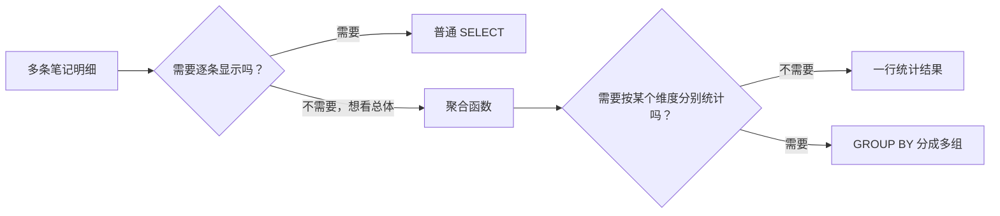
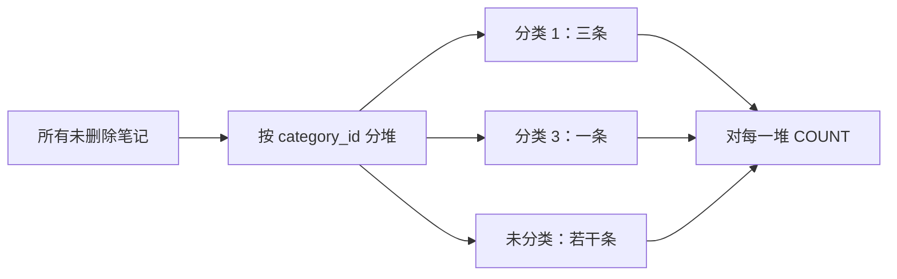

# 09 统计查询，数一数、分组算一算

## 1. 本节目标：从“看每一条”切换到“看总体情况”

第 07、08 章的查询通常返回明细：每一行是一条笔记，或一条笔记加上它的分类名称。统计查询要问的是另一类问题：

| 明细问题 | 统计问题 |
| --- | --- |
| 哪些笔记是草稿？ | 草稿一共有多少条？ |
| 每条笔记的浏览量是多少？ | 总浏览量、平均浏览量是多少？ |
| 每条笔记属于哪个分类？ | 每个分类下各有几条笔记？ |

统计会把许多行“汇总”成一个数，或按规则分成几组后每组一个数。读本章时最重要的是始终问自己：**我现在看到的是一条明细，还是一组数据的统计结果？**

## 2. 先看同一批数据的两种问法

假设有以下未删除笔记：

| id | title | category_id | status | view_count | archived_at |
| --- | --- | --- | --- | --- | --- |
| 1 | 认识 MySQL | 1 | active | 8 | NULL |
| 2 | 学习 SELECT | 1 | active | 12 | NULL |
| 3 | 整理 JOIN | 1 | draft | 0 | NULL |
| 4 | 学习 CSS | 3 | active | 5 | 2026-08-03 10:00:00 |

明细查询会得到四行：

```sql
SELECT id, title, view_count
FROM learning_notes;
```

如果问“总共有几条”，结果只需要一行一个数字：

```sql
SELECT COUNT(*) AS total
FROM learning_notes;
```



`COUNT`、`SUM`、`AVG`、`MAX`、`MIN` 这类把多行变成统计结果的工具，叫**聚合函数**。名字不需要背得很正式，先理解“它对一堆行一起计算”。

## 3. COUNT(*)：数经过筛选后还剩多少行

### 3.1 数整张表有多少条记录

```sql
SELECT COUNT(*) AS total
FROM learning_notes;
```

| 片段 | 含义 |
| --- | --- |
| `COUNT(*)` | 对每一行计数，不关心某一列是否为 NULL |
| `AS total` | 把这次统计结果的列名叫 total |
| `FROM learning_notes` | 统计来源是学习笔记表 |

它返回一行一列，例如 `total = 4`，而不是返回 4 条笔记明细。

### 3.2 先 WHERE，再 COUNT

统计“正常且未软删除”的笔记数：

```sql
SELECT COUNT(*) AS active_total
FROM learning_notes
WHERE status = 'active'
  AND deleted_at IS NULL;
```

请按这个过程理解：

1. 从 `learning_notes` 取出所有行。
2. `WHERE` 先排除非 active 和已删除的行。
3. 对剩下的行使用 `COUNT(*)`。

因此 `COUNT(*)` 不是不带条件的“全表总数”；它统计的是此时查询范围内的行。

## 4. COUNT(列名)：只数这一列有值的行

下面一次得到两个数字：

```sql
SELECT
  COUNT(*) AS all_notes,
  COUNT(archived_at) AS archived_notes
FROM learning_notes
WHERE deleted_at IS NULL;
```

差别在于：

| 写法 | 会不会数 archived_at 为 NULL 的行 |
| --- | --- |
| `COUNT(*)` | 会，只要这行在 WHERE 范围内 |
| `COUNT(archived_at)` | 不会，它只数 archived_at 真正有时间值的行 |

对“已经归档多少条”这个问题，`COUNT(archived_at)` 正好贴合语义，因为未归档笔记的这个字段是 `NULL`。

不要把它理解成“`COUNT(列)` 总是更好”。你到底要数“行数”，还是数“某个字段已经有值的次数”，决定了写法。

## 5. DISTINCT：先去重，再数有多少种

假设三条笔记都属于 category 1，另一条属于 category 3。下面这句不是数笔记数，而是数“被使用过的不同分类有几种”：

```sql
SELECT COUNT(DISTINCT category_id) AS category_kinds
FROM learning_notes
WHERE category_id IS NOT NULL
  AND deleted_at IS NULL;
```

执行过程可以看成：

```text
原始 category_id：1、1、1、3
去重后：          1、3
最后 COUNT：       2
```

`DISTINCT` 的意思是“相同值只保留一个”。`category_id IS NOT NULL` 明确排除未分类笔记，否则“没有分类”这个 NULL 不是我们想统计的一个真实分类。

同样的思想也能用于查看所有不同状态：

```sql
SELECT DISTINCT status
FROM learning_notes
ORDER BY status ASC;
```

这不是统计数量，而是把重复状态去掉后列出来。

## 6. GROUP BY：先按类别分堆，再对每一堆计算

如果你想知道“每个分类下有多少条笔记”，不能只写一个 `COUNT(*)`，因为它会把所有笔记混成一个总数。需要先按 `category_id` 分组：

```sql
SELECT
  category_id,
  COUNT(*) AS note_count
FROM learning_notes
WHERE deleted_at IS NULL
GROUP BY category_id;
```

可以想成整理一叠卡片：



`GROUP BY category_id` 后，原来每条笔记一行的结果，变成每种 `category_id` 一行。未分类笔记的 `category_id` 是 `NULL`，它们也会被归为一个 NULL 组；这是否符合你的统计目的，需要你明确决定。

如果不想统计未分类笔记，加上：

```sql
WHERE deleted_at IS NULL
  AND category_id IS NOT NULL
```

## 7. 为什么分组时不能随手 SELECT title

下面这种写法在 MySQL 默认的严格分组规则下会报错，或者在旧宽松模式下产生语义不清的结果：

```sql
-- 不要这样写
SELECT category_id, title, COUNT(*)
FROM learning_notes
GROUP BY category_id;
```

一个分类组里可能有多条标题：`认识 MySQL`、`学习 SELECT`、`整理 JOIN`。统计结果只有一行时，`title` 到底应该显示哪一条？没有合理答案。

安全的规则是：分组查询的 `SELECT` 中，优先只放三类内容：

1. 出现在 `GROUP BY` 中的分组字段，例如 `category_id`。
2. 聚合函数的结果，例如 `COUNT(*)`、`SUM(view_count)`。
3. 确实由分组字段唯一决定的字段，例如第 08 章中分类的 `id` 和 `name` 一起分组。

这不是语法刁难，而是防止数据库随便挑一条明细值来误导你。

## 8. 想显示分类名称：LEFT JOIN 和 COUNT(n.id) 配合

只看 `category_id = 1`、`3` 不够直观。现在把分类表接进来，显示名称，并且让“还没有笔记的分类”也显示为 0：

```sql
SELECT
  c.id,
  c.name,
  COUNT(n.id) AS note_count
FROM note_categories AS c
LEFT JOIN learning_notes AS n
  ON n.category_id = c.id
  AND n.deleted_at IS NULL
GROUP BY c.id, c.name
ORDER BY note_count DESC, c.id ASC;
```

这条 SQL 比前面长，但它正好把第 08 章和本章结合起来。逐段读：

| 片段 | 为什么这样写 |
| --- | --- |
| `FROM note_categories AS c` | 把分类作为左表，目标是每个分类都要出现在结果中 |
| `LEFT JOIN learning_notes AS n` | 有笔记就配上笔记，没有也保留分类行 |
| `ON n.category_id = c.id` | 笔记的分类编号和分类 id 对上 |
| `AND n.deleted_at IS NULL` | 只把未删除笔记参与“配对”和统计，不能放在 WHERE 中把零笔记分类筛掉 |
| `COUNT(n.id)` | 只数真正配对到的笔记 id |
| `GROUP BY c.id, c.name` | 每个分类形成一组 |

为什么这里使用 `COUNT(n.id)`，而不是 `COUNT(*)`？

当某分类没有任何笔记时，`LEFT JOIN` 仍会保留一行分类数据，`c.id` 有值，但右表 `n.id` 是 `NULL`：

| 分类 | n.id | `COUNT(*)` 的直觉问题 | `COUNT(n.id)` |
| --- | --- | --- | --- |
| 前端，没有笔记 | NULL | 会把“保留下来的分类行”当成 1 行 | 只数非 NULL 的 n.id，结果为 0 |

这是一条非常有用的统计规则：**以左表为主体做 LEFT JOIN 后，若要统计右表真实匹配数量，通常数右表的主键。**

## 9. HAVING：分组完成后，再筛选“哪些组要留下”

`WHERE` 处理的是每条原始记录；`HAVING` 处理的是每一组的统计结果。

例如只看“至少有 2 条未删除笔记的分类”：

```sql
SELECT
  c.id,
  c.name,
  COUNT(n.id) AS note_count
FROM note_categories AS c
LEFT JOIN learning_notes AS n
  ON n.category_id = c.id
  AND n.deleted_at IS NULL
GROUP BY c.id, c.name
HAVING COUNT(n.id) >= 2
ORDER BY note_count DESC, c.id ASC;
```

把它分为两个筛选时点：

| 阶段 | 使用什么 | 这个例子中做什么 |
| --- | --- | --- |
| 分组之前 | `WHERE` 或 JOIN 的 `ON` 条件 | 排除已删除笔记 |
| 分组之后 | `HAVING` | 只留下数量至少为 2 的分类组 |

下面写法不对，因为在 `WHERE` 阶段，`COUNT(n.id)` 这个分组统计还没有计算出来：

```sql
-- 错误：WHERE 不能筛选聚合计算结果
WHERE COUNT(n.id) >= 2
```

有些数据库允许 `HAVING note_count >= 2` 使用别名，MySQL 也常能支持；为减少跨数据库差异和阅读歧义，课程中直接写完整的 `HAVING COUNT(n.id) >= 2`。

## 10. SUM、AVG、MAX、MIN：除了“有多少”，还可以“算多少”

这四个常见聚合函数的用途：

| 函数 | 人话 | 适合 `view_count` 的例子 |
| --- | --- | --- |
| `SUM` | 加起来 | 总浏览量 |
| `AVG` | 求平均 | 平均每条浏览量 |
| `MAX` | 找最大 | 浏览量最高的一条的数值 |
| `MIN` | 找最小 | 浏览量最低的一条的数值 |

按分类统计未删除笔记的浏览量：

```sql
SELECT
  category_id,
  COUNT(*) AS note_count,
  SUM(view_count) AS total_views,
  AVG(view_count) AS average_views,
  MAX(view_count) AS max_views,
  MIN(view_count) AS min_views
FROM learning_notes
WHERE deleted_at IS NULL
  AND category_id IS NOT NULL
GROUP BY category_id
ORDER BY total_views DESC, category_id ASC;
```

请把这一行结果看作“一个分类的一张小报表”，而不是某条具体笔记。`AVG` 可能出现小数，这是正常的平均值；`SUM` 和 `AVG` 对 `NULL` 的处理有自己的规则，通常会忽略 NULL 值。课程的 `view_count` 是 `NOT NULL DEFAULT 0`，因此这里不会被 NULL 干扰。

## 11. 统计 SQL 的完整阅读顺序

面对下面这条查询，不要从上到下机械翻译。按数据流理解：

```sql
SELECT
  category_id,
  COUNT(*) AS note_count
FROM learning_notes
WHERE status = 'active'
  AND deleted_at IS NULL
GROUP BY category_id
HAVING COUNT(*) >= 2
ORDER BY note_count DESC, category_id ASC;
```

正确的脑内步骤：

1. `FROM`：从所有学习笔记开始。
2. `WHERE`：只留下 active 且未删除的笔记。
3. `GROUP BY`：按 `category_id` 分成多组。
4. `COUNT(*)`：每组各数几条。
5. `HAVING`：删掉数量不足 2 的组。
6. `SELECT`：显示分类编号和每组数量。
7. `ORDER BY`：把保留下来的统计行按数量从大到小展示。

你不需要现在背数据库内部真实执行器的每一个优化步骤。这个顺序是理解结果如何形成的稳定方法。

## 12. 本节常见错误

| 错误或现象 | 根本原因 | 改法 |
| --- | --- | --- |
| `COUNT(archived_at)` 比总数小 | NULL 不会被 `COUNT(列)` 统计 | 用它统计“已经有归档时间”的行正合适 |
| 分组后直接显示 `title` | 一个组里有多个标题，语义不明确 | 只显示分组字段或聚合结果 |
| `WHERE COUNT(*) > 1` 报错 | 聚合值在 WHERE 之后才存在 | 改为 `HAVING COUNT(*) > 1` |
| 零笔记分类没有显示 | 从笔记表出发，或 WHERE 筛掉了右表 NULL | 从分类表 LEFT JOIN，并把右表过滤写进 ON |
| 零笔记分类计数为 1 | 使用了 `COUNT(*)` | 使用 `COUNT(右表主键)` |

## 13. 本节练习

1. 统计所有未软删除笔记总数，以及其中已经归档的数量，解释为什么两个 `COUNT` 写法不同。
2. 统计未删除笔记使用了多少种不同分类。
3. 按 `status` 分组，统计每种状态有几条笔记。
4. 以 `note_categories` 为左表，显示每个分类及其未删除笔记数，确保没有笔记的分类显示 `0`。
5. 在上一题基础上，只保留笔记数不少于 2 的分类。
6. 按分类统计总浏览量和平均浏览量，并解释每一行统计结果代表什么。

下一章不再增加新的业务表，而是回到已经会写的查询，学习数据变大后怎样让它保持高效。
