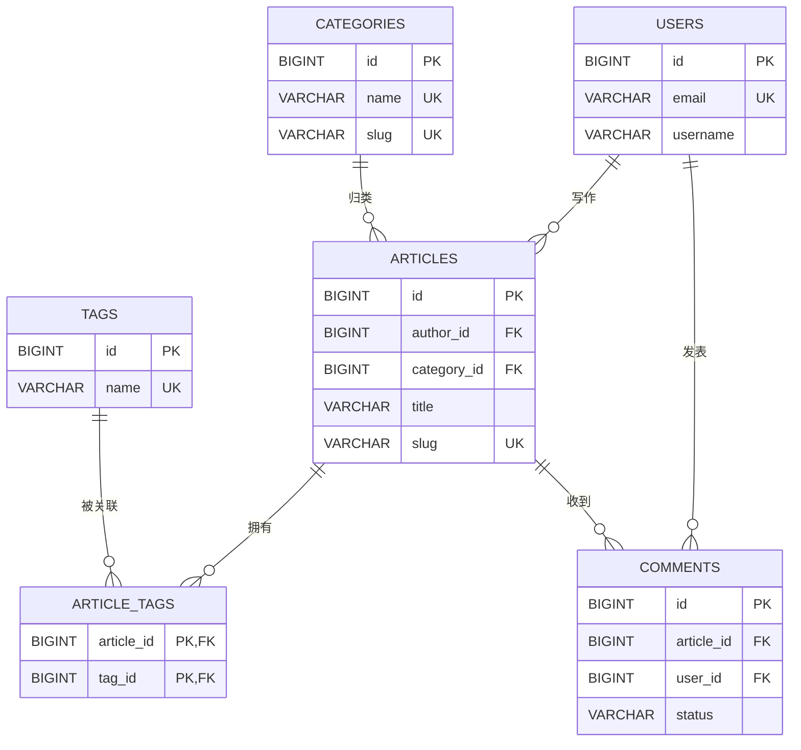
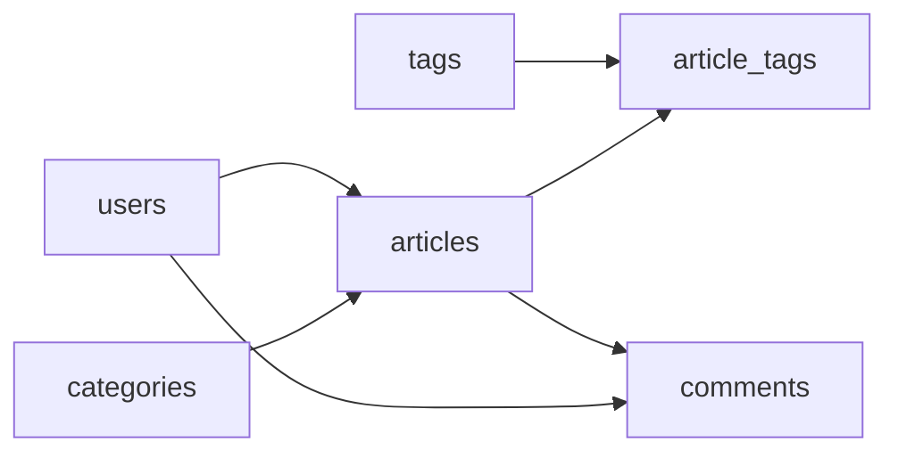

# 12 毕业项目，博客系统 MySQL 设计

## 1. 这一章不是“突然上项目”，而是把学过的积木放在一起

如果你直接从这一章开始看，会觉得表和 SQL 很多。正确读法是：它不是一门新课，而是前 11 章的综合练习。每一张表、每一个关键词，都应当能在前面找到出处。

| 本章出现的内容 | 你在哪一章已经学过 |
| --- | --- |
| 一张表、字段、主键、默认值 | 第 02、04、05 章 |
| 插入、修改、删除与影响范围 | 第 06 章 |
| 列表、筛选、排序、分页 | 第 07 章 |
| 一对多、多对多、JOIN、外键 | 第 08 章 |
| 评论数、分类统计 | 第 09 章 |
| 列表索引和 EXPLAIN | 第 10 章 |
| 发布文章和绑定标签的事务 | 第 11 章 |

这一章的目标不是照抄一套“万能博客表结构”，而是训练你从业务对象出发：每张表一行代表什么，谁和谁关联，列表要怎样查，为什么需要某条索引或事务。

## 2. 先建立一个新的练习数据库，绝不覆盖前面的笔记表

本章会创建更多表。请使用一个新的练习数据库，而不是在真实项目库或前面已有练习的数据库里随意执行：

```sql
CREATE DATABASE mysql_blog_learning
  CHARACTER SET utf8mb4
  COLLATE utf8mb4_0900_ai_ci;

USE mysql_blog_learning;

SELECT DATABASE();
```

最后一条应返回 `mysql_blog_learning`。后面所有 `CREATE TABLE` 都在这里执行。

这不是线上项目的完整迁移脚本，也不会改动本仓库正在使用的 MongoDB。它只是让你在 MySQL 中独立练习关系型数据库设计的课程项目。

## 3. 先列业务对象：不要一上来写表名

一个极简博客需要回答这些问题：

| 业务问题 | 需要保存的对象 | 对应表 |
| --- | --- | --- |
| 谁写了文章？ | 用户 | `users` |
| 文章属于哪个大类？ | 分类 | `categories` |
| 文章标题、正文、发布时间是什么？ | 文章 | `articles` |
| 一篇文章可贴哪些标签？ | 标签 | `tags` |
| 哪篇文章贴了哪个标签？ | 文章和标签的关联 | `article_tags` |
| 谁对哪篇文章发表了什么评论？ | 评论 | `comments` |

每张表只保存一种东西。`article_tags` 看起来不像一个“独立业务对象”，但它的每一行仍有清楚含义：**某篇文章贴了某个标签。**

## 4. 先画关系，再确定建表顺序



图读法：

- 一个用户可以写多篇文章，一篇文章只有一个作者，所以 `articles.author_id` 指向 `users.id`。
- 一个分类可以包含多篇文章，一篇文章先归到一个分类，所以 `articles.category_id` 指向 `categories.id`。
- 文章和标签是多对多，所以需要 `article_tags` 中间表。
- 一篇文章可以有多条评论，一个用户也可以发表多条评论。

外键会引用已经存在的表，因此建表顺序应是：



实际执行顺序：`users`、`categories`、`tags`、`articles`、`article_tags`、`comments`。先建被引用的“上游表”，再建包含外键的“下游表”。

## 5. 用户表：用户身份和密码规则

每一行 `users` 表示一个可登录的用户：

```sql
CREATE TABLE users (
  id BIGINT UNSIGNED NOT NULL AUTO_INCREMENT,
  email VARCHAR(255) NOT NULL,
  username VARCHAR(50) NOT NULL,
  password_hash VARCHAR(255) NOT NULL,
  status VARCHAR(20) NOT NULL DEFAULT 'active',
  created_at DATETIME(3) NOT NULL DEFAULT CURRENT_TIMESTAMP(3),
  updated_at DATETIME(3) NOT NULL DEFAULT CURRENT_TIMESTAMP(3)
    ON UPDATE CURRENT_TIMESTAMP(3),
  PRIMARY KEY (id),
  UNIQUE KEY uk_users_email (email)
) ENGINE=InnoDB DEFAULT CHARSET=utf8mb4 COLLATE=utf8mb4_0900_ai_ci;
```

字段选择理由：

| 字段 | 规则背后的理由 |
| --- | --- |
| `id` | 内部唯一标识，文章和评论通过它关联作者 |
| `email` | 登录或联系标识，使用唯一约束防止重复注册 |
| `username` | 展示给读者的名字，不要求它等于邮箱 |
| `password_hash` | 只保存密码哈希，不保存任何明文密码 |
| `status` | 用户可能被禁用，默认正常状态 |
| 时间字段 | 记录账号何时创建、何时最后修改 |

`password_hash` 不是“把密码加密一下”。它应该由后端使用专门的密码哈希算法（例如 bcrypt、Argon2）生成和验证；数据库只负责保存哈希结果。绝对不要写 `password VARCHAR(...)` 然后把真实明文密码插入表中。

## 6. 分类表：分类既要能显示，也要能用于路径

每一行 `categories` 表示一个文章分类：

```sql
CREATE TABLE categories (
  id BIGINT UNSIGNED NOT NULL AUTO_INCREMENT,
  name VARCHAR(100) NOT NULL,
  slug VARCHAR(120) NOT NULL,
  sort_order INT NOT NULL DEFAULT 0,
  created_at DATETIME(3) NOT NULL DEFAULT CURRENT_TIMESTAMP(3),
  PRIMARY KEY (id),
  UNIQUE KEY uk_categories_name (name),
  UNIQUE KEY uk_categories_slug (slug)
) ENGINE=InnoDB DEFAULT CHARSET=utf8mb4 COLLATE=utf8mb4_0900_ai_ci;
```

| 字段 | 示例 | 为什么需要 |
| --- | --- | --- |
| `name` | `MySQL 入门` | 页面上显示给人看的名字 |
| `slug` | `mysql-basics` | URL 中稳定、易读的文本标识 |
| `sort_order` | `10` | 让后台可控制分类展示顺序 |

`name` 和 `slug` 都应唯一，但理由不同：名称重复会让管理者混淆；slug 重复会让路径无法唯一定位分类。

## 7. 标签表：标签也有自己的身份

每一行 `tags` 表示一个可复用标签：

```sql
CREATE TABLE tags (
  id BIGINT UNSIGNED NOT NULL AUTO_INCREMENT,
  name VARCHAR(50) NOT NULL,
  slug VARCHAR(80) NOT NULL,
  created_at DATETIME(3) NOT NULL DEFAULT CURRENT_TIMESTAMP(3),
  PRIMARY KEY (id),
  UNIQUE KEY uk_tags_name (name),
  UNIQUE KEY uk_tags_slug (slug)
) ENGINE=InnoDB DEFAULT CHARSET=utf8mb4 COLLATE=utf8mb4_0900_ai_ci;
```

不要把一篇文章的标签写成文章表中的字符串，例如 `数据库,入门,查询`。那样以后无法可靠地统计一个标签下有哪些文章，也无法防止“数据库”和“数据 库”变成两个标签。标签是可复用对象，所以单独建表。

## 8. 文章表：把作者、分类和文章自身的信息放在正确位置

每一行 `articles` 表示一篇文章：

```sql
CREATE TABLE articles (
  id BIGINT UNSIGNED NOT NULL AUTO_INCREMENT,
  category_id BIGINT UNSIGNED NOT NULL,
  author_id BIGINT UNSIGNED NOT NULL,
  title VARCHAR(200) NOT NULL,
  slug VARCHAR(220) NOT NULL,
  summary VARCHAR(300) NULL,
  content TEXT NOT NULL,
  status VARCHAR(20) NOT NULL DEFAULT 'draft',
  view_count INT UNSIGNED NOT NULL DEFAULT 0,
  published_at DATETIME(3) NULL,
  created_at DATETIME(3) NOT NULL DEFAULT CURRENT_TIMESTAMP(3),
  updated_at DATETIME(3) NOT NULL DEFAULT CURRENT_TIMESTAMP(3)
    ON UPDATE CURRENT_TIMESTAMP(3),
  PRIMARY KEY (id),
  UNIQUE KEY uk_articles_slug (slug),
  KEY idx_articles_status_published_id (status, published_at, id),
  KEY idx_articles_category_status_published_id
    (category_id, status, published_at, id),
  KEY idx_articles_author_created_at (author_id, created_at),
  CONSTRAINT fk_articles_category
    FOREIGN KEY (category_id) REFERENCES categories(id),
  CONSTRAINT fk_articles_author
    FOREIGN KEY (author_id) REFERENCES users(id)
) ENGINE=InnoDB DEFAULT CHARSET=utf8mb4 COLLATE=utf8mb4_0900_ai_ci;
```

不要一次记住整段。分为四组：

| 组 | 字段 | 表达什么 |
| --- | --- | --- |
| 关联谁 | `category_id`、`author_id` | 这篇文章属于哪个分类、由谁写 |
| 文章内容 | `title`、`slug`、`summary`、`content` | 面向读者展示和访问的内容 |
| 生命周期 | `status`、`published_at` | 还在草稿、已发布，何时发布 |
| 统计和审计 | `view_count`、创建/更新时间 | 被看了多少次，何时创建和最后修改 |

两个外键不是为了让 SQL 变复杂，而是为了阻止这样的错误：试图插入 `author_id = 99999`，但根本没有这个用户；或文章引用一个不存在的分类。它们要求关联 ID 必须真实存在。

三条 `KEY` 都来自查询需求：

| 索引 | 它服务的查询 |
| --- | --- |
| `(status, published_at, id)` | 首页按发布时间取已发布文章 |
| `(category_id, status, published_at, id)` | 进入某分类后按时间取已发布文章 |
| `(author_id, created_at)` | 查看某作者写过的文章 |

这正是第 10 章的原则：先有访问路径，再有索引。没有哪个索引只是因为“看起来专业”而存在。

## 9. 文章标签中间表：一行只说明一次“贴标签”

一篇文章可有多个标签，一个标签也能用于多篇文章。中间表这样写：

```sql
CREATE TABLE article_tags (
  article_id BIGINT UNSIGNED NOT NULL,
  tag_id BIGINT UNSIGNED NOT NULL,
  created_at DATETIME(3) NOT NULL DEFAULT CURRENT_TIMESTAMP(3),
  PRIMARY KEY (article_id, tag_id),
  KEY idx_article_tags_tag_id (tag_id),
  CONSTRAINT fk_article_tags_article
    FOREIGN KEY (article_id) REFERENCES articles(id)
    ON DELETE CASCADE,
  CONSTRAINT fk_article_tags_tag
    FOREIGN KEY (tag_id) REFERENCES tags(id)
) ENGINE=InnoDB DEFAULT CHARSET=utf8mb4 COLLATE=utf8mb4_0900_ai_ci;
```

最值得理解的是：

```sql
PRIMARY KEY (article_id, tag_id)
```

这叫复合主键，意思是“文章编号和标签编号这对组合不能重复”。如果文章 5 已经贴过标签 2，再插入 `(5, 2)` 会被拒绝；但 `(5, 3)` 和 `(6, 2)` 都是不同关联，允许存在。

`ON DELETE CASCADE` 只放在“文章被物理删除时，顺带删除它的标签关联”这一条上。课程的文章业务更推荐软删除或下架而不是轻易物理删除；这里展示的是外键删除策略也需要从业务语义出发选择。

`idx_article_tags_tag_id` 是为了反向查询“这个标签下有哪些文章”。复合主键的最左列是 `article_id`，不能完全替代以 `tag_id` 开头的访问路径。

## 10. 评论表：评论属于文章，也属于发表它的用户

每一行 `comments` 表示一条评论：

```sql
CREATE TABLE comments (
  id BIGINT UNSIGNED NOT NULL AUTO_INCREMENT,
  article_id BIGINT UNSIGNED NOT NULL,
  user_id BIGINT UNSIGNED NOT NULL,
  content VARCHAR(1000) NOT NULL,
  status VARCHAR(20) NOT NULL DEFAULT 'pending',
  deleted_at DATETIME(3) NULL,
  created_at DATETIME(3) NOT NULL DEFAULT CURRENT_TIMESTAMP(3),
  updated_at DATETIME(3) NOT NULL DEFAULT CURRENT_TIMESTAMP(3)
    ON UPDATE CURRENT_TIMESTAMP(3),
  PRIMARY KEY (id),
  KEY idx_comments_article_status_created
    (article_id, status, created_at),
  KEY idx_comments_user_created_at (user_id, created_at),
  CONSTRAINT fk_comments_article
    FOREIGN KEY (article_id) REFERENCES articles(id),
  CONSTRAINT fk_comments_user
    FOREIGN KEY (user_id) REFERENCES users(id)
) ENGINE=InnoDB DEFAULT CHARSET=utf8mb4 COLLATE=utf8mb4_0900_ai_ci;
```

| 字段 | 业务含义 |
| --- | --- |
| `article_id` | 这条评论留给哪篇文章 |
| `user_id` | 这条评论由谁发表 |
| `content` | 评论短文本，课程设上限 1000 字符 |
| `status` | 待审核、已通过、已拒绝等状态 |
| `deleted_at` | 用软删除保留审计信息 |

评论列表常见需求是“某篇文章下的已通过评论，按时间排序”，因此联合索引以 `article_id`、`status`、`created_at` 排列。这里同样能看出索引不是凭感觉加的。

## 11. 建表后先检查：不要直接进入复杂查询

六张表都创建后，依次执行：

```sql
SHOW TABLES;

SHOW CREATE TABLE users;
SHOW CREATE TABLE articles;
SHOW CREATE TABLE article_tags;
SHOW CREATE TABLE comments;
```

检查时问自己：

1. 每张表一行各代表什么？
2. `articles` 的 `author_id` 和 `category_id` 引用哪张表？
3. `article_tags` 为什么没有额外的自增 `id`？
4. 哪些字段有唯一约束？为什么？
5. 哪些索引对应哪条列表或详情查询？

能说清这些，再插入测试数据。不要表都还没看懂就复制一大段查询。

## 12. 插入最小测试数据：先准备上游对象

下面数据仅用于本地课程数据库。`password_hash` 的内容只是占位文本，不能用于真实登录；真实项目必须由后端生成合法哈希。

```sql
INSERT INTO users (email, username, password_hash)
VALUES (
  'learner@example.test',
  '课程练习用户',
  'course-demo-hash-not-a-real-password'
);

INSERT INTO categories (name, slug, sort_order)
VALUES ('数据库基础', 'database-basics', 10);

INSERT INTO tags (name, slug)
VALUES
  ('MySQL', 'mysql'),
  ('入门', 'beginner');
```

每执行一段都查询确认实际编号：

```sql
SELECT id, email, username FROM users;
SELECT id, name, slug FROM categories;
SELECT id, name, slug FROM tags;
```

外键表必须先有对应的用户、分类、标签，文章和关联表才能引用它们。

## 13. 发布文章并绑定标签：这是第 11 章事务的真实用法

这件事至少包含两步：插入文章、插入文章和标签的关联。如果文章已插入，但标签关联失败，就不是完整发布。因此把它们放进同一事务。

先用当前连接中的变量获取实际 ID，而不是硬写 1：

```sql
SET @author_id = (
  SELECT id
  FROM users
  WHERE email = 'learner@example.test'
  LIMIT 1
);

SET @category_id = (
  SELECT id
  FROM categories
  WHERE slug = 'database-basics'
  LIMIT 1
);
```

`@author_id`、`@category_id` 是当前 MySQL 客户端连接里的临时变量。查看它们：

```sql
SELECT @author_id, @category_id;
```

如果其中任何一个是 `NULL`，不要继续事务，先检查上一步的测试数据。确认都有真实 ID 后执行：

```sql
START TRANSACTION;

INSERT INTO articles (
  category_id,
  author_id,
  title,
  slug,
  summary,
  content,
  status,
  published_at
)
VALUES (
  @category_id,
  @author_id,
  'MySQL 小白入门',
  'mysql-beginner-course',
  '从一张表开始理解 MySQL。',
  '这里是课程练习用的文章正文。',
  'published',
  CURRENT_TIMESTAMP(3)
);

SET @article_id = LAST_INSERT_ID();

INSERT INTO article_tags (article_id, tag_id)
SELECT @article_id, id
FROM tags
WHERE slug IN ('mysql', 'beginner');

COMMIT;
```

逐步理解事务中发生的事：

| 步骤 | SQL | 为什么在这里 |
| --- | --- | --- |
| 1 | `START TRANSACTION` | 从这里开始，这组写入可一起回滚 |
| 2 | `INSERT INTO articles` | 创建文章主体 |
| 3 | `LAST_INSERT_ID()` | 取到本连接刚创建的文章编号 |
| 4 | `INSERT ... SELECT` | 找到两个标签的真实 id，并为每个标签插一条关联 |
| 5 | `COMMIT` | 文章和标签关联都成功后才正式提交 |

如果第 4 步发生意外错误，应执行 `ROLLBACK`，而不是仍然 `COMMIT`。在真实后端中，异常处理会自动走回滚路径；手工练习时，先逐条检查结果再提交。

验证发布结果：

```sql
SELECT id, title, slug, status, published_at
FROM articles;

SELECT article_id, tag_id
FROM article_tags
ORDER BY article_id ASC, tag_id ASC;
```

## 14. 文章列表：一次查询需要哪些表，先在脑中拆开

一个公开文章列表常需显示：文章标题、摘要、发布时间、作者名、分类名、已通过评论数。先把来源分开：

| 展示内容 | 来自哪张表 |
| --- | --- |
| 标题、摘要、发布时间 | `articles` |
| 作者名 | `users` |
| 分类名 | `categories` |
| 评论数 | `comments` |

再写查询：

```sql
SELECT
  a.id,
  a.title,
  a.summary,
  a.slug,
  a.published_at,
  u.username AS author_name,
  c.name AS category_name,
  COUNT(cm.id) AS comment_count
FROM articles AS a
INNER JOIN users AS u
  ON u.id = a.author_id
INNER JOIN categories AS c
  ON c.id = a.category_id
LEFT JOIN comments AS cm
  ON cm.article_id = a.id
  AND cm.status = 'approved'
  AND cm.deleted_at IS NULL
WHERE a.status = 'published'
GROUP BY
  a.id,
  a.title,
  a.summary,
  a.slug,
  a.published_at,
  u.username,
  c.name
ORDER BY a.published_at DESC, a.id DESC
LIMIT 10;
```

这一段很长，但每段都来自前面：

| 结构 | 作用 |
| --- | --- |
| 两个 `INNER JOIN` | 每篇有效文章必须有作者和分类，取它们的显示名称 |
| `LEFT JOIN comments` | 没有评论的文章也必须显示 |
| 评论状态条件在 `ON` | 只让已通过、未删除评论参与匹配，同时保留零评论文章 |
| `COUNT(cm.id)` | 统计每篇文章真正匹配到的评论数，零评论得到 0 |
| `GROUP BY` | 一篇文章和多条评论连接后会产生多行，按文章重新汇总成一行 |
| `WHERE a.status = 'published'` | 草稿不应出现在公开列表 |
| `ORDER BY + LIMIT` | 最新文章在前，取首页 10 条 |

不要一开始就把详情、标签、评论、作者全部塞进一条“万能 SQL”。列表用列表需要的数据，详情用详情需要的数据，通常更清晰也更容易优化。

## 15. 文章详情：拆成几条清楚的查询比一条巨型 JOIN 更好

详情页首先通过 slug 查询文章主体、作者和分类：

```sql
SELECT
  a.id,
  a.title,
  a.content,
  a.published_at,
  u.username AS author_name,
  c.name AS category_name
FROM articles AS a
INNER JOIN users AS u
  ON u.id = a.author_id
INNER JOIN categories AS c
  ON c.id = a.category_id
WHERE a.slug = 'mysql-beginner-course'
  AND a.status = 'published';
```

真实后端中，`'mysql-beginner-course'` 应由参数化查询传入，不能把用户输入直接拼到 SQL 字符串中。第 17 章会把“参数化”在代码里实际长什么样讲清楚。

获取文章后，假设文章 `id` 是 1（请以你的查询结果为准），再单独查询标签：

```sql
SELECT
  t.id,
  t.name,
  t.slug
FROM article_tags AS at
INNER JOIN tags AS t
  ON t.id = at.tag_id
WHERE at.article_id = 1
ORDER BY t.name ASC;
```

最后查询公开可见评论：

```sql
SELECT
  cm.id,
  cm.content,
  cm.created_at,
  u.username AS commenter_name
FROM comments AS cm
INNER JOIN users AS u
  ON u.id = cm.user_id
WHERE cm.article_id = 1
  AND cm.status = 'approved'
  AND cm.deleted_at IS NULL
ORDER BY cm.created_at ASC, cm.id ASC;
```

拆成三条 SQL 的好处是每条都有单一目的：文章主体、标签、评论。代码也能分别处理“文章不存在”“文章没有标签”“文章还没有评论”等不同状态。

## 16. 评论审核：用条件更新防止重复审核

假设管理员审核一条待审核评论：

```sql
UPDATE comments
SET status = 'approved'
WHERE id = 1
  AND status = 'pending';
```

这里 `AND status = 'pending'` 是第 11 章的条件更新思路：只有当前仍待审核才允许通过。随后检查影响行数：

```sql
SELECT ROW_COUNT();
```

返回 1 通常表示状态正常变化；返回 0 说明评论不存在、已处理或状态不符合，后台不应重复当作审核成功。再次查询目标评论确认最终状态，是更稳妥的最后一步。

## 17. 参数化查询：后端怎样把用户输入安全交给 SQL

在 MySQL 命令行里练习时，`WHERE a.slug = 'mysql-beginner-course'` 中的文字是你亲手写死的例子。真实网站中，文章 slug 来自网址，请求者可以随意构造它；把这段输入直接拼进 SQL 字符串，会造成 SQL 注入风险。

以 Node.js 常用的 `mysql2/promise` 驱动为例，安全查询的实际形状如下：

```js
const slug = request.params.slug

const [rows] = await connection.execute(
  `SELECT id, title, content, published_at
   FROM articles
   WHERE slug = ?
     AND status = ?`,
  [slug, 'published']
)
```

逐行看清楚：

| 代码 | 作用 |
| --- | --- |
| `const slug = request.params.slug` | 从网址中读到用户请求的文章标识；它是不可信的外部输入 |
| SQL 里的第一个 `?` | 由数据库驱动代替为 `slug` 这个值，不把它当作 SQL 语法的一部分 |
| SQL 里的第二个 `?` | 由驱动代替为固定值 `'published'`，公开接口只查询已发布文章 |
| `[slug, 'published']` | 按从左到右的顺序给两个占位符提供值；数量或顺序错了都会导致查询错误 |
| `connection.execute(...)` | 让驱动发送 SQL 和参数，不需要自己给字符串加引号、转义或拼接 |

这里的 `?` 是**后端数据库驱动的占位符**，不是可以直接复制到 `mysql>` 命令行执行的 MySQL 语法。命令行学习 SQL 时仍写具体练习值；编写后端时才把不可信的值放进参数数组。

参数化只能替代“数据值”，不能替代表名、列名或 `ORDER BY` 的方向。比如用户可选排序字段时，后端必须先用自己维护的白名单把输入映射到允许的列名，不能把用户给的文字直接拼进去。参数化能防 SQL 注入，但不会自动完成“这个人能否看这篇文章”的登录、角色和作者身份校验。

## 18. 最小化安全规则：结构正确还不够

数据库设计只是安全的一部分。做成真实网站时，至少还要遵守：

| 风险 | 基本做法 |
| --- | --- |
| SQL 注入 | 后端始终使用参数化查询，不拼接用户输入 |
| 明文密码泄露 | 只存受信任算法生成的密码哈希 |
| 普通用户修改别人文章 | 后端根据当前登录用户和 `author_id` 做权限校验 |
| 草稿被公开访问 | 公开查询固定加入 `status = 'published'` |
| 评论未审核就展示 | 公开评论查询固定加入 `status = 'approved'` 和未删除条件 |
| 误删数据 | 优先下架/软删除，并限制物理删除操作 |

外键、唯一约束和 `NOT NULL` 能保护基础数据关系；权限、输入校验、密码处理和发布流程仍属于后端必须承担的职责。

## 19. 备份与恢复：先证明自己能保护练习数据

`DROP DATABASE`、误写 `UPDATE` 条件、电脑故障都可能让数据消失。备份像给整本练习册拍一份可还原的副本；但“电脑里多了一个 `.sql` 文件”不等于备份可用，真正的验证是把它恢复到隔离环境后再检查数据。

下面命令要在 **PowerShell 或 cmd.exe** 中执行，不是在 `mysql>` 提示符中执行。它导出一个包含建库语句的完整备份文件：

```powershell
mysqldump -h 127.0.0.1 -P 3306 -u root -p --single-transaction --routines --events --triggers --databases mysql_blog_learning > mysql_blog_learning-full-20260803.sql
```

| 片段 | 用途 |
| --- | --- |
| `mysqldump` | MySQL 自带的导出工具，把表结构和数据写成一串 SQL |
| `--databases mysql_blog_learning` | 导出指定数据库，并写入 `CREATE DATABASE` 与 `USE` 语句 |
| `--single-transaction` | 对 InnoDB 表在不长时间锁表的情况下取得一致快照 |
| `--routines --events --triggers` | 需要时一并导出存储对象；本课程暂未使用它们，但完整备份不应悄悄漏掉 |
| `> ...sql` | 把导出的文本保存成文件；文件名中加入日期，便于区分版本 |

导出后先确认文件存在且不是 0 字节，并用文本编辑器打开开头，能看到类似 `CREATE DATABASE`、`USE`、`CREATE TABLE` 的 SQL。这一步只能证明“文件写出来了”，还不能证明恢复正确。

### 19.1 用不会碰原库的方式练习恢复

为了验证恢复过程，先导出一份**不包含数据库名切换**的可移植练习副本：

```powershell
mysqldump -h 127.0.0.1 -P 3306 -u root -p mysql_blog_learning > mysql_blog_learning-portable.sql
```

然后在 `mysql>` 中创建一个专门用于检查恢复结果的新空数据库：

```sql
CREATE DATABASE mysql_blog_restore_check
  CHARACTER SET utf8mb4
  COLLATE utf8mb4_0900_ai_ci;
```

接着打开 **cmd.exe**，切换到备份文件所在目录，再运行：

```bat
mysql -h 127.0.0.1 -P 3306 -u root -p mysql_blog_restore_check < mysql_blog_learning-portable.sql
```

这里 `<` 是 cmd.exe 的“把文件内容送给命令”符号；PowerShell 不适合直接照抄这条带 `<` 的命令。恢复完成后连接 `mysql_blog_restore_check`，至少核对表和数据行数：

```sql
USE mysql_blog_restore_check;
SHOW TABLES;
SELECT COUNT(*) AS article_total FROM articles;
SELECT COUNT(*) AS user_total FROM users;
```

表存在、数量符合预期，才说明备份文件能在空库中恢复。检查结束后，这个专门创建的检查库可以删除；删除前确认当前选中的确实是 `mysql_blog_restore_check`，绝不能凭记忆操作。

### 19.2 原库替换不是普通导入

带 `--databases` 的完整备份记录的是原来的库名。把它导回一个已有业务数据的服务器，既不会自动替你合并新旧数据，也不应该被当作“撤销一步”的按钮。真正替换原库通常要先停掉应用、确认没有需要保留的新数据、再清空或替换目标库，任何一步做错都可能造成数据丢失。

所以本课程只要求你完成“导出 + 恢复到检查库 + 核对”的安全闭环。生产环境的恢复必须先有最新备份、书面确认恢复范围，并由理解当前业务数据的人在隔离环境演练后执行。

## 20. 毕业验收：不要只看 SQL，试着从需求反推它

完成本章后，请不看正文试着完成：

1. 画出六张表及关系，并解释每条外键字段放在为什么这张表里。
2. 说清 `articles`、`article_tags`、`comments` 的“一行”各代表什么。
3. 解释 `article_tags` 为什么使用 `(article_id, tag_id)` 作为复合主键。
4. 创建一位用户、一个分类、两个标签；用事务创建一篇已发布文章并绑定两个标签。
5. 写出公开文章列表 SQL，并解释为什么评论使用 `LEFT JOIN` 和 `COUNT(cm.id)`。
6. 拆成多条查询实现文章详情：主体、标签、已通过评论。
7. 写出评论从 `pending` 审核为 `approved` 的安全更新，并检查影响行数。
8. 找出文章首页列表和分类文章列表对应的两个联合索引。
9. 用自己的话解释：事务解决什么问题，外键解决什么问题，后端权限又解决什么问题？
10. 看懂参数化查询中 `?` 和参数数组的对应关系，并说清它为什么不能代替权限校验。
11. 导出 `mysql_blog_learning`，恢复到 `mysql_blog_restore_check`，再核对表名和至少两张表的行数。

能完成这些，不代表已经掌握所有 MySQL 高级特性；但你已经可以从一个具体需求出发，独立设计一组基础表、写出安全的常用查询，并知道什么时候要查资料和做验证。这才是从零开始学数据库真正应该达到的第一阶段。
