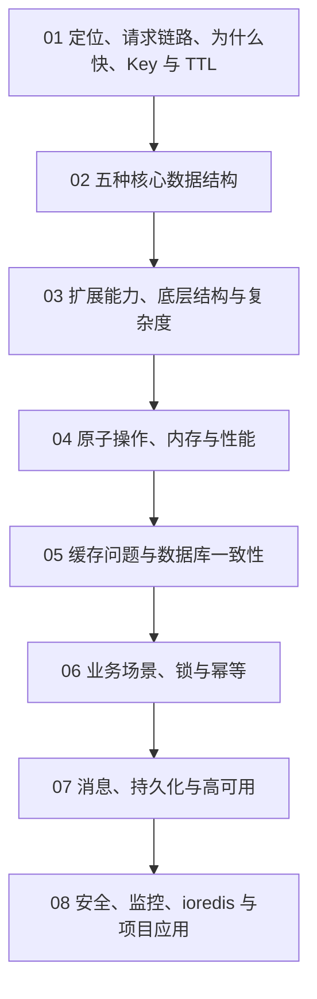

# Redis 实用入门总目录：定位、数据结构、缓存与高可用

Redis 的知识点很多，但日常开发并不要求每个人都会搭 Cluster、背完整命令或手写分布式锁。真正重要的是建立一张正确地图：Redis 在系统里负责什么，什么数据适合放进去，缓存为什么会出问题，并发和故障时系统会发生什么。

这套专题把完整知识收拢为 8 篇文章。文章数量不多，但每篇都按“生活场景、直观比喻、运行原理、短代码逐行解释、常见误区、业务边界、本章复盘”的顺序展开，避免把几十个术语压成一页速查表。

代码只用来帮助理解：

- Redis 命令展示数据结构和 TTL 的实际形状。
- 一段短 Lua 展示为什么“比较锁令牌并删除”必须原子完成。
- 一段短 JavaScript 展示 Cache-Aside 的读取顺序。
- 一段 ioredis 配置展示连接、超时、重试和离线队列。

这里没有大段可运行项目、命令百科和课后练习。开发时即使使用团队封装好的 Redis 服务，也应该能看懂这些短片段背后的设计。

## 先看完整知识地图

这条路线从“Redis 是什么”开始，最后回到“知识库项目究竟怎样用”。前两篇是地基，第 05、06 篇最贴近日常业务，第 07、08 篇负责生产可靠性。

## 八篇文章

### 01 认识 Redis、为什么快与 Key 生命周期

[开始阅读：认识 Redis、为什么快与 Key 生命周期](/console/articles/redis-01-overview-fast-key-ttl)

先区分应用内存、Redis 和数据库，再拆解一次 Redis 请求的客户端、网络、RESP 和服务端路径。文章会说明“单线程”为什么只是简化说法，并用门牌号和食品有效期解释 Key、TTL、SCAN 和生命周期卡片。

读完至少能回答：Redis 会不会自己查数据库？缓存丢失后怎么办？TTL 为什么不是可靠定时任务？

### 02 核心数据结构与常见场景

[继续阅读：核心数据结构与常见场景](/console/articles/redis-02-core-data-structures)

把 String、Hash、List、Set 和 Sorted Set 分别理解成单值盒子、资料卡、队伍、去重名单和比赛成绩板。每种结构都配最小命令、逐行解释、真实场景和规模边界。

读完不要求背命令，但应能根据“是否需要字段、顺序、去重和分数”选择结构。

### 03 扩展能力、底层结构与复杂度

[继续阅读：扩展能力、底层结构与复杂度](/console/articles/redis-03-extended-types-internals-complexity)

用签到灯、访客估算和地图图钉理解 Bitmap、Bitfield、HyperLogLog 和 Geo，再认识 Bloom Filter、Stream、JSON、Search、Time Series 和向量能力。

底层部分只建立直觉：同一种外部类型可能根据规模使用不同内部编码，O(1) 也不代表返回 10 MB 数据没有成本。

### 04 原子操作、内存管理与性能问题

[继续阅读：原子操作、内存管理与性能问题](/console/articles/redis-04-atomicity-memory-performance)

从两个请求同时扣一份库存讲起，区分单命令、Pipeline、事务、WATCH、Lua 和 Functions。后半篇用仓库保质期和清货规则区分过期与淘汰，并细讲内存余量、碎片、大 Key、热 Key 和慢请求。

读完应能解释：Pipeline 为什么不保证原子性，Redis 事务为什么没有数据库式回滚。

### 05 缓存问题与数据库一致性

[继续阅读：缓存问题与数据库一致性](/console/articles/redis-05-cache-consistency)

这是最贴近日常开发的一篇。文章用餐厅备餐解释 Cache-Aside，通过一段短 JavaScript 逐步说明命中、回源、空值和回填，再区分缓存穿透、击穿、雪崩和冷启动。

后半篇重点解释数据库更新后为什么通常删除缓存、旧读请求怎样晚到回填，以及 Outbox、CDC、版本化 Key 如何缩小不一致窗口。

### 06 常见业务场景、分布式锁与幂等

[继续阅读：常见业务场景、分布式锁与幂等](/console/articles/redis-06-business-lock-idempotency)

把 Redis 放进会话、验证码、五种限流算法、计数、在线状态和排行榜。锁部分从 NX、唯一令牌和租期开始，用短 Lua 解释安全释放，再说明锁过期、续期、围栏令牌和异步复制边界。

文章会反复强调：锁减少同时执行，幂等保证重复请求只产生一次结果，数据库唯一约束负责最终事实。

### 07 消息、持久化与高可用

[继续阅读：消息、持久化与高可用](/console/articles/redis-07-messaging-persistence-high-availability)

先把三张安全网分开：Pub/Sub 与 Stream 负责消息交付，RDB/AOF/备份负责恢复，复制/Sentinel/Cluster 负责节点故障后的继续服务。

文章会讲清 Stream 的消费组、PEL、ACK 和重复投递，RDB 与 AOF 的数据窗口，主从异步复制，Sentinel 自动选主，以及 Cluster 的 16384 槽、MOVED、ASK 和同槽限制。

### 08 安全监控、ioredis 与项目应用

[继续阅读：安全监控、ioredis 与项目应用](/console/articles/redis-08-security-monitoring-ioredis-case)

最后从生产环境反推：私网、TLS、ACL、秘密管理和备份保护分别做什么，内存、连接、复制、持久化和业务回源量应该怎样监控。

ioredis 部分解释长连接、专用订阅连接、超时、有限重试和离线队列；项目案例则明确公开文章、目录、会话、权限、阅读量、点赞、导入幂等分别由 Redis 和 MongoDB 承担什么。

## 两种阅读路线

### 只想先知道 Redis 大概怎么回事

按 `01 → 02 → 05 → 06 → 08 的项目案例` 阅读。

这条路线先建立定位和数据结构，再看最常见的缓存与业务场景，最后落到 Node.js 知识库项目。读完已经足够看懂多数日常 Redis 代码和方案讨论。

### 想建立完整体系

按 `01 → 08` 顺序完整阅读。

第 03、04 篇补充扩展结构、原子性、内存和性能，第 07 篇补充消息、恢复和高可用。第一次遇到内部编码或 Cluster 术语时不必停下来背，先理解它解决的问题和主要边界。

## 每学一个能力都问四句话

1. 它解决的是读取加速、短期状态、计算、消息，还是协调？
2. 这份数据的正式来源在哪里，Redis 丢失后能否恢复？
3. Key、Value、TTL 和最大规模是什么？
4. Redis 变慢、断开或切换时，业务怎样限流、重试和降级？

如果只能回答“因为 Redis 快”，方案通常还不完整。

## 读完后的合理目标

你不需要成为 Redis 运维专家，至少应该能够：

- 区分数据库正式事实、可重建缓存、临时状态和协调状态。
- 根据数据形状选择 String、Hash、List、Set、Sorted Set 或知道何时不用 Redis。
- 解释 Key、TTL、过期、淘汰、大 Key、热 Key 和慢请求的区别。
- 区分 Pipeline、事务、WATCH、Lua、锁、幂等和数据库约束。
- 分辨缓存穿透、击穿、雪崩和数据库缓存不一致。
- 知道 Pub/Sub、Stream、RDB、AOF、复制、Sentinel 和 Cluster 各自保护哪一层。
- 看懂 ioredis 连接配置，并能追问超时、重试、拓扑、监控和降级。

真正掌握 Redis，不是把所有数据都搬进 Redis，而是知道什么值得加速、什么必须保留正式事实，以及 Redis 出问题时系统怎样保持可控。
