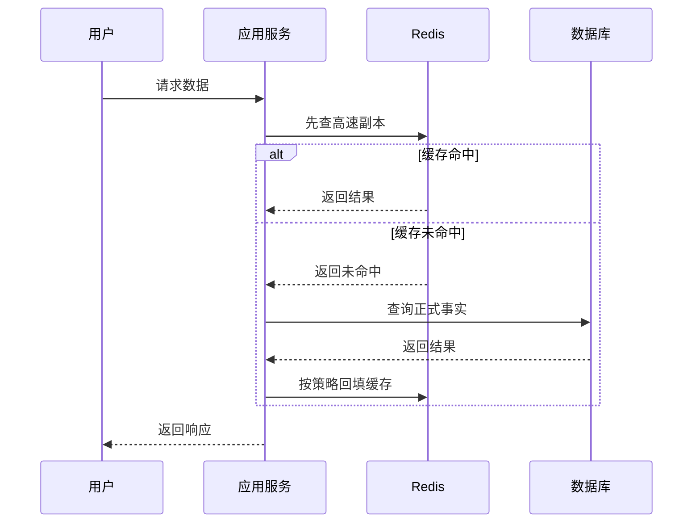
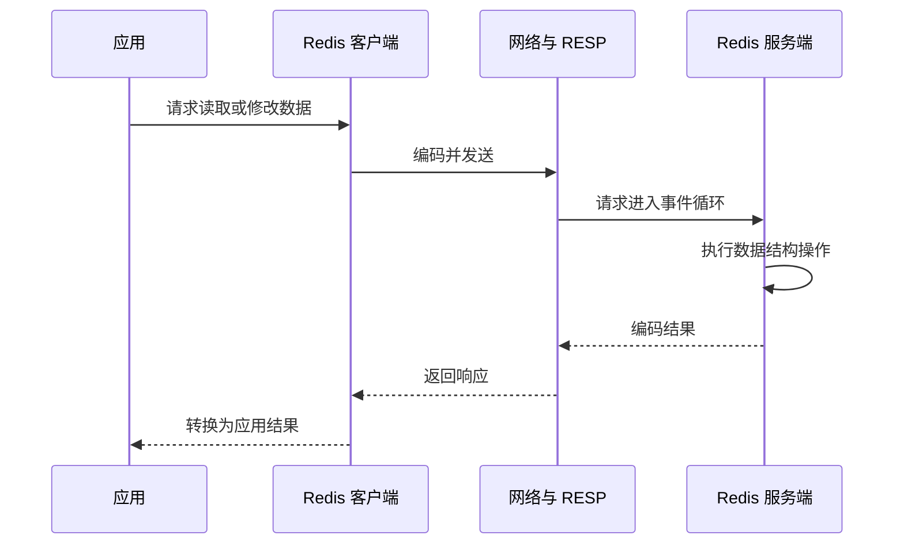
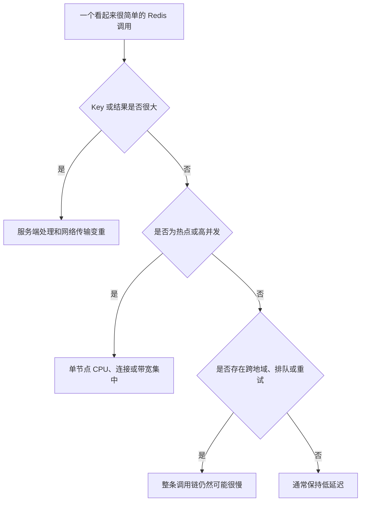
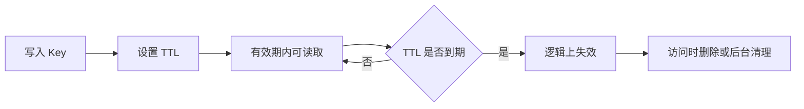

# 第 01 篇：Redis 定位与 Key 生命周期：为什么快、请求链路、Key 设计与 TTL

> 阅读定位：这一篇默认你从来没有用过 Redis。读完后不要求会搭集群，也不要求背命令，只要求能说清 Redis 放在系统哪里、一次请求怎样经过它、Key 和 TTL 分别负责什么。

## 这一篇先解决五个问题

很多教程一上来就让你安装 Redis、输入命令。这样很容易出现一种情况：命令会敲了，却不知道为什么项目要多出一个 Redis。

这一篇按下面的顺序慢慢展开：

1. 程序为什么既需要数据库，又需要 Redis。
2. Redis 为什么快，但为什么不是所有数据都适合放进去。
3. 应用、Redis 和数据库在一次请求中怎样分工。
4. Key 为什么像门牌号，TTL 为什么像有效期。
5. 当 Redis 不可用时，业务应该怎样思考。

## 先把 Redis 放在正确的位置

Redis 是一个以内存为主要工作空间、通过网络提供多种数据结构的服务。它能保存数据，但最常见的价值不是替代数据库，而是缩短高频访问路径、保存短期状态、快速计数和帮助多个应用实例协调。

可以把数据库想成档案馆，把 Redis 想成大厅旁边的高速服务台。文章正文、订单、用户角色和支付记录属于正式档案；文章缓存、验证码、会话、排行榜和限流次数适合放在服务台。

判断一份数据能不能只放 Redis，可以先问一句：Redis 里的它突然消失后，系统能否从其他地方恢复正确结果？如果不能，它就不应只依赖 Redis。

Redis 的名字可以理解为“远程字典服务”。所谓字典，就是先给一份数据起一个名字，再通过这个名字找到对应内容；所谓远程，就是 Redis 通常作为独立服务运行，应用需要通过网络访问它。

对小白来说，可以先把程序中的存储分成三层：

| 存储位置 | 生活比喻 | 优点 | 局限 |
| --- | --- | --- | --- |
| 应用进程内存 | 自己手里拿着的便签 | 最靠近代码，读取最快 | 进程重启就消失，多台应用之间不共享 |
| Redis | 大厅里的公共高速服务台 | 多台应用可共享，速度快，结构丰富 | 内存昂贵，需要单独运维，也可能故障 |
| MongoDB、MySQL 等数据库 | 保存正式档案的档案馆 | 适合长期事实、查询、事务和审计 | 单次访问路径通常更长，不能承受无限重复查询 |

应用进程内存和 Redis 都可以做缓存，但两者不是一回事。应用本地缓存只服务当前进程；Redis 可以让十台、几十台应用看到同一份短期状态。



注意图中的责任边界：**Redis 不会在缓存未命中时自动替应用查询数据库**。通常是应用发现未命中后查询数据库，再决定是否回填 Redis。第 05 篇会把这套 Cache-Aside 流程讲细。

Redis 中的数据大致可以分成四类：

| 数据类型 | 例子 | Redis 丢失后的处理 |
| --- | --- | --- |
| 可重建缓存 | 公开文章、分类树、首页推荐 | 从数据库重新加载 |
| 临时状态 | 验证码、会话、限流窗口 | 重新获取或按安全策略失败 |
| 实时近似数据 | 阅读增量、在线状态、热榜 | 接受有限误差或重新统计 |
| 协调状态 | 锁、幂等标记、任务领取 | 需要数据库约束或状态机兜底 |

订单金额、正式权限、点赞关系、库存账目等事实通常仍以数据库为准。Redis 可以加速这些事实的读取，但不能因为速度快就忽略事务、审计和备份。

这里最容易犯的错误，是把“Redis 可以持久化”理解成“Redis 就能无条件替代数据库”。持久化只能减少重启后的数据损失，它不会自动提供关系约束、复杂事务、完整审计和所有业务恢复能力。是否能把 Redis 当主要存储，要由具体业务、产品能力和恢复目标决定，不能只看速度。

## 一次 Redis 请求经过什么

应用不会直接碰到 Redis 内存。一次请求要经过 Redis 客户端、网络、RESP 协议、服务端解析、数据结构操作、响应编码和网络返回。



这条链路解释了一个重要事实：Redis 服务端操作很快，不代表应用调用一定快。连接频繁创建、跨地域网络、一次返回几 MB 数据、客户端排队和无限重试，都可能让接口变慢。

把这条链路拆成七步，就更容易定位问题：

1. 业务代码向客户端库发出请求。
2. 客户端从连接池或现有长连接中选择连接。
3. 客户端把命令编码成 RESP 数据。
4. 网络把字节发送到 Redis。
5. Redis 解析命令并操作对应数据结构。
6. Redis 编码结果并通过网络返回。
7. 客户端把结果转换成字符串、数组或对象，交还业务代码。

如果第 5 步只花了 0.2 毫秒，但连接等待花了 20 毫秒、网络花了 10 毫秒，那么用户看到的仍然是三十多毫秒。排障时只盯着 Redis 慢日志，会漏掉前后很多环节。

RESP 可以理解为应用和 Redis 约定的一套“快递面单格式”。业务代码写的是 `redis.get(key)`，客户端会把它翻译成 Redis 能理解的字节；Redis 返回字节后，客户端再翻译成代码里的值。日常开发通常不用手工拼 RESP，但知道它存在，就能明白“调用 Redis”本质上仍是一次网络通信。

## Redis 为什么快

第一，数据主要位于内存，避免了大量磁盘随机读取。

第二，Redis 为字符串、哈希、列表、集合、排行榜等问题提供专用结构，很多操作不需要复杂查询计划。

第三，核心命令执行路径相对简单，并具有高度串行的特征。一个普通命令执行时，不会被另一个普通命令从中间插入，因此很多单命令天然具有原子性。

第四，Redis 使用事件循环和 I/O 多路复用管理大量连接，不需要为每个连接单独创建一个重量级工作线程。客户端还可以通过 Pipeline 减少网络往返。

但“Redis 是单线程的”只是简化说法。现代 Redis 可以让 I/O 线程处理部分网络工作，也会使用后台线程或子进程完成异步释放、持久化和其他任务。真正需要警惕的是主执行路径上的大 Key、全量集合操作和长 Lua 脚本。

可以把 Redis 的核心执行路径想成一家效率极高的单窗口柜台：

- 柜员把每项简单业务做得非常快，所以一秒能处理很多请求。
- 大量顾客可以先在等候区排队，事件循环负责发现谁已经准备好。
- 柜员处理一项普通业务时，不会做到一半突然切给另一个顾客。
- 如果有人拿来十万页材料要求当场统计，后面所有简单业务也要等待。

因此，“串行执行”既带来单命令原子性，也带来阻塞风险。Redis 快的关键不是单线程三个字，而是绝大多数操作短小、数据在内存、结构合适、网络往返可控。

### 快不等于每个命令都一样快

下面三个请求都叫“读取”，工作量却完全不同：

| 请求 | Redis 需要做的事 | 主要风险 |
| --- | --- | --- |
| 读取一个很小的计数器 | 定位 Key，返回几个字节 | 通常很轻 |
| 读取一篇较大的完整文章 | 定位 Key，复制并发送较多字节 | 网络和序列化变重 |
| 读取一个集合的全部成员 | 遍历大量元素并返回大响应 | 主执行路径、网络和客户端都可能变慢 |

所以不要只看命令名称，要继续问：这个 Key 多大、集合有多少成员、一次返回多少数据、每秒调用多少次。

## 什么会让 Redis 变慢

Redis 不会因为在内存中就自动忽略数据量。读取一个小 Key 和返回一个百万成员集合完全不同。

常见问题包括：

- 一次读取或删除巨大 Key。
- 对大集合执行全量遍历或集合运算。
- 执行长时间 Lua 脚本。
- 返回结果过大，网络与客户端处理时间增加。
- 快照、AOF 重写或全量复制期间资源紧张。
- 客户端超时后立即重试，形成请求放大。

所以评估 Redis 性能时，不只看平均响应，还要看 P95、P99、最大结果大小、连接等待和故障期间行为。



## 学习环境与生产环境

本地学习可以使用 Docker、WSL、Linux 虚拟机或团队开发实例。旧 Windows 原生移植版和第三方兼容实现可能长期未更新，不适合当成生产标准。

你不需要为了读懂这套文章先搭一套生产集群。只要记住两个环境目的：

- 学习环境用来观察 Key、TTL 和数据结构，可以随时清空重来。
- 生产环境保存真实业务状态，需要网络隔离、认证、容量、备份、监控和故障方案。

很多团队会直接使用云托管 Redis。这样可以少做服务器安装和主从切换，但应用侧的超时、重试、幂等、缓存一致性和降级仍然存在，云服务不会替业务代码自动解决这些问题。

生产部署常见四种形态：

| 形态 | 解决的问题 | 主要边界 |
| --- | --- | --- |
| 单节点 | 学习、开发、小型可重建缓存 | 节点故障会中断服务 |
| 主从复制加 Sentinel | 单份数据集的自动故障转移 | 总容量仍受单主节点限制 |
| Cluster | 多主分片和横向扩容 | 跨槽操作和运维更复杂 |
| 托管 Redis | 减少服务器和升级运维 | 应用仍要处理超时、降级和一致性 |

版本也要确认。Redis 7.4 开始支持 Hash 字段级过期；Redis 8 的发行体系进一步整合 JSON、Search、Time Series 和概率结构等能力；部分更新版本或产品还提供独立的向量数据能力。旧版本、兼容产品和云服务不一定全部支持。

## Key 是门牌号

Key 决定一份数据怎样被找到，也决定它属于哪个项目、环境、模块和对象。

一个容易维护的 Key 通常包含业务、对象、用途和标识，例如“知识库、文章详情、文章编号”。命名应稳定，不要一会儿使用下划线、一会儿使用冒号，也不要把手机号、Token、密码等敏感信息直接写进 Key。

例如 `cache:article:1001` 可以从左到右读成：

| 片段 | 含义 |
| --- | --- |
| cache | 这是一份可重建缓存 |
| article | 它属于文章业务 |
| 1001 | 它对应文章 1001 |

冒号不是 Redis 强制语法，只是常见的人类可读分隔方式。真正重要的是团队统一。一个项目里同时出现 `article_1001`、`article-1001`、`article:1001`，后续盘点和清理会很痛苦。

Key 也不能只追求“越详细越好”。过长 Key 会重复占用内存，包含敏感值还可能出现在监控、慢日志和诊断结果中。通常写出业务身份即可，不要把完整查询参数、文章正文或访问令牌直接塞进 Key。

环境隔离优先使用独立实例、集群和账号。Key 前缀只是辅助边界，不能把同一实例中的开发、测试和生产当作真正隔离。

下面只用最少命令说明 Key 的基本感觉，不需要背诵：

```redis
SET article:1001:title "Redis 入门"
GET article:1001:title
EXPIRE article:1001:title 600
TTL article:1001:title
DEL article:1001:title
```

这几行表达的是：创建数据、读取数据、设置十分钟生命周期、查看剩余时间和删除数据。实际项目通常由客户端库调用，不会让开发者每天手敲这些命令。

逐行看一次，不需要死记：

- SET 表示“把这个门牌号对应的内容写进去”。
- GET 表示“按门牌号取回内容”。
- EXPIRE 表示“给已经存在的 Key 增加有效期”，这里的 600 是秒。
- TTL 表示“查看还剩多少秒”；返回 -1 通常表示存在但没有过期时间，返回 -2 通常表示 Key 已不存在。
- DEL 表示同步删除。删除特别大的 Key 时，线上常评估 UNLINK 等异步释放方式，避免一次释放占用主执行路径太久。

如果创建时就知道有效期，可以把写入和过期放在同一个原子命令中，避免数据写成功但 TTL 因中途失败没有设置：

```redis
SET cache:article:1001 "已序列化的文章内容" EX 600
```

## TTL 表示有效期，不是定时任务

TTL 表示数据多久后不再有效。Redis 会在访问时检查过期，也会在后台主动抽查，不保证到期的那个毫秒立刻释放全部物理内存。

因此，TTL 适合验证码、会话和缓存失效，不适合独自承担“某一秒必须关闭订单”的任务。可靠定时业务应该使用任务调度、消息系统或数据库状态扫描。

可以把 TTL 想成食品包装上的“有效期”，而不是一个闹钟任务：

- 到期后，这份数据在逻辑上不应该再被使用。
- Redis 会在访问检查或后台清理时回收它。
- Redis 不承诺到点就立即替你执行“关闭订单”“发送短信”之类业务动作。



常见 TTL 设计包括：

- 固定 TTL：验证码等生命周期明确的数据。
- 随机 TTL：让大量缓存不要同时过期。
- 滑动 TTL：活跃会话持续续期，但必须设置最长寿命。
- 逻辑过期：热点缓存保留旧值，后台刷新。
- 版本化 Key：数据更新后使用新版本，旧版本自然过期。

传统 TTL 作用于整个 Key。较新版本支持 Hash 字段级过期，但这不意味着可以把所有用户都塞进同一个巨大 Hash，单 Key 热点和大 Key 风险仍然存在。

TTL 设计还要回答“谁负责续期”。例如登录会话可能在用户持续活跃时延长，但如果每个接口都无条件续期，会话可能永远不结束。常见做法是同时设置滑动有效期和绝对最长寿命：近期活跃可以续，超过总寿命必须重新登录。

缓存 TTL 也不是越长越好：

- 太短会频繁回源数据库，命中率低。
- 太长会让旧内容停留更久，失效失败时影响扩大。
- 完全不设 TTL，则必须非常确信变更事件一定能删除缓存，并准备人工清理方式。

实际项目通常把 TTL 当作一致性的最后保险，而不是唯一更新机制。

## 不要在生产环境一次列出全部 Key

一次性获取所有 Key，在本地小数据集上看不出问题，生产环境却可能让 Redis 长时间扫描并返回巨大结果。

安全盘点应使用 SCAN 一类渐进遍历：分批读取、保存游标、允许暂停。遍历期间数据可能变化，因此结果可能重复，也不是严格快照，处理程序要能够去重。

键空间通知可以告诉订阅者某些 Key 被修改或过期，但它属于轻量通知，不保证离线补发，不能当成可靠任务队列。

可以这样区分 KEYS 和 SCAN：

| 方式 | 像什么 | 适用范围 |
| --- | --- | --- |
| KEYS | 关掉整个仓库，一次清点全部货物 | 只适合可控的小型学习环境或明确的小数据集 |
| SCAN | 每次清点一排货架，记录下次从哪里继续 | 适合生产盘点，但结果需要去重，也不是事务快照 |

不要把 SCAN 理解成“零成本”。如果程序无限高速地扫描整个实例，一样会消耗 CPU、网络和客户端资源。正确做法是限制批次、控制速率，并尽量通过已知业务索引管理 Key，而不是经常全库搜索。

## 每类 Key 都要有生命周期卡片

至少写清以下内容：

- 谁创建、谁读取、谁删除。
- 使用什么数据结构。
- 平均大小和最大大小。
- TTL 和续期规则。
- 丢失后从哪里重建。
- 数据变更后怎样失效。
- Redis 不可用时怎样降级。

以“公开文章详情缓存”为例，一张简单生命周期卡可以写成：

| 项目 | 设计 |
| --- | --- |
| Key | cache:article:{articleId}:v{contentVersion} |
| Value | 已发布文章的序列化结果 |
| TTL | 10 分钟并加入随机抖动 |
| 创建者 | 文章读取服务在缓存未命中时回填 |
| 失效者 | 文章发布、修改、下架流程 |
| 正式来源 | MongoDB 中已发布且当前用户可见的文章 |
| Redis 故障 | 限制回源并发，必要时使用本地短缓存 |

这张卡片比只写一句“这里用了 Redis 缓存”有用得多，因为它说明了数据从哪里来、什么时候失效、出故障怎么办。

## 第一次读完后，只记住这张判断表

| 问题 | 正确的第一反应 |
| --- | --- |
| Redis 是数据库吗 | 它能保存数据，但多数项目把它当高速副本、短期状态和协调服务 |
| Redis 为什么快 | 内存、合适的数据结构、事件循环、短小执行路径共同作用 |
| Redis 会自己查数据库吗 | 通常不会，由应用负责回源和回填 |
| 单线程是不是永远快 | 不是，大 Key、大结果和长脚本会堵住主执行路径 |
| Key 是什么 | 数据的稳定门牌号 |
| TTL 是什么 | 数据的有效期，不是可靠定时任务 |
| Redis 丢了怎么办 | 缓存应能重建，关键事实应有数据库或其他可靠来源 |

## 本章小结

Redis 是高速数据结构服务，常用于缓存、临时状态、计数、排序和轻量协调。它快，是内存、专用结构、事件循环和简单执行路径共同作用的结果，而不是“内存加单线程”六个字就能解释完。

Key 决定身份，TTL 决定有效期，渐进遍历决定线上盘点方式。开发时即使不直接写 Redis 命令，也要能看懂这三件事，否则很难判断缓存为什么失效、数据为什么堆积，以及 Redis 故障后业务会发生什么。
