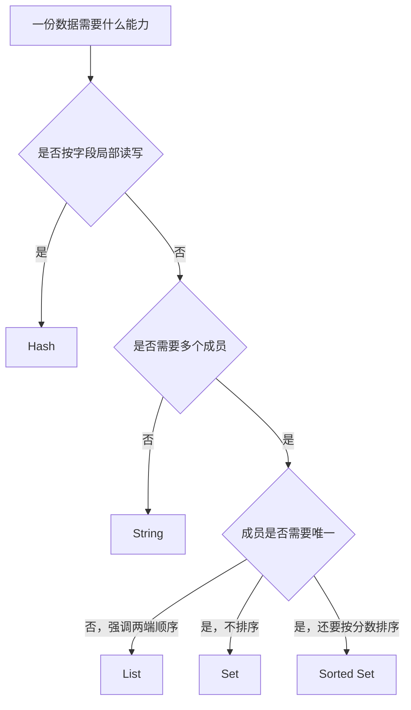
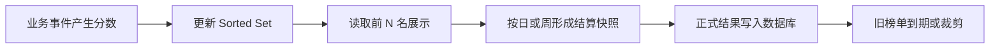
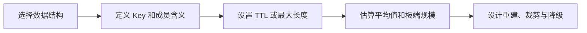

# 第 02 篇：核心数据结构与场景：String、Hash、List、Set 与 ZSet

> 阅读定位：这一篇只讲最常见的五种结构。你不需要背完整命令参数，重点是看到一份业务数据时，能判断它更像“一个值、一张资料卡、一条队伍、一份去重名单，还是一张排行榜”。

## 为什么 Redis 不只有一种 Value

假设家里所有东西都只能装进完全一样的纸箱：书、衣服、调料和正在排队的快递全部混在一起。虽然理论上都能装进去，但每次查找、去重、排序都会非常麻烦。

Redis 的不同数据结构，就像提前准备好的不同收纳工具：

- String 是贴着标签的单个盒子。
- Hash 是有多个字段的资料卡。
- List 是有前后顺序的队伍。
- Set 是不会出现重复名字的名单。
- Sorted Set 是每个人都带着分数的排名表。

数据结构不是为了让名词更多，而是让 Redis 直接理解你需要的操作。选对以后，增加计数、判断成员、维护排名等动作可以由 Redis 原子完成；选错以后，应用可能反复读取整个大对象再自己计算。

## 先看数据的形状

Redis 的价值不只是读写快，还在于它提供不同形状的容器。String 像一个值，Hash 像资料卡，List 像排队通道，Set 像不重复名单，Sorted Set 像带分数的排行榜。

选结构时不要先问“哪个命令我会”，而要问：是否需要局部字段、是否需要顺序、成员能否重复、是否要按分数查询，以及单个集合会增长到多大。



第一次选型可以依次问五个问题：

1. 这是单个值，还是一组成员？
2. 如果是对象，是否经常只修改其中一个字段？
3. 如果是多成员，成员能不能重复？
4. 是否需要保留插入先后或从两端取数据？
5. 是否需要按分数、时间或优先级排序？

这些问题比“String 和 Hash 哪个性能更好”更重要。没有脱离业务形状的绝对最佳结构。

## String：最通用的单值容器

String 可以保存文本、数字、二进制内容或序列化对象。文章详情缓存、开关、计数器、令牌和简单状态都常用 String。

它不是只能保存文字。应用对象通常先转成 JSON 等字节内容，再放入 String；整数形式的 String 又可以原子增加和减少。

### 用盒子理解 String

一个 String Key 对应一个完整 Value。你可以把它想成一个贴着门牌号的盒子：Redis 不理解盒子里的 JSON 字段是什么意思，但可以快速把整个盒子交给应用。

例如文章详情包含标题、摘要和作者。应用可以先把对象序列化成 JSON，再把整段内容放入一个 String。读取时一次拿回，适合“总是整份读取”的缓存。

```redis
SET cache:article:1001 "文章详情"
GET cache:article:1001

SET article:1001:views 0
INCR article:1001:views
```

这段命令分成两组：

- 第一组把文章内容作为一个完整值写入并读取。
- 第二组先把阅读量设为 0，再通过 INCR 增加 1。

INCR 不是“应用先 GET、加一、再 SET”，而是 Redis 内部直接增加。并发请求不会因为都读到同一个旧值而互相覆盖，这就是使用专用原子命令的价值。

单次 INCR 是原子的，多个请求同时增加不会互相覆盖。但“读取库存、判断、扣减”仍然是多个步骤，需要 Lua、事务或数据库约束。

把整个对象序列化成 String 的优点是一次读取方便，缺点是修改一个字段也要读写整个对象。结构变化时还应加入版本，避免旧缓存无法解析。

String 也不能无限大。超大文章、图片和文件应放在数据库、对象存储或文件系统，Redis 只保存摘要、地址或热点结果。

### String 常见的三种用法

| 用法 | Value 长什么样 | 例子 | 注意点 |
| --- | --- | --- | --- |
| 普通值 | 一小段文本或状态 | 功能开关、短期令牌 | 通常要明确 TTL |
| 数字计数 | Redis 可识别的整数或浮点形式 | 阅读量、限流次数 | 正式结算仍需可靠来源 |
| 序列化对象 | JSON、MessagePack 等字节 | 文章详情缓存 | 修改一个字段也要重写整份对象 |

不要把序列化对象当成数据库文档随意无限增长。读取一个 Key 的定位可能很快，但复制、传输和解析一个几 MB 的 Value 仍然昂贵。

## Hash：一张可以局部修改的资料卡

Hash 由多个字段和值组成，适合字段数量可控、经常局部读取或更新的对象。例如用户简要资料、文章统计和配置项。

如果 String 像一个封好的快递箱，Hash 就像一张表格卡片。你可以只查看“姓名”这一格，也可以只修改“状态”这一格，不必每次重写整张卡片。

```redis
HSET user:1001 name "张三" role "editor" status "active"
HGET user:1001 name
HGETALL user:1001
```

逐行理解：

- HSET 在 `user:1001` 这张资料卡里写入 name、role、status 三个字段。
- HGET 只读取 name 字段。
- HGETALL 读取所有字段和值，只适合字段数量和结果大小可控的 Hash。

与完整 JSON String 相比，Hash 可以只修改一个字段，不必重写整个对象。但它不提供数据库表那样的字段类型、外键和复杂查询，字段含义仍由应用维护。

String 对象和 Hash 经常让小白纠结，可以这样判断：

| 情况 | 更自然的选择 |
| --- | --- |
| 总是整份读取和替换，结构由应用序列化 | String |
| 经常只读取或更新某几个字段 | Hash |
| 需要复杂筛选、关联、唯一约束和历史审计 | 数据库，而不是仅靠 Redis |

Hash 字段和值最终仍是字节内容。Redis 不会因为字段名叫 age 就自动验证它必须是整数，也不会因为字段名叫 role 就理解权限规则。

传统 TTL 作用于整个 Hash Key，不会因为某个字段被读取就自动续期。Redis 7.4 之后支持字段级过期，但要确认实际版本和客户端。

不要用一个 Hash 保存“所有用户”。它会形成大 Key、单点热点和难以迁移的巨型容器。更常见的是一个业务对象对应一个 Key，或者按可控范围分片。

为什么“所有用户一个 Hash”看起来省 Key，却通常不值得？因为这个容器会不停增长，删除、迁移、备份和热点访问都集中在一个 Key 上。省下一点门牌号管理成本，却把整个小区的人塞进同一间房。

## List：有顺序的双端队列

List 保存有顺序且可以重复的元素，适合从头尾放入或取出。最近浏览、简单任务队列和固定长度动态列表是常见场景。

把 List 想成一条可以从左边和右边操作的队伍：

- LPUSH、RPUSH 分别从左边或右边加入。
- LPOP、RPOP 分别从左边或右边取走。
- 同一个成员可以出现多次。
- 最擅长的是两端操作，不擅长在队伍中间反复找人。

```redis
LPUSH article:1001:recent-comments comment-3 comment-2 comment-1
LTRIM article:1001:recent-comments 0 99
LRANGE article:1001:recent-comments 0 9
```

这里表达的是把新评论放到头部、只保留最近一百条、读取前十条。真正评论正文仍应保存到数据库，List 可以只存评论 ID。

LTRIM 很重要，因为“最近评论”天然应该有上限。如果只 LPUSH 不裁剪，这条 List 会从最近列表悄悄变成永久历史库。

示例一次向 LPUSH 传入多个值时，Redis 会按参数依次压到头部，最终顺序可能与初看参数的直觉相反。真实项目应先定义“左边是最新还是最旧”，并用测试固定顺序，不要只凭命令名字猜。

List 支持阻塞等待，新任务到达前消费者可以休眠。但消费者取走任务后崩溃，简单 List 队列可能丢任务。需要确认、重试和消费组时，更适合 Stream 或专业消息队列。

从中间位置频繁查找或删除并不是 List 的强项。它适合两端操作，不适合把它当成任意下标都很快的数组。

List 可以做简单队列，但“能排队”不等于“可靠消息系统”。如果业务需要消费确认、失败接管、重试次数和消费组，应该继续评估 Stream；如果还需要复杂路由、长期堆积和成熟治理，则要评估专业消息队列。

## Set：不重复的成员名单

Set 中成员唯一，没有业务排序。它适合标签、黑名单、关注关系、已处理 ID 和集合交并差。

生活里最像 Set 的是活动签到名单：张三签到两次，名单中仍然只有一个张三。它最擅长回答“某人是否在名单里”“名单里有多少人”“两个名单有哪些共同成员”。

```redis
SADD article:1001:tags redis backend cache
SISMEMBER article:1001:tags redis
SCARD article:1001:tags
SINTER user:1001:follows user:1002:follows
```

逐行理解：

- SADD 添加标签，已经存在的成员不会重复增加。
- SISMEMBER 判断 redis 是否在标签集合中。
- SCARD 只返回成员数量，不需要把所有成员都传回应用。
- SINTER 计算两个关注集合的交集，也就是共同关注。

成员判断通常很快，集合运算也很方便。但两个巨大 Set 做交集时，Redis 仍要处理大量成员，操作成本与数据规模有关。

抽奖可以利用随机成员能力，但高价值抽奖还要记录资格快照、去重、审计和最终结果，不能只依赖一个会变化的 Set。

点赞关系如果只放 Set，Redis 丢失后可能无法证明谁点赞过。正式点赞关系通常写数据库唯一约束，Set 只作为加速索引。

Set 没有业务顺序。即使某次读取看起来按某个顺序返回，也不能依赖这个偶然顺序做页面展示。需要按时间或分数排序时，应使用 Sorted Set 或把正式时间保存在数据库。

## Sorted Set：成员唯一、分数排序

Sorted Set 中成员唯一，每个成员有一个分数。Redis 可以按成员查分数，也可以按分数或排名获取范围。

可以把它想成比赛成绩板：

- member 是参赛者，例如 article-1001。
- score 是成绩，例如热度 120。
- member 不重复，再次写入同一成员会更新它的分数。
- Redis 根据 score 维护顺序，因此能快速取前十名或某个分数区间。

```redis
ZADD ranking:article:daily 120 article-1001 80 article-1002
ZINCRBY ranking:article:daily 5 article-1002
ZREVRANGE ranking:article:daily 0 9 WITHSCORES
```

这三行分别表示：

1. 把两篇文章及初始分数放入日榜。
2. 给 article-1002 增加 5 分。
3. 按分数从高到低取第 0 到第 9 名，并同时返回分数。

它适合排行榜、热度榜、延迟任务索引和按时间排序的数据。分数表示什么必须提前约定：积分、热度、时间戳还是优先级。

同分成员仍会按确定规则排列，但如果业务需要“先达到分数的人排名更高”，就要把时间规则编码进模型或单独处理。

日榜、周榜和总榜应拆成不同 Key，并设置生命周期。一个永久增长的总榜会逐渐变成大 Key。

Sorted Set 可以把时间戳作为分数，用于查找“到某时间应该处理的任务”。但多个消费者领取任务时仍需原子操作，失败重试和任务事实也要由应用维护。

Score 使用浮点数表达。普通时间戳和常见积分通常没有问题，但极大整数、精确金额和复杂复合排序不能想当然地直接塞入 score。财务金额不应依靠浮点排名结果完成正式结算。

### 排行榜的一次完整生命周期



图中最后两步很关键。实时榜单可以由 Redis 快速维护，但涉及奖金、权益或审计的最终结果，应该冻结并保存到正式存储。

## 五种结构快速对照

| 结构 | 是否有顺序 | 是否去重 | 典型用途 | 常见误区 |
| --- | --- | --- | --- | --- |
| String | 单值 | 不适用 | 缓存、计数、令牌 | 把超大对象和文件塞进去 |
| Hash | 字段无业务顺序 | 字段名唯一 | 对象字段、状态卡 | 一个 Hash 装所有对象 |
| List | 有插入顺序 | 不去重 | 最近列表、简单队列 | 频繁操作中间位置 |
| Set | 无业务顺序 | 去重 | 标签、关系、成员判断 | 对巨大集合做全量运算 |
| Sorted Set | 按分数排序 | 成员去重 | 排名、时间索引 | 榜单无限增长或热 Key |

## 用真实需求再选一次

| 需求 | 推荐起点 | 原因 |
| --- | --- | --- |
| 缓存一篇完整公开文章 | String | 通常整份读取和替换 |
| 保存用户短期资料并局部更新状态 | Hash | 可以按字段读写 |
| 保存最近 100 个浏览记录 | List | 有顺序、允许重复、可从一端裁剪 |
| 判断用户是否拥有某标签 | Set | 成员唯一，擅长存在性判断 |
| 展示本周文章热度前 20 名 | Sorted Set | 成员带分数并按分数排序 |
| 保存正式点赞关系和创建时间 | 数据库为主 | 需要唯一约束、审计和可靠事实 |

最后一行提醒我们：数据结构选型不只是在五种 Redis 类型里选。有些需求的正确答案是数据库，Redis 只做辅助。

## 数据结构选对了也要限制规模

很多 Redis 事故不是“类型选错”，而是容器没有上限：最近列表不裁剪、排行榜不分周期、用户关系永远塞进一个 Set、对象缓存越来越大。

每个集合都应定义：最大成员数、是否分页、何时裁剪、历史数据放哪里、删除是否异步、是否可能成为热 Key。



可以把规模限制理解为给容器装“限位器”：

- 最近列表只保留最近 N 条。
- 日榜按日期拆 Key，并让旧日榜到期。
- 大关系集合按业务维度分页或分片。
- 缓存对象超过合理大小时不再整份缓存。
- 批量读取必须有页大小和最大返回量。

没有限位器的数据结构，早期看起来都很快；真正的问题往往在运行几个月、数据增长几百倍以后才出现。

## 小白最容易混淆的四组概念

| 容易混淆 | 区别 |
| --- | --- |
| String 对象与 Hash | 前者整份取放，后者适合字段级操作 |
| List 与 Set | List 保留顺序且可重复，Set 去重但无业务顺序 |
| Set 与 Sorted Set | 两者成员都唯一，后者额外维护 score 顺序 |
| List 队列与 Stream | List 适合简单两端队列，Stream 增加历史、消费组和待确认状态 |

## 本章小结

String 解决单值和计数，Hash 解决局部字段，List 解决双端顺序，Set 解决成员唯一和集合关系，Sorted Set 解决分数排序。

开发中不一定每天手写这些命令，但看到业务代码中的 Key、结构和操作时，应能判断它为什么使用这个类型、会不会无限增长、数据丢失后能否恢复。这比背命令完整参数更重要。
