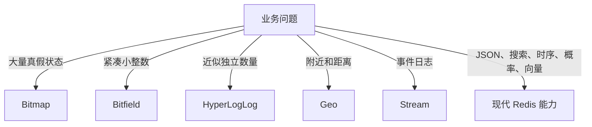
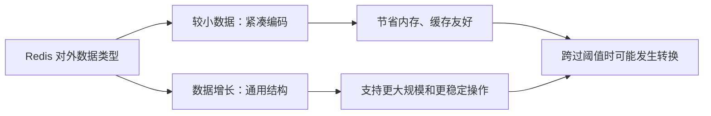
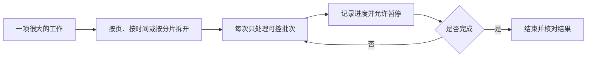

# 第 03 篇：扩展能力与性能直觉：Bitmap、HyperLogLog、Geo、底层结构与复杂度

> 阅读定位：这一篇分成两层。Bitmap、HyperLogLog、Geo 和 Stream 只需要知道“解决什么问题”；底层编码和复杂度只需要建立性能直觉。第一次阅读不要求记住所有名词。

## 先给自己一个减压规则

五种核心结构已经能覆盖大多数日常开发。扩展能力不是“学不会就不能用 Redis”，而是遇到特殊问题时多几个工具。

第一次阅读时，可以按下面优先级理解：

| 优先级 | 内容 | 学到什么程度 |
| --- | --- | --- |
| 必须理解 | Bitmap、HyperLogLog、Geo、Stream 的用途和边界 | 能看懂项目为什么选它 |
| 建议理解 | Bloom Filter 等概率结构 | 知道结果可能有误差 |
| 建立直觉 | SDS、listpack、quicklist、跳表 | 知道数据变大后内部实现会变化 |
| 知道存在 | JSON、Search、Time Series、向量等现代能力 | 真正使用前再查当前版本文档 |

不要在第一次学习时背内部阈值或所有命令。Redis 版本和配置会变化，真正稳定的是“数据形状、工作量和失败边界”。

## 为什么还需要扩展结构

五种核心结构能解决大多数业务，但一些问题很特殊：保存海量真假状态、估算独立访客、查询附近地点、做全文或向量搜索、保存时间序列。

Redis 对其中一些问题提供传统内置能力，另一些能力在早期通过 Redis Stack 模块提供，并在 Redis 8 的发行体系中逐步整合。使用前仍要确认服务端版本、云产品和客户端支持。



这些结构本质上是在回答不同问题：

- Bitmap 回答某个编号对应的开关是 0 还是 1。
- HyperLogLog 回答“大约有多少个不同的人”。
- Geo 回答“谁离这个坐标比较近”。
- Stream 回答“从某个位置以后发生了哪些事件”。

如果业务问题不是这些形状，就不要为了显得高级而强行使用扩展结构。

## Bitmap：把 String 当成一排开关

Bitmap 的每一位只有零和一，适合表示“某个编号对应的状态是否成立”。签到、活跃状态和布尔标记都很常见。

想象酒店前台有一排小灯，每盏灯代表某个房间是否已入住。普通做法可能为每个房间保存完整的“已入住”文字；Bitmap 只需要让对应位置亮起或熄灭，因此保存大量真假状态时很紧凑。

```redis
SETBIT signin:2026-08:user-1001 0 1
SETBIT signin:2026-08:user-1001 1 1
BITCOUNT signin:2026-08:user-1001
```

这段表示用户在本月前两天完成签到，再统计一共点亮多少位。

逐行理解：

- 第一个 SETBIT 把偏移量 0 设为 1，可以约定它表示本月第 1 天签到。
- 第二个 SETBIT 把偏移量 1 设为 1，表示第 2 天签到。
- BITCOUNT 统计这个 Bitmap 里一共有多少个 1，也就是签到天数。

“偏移量代表什么”完全由业务约定。今天用 0 表示 1 号，明天又用 1 表示 1 号，数据就无法解释。映射规则必须固定并写进文档。

Bitmap 很省空间，但编号必须相对连续。如果用户 ID 极大而且稀疏，为了设置一个很靠后的位，前面可能形成大量空洞。它本质上仍是 String，也会成为大 Key 或热 Key。

例如只有两个用户，ID 分别是 1 和 10 亿。直接把用户 ID 当位偏移，就要跨到非常靠后的位置。此时 Bitmap 不一定比 Set 更合适。省空间的前提是编号相对紧凑。

Bitmap 还要考虑分片。全站所有用户的每日活跃都放进一个 Key，可能形成一个巨大且很热的 Key；按日期、租户或可控编号区间拆分，通常更容易管理。

## Bitfield：在位中保存小整数

Bitfield 可以把连续几位组合成有符号或无符号小整数，适合设备状态、游戏属性和极度关注空间的计数。

它需要明确位宽、溢出方式和编号映射。普通企业对象不应该为了省一点内存全部压成位，否则可读性和迁移成本会很高。

可以把 Bitmap 看成每个抽屉只放“是或否”，Bitfield 则允许几个连续抽屉合起来保存一个小数字。例如用 4 位表示 0 到 15 的状态。

空间变小的代价是解释变复杂：哪几位代表等级、哪几位代表开关、数字溢出时是报错、截断还是环绕，都必须事先定义。对普通后台系统而言，Hash 往往更容易维护；Bitfield 更适合确实有大规模紧凑状态需求的场景。

## HyperLogLog：用误差换空间

HyperLogLog 用很小且相对稳定的空间估算不同元素数量，典型用途是统计网站 UV。

假设要统计今天有多少位不同访客。使用 Set 可以保存每个用户 ID，并得到精确人数；但访客达到几千万时，完整名单会占用大量内存。HyperLogLog 不保留可还原的完整名单，而是根据元素特征做概率估算。

```redis
PFADD uv:2026-08-04 user-1001 user-1002 user-1003
PFCOUNT uv:2026-08-04
```

它不会保存一份可以还原的完整用户名单，结果也存在小幅误差。因此适合趋势统计，不适合权限判断、抽奖名单和财务核对。

这意味着 HyperLogLog 能回答“今天大约有多少独立访客”，却不能回答“张三今天是否访问过”。需要成员明细或绝对精确数量时，应选择 Set、数据库统计或其他方案。

可以把它理解成通过会场门口的抽样装置估算来宾数量，而不是保存一份逐人签名表。估算很省空间，但不能拿去做奖金发放名单。

## Geo：附近查询，不是完整地图系统

Geo 保存经纬度并查找附近成员，适合门店、设备和服务点。

Geo 最像在地图上插入很多图钉，然后问“以某个位置为圆心，半径 5 公里内有哪些图钉”。Redis 会帮助完成附近成员和距离查询。

```redis
GEOADD stores 113.2644 23.1291 store-guangzhou
GEOADD stores 114.0579 22.5431 store-shenzhen
GEOSEARCH stores FROMLONLAT 113.3 23.1 BYRADIUS 150 KM
```

GEOADD 中先写经度，再写纬度，这个顺序很容易写反。示例先放入广州和深圳两个门店坐标，再查询目标坐标 150 公里范围内的门店。

Geo 能回答距离和附近，不能替代路线规划、道路约束、行政区多边形和专业 GIS。用户位置还属于敏感信息，需要控制精度、权限和保留时间。

直线距离近，不代表开车一定快；隔着河流、高速出口或行政边界时，真实路线可能完全不同。需要导航和路径规划时，应交给专业地图服务。

## 概率结构与现代数据能力

除了 HyperLogLog，Redis 生态还有 Bloom Filter、Cuckoo Filter、Count-Min Sketch、Top-K 和 t-digest 等概率结构。

概率结构共同的特点是：用更少空间换取一个可接受的近似答案。它们适合海量数据的快速预判和趋势分析，不适合需要一笔不错的正式事实。

- Bloom Filter：判断“一定不存在或可能存在”，常用于防缓存穿透。
- Cuckoo Filter：与 Bloom 类似，并支持一定形式的删除。
- Count-Min Sketch：近似估算元素出现频率。
- Top-K：维护近似热门项。
- t-digest：估算百分位数。

它们都使用可控误差换取空间，不应用于需要绝对准确的账务和结算。

### Bloom Filter 为什么经常和缓存一起出现

Bloom Filter 最常见的回答是：

- 它说“一定不存在”时，可以直接拒绝继续查询。
- 它说“可能存在”时，仍然要继续查询 Redis 或数据库。

可以把它想成小区门口的快速访客筛查：名单规则确认某人绝不可能属于本小区，就不必让管理员翻完整档案；筛查说“可能是”，仍要去正式名单核对。

它可能把不存在的人误判为“可能存在”，但正常设计下不会把真正存在的人判成“一定不存在”。新增数据、容量和误判率都需要提前规划。

Redis 8 发行体系进一步整合了 JSON、Search、Time Series 和概率结构，部分更新版本或产品还提供独立的向量数据能力：

| 能力 | 解决的问题 | 主要代价 |
| --- | --- | --- |
| JSON | 服务端理解和局部修改文档字段 | 文档与索引内存 |
| Search | 文本、数值、标签、地理和向量检索 | 写入时维护索引 |
| Time Series | 指标、采样、聚合和保留 | 需要定义时间窗口与降采样 |
| Vector Set | 向量相似度检索 | 维度、召回率和索引成本 |

这些能力不代表 Redis 应自动替代 Elasticsearch、向量数据库、文档数据库或时序数据库。数据规模、长期存储、查询复杂度、成本和团队经验仍要综合比较。

这部分第一次阅读只需要记住一句话：现代 Redis 已不只是五种基础结构，但越专业的查询能力，越需要额外索引、更多内存和版本兼容检查。真正准备使用时，再根据实际 Redis 版本和云产品文档确认。

## Stream 先认识，后面再讲可靠性

Stream 是带 ID 的追加日志，支持按位置读取和消费组。它比 List 队列多了历史、待确认消息和消费者恢复能力。

List 像把任务纸条放进盒子，取走后盒子里就少一张；Stream 更像一本按页码不断追加的值班日志。消费者可以记住读到哪一页，消息交出去但没有确认时也能留下待处理记录。

Stream 适合轻量事件和任务，但可靠消息还涉及 ACK、Pending Entries List、接管、幂等、重试和裁剪，第 07 篇会统一讲。

第一次看到 Stream 时，不要把它直接等同于 Kafka、RabbitMQ 等专业消息平台。是否适合，要看消息量、堆积时间、路由、跨地域、运维能力和业务可靠性要求。

## 数据结构只是外观，内部编码会变化

同一种 Redis 类型，内部不一定永远使用同一种实现。Redis 会根据元素数量、值大小和版本选择更紧凑或更通用的编码。

这就像同样叫“通讯录”，人少时可以写在一张卡片上，人多时要换成带索引的档案柜。对外都叫通讯录，但内部组织方式不同。



常见概念包括：

- SDS：Redis 字符串的动态表示，记录长度并预留扩展空间。
- 哈希表：Key 空间、Hash 和 Set 常用的查找结构。
- 渐进式 rehash：扩容时分批迁移哈希桶，避免一次搬完。
- listpack：小型 Hash、Sorted Set 等可能使用的紧凑连续编码。
- quicklist：List 常见的分段链式结构。
- 跳表：Sorted Set 用来支持按分数范围和排名查询。

具体转换阈值会随版本和配置变化，不需要背固定数字。稳定结论是：数据变大后，内存和操作成本可能发生变化。

### 这些底层名词分别在解决什么

| 名词 | 小白理解 | 主要价值 |
| --- | --- | --- |
| SDS | 比普通字符数组更了解自己长度的字符串表示 | 快速获取长度，支持扩展和二进制内容 |
| 哈希表 | 根据名字快速找到位置的索引柜 | 支持 Key、字段和成员快速查找 |
| 渐进式 rehash | 扩建档案柜时每天搬一部分 | 避免一次迁移所有桶造成长阻塞 |
| listpack | 把少量小元素紧凑排在连续空间 | 节省指针和对象开销 |
| quicklist | 把列表分段组织后再串起来 | 兼顾两端操作和内存效率 |
| 跳表 | 给有序成员增加多层快速通道 | 支持按分数范围和排名查找 |

记住用途即可，不需要靠这些名词手工控制每个 Key 的内部编码。错误做法是为了保持某种紧凑编码，硬把业务数据切成难以理解的形状。

## 时间复杂度还要乘以数据量

O(1) 表示操作次数不随集合规模线性增加，不代表网络返回也永远很小。获取一个 10 MB String，即使定位很快，传输和解析仍然昂贵。

O(N) 表示处理量通常与元素数量有关。获取全部集合、范围过大、集合交集和全量删除，都可能随着 N 增长。

Sorted Set 的查找和更新通常利用哈希表与跳表，能在较好复杂度下同时支持按成员和排名查询，但返回前一万名仍然要构造和传输一万条结果。

所以评估命令要看三个维度：定位成本、处理元素数量和响应字节数。

可以用快递来理解这三个维度：

1. 定位成本：仓库多久能找到货架位置。
2. 处理数量：要从货架上拿多少件商品。
3. 响应字节：最终要装多大的车送出去。

即使仓库一秒找到位置，要运走十吨货也不可能瞬间完成。

| 操作形态 | 需要继续追问 |
| --- | --- |
| GET 一个 String | Value 最大有多大，每秒读多少次 |
| HGET 一个字段 | 字段值多大，Hash 是否形成热 Key |
| HGETALL | 一共有多少字段，响应是否可控 |
| SMEMBERS | Set 有多少成员，是否应该分页或扫描 |
| ZRANGE 一段范围 | 范围多大，是否把几万项一次返回 |
| 集合交集 | 参与集合分别多大，是否阻塞主路径 |

## 渐进式处理是 Redis 的重要思想

Redis 在 rehash、Key 遍历、过期清理和异步释放等地方，都尽量把大工作拆成小步骤，避免长时间独占执行路径。

应用也应使用同样思路：分页读取、分批删除、按时间分 Key、控制 Pipeline 批量、限制搜索结果，而不是积累几年后一次清理。



这种思想不仅保护 Redis，也保护网络、应用内存和下游数据库。一次返回十万条数据，即使 Redis 没有阻塞，Node.js 进程也可能因为解析大响应而抖动。

## 第一次读完后需要记住什么

- 五种核心结构已经够用，不要为了高级而高级。
- Bitmap 适合紧凑真假状态，但编号稀疏会浪费空间。
- HyperLogLog 只给近似数量，不给完整成员名单。
- Geo 做附近查询，不做路线规划。
- 概率结构会有误差，不能承担账务和权限事实。
- Stream 像追加日志，可靠消费细节放到第 07 篇。
- 同一外部类型的内部编码可能随规模变化。
- 判断性能时要看元素数量和返回字节，不只看 O(1) 或命令名字。

## 本章小结

Bitmap、Bitfield、HyperLogLog 和 Geo 解决特殊数据形状，Stream 解决事件日志，现代 Redis 还扩展到概率、JSON、搜索、时序和向量能力。

开发者不必记住所有底层源码，但要知道 Redis 会使用紧凑编码、哈希表、quicklist 和跳表，并且任何操作最终都受元素数量和返回大小影响。看到一个看似简单的命令时，继续问“它要处理多少数据”，就抓住了性能判断的核心。
