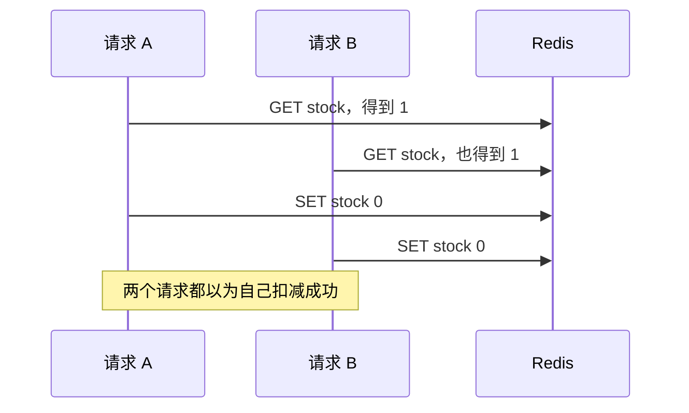
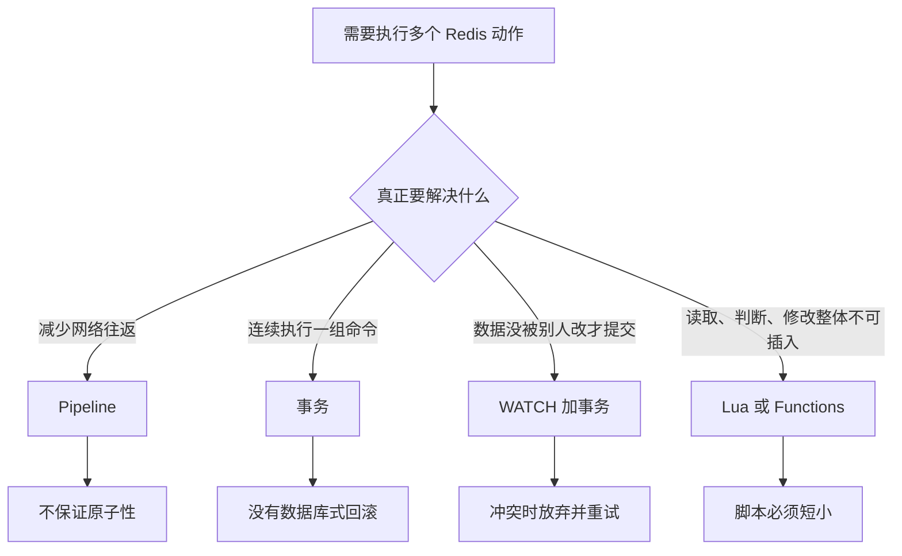
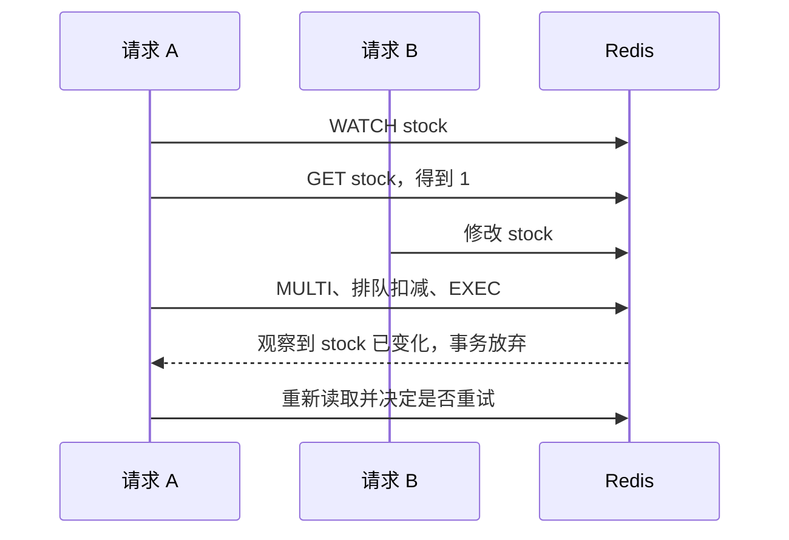
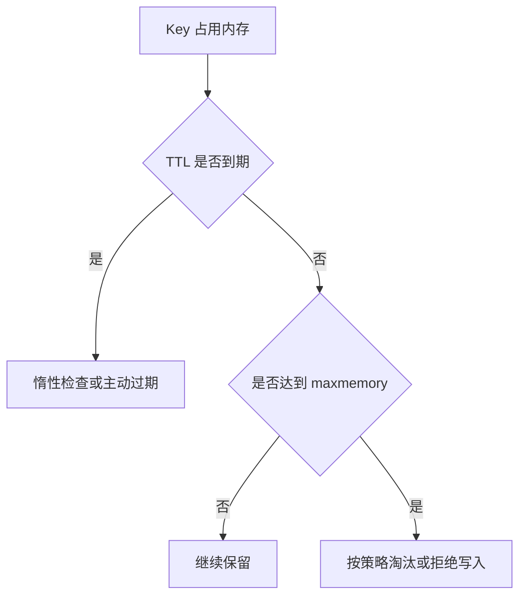

# 第 04 篇：原子操作与性能治理：事务、Lua、内存淘汰、大 Key 与热 Key

> 阅读定位：这一篇解决两个容易混在一起的问题。前半篇讲“多个请求同时操作时怎样避免互相踩数据”，后半篇讲“Redis 内存满了或某个 Key 太重时会怎样”。第一次阅读先抓住区别，不需要背八种淘汰策略。

## 先看一个最常见的并发错误

假设库存只剩 1：

1. 请求 A 读取库存，看到 1。
2. 请求 B 也读取库存，看到 1。
3. A 判断可以购买，把库存改成 0。
4. B 也判断可以购买，再把库存改成 0。

两个请求都认为自己成功，业务却卖出了两份。这不是 Redis 特有问题，而是“读取、判断、修改”被拆成多个步骤后产生的并发竞争。



如果只是 INCR、DECR、SADD 这样的单命令，Redis 可以在内部一次完成；如果业务包含“先判断再修改”，就要使用事务、WATCH、Lua、Functions，或者干脆让数据库约束承担最终正确性。

## 原子性不等于自动回滚

原子性首先表示一个操作执行时，其他普通命令不能从中间插入。它不自动表示里面每一步都成功，也不表示失败后全部撤销。

单个计数增加、集合加入和有序集合分数修改通常天然原子。但“先读取库存、判断大于零、再扣减”包含多个命令，两个请求可能同时看到同一个旧值。

### 原子性有三层，不要混在一起

| 层次 | 问题 | Redis 能否直接解决 |
| --- | --- | --- |
| 单命令 | INCR 执行到一半会不会被别的命令插入 | 普通单命令通常天然原子 |
| Redis 内多个步骤 | 读取、判断、修改能否作为整体执行 | 可用 WATCH、Lua、Functions 等 |
| Redis 与数据库之间 | Redis 扣减和数据库订单能否一起提交 | 不能靠普通 Redis 事务完成，需要业务事务、幂等和补偿 |

很多“用了 Redis 锁仍然出错”的问题，根源就是只解决了第二层，却把第三层也当成已经安全。



选择工具前先问一句：你到底要减少网络次数，还是要保护并发正确性？如果目标都没分清，很容易拿 Pipeline 当事务，或者拿 Redis 事务当数据库事务。

## Redis 事务做了什么

事务把命令先放入队列，提交后按顺序连续执行。执行期间其他普通命令不会插入这组命令中间。

可以把事务想成先把几张业务单装进一个文件夹，交给柜员后连续办理。它保证文件夹里的单据依次处理，不保证每张单据都一定合法，也不会在最后一张失败时自动把前面已经完成的业务倒回去。

```redis
MULTI
INCR article:1001:views
EXPIRE article:1001:views 86400
EXEC
```

这段只表示两个命令连续执行。若第二个命令在运行时因为类型错误失败，第一个增加可能已经生效，Redis 不会自动倒带。

示例中：

- MULTI 表示开始把后续命令放入事务队列。
- INCR 和 EXPIRE 先排队，不会在写下这一行时立刻执行。
- EXEC 提交队列，Redis 按顺序执行并返回每条命令的结果。

排队阶段就能发现的语法错误可能让事务无法提交；只有执行时才知道的类型错误，可能只让对应命令失败。应用需要检查每条结果。

DISCARD 只是丢弃尚未执行的命令队列，不是撤销已经执行的事务。

所以 Redis 事务更接近“连续执行的一组命令”，而不是关系数据库中带回滚、约束和隔离级别的完整事务。

## WATCH 是乐观锁

WATCH 观察一个或多个 Key。应用读取数据并准备事务期间，如果 Key 被其他客户端改过，提交会放弃，应用重新读取并重试。

“乐观”表示先假设冲突不多，不提前把其他人挡在门外。提交前发现数据被改过，就承认这次计算基于旧数据，主动放弃并重新来。



它适合冲突较少的场景。热点 Key 上大量请求会反复冲突，Lua 或重新设计数据模型可能更合适。

WATCH 只能观察 Redis 内部 Key，不能把 Redis 和数据库组成同一个跨系统事务。

重试也必须有上限和退避。热点竞争时所有请求立即无限重试，只会把冲突放大成流量风暴。

## Pipeline 只减少往返

Pipeline 让客户端一次发送多条命令，再批量读取结果。它像一次把十份材料交给窗口，减少来回跑十趟。

假设应用要读取 100 个互不相关的 Key：

- 不使用 Pipeline，可能经历 100 次“发送、等待、返回”。
- 使用 Pipeline，可以批量发送，再批量收结果，显著减少网络往返。

Redis 执行的命令数量没有凭空减少，主要省掉的是应用和 Redis 之间反复等待的时间。

Pipeline 不保证这些命令之间不会穿插其他客户端操作，也不保证全部成功。批量过大还会占用客户端和服务端缓冲区，产生大响应和超时。

因此 Pipeline 适合批量读取、批量写入和吞吐优化，不适合解决库存竞争和锁安全。

Pipeline 批量也要有限制。一次塞十万条命令，可能把网络往返从太多变成一个巨大请求和巨大响应，照样造成内存峰值和延迟抖动。实际项目应按数据大小压测批次，而不是照搬固定数字。

## Lua 和 Functions 组合短小规则

Lua 可以把读取、判断和修改放到 Redis 内部一次执行。下面是一个简化库存判断，只用于理解原理：

```lua
local stock = tonumber(redis.call('GET', KEYS[1]) or '0')
if stock <= 0 then
  return 0
end
redis.call('DECR', KEYS[1])
return 1
```

逐行理解：

1. GET 读取库存；没有这个 Key 时按 0 处理。
2. tonumber 把字符串库存转成数字。
3. 库存小于等于 0 时直接返回失败。
4. 有库存时执行 DECR。
5. 返回 1 告诉调用方扣减成功。

因为判断和扣减都在同一段短脚本里执行，其他普通命令不能在两步中间插入。这个示例只解决 Redis 内部的库存竞争，不代表订单数据库、支付和消息发送也自动成为一个事务。

脚本执行期间不会有普通命令插入，但脚本也没有数据库式自动回滚。如果前面已经写入，后面运行错误，之前写入可能保留。

长循环、大范围扫描和复杂计算会阻塞 Redis。Lua 适合毫秒级短规则，不适合完整订单流程、远程调用和大批量任务。

Functions 是较新版本提供的服务端函数管理方式，更适合版本化和复用，仍然遵守短小、确定和不可长时间阻塞的原则。

### 五种工具放在一起比较

| 工具 | 主要目标 | 是否原子 | 最常见误区 |
| --- | --- | --- | --- |
| 单命令 | 完成一个专用动作 | 通常是 | 把多步业务误当成单命令 |
| Pipeline | 减少网络往返 | 否 | 误以为批量发送就不会被穿插 |
| 事务 | 连续执行排队命令 | 事务执行段不被普通命令插入 | 误以为运行错误会全部回滚 |
| WATCH + 事务 | 数据未变化时才提交 | 冲突时放弃 | 热点下无限重试 |
| Lua / Functions | 原子组合短小判断和修改 | 执行期间不可插入 | 把完整业务流程塞进脚本 |

## 过期和淘汰不是一回事

过期解决“数据什么时候不再有效”，淘汰解决“内存满时删除什么”。

可以把 Redis 想成一家冷藏仓库：

- TTL 是商品自己的保质期，到期后商品不应再出售。
- 淘汰策略是仓库放满时的清货规则，即使商品还没到期，也可能为了腾位置被移走。

这就是为什么“设置了很长 TTL”不等于数据一定能活到那个时间。若实例允许淘汰，它可能因为内存压力更早消失。

Redis 通过访问时检查和后台主动过期清理到期 Key，不保证到期瞬间物理删除。内存接近 maxmemory 后，才会根据淘汰策略处理。



过期 Key 的清理通常由访问时检查和后台主动过期共同完成。这样可以避免专门为每个 Key 建一个精确闹钟，但代价是到期和物理内存回收之间可能存在短暂差异。

## 八类常见淘汰策略

第一次阅读不用背表。先记住三个问题：

1. 内存满时，是拒绝写入还是允许删除旧数据？
2. 如果允许删除，所有 Key 都能删，还是只删带 TTL 的 Key？
3. 选择谁删除，是参考最近访问、访问频率、剩余 TTL，还是随机？

| 策略 | 候选范围 | 大致思路 |
| --- | --- | --- |
| noeviction | 不淘汰 | 内存不足时拒绝增加内存的写入 |
| allkeys-lru | 所有 Key | 近似淘汰最近较少使用的数据 |
| volatile-lru | 仅有 TTL 的 Key | 在可过期数据中近似 LRU |
| allkeys-lfu | 所有 Key | 近似淘汰访问频率较低的数据 |
| volatile-lfu | 仅有 TTL 的 Key | 在可过期数据中近似 LFU |
| allkeys-random | 所有 Key | 随机淘汰 |
| volatile-random | 仅有 TTL 的 Key | 在可过期数据中随机淘汰 |
| volatile-ttl | 仅有 TTL 的 Key | 倾向淘汰剩余寿命较短的数据 |

LRU 和 LFU 通常是抽样近似，不是维护一张绝对精确的全局排行榜。

纯缓存实例常考虑 allkeys-lru 或 allkeys-lfu。会话、锁和任务状态不应被静默淘汰，noeviction 反而可能更合理。最好不要把可随意淘汰的缓存和不可淘汰状态混在同一实例。

混用的风险可以这样理解：同一个仓库里，一边放“卖完可重新进货的饮料”，一边放“丢失就无法补办的唯一凭证”。仓库管理员按热度清货时，很难用一条简单规则同时满足两类物品。

实例拆分不只是为了性能，也是在拆分数据责任和故障影响。

## maxmemory 不能等于机器总内存

Redis 还需要客户端缓冲、复制积压、AOF 缓冲、内存分配器、操作系统以及 fork 写时复制空间。若把 maxmemory 顶到物理内存边缘，快照或 AOF 重写期间可能被操作系统 OOM 杀死。

容量规划应计算 Key、Value、结构开销、增长、碎片、复制、持久化和故障余量，而不是只把业务正文大小相加。

例如机器有 16 GB 内存，并不表示可以把 maxmemory 直接设为 16 GB。Redis 进程和操作系统还要为连接、复制、持久化和临时内存峰值留出空间。具体余量要结合写入比例、持久化方式和实测，而不是使用一个适用于所有项目的百分比。

容量规划至少要看：

- 当前数据量和每天增长量。
- 平均 Key 大小与最大 Key 大小。
- TTL 到期速度和淘汰数量。
- 高峰连接数与输出缓冲。
- RDB、AOF 重写和复制期间的额外内存。
- 节点故障后流量集中到剩余节点的余量。

## 内存碎片

频繁创建和删除不同大小对象后，内存分配器可能留下空洞。Redis 逻辑数据内存已经下降，进程 RSS 仍然较高，这就是常见碎片。

可以把碎片想成停车场：空位总数看起来不少，但被零散分布在各处，新的大车找不到一块连续空间。Redis 已经删除了一些数据，不代表操作系统立即收回同等大小的物理内存。

部分版本支持主动碎片整理，但会消耗 CPU。不能只看到碎片率高就立即重启，要结合绝对内存、持续时间、业务延迟和系统剩余内存判断。

碎片率低也不一定健康：如果物理内存已经接近耗尽，哪怕比例看起来正常也危险。指标要结合绝对值、趋势和机器余量一起看。

## 大 Key、热 Key 和慢请求

大 Key 是单个 Key 保存的数据很多；热 Key 是流量集中到少数 Key；慢请求是应用看到的整条链路变慢。三者可能互相影响，但不是同一个问题。

用商场比喻：

- 大 Key 是一个顾客一次搬来几百箱货，单次处理很重。
- 热 Key 是所有顾客都挤到同一个窗口，即使每次只办小业务也会排队。
- 慢请求是顾客最终等得久，原因可能在窗口，也可能在停车、排队或付款网络。

| 问题 | 主要危害 | 常见治理 |
| --- | --- | --- |
| 大 Key | 阻塞、网络大响应、删除慢、迁移倾斜 | 拆分、分页、裁剪、异步释放 |
| 热 Key | 单节点 CPU 或带宽集中 | 本地缓存、CDN、请求合并、分片计数 |
| 慢请求 | 超时、重试、连接堆积 | 拆分客户端、网络和服务端耗时 |

大 Key 没有全球统一阈值。100 KB 每天读一次和每秒读一万次，风险完全不同。要同时看字节数、成员数、访问频率、最重操作和返回大小。

Cluster 能把不同 Key 分到不同主节点，不能自动拆开同一个热 Key。继续增加节点并不能解决所有热点。

### 三类问题可能组合出现

一个热门文章缓存既可能是热 Key，也可能因为正文和大量关联数据打包在一起成为大 Key。此时每秒大量请求都在传输一个大 Value，CPU、网络和客户端解析会同时承压。

治理要先识别主因：

- 大 Key 优先拆内容、限制范围、异步释放。
- 热 Key 优先用 CDN、本地缓存、请求合并或合理分片。
- 大响应优先分页、裁剪和只返回必要字段。
- 客户端连接慢则检查连接复用、连接池和网络路径。

## 慢日志不是完整接口耗时

Redis 慢日志主要记录服务端命令执行阶段，不包含客户端等待连接、网络传输、响应排队和应用解析。

例如接口耗时 500 毫秒，Redis 慢日志却没有记录，可能是：

- 客户端等待可用连接花了 300 毫秒。
- Redis 很快生成结果，但返回数据过大，网络传输花了很久。
- Node.js 进程事件循环繁忙，迟迟没有处理回调。
- 请求超时后被多层重试，整体时间被放大。

因此慢日志是服务端证据之一，不是整条调用链的唯一真相。

排查顺序可以是：

1. 确认受影响接口和时间段。
2. 检查最近发布、流量变化和重试。
3. 查看连接、网络、CPU、内存和延迟。
4. 查看慢日志、大 Key、热 Key 和大响应。
5. 检查持久化、复制、磁盘和故障切换。

压测也不能只看平均吞吐，要使用接近生产的数据大小、热点分布、Pipeline 批量和读写比例，并关注 P95、P99 和故障期间表现。

## 上线前的简单检查表

| 检查项 | 要回答的问题 |
| --- | --- |
| 原子性 | 是否存在读取后再判断和修改的多步竞争 |
| 工具选择 | Pipeline 是为了网络，Lua 是为了短小原子逻辑，是否用对 |
| 回滚预期 | 运行错误后，前面 Redis 写入是否会保留 |
| 内存 | maxmemory 是否留出系统、复制和持久化余量 |
| 淘汰 | 这类数据能否在内存满时被静默删除 |
| 大 Key | 最大成员数、最大 Value 和最大响应是多少 |
| 热 Key | 高峰流量是否集中到单个 Key |
| 慢请求 | 是否同时观察应用、网络、客户端和 Redis 服务端 |

## 本章小结

Pipeline 解决网络往返，事务解决连续执行，WATCH 解决乐观并发冲突，Lua 和 Functions 解决短小逻辑的原子组合。它们都不等于数据库事务。

过期、淘汰、碎片、大 Key、热 Key 和慢请求决定 Redis 能否长期稳定运行。掌握这些边界后，即使开发中只调用封装好的 Redis 服务，也能判断一次超时究竟应该改代码、数据模型还是基础设施。
