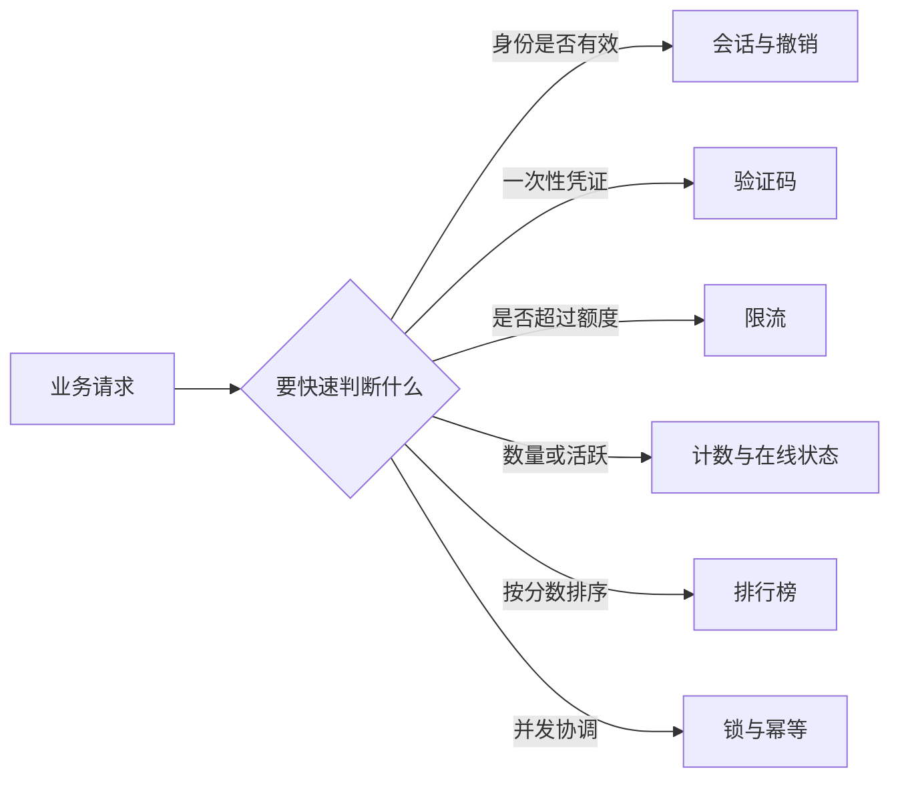
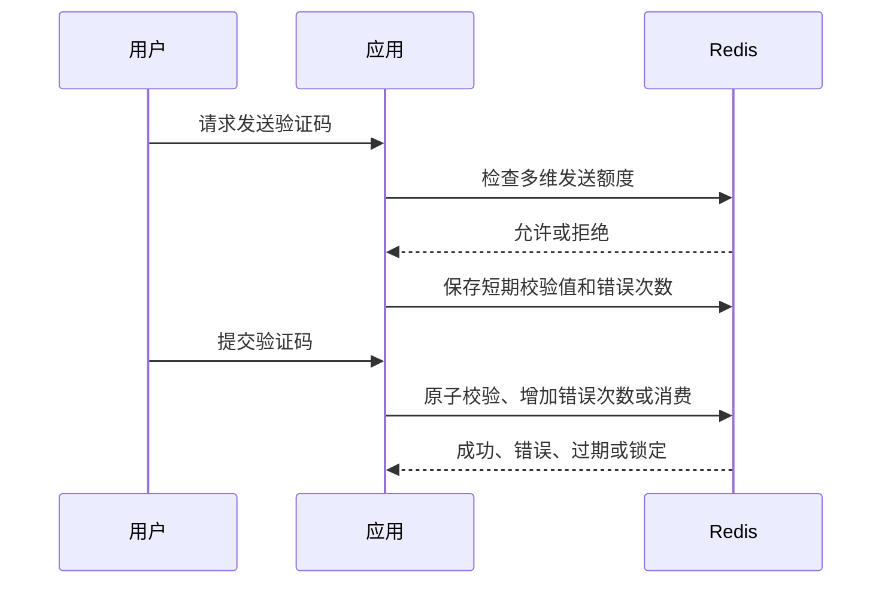
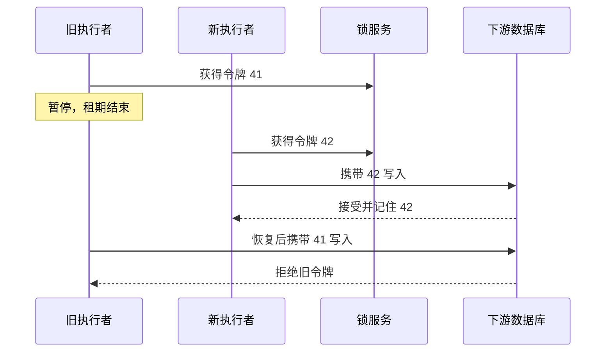

# 第 06 篇：业务场景与并发控制：会话、限流、分布式锁与幂等

> 阅读定位：这一篇不教你手写一套锁框架，而是帮助你看懂 Redis 为什么经常出现在登录、验证码、限流、计数和排行榜代码里，并分清“锁住并发”和“重复请求只生效一次”是两件事。

## 这些场景为什么有共同点

会话、验证码、限流次数和在线状态看起来毫不相关，其实都有三个共同特征：

1. 需要非常快地判断。
2. 通常有明确有效期。
3. 多台应用实例需要看到同一状态。

例如验证码只能活五分钟，限流次数只关心当前窗口，在线状态需要不断续期。这些短期状态正好适合 Redis 的共享内存、原子命令和 TTL。

但“适合放 Redis”不等于“只放 Redis 就万事大吉”。越接近付款、库存、权限和正式关系，越要有数据库约束、审计或状态机兜底。

## 为什么这些业务喜欢 Redis

会话、验证码、限流、阅读量、在线状态和排行榜都需要快速读写，而且通常有明确生命周期。Redis 的数据结构、原子命令和 TTL 很适合这些短期判断。



先把常见数据按正确性要求排个层次：

| 场景 | 能否接受短暂误差 | Redis 丢失后的主要风险 |
| --- | --- | --- |
| 在线状态 | 通常可以 | 少量用户暂时显示离线 |
| 阅读量 | 通常可以 | 丢失一小段增量 |
| 排行榜展示 | 视业务而定 | 实时榜单短暂不准 |
| 验证码和会话 | 安全策略决定 | 用户需重新验证或高风险请求被拒绝 |
| 库存、余额、支付结果 | 通常不可以 | 超卖、错账或重复扣款 |

因此，同样使用 Redis，故障时的处理方向完全不同。

## 服务端会话与令牌撤销

服务端会话让浏览器只携带随机会话 ID，Redis 保存用户、设备、登录时间和有效期。退出时删除会话即可立即失效。

可以把会话 ID 想成寄存柜小票。浏览器拿着一串随机编号，真正的用户身份和权限摘要放在 Redis。服务端收到小票后查询 Redis，确认它是否存在、是否过期、属于哪个用户。

会话 Key 可能类似：

```redis
SET session:random-session-id "用户与设备摘要" EX 1800
```

这行只表达“保存一个 30 分钟有效的会话”。真实项目不会把可预测的用户 ID 直接当会话令牌，也不会把密码等敏感信息放进 Value。

自包含令牌可以在不查 Redis 的情况下验证签名，但退出登录、封禁用户、修改密码和角色变化仍可能需要撤销名单或用户权限版本。

服务端会话和 JWT 等自包含令牌不是简单的先进与落后：

| 方式 | 优点 | 主要难点 |
| --- | --- | --- |
| 服务端会话 | 可立即撤销，状态集中 | 每次校验依赖会话存储 |
| 自包含令牌 | 验签后可本地读取声明 | 提前撤销和权限变化传播更复杂 |
| 自包含令牌加版本或撤销状态 | 兼顾部分本地验证与集中撤销 | 仍要设计 Redis 不可用时的安全策略 |

滑动会话每次访问都会续期，但必须同时设置绝对最长寿命，否则被盗会话可能通过持续访问永远有效。

Redis 不可用时，公开浏览可以继续；高风险后台操作如果无法确认撤销和权限状态，通常应谨慎失败。失败时放行还是拒绝，是业务安全决策。

“谨慎失败”也叫 fail closed：无法确认安全时拒绝操作。“保守放行”常叫 fail open：依赖不可用时暂时允许。公开文章浏览和管理员改权限显然不应使用同一策略。

## 验证码不只是设置 TTL

一个安全验证码流程至少包含：

- 手机号、账号、设备和网络来源的发送频率限制。
- 较短有效期。
- 错误尝试次数限制。
- 校验值脱敏或哈希保存。
- 校验成功后一次性消费。

校验与删除必须原子完成，否则两个并发请求可能同时使用同一个验证码。

仅仅执行 `SET code 123456 EX 300` 远远不够。攻击者可以反复请求发送、无限尝试、在多个设备并发验证，甚至利用日志泄露验证码。



一次完整验证通常有四种结果：

- 成功：验证码正确，并在同一个原子动作中消费。
- 错误：增加失败次数，还可继续尝试。
- 锁定：错误次数达到上限，剩余有效期内不再允许尝试。
- 过期：Key 已不存在，需要重新发送。

“比较验证码”和“删除验证码”如果分成两个命令，两个并发请求可能都在删除前读到正确值。生产实现通常使用短 Lua、事务能力或经过验证的封装把校验、计数和消费组合起来。

## 五类常见限流算法

限流不是为了惩罚用户，而是把下游能承受的流量变成明确规则。它像景区入口控制每分钟放多少人，避免所有人同时挤进狭窄通道。

| 算法 | 思路 | 优缺点 |
| --- | --- | --- |
| 固定窗口 | 每个整分钟或整小时计数 | 简单，但窗口边界可能突发 |
| 滑动日志 | 保存窗口内每次请求时间 | 精确，但记录量大 |
| 滑动计数 | 对相邻窗口按比例估算 | 空间较小，结果近似 |
| 令牌桶 | 稳定补充令牌，请求消耗令牌 | 允许受控突发 |
| 漏桶 | 请求排队并按稳定速度流出 | 保护下游，但需要背压队列 |

### 用一分钟 100 次理解固定窗口

假设限制每个用户每分钟最多 100 次：

- 12:00:00 到 12:00:59 使用一个计数 Key。
- 每次请求原子增加计数。
- 第一次增加时设置窗口 TTL。
- 计数超过 100 就拒绝。

它简单，但用户可以在 12:00:59 发 100 次，又在 12:01:00 发 100 次，短短两秒通过 200 次，这叫窗口边界突发。

### 令牌桶为什么允许突发

令牌桶像一个按固定速度补充门票的盒子。请求必须拿到一张票才能通过，盒子可以提前积累少量票，所以安静一段时间后允许一小波突发；长期平均速度仍受补票速率限制。

### 漏桶为什么更平滑

漏桶更像排水口。请求先进入队列，再按稳定速度流出。它可以保护下游，但如果入口长期大于出口，就必须决定队列上限、等待超时和丢弃策略。

读取当前计数、判断额度、增加计数和首次设置 TTL 应原子完成。简单地先读取再增加会被并发请求同时通过。

限流维度也很重要：只按网络来源会误伤共享出口，只按用户无法保护全局下游。常见设计同时存在用户、租户、接口和全局额度。

限流 Key 还要防止维度爆炸。若攻击者可以随意构造数百万个用户名或参数，每个都创建一个 Key，限流系统本身会被拖垮。输入校验、Key 数量监控和外围网关限制同样重要。

## 计数器的准确性不同

阅读量允许短暂误差，可以先在 Redis 分片累计，再定期幂等写回数据库。点赞数背后还有“谁点过赞”的关系，正式事实应由数据库唯一约束保存。库存和余额更不能只依靠 Redis 计数。

“数字”看起来都一样，业务含义却不同：

| 数字 | 允许误差 | 推荐事实来源 |
| --- | --- | --- |
| 页面浏览次数 | 常允许少量误差 | Redis 增量加定期落库 |
| 点赞展示数量 | 可短暂延迟，但关系不能错 | 数据库关系为准，Redis 加速数量 |
| 商品可售库存 | 通常要求严格 | 数据库约束或可靠库存系统 |
| 账户余额 | 不允许靠近似值 | 账务数据库和审计流水 |

极热计数器可以拆成多个分片，写入分散，读取时汇总。代价是实时结果可能有短暂误差。

分片计数像把一个收银台拆成十个小票箱。写入压力分散了，查看总数时却要把十个箱子相加。它解决热点，代价是读取更复杂。

## 在线状态依赖心跳

用户关闭电脑时，服务端不一定收到可靠离线通知。客户端通常周期性发送心跳，Redis 在线标记使用较短 TTL，若连续几个周期没有续期就视为离线。

不能只依赖“退出时删除在线标记”，因为断网、浏览器崩溃和电脑关机都可能来不及发送退出请求。TTL 像自动熄灭的信号灯：只要心跳持续就续亮，心跳停止一段时间后自然熄灭。

在线状态是近似值。网络抖动、多设备登录和跨区域延迟都会影响结果，不能把集合成员数当成绝对精确在线人数。

多设备用户还要决定：任意设备在线算在线，还是分别展示每台设备。数据模型不同，Key 和过期策略也会不同。

## 排行榜必须定义分数

Sorted Set 很适合日榜、周榜和热榜，但要提前定义分数含义、同分规则、周期、时间衰减和重建来源。

例如文章热度不是简单的阅读量，可能由阅读、点赞、收藏、评论和时间衰减共同计算。公式改变后，旧榜单能否重算，取决于原始事件是否还在数据库或日志中。

奖金结算等正式结果需要冻结并写入数据库，Redis 实时榜单只作为快速展示。否则 Redis 故障、作弊流量和分数公式变化都会影响最终结果。

日榜和周榜通常使用不同 Key，旧榜单设置较长但有限的 TTL。总榜如果长期存在，也要控制成员数量和冷成员清理，不能无限增长。

## 分布式锁解决什么

多个应用实例可能同时重建缓存、执行定时任务或修改同一资源。Redis 锁用于让一段时间内只有一个执行者获得处理资格。

可以把分布式锁想成会议室门口唯一的一把临时钥匙。谁拿到钥匙，谁获得一段时间的使用资格；没有拿到的人等待、跳过或稍后重试。

它解决的是“多个进程谁先做”，不是“做的业务一定成功”，也不是“同一个请求永远不会重复”。

安全申请锁通常包含三个要素：不存在时才创建、写入唯一持有者令牌、设置租期。

```redis
SET lock:article:1001 random-owner-token NX PX 10000
```

NX 表示不存在时才写入，PX 表示租期。租期防止进程崩溃后锁永久不释放。

把四个部分拆开：

- `lock:article:1001` 是锁保护的资源。
- `random-owner-token` 是本次持有者的唯一身份，不能所有实例都写同一个固定值。
- NX 保证只有 Key 不存在时才能创建。
- PX 10000 设置 10 秒租期，避免持有者崩溃后形成永久死锁。

锁粒度应该围绕具体资源。锁住一篇文章的重建，不应让其他所有文章也排队。

释放时不能直接删除。执行者可能暂停超过租期，锁已被其他进程重新获得；旧执行者恢复后直接删除，就会删掉别人的锁。

安全释放需要比较令牌和删除在同一个原子脚本里完成：

```lua
if redis.call('GET', KEYS[1]) == ARGV[1] then
  return redis.call('DEL', KEYS[1])
end
return 0
```

这是 Redis 锁中最值得看懂的一小段代码：只有锁里的令牌仍然属于自己，才允许删除。

逐行看：

1. GET 读取当前锁里的持有者令牌。
2. 与调用者传来的令牌比较。
3. 相同才 DEL。
4. 不同就返回 0，表示这把锁已经不属于当前执行者。

比较和删除必须在同一个脚本中。若先 GET、确认相同，再单独 DEL，中间仍可能恰好过期并被别人重新获取。

## 锁过期后旧持有者仍可能继续

进程可能发生长时间垃圾回收、机器卡顿或网络分区。锁到期后新执行者已经获得锁，旧执行者恢复却继续写数据库，形成两个执行者。

续期机制可以降低正常长任务过期概率，但不能消除所有暂停。

续期像会议快结束时申请延长使用时间。它要求持有者仍然活着并能及时联系 Redis；如果进程暂停时间超过租期，续期来不及发生。

围栏令牌使用单调递增编号。每次获得锁拿到更大编号，下游存储只接受不小于自己已见最大编号的写入，从而拒绝恢复后的旧持有者。



围栏令牌要求下游参与校验。只在 Redis 里保存一个编号，下游不比较，仍然挡不住旧执行者。

围栏令牌的生成源也必须维持单调性。若 Redis 故障恢复后计数倒退，下游就无法只靠编号判断新旧。严格场景应使用能保证单调序列的可靠来源，并让数据库写入条件真正校验令牌。

Redis 主从复制通常是异步的。主节点刚创建锁就故障，而锁还没复制到新主时，新主可能再次把同一资源的锁发给别人。因此，对不能容忍双执行的核心业务，不能只把一个简单 `SET NX PX` 当成绝对互斥证明；应使用成熟方案，并由幂等、围栏或数据库约束保护最终结果。

## 锁和幂等不是一回事

锁减少同时执行，幂等保证同一个业务请求重复到达只产生一次有效结果。

快递单号是理解幂等的好例子。同一张订单因为网络超时被提交三次，系统应该识别它们属于同一个业务请求，而不是创建三个订单。

支付回调、消息消费、文章导入和表单提交都需要业务唯一键。正确顺序是先识别唯一键、占用处理权，再执行数据库事务，最后记录结果。不能先产生副作用，再检查是否重复。

Redis 可以保存短期幂等状态，但关键业务还需要数据库唯一约束和状态机，因为 Redis 标记可能过期、淘汰或在切换时丢失。

一个幂等记录通常不只是“有或没有”，还可能包含：

| 状态 | 含义 | 重复请求怎样处理 |
| --- | --- | --- |
| processing | 已有人正在处理 | 等待、查询状态或稍后重试 |
| succeeded | 已成功并有结果 | 直接返回原结果 |
| failed_retryable | 失败但允许重试 | 按策略重新占用 |
| failed_final | 最终失败 | 返回固定失败结果 |

如果只写一个永久 `done` 标记，无法处理执行中崩溃；如果 TTL 太短，旧请求可能在标记过期后再次产生副作用。


## 什么时候不需要锁

如果数据库唯一约束已经能安全拒绝重复创建，额外分布式锁可能只增加延迟。冲突很少时，乐观锁和重试也可能更简单。

锁的粒度应围绕单个订单、文章或任务，避免全局大锁让无关请求互相等待。

常见的替代方式包括：

- 数据库唯一索引拒绝重复订单号。
- 条件更新确保版本号或库存满足条件。
- 消息消费者使用业务事件 ID 幂等。
- 单节点进程内锁处理只发生在当前进程的竞争。

先使用最靠近正式数据的约束，再考虑 Redis 锁减少冲突，通常比把锁当第一选择更稳。

## 在知识库项目中怎样判断

| 场景 | Redis 的作用 | 最终兜底 |
| --- | --- | --- |
| 热门文章缓存重建 | 短锁让一个实例重建 | 旧值、回源限流和数据库 |
| 文章导入防重复 | 短期幂等和并发协调 | 数据库批次唯一键 |
| 阅读量增加 | 高速分片计数 | 幂等汇总到数据库 |
| 用户登录会话 | 快速校验和撤销 | 用户与权限事实在数据库 |
| 管理后台权限变化 | 权限版本快速失效 | 数据库角色、菜单和 RBAC |
| 定时发布任务 | 减少多个实例重复领取 | 数据库状态条件更新和任务幂等 |

## 第一次读完后记住六句话

1. 会话、验证码和限流都依赖 TTL，但安全策略不同。
2. 计数器是否能有误差，要由业务含义决定。
3. 在线状态靠心跳推断，不是绝对事实。
4. Redis 锁需要 NX、唯一令牌、租期和安全释放。
5. 锁过期后旧执行者可能继续，所以还要幂等或围栏。
6. 数据库唯一约束能解决的问题，不一定要再加分布式锁。

## 本章小结

会话、验证码、限流、计数和排行榜使用 Redis 的高速读写和 TTL；分布式锁使用原子创建、唯一令牌和租期协调多个执行者。

但锁会过期，Redis 状态也可能丢失，所以幂等、围栏令牌、数据库唯一约束和状态机仍然负责最终正确性。理解职责分工，比记住一个“加锁命令”更重要。
