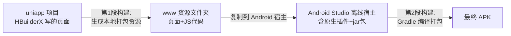

# 第 01 篇：uni-app 对接自定义 jar 包：HBuilderX、离线 SDK、Android Studio、原生插件

## 写在前面：先理解一个核心原理

在开始任何操作之前，必须先搞懂一个关键概念，否则后面每一步都会迷糊。

uniapp 生成 APK **不是一步完成的，而是两段构建拼出来的**：



**第一段**：在 HBuilderX 里点"生成本地打包 App 资源"，它产出一个 `www` 文件夹（里面是你的页面和 JS 代码），**这不是 APK**。

**第二段**：把这个 `www` 文件夹放到 Android Studio 工程里，连同你写的原生插件和 jar 包，用 Gradle 编译，才生成最终的 APK。

你要对接的 jar 包是 Java 写的，前端 JS 没法直接调用。解决办法是在 Android Studio 里写一个"原生插件 Module"，把 jar 包引进来，封装成方法，再让前端通过 `uni.requireNativePlugin` 调用。整篇指南就是围绕这个流程展开的。

---

## 第一阶段：装软件和准备资料

### 第 1 步：安装 HBuilderX 并记录版本号

去 DCloud 官网 <https://www.dcloud.io/hbuilderx.html> 下载 HBuilderX。安装完成后打开，点顶部菜单栏的"帮助"→"关于"，弹出的窗口会显示版本号，比如 `5.15.2026070813`。

**拿笔记下来**，后面下载 SDK 时必须和这个版本严格对应。

> 这一步是装写 uniapp 页面用的编辑器。版本号很重要，因为页面资源的编译版本和 Android SDK 的运行时版本必须匹配，不匹配运行时会报版本不一致的警告，正式交付前必须解决。

### 第 2 步：安装 Android Studio

去 <https://developer.android.com/studio> 下载安装。安装时保持默认选项，让它自动下载 Android SDK。装完第一次打开会下载 SDK 组件，耐心等。

Android Studio 自带了 Java 环境（叫 JBR），**不需要单独安装 Java**。但要记住安装路径，比如 `D:\CodeEditor\AndroidStudio`，后面要用到这个路径下的 `jbr` 文件夹。

> 这一步是装写原生插件和打包 APK 用的工具。Android Studio 自带的 JBR 就是 Java 运行环境，省去了单独配 Java 的麻烦。

### 第 3 步：下载匹配版本的 DCloud Android 离线 SDK

打开 <https://nativesupport.dcloud.net.cn/AppDocs/download/android.html>。页面上列出多个版本，找到和你 HBuilderX 版本对应的那一条，比如写着"HBuilderX（5.15.2026070915）对应的 Android 离线 SDK"，点下载。

下载后解压，里面有一个叫 `UniPlugin-Hello-AS` 的目录，这就是示例工程，后面所有操作都基于它。

> 这一步是拿 uniapp 的 Android 运行时和一个现成的示例工程。版本必须和 HBuilderX 对上，否则页面资源和运行时不匹配，轻则弹警告，重则功能异常。

### 第 4 步：收集 jar 包和设备资料

把需要对接的东西整理好，至少要有：

- jar 包文件（比如 `yxapi.jar`）
- jar 包的 API 文档（告诉你里面有哪些方法、参数是什么）
- 厂家的 Demo APK 或 Demo 源码（能跑起来看效果的参考）
- 目标设备信息：什么设备、Android 几、CPU 是 32 位还是 64 位

> 这一步是准备"原材料"。jar 包是你最终要调用的东西，文档告诉你怎么调，Demo 给你参考，设备信息决定打包时的兼容性配置。

---

## 第二阶段：固定应用身份

这一阶段的所有信息，必须在写代码之前就确定下来。身份信息一旦固定，后续不要随便改，否则会导致 AppKey 失效、无法覆盖升级等问题。

### 第 5 步：在 HBuilderX 新建 uni-app 项目并获取 AppID

打开 HBuilderX →"文件"→"新建"→"项目"→选"uni-app"→填项目名→选默认模板→点创建。

项目建好后，在左侧项目树找到 `manifest.json`，双击打开。在"基础配置"标签页里看到"AppID"，格式类似 `__UNI__807D0A1`。**记下来。**

> AppID 是这个应用在 DCloud 体系里的唯一身份证号，后面 DCloud 后台、Android 工程配置都要用到它，改来改去会乱套。

### 第 6 步：在 DCloud 后台创建证书

打开浏览器登录 DCloud 开发者中心 <https://dev.dcloud.net.cn/>，操作路径：

```
左侧"应用管理" → 找到你的应用 → 点应用名称进入
→ 左侧菜单"证书管理" → 点"创建证书"
```

选 Android 平台，点创建，等一两分钟生成完成。刷新页面后点"下载"，把证书文件（`.keystore`）保存到电脑上。然后点"证书详情"，看到这些信息：

- 证书别名（keyAlias）
- 证书密码
- SHA-1 指纹
- SHA-256 指纹

**全部记下来**，密码属于敏感信息，不要写进代码仓库或聊天记录。

> 证书就是给 APK 盖章的"公章"。没有它打出来的包没法正式使用，换了证书就没法覆盖升级旧版本。SHA-1 指纹后面用来生成 AppKey，必须和证书绑定。

### 第 7 步：确定 Android 包名

包名是 App 装到手机上的唯一标识，格式类似 `com.company.appname`，自己定一个，比如 `com.electronicclasssign.device`。

这个包名后面会出现在三个地方，必须完全一致：
1. Android Studio 工程 `app/build.gradle` 里的 `applicationId`
2. DCloud 后台"各平台信息"里填的包名
3. 最终 APK 的实际包名

> 包名就是 App 在手机系统里的"户口本名字"。同包名的 App 才能覆盖升级，包名变了系统会当成两个不同的 App。

### 第 8 步：在 DCloud 后台生成离线 AppKey

还在 DCloud 开发者中心你的应用页面里：

```
左侧"各平台信息"（旧版叫"离线打包Key管理"）→ Android App → 选"测试版"
```

填三项信息：

| 字段 | 填什么 |
|------|--------|
| 包名 | 第 7 步定的包名 |
| 应用签名 SHA-1 | 第 6 步证书详情里的 SHA-1 |
| 应用签名 SHA-256 | 第 6 步证书详情里的 SHA-256 |

提交后点"查看离线 Key"，生成一串 AppKey 字符串。**复制保存。**

> AppKey 是 DCloud 给你的"离线打包许可证"。它绑定了"AppID + 包名 + 证书 SHA-1"三者，任何一个对不上，APK 启动就报 AppKey 校验失败。所以前面三步的身份信息必须先固定好。

### 第 9 步：把证书文件放到工程里

把第 6 步下载的 `.keystore` 文件复制到示例工程的 `app` 目录下：

```
UniPlugin-Hello-AS/app/myapp.keystore
```

> 证书文件要放在 Android Studio 工程能找到的位置，后面 Gradle 构建时要用它给 APK 签名。

---

## 第三阶段：搭建 Android 离线宿主

"宿主"你可以理解为一个空壳 Android 工程，它的作用是装载你的 uniapp 页面和原生插件，最后打包成 APK。

### 第 10 步：导入示例工程到 Android Studio

打开 Android Studio →"File"→"Open"→ 找到 `UniPlugin-Hello-AS` 文件夹 →"OK"。

等待右下角进度条跑完（Gradle Sync），第一次可能要几分钟，因为要下载依赖。同步完成后底部不显示红色错误就对了。

> 这一步是把官方示例工程加载进来。先跑通官方的，确认你的环境没问题，再改成自己的。

### 第 11 步：先跑通官方 Demo 确认环境没问题

在 Android Studio 顶部确认运行配置选的是 `app`（不是 Gradle 临时配置）。连上手机（USB 调试 + 文件传输模式），点绿色运行按钮。如果手机上能装上并打开 DCloud 示例页面，说明环境没问题。

如果 Terminal 报 `JAVA_HOME is not set`，在 Terminal 里执行（路径换成你的 Android Studio 安装路径）：

```powershell
$env:JAVA_HOME = 'D:\CodeEditor\AndroidStudio\jbr'
$env:Path = "$env:JAVA_HOME\bin;$env:Path"
```

验证一下：

```powershell
java -version
```

能输出版本号就行。

> 这一步是"环境体检"。官方 Demo 都跑不起来，说明你的 Android SDK、Java 或 Gradle 有问题，先解决了再往下走，否则后面全是坑。

### 第 12 步：复制一份作为项目专用宿主

关掉 Android Studio。在文件管理器里把整个 `UniPlugin-Hello-AS` 文件夹复制一份，重命名为你的项目名，比如 `MyClassSign`。然后删掉这些缓存目录和文件：

```
MyClassSign/.gradle/
MyClassSign/.idea/
MyClassSign/.kotlin/
MyClassSign/local.properties
MyClassSign/app/build/
```

这些是上一台电脑或上一次构建的缓存，带过去会导致冲突。官方那份 `UniPlugin-Hello-AS` 留着不动，出问题时拿来对比。

删完后用 Android Studio 重新打开 `MyClassSign`，等 Gradle Sync 完成。

> 这一步是"分家"。官方工程留着当参照物，你自己的项目在副本上改，互不干扰。

### 第 13 步：配置 local.properties

打开工程根目录下的 `local.properties`（如果没有就新建）。写你的 Android SDK 路径：

```properties
sdk.dir=C\:\\Users\\你的用户名\\AppData\\Local\\Android\\Sdk
```

不知道路径在哪？Android Studio →"File"→"Settings"→"Languages & Frameworks"→"Android SDK"，里面的"Android SDK Location"就是。

> 这一步告诉 Gradle 你的 Android SDK 装在哪。这个文件是本机路径，每台电脑不一样，所以不能提交到代码仓库。

### 第 14 步：修改 app/build.gradle 的包名和版本

在 Android Studio 左上角把文件视图从"Android"切换成"Project"（这样才能看到完整目录结构）。打开 `app/build.gradle`，找到 `defaultConfig`，改成：

```gradle
android {
    namespace 'com.electronicclasssign.device'

    defaultConfig {
        applicationId "com.electronicclasssign.device"
        minSdkVersion 21
        targetSdkVersion 32
        versionCode 100
        versionName "1.0.0"
        multiDexEnabled true
    }
}
```

- `applicationId`：第 7 步定的包名，必须和 DCloud 后台填的完全一致
- `namespace`：通常和包名一致
- `versionCode`：整数，每次发布新版本必须比上一次大
- `versionName`：给人看的版本号

改完点右上角"Sync Now"。

> 这一步是给宿主"上户口"。包名要和 AppKey 绑定的一致，版本号每次升级必须递增，否则没法覆盖安装。

### 第 15 步：配置签名

在 `app/build.gradle` 里找到 `signingConfigs` 块，改成你的证书：

```gradle
signingConfigs {
    config {
        storeFile file('myapp.keystore')
        storePassword '你在DCloud后台看到的证书密码'
        keyAlias '你在DCloud后台看到的别名'
        keyPassword '你在DCloud后台看到的密码'
    }
}
```

然后确认 `buildTypes` 里 debug 和 release 都用这个签名：

```gradle
buildTypes {
    release {
        signingConfig signingConfigs.config
    }
    debug {
        signingConfig signingConfigs.config
    }
}
```

改完点"Sync Now"。

> 这一步是让 Gradle 知道用哪个证书给 APK 签名。debug 和 release 都用同一个证书，这样测试包和正式包的签名指纹一致，AppKey 都能通过校验。正式项目里密码建议用独立的 properties 文件管理，不写死在代码里。

### 第 16 步：验证签名配置

在 Terminal 里（确认 JAVA_HOME 设好了）执行：

```powershell
.\gradlew.bat :app:signingReport
```

输出里找到你配置的证书，核对 SHA-1 是不是和 DCloud 后台填的一致。看到 `BUILD SUCCESSFUL` 就对了。

**把这里输出的 SHA-1 和第 6 步 DCloud 后台的 SHA-1 对一下，必须完全一致。** 不一致说明签名配置没生效，后面 AppKey 会校验失败。

> 这一步是"对指纹"。签名没配对，APK 装上去启动就白屏或报 AppKey 错误，所以必须提前确认。

### 第 17 步：配置 AndroidManifest.xml 的 AppKey

打开 `app/src/main/AndroidManifest.xml`。找到 `<application>` 标签，在它的结束标签 `</application>` 之前加入：

```xml
<meta-data
    android:name="dcloud_appkey"
    android:value="你在第8步生成的AppKey字符串" />
```

如果示例工程里已经有一个 `dcloud_appkey` 的 meta-data，把它的 value 改成你的 AppKey，不要重复加。

> 这一步把 DCloud 发的许可证写进 APK。APK 启动时 DCloud 运行时会读这个值，和后台绑定的信息比对，对不上就拒绝启动。

### 第 18 步：配置 dcloud_control.xml

打开 `app/src/main/assets/data/dcloud_control.xml`，改成你的 AppID：

```xml
<hbuilder>
    <apps>
        <app appid="__UNI__807D0A1" appver="" />
    </apps>
</hbuilder>
```

> 这一步告诉宿主"启动哪个应用"。AppID 必须和你的 uni-app 项目一致。如果这里还指向示例的 AppID，哪怕你页面资源都复制对了，它也会启动错的应用。

---

## 第四阶段：创建原生插件 Module

这是对接 jar 包的核心。先打通一个最简单的 `sayHi` 方法，验证整条调用链没问题，再接入 jar 包。

### 第 19 步：新建 Android Library Module

在 Android Studio 里："File"→"New"→"New Module"→选"Android Library"→"Next"。填写：

| 字段 | 填什么 |
|------|--------|
| Module name | classsign_device |
| Package name | com.electronicclasssign.device |
| Language | Java |
| Minimum SDK | API 21 |
| Build Configuration Language | Groovy DSL (build.gradle) |

点 Finish。左侧项目树多了一个 `classsign_device` 目录。

> 这一步是创建一个独立的"插件模块"。它是一个 Android Library，专门用来写对接 jar 包的 Java 代码，和宿主工程分开管理，清晰好维护。

### 第 20 步：配置 Module 的 build.gradle

打开 `classsign_device/build.gradle`，把 `dependencies` 块替换成：

```gradle
repositories {
    flatDir {
        dirs 'libs'
    }
}

dependencies {
    // DCloud 核心 AAR —— 用 compileOnly，不打包进 APK（宿主已经有了）
    compileOnly fileTree(
        dir: '../app/libs',
        include: ['uniapp-v8-release.aar']
    )

    compileOnly 'androidx.recyclerview:recyclerview:1.0.0'
    compileOnly 'androidx.legacy:legacy-support-v4:1.0.0'
    compileOnly 'androidx.appcompat:appcompat:1.0.0'

    // fastjson 用 implementation，真正进 APK
    implementation 'com.alibaba:fastjson:1.2.83'

    // 测试依赖（创建 Module 时自动生成了测试代码，不加会报错）
    testImplementation 'junit:junit:4.13.2'
    androidTestImplementation 'androidx.test.ext:junit:1.1.5'
    androidTestImplementation 'androidx.test.espresso:espresso-core:3.5.1'
}
```

点"Sync Now"。

> 这里有个关键区别：DCloud 的 aar 用 `compileOnly`（编译时需要知道类定义，但不打包进 APK，因为宿主已经带了一份，打包两份会报重复类错误）；fastjson 用 `implementation`（你的 Module 自己用的，宿主里没有，要真正打包进去）。测试依赖那三行必须加，否则创建 Module 时自动生成的测试代码会编译报错。

### 第 21 步：配置混淆文件

打开 `classsign_device/proguard-rules.pro`，末尾加一行：

```
-keep public class * extends io.dcloud.feature.uniapp.common.UniModule{*;}
```

> 这行告诉混淆器：别动继承 UniModule 的类。Release 打包时会开启混淆，不加这行，类名会被改成 a.b.c，前端就调不到了。

### 第 22 步：写最小 sayHi 方法

在左侧项目树展开 `classsign_device`→`src`→`main`→`java`→`com.electronicclasssign.device`。右键这个包→"New"→"Java Class"，类名填 `ClassSignDeviceModule`，回车。内容替换成：

```java
package com.electronicclasssign.device;

import com.alibaba.fastjson.JSONObject;

import io.dcloud.feature.uniapp.annotation.UniJSMethod;
import io.dcloud.feature.uniapp.bridge.UniJSCallback;
import io.dcloud.feature.uniapp.common.UniModule;

public class ClassSignDeviceModule extends UniModule {

    @UniJSMethod(uiThread = true)
    public void sayHi(String name, UniJSCallback callback) {
        if (callback == null) {
            return;
        }
        JSONObject result = new JSONObject();
        result.put("success", true);
        result.put("message", "你好，" + name);
        callback.invoke(result);
    }
}
```

两条硬性规则：
- `@UniJSMethod(uiThread = true)` 注解必须加，否则前端调不到。`uiThread = true` 表示在 UI 线程执行
- 方法必须是 `public`，因为 uniapp 通过 Java 反射机制调用，非 public 的方法反射调不到

> 这一步写一个最简单的方法：接收一个名字，返回"你好，+名字"。它的作用是验证"前端 JS → Java → 回调返回前端"这条桥接链路是否通畅。先不碰 jar 包，排除两类问题同时排查的混乱。

### 第 23 步：注册插件到 dcloud_uniplugins.json

打开 `app/src/main/assets/dcloud_uniplugins.json`，在 `nativePlugins` 数组里加一项：

```json
{
  "nativePlugins": [
    {
      "type": "module",
      "name": "ClassSignDevice",
      "class": "com.electronicclasssign.device.ClassSignDeviceModule"
    }
  ]
}
```

- `type`：必须是 `module`
- `name`：前端调用时用的名字，记住它
- `class`：Java 类的完整路径，格式是 `包名.类名`

如果 JSON 里已有其他插件项，注意逗号语法：项之间用逗号分隔，最后一项后面不要逗号。

> 这一步是"登记造册"。DCloud 运行时根据这个配置表，把前端的 `requireNativePlugin('ClassSignDevice')` 映射到对应的 Java 类。没注册，前端调了也找不到。

### 第 24 步：让宿主 App 引用你的 Module

打开 `app/build.gradle`，在 `dependencies` 里加：

```gradle
implementation project(':classsign_device')
```

然后打开根目录 `settings.gradle`，确认有：

```gradle
include ':classsign_device'
```

新版 Android Studio 创建 Module 时通常会自动加，但确认一下。点"Sync Now"。

> 这一步让宿主工程知道"我依赖这个插件模块"。不声明依赖，宿主编译时不会把你的插件代码打包进 APK。

### 第 25 步：编译验证

在 Terminal 里先单独编译 Module：

```powershell
.\gradlew.bat :classsign_device:assembleDebug
```

看到 `BUILD SUCCESSFUL` 说明 Module 本身没问题。如果报 `程序包 org.junit 不存在`，回第 20 步检查测试依赖那三行都在。

再编译整个宿主：

```powershell
.\gradlew.bat :app:assembleDebug
```

`BUILD SUCCESSFUL` 说明你的 Module 已正确进入宿主编译链路。APK 在 `app/build/outputs/apk/debug/app-debug.apk`。

> 这一步是"编译体检"。先单独编译插件确认它本身没语法错误，再编译宿主确认依赖关系正确。分层验证，出了问题好定位是插件的问题还是宿主的问题。

---

## 第五阶段：打通最小调用链

### 第 26 步：在 HBuilderX 写测试页面

回到 HBuilderX，打开你的 uni-app 项目。在测试页面（或新建一个页面）里写：

```html
<template>
  <view style="padding: 20px;">
    <button type="primary" @click="testSayHi">测试原生插件</button>
    <view style="margin-top: 20px; padding: 15px; background: #f5f5f5; border-radius: 8px;">
      <text>{{ result }}</text>
    </view>
  </view>
</template>

<script>
const plugin = uni.requireNativePlugin('ClassSignDevice')

export default {
  data() {
    return {
      result: '点击按钮测试'
    }
  },
  methods: {
    testSayHi() {
      plugin.sayHi('电子班牌', (res) => {
        this.result = res.message
        uni.showToast({
          title: res.message,
          icon: 'none',
          duration: 2
        })
      })
    }
  }
}
</script>
```

`uni.requireNativePlugin('ClassSignDevice')` 里的 `'ClassSignDevice'` 必须和第 23 步注册的 `name` 完全一致，包括大小写。

> 这一步写前端页面。通过 `requireNativePlugin` 拿到插件对象，调用它的 `sayHi` 方法，用回调函数接收返回值。名字对不上就调不到，这是最常见的错误。

### 第 27 步：生成本地打包资源

在 HBuilderX 里："发行"→"原生App-本地打包"→"生成本地打包App资源"。

等编译完成，控制台输出路径类似：

```
你的项目/unpackage/resources/__UNI__807D0A1/www
```

**这一步只生成 www 文件夹，不是 APK。** 这就是"两次构建"的第一段。

> 这一步把你的 Vue/JS 页面编译成 Android 能识别的静态资源。HBuilderX 本身没有把资源编译成 APK 的能力，出 APK 那一步永远得靠 Android Studio。

### 第 28 步：复制资源到 Android 宿主

在文件管理器里找到 HBuilderX 生成的资源目录：

```
你的uniapp项目/unpackage/resources/__UNI__807D0A1/
```

把整个 `__UNI__807D0A1` 文件夹（包含里面的 `www`）复制到 Android Studio 工程的：

```
MyClassSign/app/src/main/assets/apps/
```

复制完后目录结构应该是：

```
app/src/main/assets/
├─ apps/
│  └─ __UNI__807D0A1/
│     └─ www/
└─ data/
   └─ dcloud_control.xml
```

三个必须检查的点：
1. `apps` 下的文件夹名和 `dcloud_control.xml` 里的 AppID 完全一致
2. `__UNI__807D0A1` 下面直接是 `www`，不要多套或少套一层目录
3. 如果 `apps` 下还有示例工程的旧 AppID 目录（比如 `__UNI__E`），暂时留着，验证成功后再清理

> 这一步是把前端资源"搬"到 Android 工程里。搬错了路径或 AppID 对不上，宿主启动时找不到页面，就白屏。这是最容易出错的一步，务必仔细检查目录结构。

### 第 29 步：重新构建 Debug APK

```powershell
.\gradlew.bat :app:assembleDebug
```

`BUILD SUCCESSFUL` 后，APK 在 `app/build/outputs/apk/debug/app-debug.apk`。

> 这一步是"第二次构建"，把前端资源和原生插件组装成 APK。每次改了前端页面都要重新走"生成资源→复制→构建"这个循环。

### 第 30 步：连接手机并运行

用 USB 线连上手机。手机上做两件事：
1. 开启"开发者选项"→开启"USB 调试"（一般是设置→关于手机→连点版本号7次）
2. 连上 USB 后，手机弹窗选"文件传输"模式（不是"仅充电"）

手机虽然开了 USB 调试，但如果 USB 用途是"仅充电"，电脑和 Android Studio 都看不到手机。必须切到"文件传输"。

在 Android Studio 顶部工具栏：
1. 确认运行配置选的是 `app`（不是 Gradle 临时配置）
2. 确认旁边的设备下拉框显示了你的手机型号

点绿色运行按钮。手机弹出"是否允许 USB 调试"就点"允许"。

> 这一步是真机调试。模拟器有时和真机行为不一样，尤其涉及硬件能力时必须在真机上验证。运行配置选错是常见问题——选成了 Gradle 配置就看不到设备。

### 第 31 步：验证 sayHi

App 启动后进入测试页面，点"测试原生插件"按钮。

如果弹出 Toast 显示 `你好，电子班牌`，**最小调用链打通了。**

如果点击没反应或报错，检查：
- `uni.requireNativePlugin('ClassSignDevice')` 的名字和 `dcloud_uniplugins.json` 里的 `name` 是否一致
- Java 方法的 `@UniJSMethod` 注解是否加了
- 方法是否是 `public` 的
- 第 28 步的 www 资源是不是最新复制过去的

> 这一步证明从前端 JS 到 Java 原生再到回调返回的整条桥接链路没问题。链路通了，后面接入 jar 包就只是在 Java 层加代码，不用担心桥接本身有问题。

---

## 第六阶段：引入 jar 包

### 第 32 步：把 jar 包放到 Module 的 libs 目录

找到你的 Module 目录 `MyClassSign/classsign_device/libs/`（没有 `libs` 文件夹就手动建一个）。把 jar 包复制进去，比如 `yxapi.jar`。

复制后用 SHA-256 核对，确认和原件一模一样：

```powershell
Get-FileHash classsign_device/libs/yxapi.jar -Algorithm SHA256
```

> 这一步把 jar 包放到插件模块能找到的位置。核对哈希是为了确认文件复制完整没损坏，后面出了问题可以排除"文件不对"这个原因。

### 第 33 步：用 javap 查看 jar 包的方法签名

在 Terminal 里执行：

```powershell
javap -classpath classsign_device/libs/yxapi.jar com.ys.rkapi.MyManager
```

`com.ys.rkapi.MyManager` 换成你 jar 包里实际的管理类全名。如果不知道类名，查 API 文档。

输出类似：

```
public static synchronized MyManager getInstance(android.content.Context);
public String getApiVersion();
public String getAndroidModle();
public String getAndroidVersion();
```

**把每个方法名和参数类型都记下来。** 写 Java 代码时必须严格按这个签名调，一个字母都不能改。比如厂家把 `getAndroidModel` 拼错成了 `getAndroidModle`，你必须用厂家拼错的那个名字，不能自作主张改正。

> 这一步是"摸清 jar 包的接口"。不看签名直接写代码，方法名拼错就编译不过；参数类型搞错就运行时崩。而且厂家文档和实际 jar 包可能有出入，以 jar 包实际签名为准。

### 第 34 步：配置 jar 包为运行时依赖

打开 `classsign_device/build.gradle`，在 `dependencies` 里加一行：

```gradle
// 厂家 SDK 必须进入最终 APK
implementation files('libs/yxapi.jar')
```

**关键：用 `implementation`，不用 `compileOnly`。** `compileOnly` 只在编译时能看到 jar 里的类，不会打包进 APK，运行时会报 `NoClassDefFoundError`（找不到类）。`implementation` 才会把 jar 真正打包进 APK。

点"Sync Now"。

> 这一步决定 jar 包是否进入最终 APK。用错依赖类型是最常见的"编译通过但运行崩溃"的原因——编译时找得到类，运行时 APK 里却没有。

### 第 35 步：写 getDeviceInfo 只读方法

打开 `ClassSignDeviceModule.java`，改成包含 jar 包调用的完整版本：

```java
package com.electronicclasssign.device;

import com.alibaba.fastjson.JSONObject;
import com.ys.rkapi.MyManager;

import io.dcloud.feature.uniapp.annotation.UniJSMethod;
import io.dcloud.feature.uniapp.bridge.UniJSCallback;
import io.dcloud.feature.uniapp.common.UniModule;

import android.content.Context;
import android.util.Log;

public class ClassSignDeviceModule extends UniModule {

    private static final String TAG = "ClassSignDevice";
    private MyManager manager = null;
    private boolean aidlBindingRequested = false;

    // 幂等初始化：重复进入页面不会重复绑定 AIDL
    private synchronized MyManager getOrCreateManager() {
        if (manager == null) {
            Context context = mUniSDKInstance.getContext();
            manager = MyManager.getInstance(context);
        }
        if (!aidlBindingRequested) {
            manager.bindAIDLService(mUniSDKInstance.getContext());
            aidlBindingRequested = true;
        }
        return manager;
    }

    @UniJSMethod(uiThread = true)
    public void sayHi(String name, UniJSCallback callback) {
        if (callback == null) return;
        JSONObject result = new JSONObject();
        result.put("success", true);
        result.put("message", "你好，" + name);
        callback.invoke(result);
    }

    // 只读设备信息——第一个接入厂家 jar 的方法
    @UniJSMethod(uiThread = true)
    public void getDeviceInfo(UniJSCallback callback) {
        if (callback == null) return;

        JSONObject result = new JSONObject();
        try {
            MyManager mgr = getOrCreateManager();

            JSONObject data = new JSONObject();
            data.put("apiVersion", mgr.getApiVersion());
            data.put("model", mgr.getAndroidModle());
            data.put("androidVersion", mgr.getAndroidVersion());
            data.put("firmwareVersion", mgr.getFirmwareVersion());
            data.put("firmwareBuild", mgr.getAndroidDisplay());
            data.put("firmwareDate", mgr.getFirmwareDate());
            data.put("cpuType", mgr.getCPUType());

            result.put("success", true);
            result.put("code", "SUCCESS");
            result.put("message", "设备信息方法调用成功");
            result.put("data", data);
            callback.invoke(result);

        } catch (RuntimeException e) {
            Log.e(TAG, "SDK调用失败", e);
            result.put("success", false);
            result.put("code", "SDK_CALL_FAILED");
            result.put("message", "厂家SDK调用异常");
            callback.invoke(result);
        } catch (LinkageError e) {
            Log.e(TAG, "SDK链接错误", e);
            result.put("success", false);
            result.put("code", "SDK_LINK_ERROR");
            result.put("message", "厂家SDK版本不兼容");
            callback.invoke(result);
        }
    }

    @Override
    public void onActivityDestroy() {
        if (manager != null && aidlBindingRequested) {
            try {
                manager.unBindAIDLService(mUniSDKInstance.getContext());
            } catch (Exception e) {
                Log.e(TAG, "AIDL解绑异常", e);
            }
            aidlBindingRequested = false;
            manager = null;
        }
    }
}
```

几个要点：
- `getOrCreateManager()` 做了幂等处理，重复进入页面不会重复绑定 AIDL 服务，避免内存泄漏
- `onActivityDestroy()` 在页面销毁时解绑 AIDL，释放资源
- 异常分两类：`RuntimeException` 是运行时调用失败，`LinkageError` 是 jar 版本不兼容
- 返回结构统一用 `success/code/message/data`，方便前端处理

> 这一步真正开始调用 jar 包。先只做一个只读方法（读设备信息），不做任何写入或控制操作。只读方法没有副作用，就算调错了也不会把设备搞坏。等只读链路稳定了，再逐步加写入和控制能力。

### 第 36 步：编译验证

```powershell
.\gradlew.bat :classsign_device:assembleDebug
```

`BUILD SUCCESSFUL` 说明 Java 编译器能通过 jar 包正确解析 `MyManager`。如果报 `Cannot resolve symbol 'MyManager'`，检查第 34 步的依赖配置和 Sync 是否做了。

再构建宿主：

```powershell
.\gradlew.bat :app:assembleDebug
```

> 分层编译验证：先确认插件模块本身能编译（jar 包的类能解析），再确认宿主能打包（依赖关系正确）。

### 第 37 步：验证 jar 包真的进了 APK

构建成功后，检查厂家类是否打包进去了：

```powershell
dexdump -l plain app\build\outputs\apk\debug\app-debug.apk | findstr "com.ys.rkapi.MyManager"
```

确认 `MyManager` 的定义数量为 1：
- 如果是 0 → jar 没打包进去，检查第 34 步是不是用了 `implementation`
- 如果大于 1 → 重复打包了，检查是不是 Module 的 libs 和 app 的 libs 都放了同一份 jar，只保留一份

> "编译成功"不等于"jar 进了 APK"。用 dexdump 检查是最可靠的验证方式。同一个类在 APK 里只能出现一次，多了会报重复类错误，少了运行时崩溃。

### 第 38 步：前端页面加 getDeviceInfo 按钮

回到 HBuilderX，测试页面加一个按钮：

```html
<template>
  <view style="padding: 20px;">
    <button type="primary" @click="testSayHi">测试原生插件</button>
    <button type="primary" @click="testGetDeviceInfo" style="margin-top: 10px;">读取设备信息</button>
    <scroll-view scrollY style="margin-top: 20px; padding: 15px; background: #f5f5f5; border-radius: 8px; max-height: 400px;">
      <text>{{ result }}</text>
    </scroll-view>
  </view>
</template>

<script>
const plugin = uni.requireNativePlugin('ClassSignDevice')

export default {
  data() {
    return {
      result: '点击按钮测试'
    }
  },
  methods: {
    testSayHi() {
      plugin.sayHi('电子班牌', (res) => {
        this.result = res.message
        uni.showToast({ title: res.message, icon: 'none', duration: 2 })
      })
    },
    testGetDeviceInfo() {
      plugin.getDeviceInfo((res) => {
        if (res.success) {
          this.result = JSON.stringify(res.data, null, 2)
        } else {
          this.result = '错误: ' + res.code + ' - ' + res.message
        }
      })
    }
  }
}
</script>
```

### 第 39 步：重新生成资源 + 复制 + 构建

每次改了前端页面，固定做这三步：

1. HBuilderX → 发行 → 原生App-本地打包 → 生成本地打包App资源
2. 把 `unpackage/resources/__UNI__807D0A1/` 整个复制覆盖到 `app/src/main/assets/apps/__UNI__807D0A1/`
3. Android Studio Terminal → `.\gradlew.bat :app:assembleDebug`

> 这三步是每次改页面的固定循环，缺一不可。只改了页面但没重新生成+复制，Android 打出来的还是旧页面。

### 第 40 步：普通手机验证

在 Android Studio 点绿色运行按钮装到手机上，点"读取设备信息"。

**在普通手机上方法可能返回数据**（比如手机品牌、系统版本），但这只证明 jar 包能加载、方法能调用。普通手机没有厂家固件，厂家专属字段（如固件日期、CPU 型号）可能是空的或默认值，这是正常的。

> 普通手机验证的是"桥接和调用链路"是否通畅，不是"厂家设备能力"是否可用。真正的厂家能力必须在目标设备上验证。

---

## 第七阶段：目标设备真机验证

### 第 41 步：准备 U 盘安装包

在 U 盘根目录创建一个全英文名的文件夹（中文路径可能导致旧 Android 系统安装失败），比如 `classsign_test`。把 `app-debug.apk` 复制进去，文件名也用纯英文，比如 `test.apk`。

复制后核对 SHA-256 确认文件完整：

```powershell
Get-FileHash E:\classsign_test\test.apk -Algorithm SHA256
```

> 用 U 盘是因为很多目标设备（如电子班牌、收银机）没法直接连电脑调试。全英文路径是防止旧版 Android 文件管理器处理中文路径时出问题。

### 第 42 步：检查 APK 和目标设备的兼容性

用 `aapt` 检查 APK：

```powershell
aapt.exe dump badging app-debug.apk
```

在输出里找到：
- `sdkVersion`：APK 支持的最低 Android API Level，不能高于目标设备的 API Level
- `native-code`：APK 包含的 CPU 架构，必须覆盖目标设备的架构

比如目标设备是 RK3288（32 位 ARM），需要 `armeabi-v7a`。如果 APK 只有 `arm64-v8a`，装上去会报笼统的"应用未安装"，实际原因是 `INSTALL_FAILED_NO_MATCHING_ABIS`。

> 这一步是"兼容性体检"。最低系统版本和 CPU 架构是两个硬门槛，不满足连装都装不上。打包成功不等于能装上，必须提前检查。

### 第 43 步：在目标设备上安装和验证

把 U 盘插到目标设备上，用文件管理器找到 `test.apk`，点击安装。打开 App：

1. 先点"测试原生插件"→ 应该显示 `你好，电子班牌`
2. 再点"读取设备信息"→ 应该返回目标设备信息

在 RK3288 班牌上返回的结果类似：

```
model: rk3288
firmwareVersion: 1.0
apiVersion: 2023-11-23
firmwareDate: 20230217
androidVersion: 22
cpuType: ARMv7 Processor rev 1 (v7l)
```

**到这里，从前端 JS 到 jar 包到目标硬件的完整调用链就打通了。**

> 这一步是"终极验收"。普通手机只能验证链路通畅，目标设备才能验证厂家能力是否真正可用。如果普通手机能返回数据但目标设备不行，问题通常在设备固件或 AIDL 服务绑定上。

---

## 后续能力扩展的安全顺序

打通只读链路后，如果要加更多能力（定时开关机、亮度调节等），严格按从低风险到高风险的顺序：

1. **只读信息**：设备信息、显示状态
2. **可恢复设置**：亮度调整（设完回读原值）、导航栏显示/隐藏、截图

每加一项能力，都走这个循环：Java 层加方法+参数校验 → 编译 → 改页面 → 生成资源 → 复制 → 构建 → 真机验证+记录返回值和设备行为。

### 几个关键的安全约束

**返回语义要诚实。** jar 包接口返回 `void` 或不可靠布尔值时，只能报告"命令已发送"，不能报告"已成功"。是否真正完成必须通过回读或现场行为验证，不能把"没抛异常"当作设备已执行成功。

**定时计划的方向性。** 周模式如果"开机晚于关机"，设备开机后可能补执行当天错过的关机任务，导致"开机几分钟又关机"。所以周模式必须强制开机时间小于关机时间，近时测试用带年月日的一次性模式。

**参数要双层校验。** 小时、分钟、星期、亮度、文件路径这些参数，前端 JS 校验一遍，Java 层再校验一遍。不能只靠前端，因为前端可以被绕过。

**密码不能写死。** 正式签名密码应该放在本机的 `signing.properties` 文件里，加到 `.gitignore` 中不提交仓库，不写进代码注释、聊天记录或构建日志。

**版本要统一。** HBuilderX 页面编译版本和 Android 离线 SDK 运行时版本必须匹配。不要通过升级 Gradle 或 AGP 来掩盖版本不一致的提示，正式交付前必须换成匹配版本。

---

## 常见问题速查

**HBuilderX 只生成 resources 没有 APK？** 正常。"生成本地打包 App 资源"只产出 www 文件夹，需要放到 Android 宿主里由 Gradle 编译才出 APK。

**AppKey 校验失败？** 依次核对：AppID、Gradle applicationId、AndroidManifest 里的 dcloud_appkey、最终 APK 签名 SHA-1、DCloud 后台绑定信息，五者必须完全一致。

**安装提示签名不一致？** 设备已有同包名、不同签名的 APK。不能直接覆盖，确认数据影响后先卸载旧包，或使用原签名重新构建。

**无法覆盖升级？** 必须满足相同包名、相同签名、versionCode 更大。仅提高 versionName 无效。

**Duplicate class（重复类）？** 同一个 jar 被 Module 的 libs、app 的 libs 或 AAR 内嵌重复携带。检查依赖树和 AAR 压缩内容，保证每个类只存在一份。

**JAVA_HOME 未设置？** 定位 Android Studio 自带的 `jbr` 目录，在当前 Terminal 临时设置 JAVA_HOME，再执行 Gradle。不用为此重新下载 Java。

**Gradle 出现旧 API、flatDir 警告？** 先判断是否阻止构建。不阻止的话记录版本即可，不要为了消除警告擅自升级 Gradle 或依赖，可能破坏旧设备兼容性。
