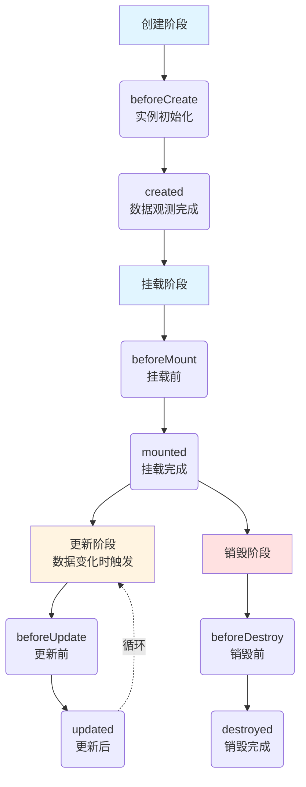

## Vue2生命周期的核心概念
Vue2组件的生命周期可以理解为**组件从创建到销毁的整个“生命旅程”**，Vue为这个旅程的关键节点提供了专属的“钩子函数”（生命周期钩子），你可以在这些钩子中编写自定义逻辑，比如在DOM渲染后请求数据、在组件销毁前清理定时器等。

Vue2的生命周期主要分为4个核心阶段，共8个核心钩子函数，整体流程如下：



### 各阶段&钩子函数详解（附代码示例）
下面用一个完整的Vue2组件示例，结合注释讲解每个钩子的执行时机、可操作内容和典型用途：

```vue
<template>
  <div id="app">
    <p>{{ message }}</p>
    <button @click="updateMsg">修改数据</button>
    <button @click="destroyComp">销毁组件</button>
  </div>
</template>
<script>
export default {
  data() {
    return {
      message: "Vue2生命周期演示",
      timer: null // 示例定时器
    };
  },

  // 1. 创建阶段 - beforeCreate
  beforeCreate() {
    console.log("1. beforeCreate 执行");
    console.log("data是否可访问：", this.message); // undefined
    console.log("DOM是否可访问：", this.$el); // undefined
    // 用途：几乎不用，此时实例刚初始化，数据和事件都未配置
  },

  // 2. 创建阶段 - created
  created() {
    console.log("2. created 执行");
    console.log("data是否可访问：", this.message); // Vue2生命周期演示
    console.log("DOM是否可访问：", this.$el); // undefined
    // 用途：初始化数据、发起异步请求（比如调接口拿数据）、监听事件（非DOM事件）
    this.timer = setInterval(() => {
      console.log("定时器运行中...");
    }, 1000);
  },

  // 3. 挂载阶段 - beforeMount
  beforeMount() {
    console.log("3. beforeMount 执行");
    console.log("DOM是否渲染完成：", this.$el); // 虚拟DOM（未挂载到页面）
    // 用途：可修改数据（不会触发额外的更新），但仍不能操作真实DOM
  },

  // 4. 挂载阶段 - mounted
  mounted() {
    console.log("4. mounted 执行");
    console.log("DOM是否渲染完成：", this.$el); // 真实DOM节点
    // 用途：操作真实DOM（比如获取DOM尺寸、绑定第三方插件）、发起依赖DOM的请求
    console.log("p标签内容：", document.querySelector("p").innerText); // Vue2生命周期演示
  },

  // 5. 更新阶段 - beforeUpdate
  beforeUpdate() {
    console.log("5. beforeUpdate 执行");
    console.log("更新前的DOM内容：", document.querySelector("p").innerText);
    // 用途：获取更新前的DOM状态，比如保存滚动位置
  },

  // 6. 更新阶段 - updated
  updated() {
    console.log("6. updated 执行");
    console.log("更新后的DOM内容：", document.querySelector("p").innerText);
    // 用途：操作更新后的DOM，但**禁止在此修改响应式数据**（会触发死循环）
  },

  // 7. 销毁阶段 - beforeDestroy
  beforeDestroy() {
    console.log("7. beforeDestroy 执行");
    console.log("实例是否可用：", this.message); // 仍可访问
    // 用途：清理副作用（清除定时器、解绑自定义事件、销毁第三方插件实例）
    clearInterval(this.timer);
  },

  // 8. 销毁阶段 - destroyed
  destroyed() {
    console.log("8. destroyed 执行");
    console.log("实例是否可用：", this.message); // 仍能访问，但已无意义
    // 用途：几乎不用，组件已完全销毁，所有监听、子组件都已移除
  },

  methods: {
    updateMsg() {
      this.message = "数据已更新"; // 触发更新阶段钩子
    },
    destroyComp() {
      this.$destroy(); // 触发销毁阶段钩子
    }
  }
};
</script>

```

### 关键补充说明
1. **执行顺序**：组件首次渲染时，钩子执行顺序是 `beforeCreate → created → beforeMount → mounted`；数据更新时触发 `beforeUpdate → updated`；调用 `$destroy()` 时触发 `beforeDestroy → destroyed`。
2. **SSR（服务端渲染）**：服务端只执行 `beforeCreate` 和 `created`，不执行挂载/销毁阶段的钩子（因为服务端无DOM）。
3. **缓存组件（keep-alive）**：会额外触发 `activated`（激活）和 `deactivated`（失活）钩子，替代销毁/重建逻辑。

### keep-alive 组件的特殊生命周期

当组件被 `<keep-alive>` 包裹时，生命周期会发生重要变化：

**核心特点**：
- ✅ 组件首次渲染：正常执行 `beforeCreate → created → beforeMount → mounted → activated`
- ✅ 组件切换离开：只触发 `deactivated`，**不触发** `beforeDestroy` 和 `destroyed`（组件被缓存）
- ✅ 组件切换回来：只触发 `activated`，**不触发** `beforeCreate`、`created`、`beforeMount`、`mounted`（从缓存恢复）
- ⚠️ **重要**：当缓存数量超过 `max` 限制，或组件被 `exclude` 排除时，组件会被**真正销毁**，此时会触发 `deactivated` → `beforeDestroy` → `destroyed`

**完整示例**：

```vue
<template>
  <div>
    <button @click="currentView = 'A'">显示组件A</button>
    <button @click="currentView = 'B'">显示组件B</button>
    <button @click="currentView = 'C'">显示组件C</button>
    
    <!-- 使用 keep-alive 缓存组件，最多缓存 2 个 -->
    <keep-alive :max="2">
      <component :is="currentView"></component>
    </keep-alive>
  </div>
</template>

<script>
// 组件 A
const ComponentA = {
  name: 'ComponentA',
  template: '<div>组件 A</div>',
  
  created() {
    console.log('A created - 只在首次创建时执行一次')
  },
  
  mounted() {
    console.log('A mounted - 只在首次挂载时执行一次')
  },
  
  activated() {
    console.log('A activated - 每次组件被激活时执行')
    // 适合做：刷新数据、恢复定时器、重新订阅事件
  },
  
  deactivated() {
    console.log('A deactivated - 组件失活或被销毁时执行')
    // 适合做：暂停定时器、取消订阅
  },
  
  beforeDestroy() {
    console.log('A beforeDestroy - 只有在超出 max 限制或被 exclude 时才会执行')
  },
  
  destroyed() {
    console.log('A destroyed - 组件被真正销毁时执行')
  }
}

// 组件 B、C 同理
const ComponentB = {
  name: 'ComponentB',
  template: '<div>组件 B</div>',
  // ... 生命周期钩子同上
}

const ComponentC = {
  name: 'ComponentC',
  template: '<div>组件 C</div>',
  // ... 生命周期钩子同上
}

export default {
  components: { ComponentA, ComponentB, ComponentC },
  data() {
    return { currentView: 'A' }
  }
}
</script>
```

**执行流程演示（max="2" 的情况）**：

```
1. 首次显示组件 A：
   A created → A mounted → A activated
   缓存：[A]

2. 切换到组件 B：
   A deactivated（A 被缓存）
   B created → B mounted → B activated
   缓存：[A, B]

3. 切换回组件 A：
   B deactivated（B 被缓存）
   A activated（A 从缓存恢复，不重新创建）
   缓存：[B, A]

4. 切换到组件 C（超出 max=2 限制）：
   A deactivated（A 被缓存）
   B deactivated → B beforeDestroy → B destroyed（B 被销毁，因为是最久未使用的）
   C created → C mounted → C activated
   缓存：[A, C]

5. 再次切换到 B：
   C deactivated（C 被缓存）
   A deactivated → A beforeDestroy → A destroyed（A 被销毁）
   B created → B mounted → B activated（B 重新创建，因为之前被销毁了）
   缓存：[C, B]
```

**关键知识点**：

1. **`max` 属性**：限制最大缓存数量，采用 LRU（最近最少使用）算法
   - 当缓存满时，最久未访问的组件会被**真正销毁**
   - 销毁时会触发：`deactivated` → `beforeDestroy` → `destroyed`

2. **`include` / `exclude` 属性**：动态控制哪些组件被缓存
   - 被 `exclude` 的组件会被立即销毁
   - 可以是字符串、正则或数组：`<keep-alive :exclude="['ComponentA']">`

3. **`deactivated` 的双重含义**（官方文档说明）：
   - 组件从 DOM 移除到缓存时调用
   - **组件被卸载（unmounted）时也会调用**

**最佳实践**：
- 在 `activated` 中做"恢复性"操作：刷新数据、启动定时器、重新绑定事件
- 在 `deactivated` 中做"暂停性"操作：暂停定时器、取消请求（但保留状态）
- 在 `beforeDestroy` / `beforeUnmount` 中做"清理性"操作：彻底清理资源（只有真正销毁时才会执行）
- 合理设置 `max` 值，避免缓存过多组件导致内存占用过高
- 对于不需要频繁切换的组件，不要使用 `keep-alive`，让它正常销毁更节省内存

### 总结
1. **核心阶段**：Vue2生命周期分为创建、挂载、更新、销毁4个阶段，对应8个核心钩子函数。
2. **常用钩子**：`created`（初始化数据/请求）、`mounted`（操作DOM）、`beforeDestroy`（清理副作用）是开发中最常用的三个钩子。
3. **核心原则**：只有 `mounted` 及之后的钩子能操作真实DOM；`updated` 中禁止修改响应式数据；销毁前务必清理定时器/事件监听，避免内存泄漏。

---

## Vue3 生命周期变化与补充
Vue3 的生命周期在保留核心设计的基础上，针对组合式 API 进行了优化，同时调整了部分钩子的命名与执行时机。以下内容在 Vue2 笔记的基础上，补充 Vue3 的生命周期特性。

### 一、Vue3 生命周期的主要变化
1. **选项式 API 钩子名称调整**
   - `beforeDestroy` 重命名为 `beforeUnmount`
   - `destroyed` 重命名为 `unmounted`

2. **组合式 API 引入生命周期钩子**
   - 在 `setup()` 中使用 `onXxx` 形式的函数（如 `onMounted`）
   - `beforeCreate` 和 `created` 被 `setup()` 本身替代，无需显式调用

3. **新增调试钩子（开发环境）**
   - `onRenderTracked`：追踪响应式依赖时触发
   - `onRenderTriggered`：响应式依赖触发重新渲染时触发

4. **`<script setup>` 语法糖简化写法**
   - 直接在顶层调用生命周期钩子，无需导出 `setup` 对象

### 二、Vue3 生命周期钩子对照表
| Vue2 选项式 | Vue3 选项式 | Vue3 组合式（setup） | 执行时机 |
| --- | --- | --- | --- |
| beforeCreate | beforeCreate | 无需（setup 本身替代） | 实例初始化后，数据观测前 |
| created | created | 无需（setup 本身替代） | 数据观测后，挂载前 |
| beforeMount | beforeMount | onBeforeMount | 挂载前 |
| mounted | mounted | onMounted | 挂载完成 |
| beforeUpdate | beforeUpdate | onBeforeUpdate | 数据更新前，DOM 重新渲染前 |
| updated | updated | onUpdated | 数据更新后，DOM 重新渲染后 |
| beforeDestroy | beforeUnmount | onBeforeUnmount | 卸载前 |
| destroyed | unmounted | onUnmounted | 卸载后 |
| - | - | onRenderTracked | 依赖被追踪时（调试用） |
| - | - | onRenderTriggered | 依赖触发更新时（调试用） |

### 三、组合式 API 生命周期示例（`<script setup>`）
以下是一个使用 Vue3 组合式 API 的完整示例，对应 Vue2 笔记中的功能，并展示钩子的用法：

```vue
<template>
  <div>
    <p>{{ message }}</p>
    <button @click="updateMsg">修改数据</button>
    <button @click="destroyComp">卸载组件</button>
  </div>
</template>
<script setup>
import { ref, onBeforeMount, onMounted, onBeforeUpdate, onUpdated, onBeforeUnmount, onUnmounted } from 'vue'

// 响应式数据（类似 data）
const message = ref('Vue3 生命周期演示')
let timer = null

// 模拟 methods
const updateMsg = () => {
  message.value = '数据已更新'
}
const destroyComp = () => {
  // 卸载组件（需要获取组件实例，通常由父组件控制，此处仅为演示）
  // 实际开发中很少手动调用，由父组件 v-if 控制
}

// 组合式 API 中生命周期钩子的使用
onBeforeMount(() => {
  console.log('onBeforeMount 执行')
  console.log('DOM 是否渲染完成：', document.querySelector('p')) // null
})

onMounted(() => {
  console.log('onMounted 执行')
  console.log('DOM 是否渲染完成：', document.querySelector('p')) // <p>...</p>
  // 启动定时器（示例）
  timer = setInterval(() => {
    console.log('定时器运行中...')
  }, 1000)
})

onBeforeUpdate(() => {
  console.log('onBeforeUpdate 执行')
  console.log('更新前的 DOM 内容：', document.querySelector('p')?.innerText)
})

onUpdated(() => {
  console.log('onUpdated 执行')
  console.log('更新后的 DOM 内容：', document.querySelector('p')?.innerText)
})

onBeforeUnmount(() => {
  console.log('onBeforeUnmount 执行')
  // 清理定时器、事件监听等
  if (timer) clearInterval(timer)
})

onUnmounted(() => {
  console.log('onUnmounted 执行')
  // 实例已卸载，不再推荐操作响应式数据
})
</script>

```

**说明**：

- `setup()` 中的代码执行时机相当于 Vue2 的 `beforeCreate` + `created`，因此无需再写这两个钩子。
- 所有组合式生命周期钩子必须在 `setup` 中同步调用（不能在异步回调中使用，否则不会生效）。
- 钩子函数可以多次调用（例如 `onMounted` 调用多次），按顺序执行。

### 四、选项式 API 在 Vue3 中的写法（与 Vue2 兼容）
如果仍使用选项式 API，Vue3 完全支持，只需将销毁钩子改名即可：

```javascript
export default {
  data() { return { message: 'Hello' } },
  beforeUnmount() {
    // 代替 beforeDestroy
    console.log('组件即将卸载')
  },
  unmounted() {
    // 代替 destroyed
    console.log('组件已卸载')
  }
}
```

### 五、注意事项与最佳实践

1. **`setup` 替代了 `beforeCreate` 和 `created`**  
   在 `setup` 中可以直接访问 `props`、定义响应式数据、调用异步请求等，无需再使用这两个钩子。

2. **组合式钩子必须在 `setup` 中同步调用**  
   错误示例：`setTimeout(() => onMounted(() => {}), 1000)` 不会生效。

3. **响应式数据修改的最佳时机**
   - 在 `setup` 中可立即修改数据（同步）
   - 若需在挂载后修改，放在 `onMounted` 中
   - 避免在 `onUpdated` 中修改数据，否则可能造成死循环

4. **清理副作用**  
   在 `onBeforeUnmount` 或 `onUnmounted` 中清理定时器、取消网络请求、解绑事件等，防止内存泄漏。

5. **`<script setup>` 语法糖简化**  
   使用 `<script setup>` 时，导入的钩子直接在顶层调用，代码更简洁，是 Vue3 推荐的写法。

6. **与 Vue2 的对比总结**
   - 功能上完全覆盖 Vue2 生命周期，且更灵活
   - 组合式 API 让逻辑复用和代码组织更清晰
   - 新增的调试钩子有助于性能分析（仅在开发环境生效）
