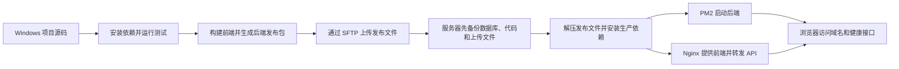

# 第 8 篇：全栈博客系统从开发到上线：阿里云真实部署实操

> 这是一份按当前项目真实部署记录整理的手把手教程。读者不需要先看过项目，也不需要猜“这一段是在说什么”：先照着本文认识目录，再按终端提示逐条执行命令，最后用真实域名验收。
>
> 本文讲的是这一个项目：Windows 本机目录为 `C:\Users\HN246\Desktop\个人全栈博客系统`，线上使用阿里云轻量服务器（Alibaba Cloud Linux 3，2 GiB 内存、40 GiB 系统盘），公网 IP 为 `121.41.11.78`，域名为 `haonan.online`。文中的命令、目录、服务名和端口都按这套真实环境书写，主流程不使用抽象占位符。
>
> 密码、JWT 密钥、Cookie 和证书私钥仍然不会写入文章或仓库。它们必须从小团体的私密密码记录中读取，并在终端交互输入；这不影响读者按真实的目录、IP、域名和服务流程操作。

## 0. 先看最终结果：你要把什么部署到哪里

你现在电脑上已经有一个完整项目：

```text
C:\Users\HN246\Desktop\个人全栈博客系统
```

这次部署要把它放到下面这台测试服务器：

```text
服务器：阿里云轻量服务器
系统：Alibaba Cloud Linux 3
公网 IP：121.41.11.78
域名：https://haonan.online/
线上项目根目录：/www/personal-blog
```

部署完成后，访问 `https://haonan.online/` 时会发生这些事情：

```text
浏览器访问 https://haonan.online/
  -> DNS 将 haonan.online 解析到 121.41.11.78
  -> Nginx 接收 443 端口的 HTTPS 请求
  -> / 请求读取 /www/personal-blog/frontend/index.html
  -> /api/ 请求转发给 127.0.0.1:3001
  -> PM2 守护 personal-blog-api，Node.js/Express 处理 API
  -> MongoDB 保存到 personal_fullstack_blog
  -> /uploads/ 读取 /www/personal-blog/uploads 中的上传文件
```

### 0.1 用图看懂：访客打开网站时发生什么

```mermaid
flowchart LR
  visitor[访客浏览器] --> dns[阿里云 DNS：haonan.online → 121.41.11.78]
  dns --> firewall[阿里云轻量服务器防火墙：80、443]
  firewall --> nginx[Nginx：HTTPS 入口与路径分流]
  nginx -->|页面请求 /| frontend[Vue 静态文件：/www/personal-blog/frontend]
  nginx -->|接口请求 /api/| api[Node.js + Express：127.0.0.1:3001]
  api --> mongo[MongoDB：127.0.0.1:27017 · personal_fullstack_blog]
  nginx -->|图片请求 /uploads/| uploads[/www/personal-blog/uploads]
  pm2[PM2：personal-blog-api] -.守护并重启.-> api
```

图里的箭头表示请求如何从浏览器走到服务器里的组件。小白可以先记住：浏览器只公开访问 Nginx 的 80/443 端口；Node.js 的 3001 和 MongoDB 的 27017 留在服务器内部，不直接暴露给互联网。
最终需要看到：

- 打开 `https://haonan.online/` 能看到“首页 - 浩南的全栈博客系统”。
- 打开 `https://haonan.online/api/health` 返回 `success: true` 的 JSON。
- 在服务器执行 `pm2 status` 时看到 `personal-blog-api` 为 `online`。
- 在服务器执行 `ss -lntp` 时，Node 监听 `127.0.0.1:3001`，MongoDB 监听本机 `27017`，外部只通过 Nginx 访问 80/443。

### 0.2 目录先看懂：每个目录到底负责什么

```text
C:\Users\HN246\Desktop\个人全栈博客系统\   Windows 本机项目根目录
├─ frontend\                                  Vue 3 + Vite 前端源码
│  └─ dist\                                    npm run build 生成的线上静态文件
├─ backend\                                   Node.js + Express 后端源码
│  ├─ src\                                    路由、服务、模型和 server.js
│  ├─ .env                                    后端运行配置（不提交 Git）
│  └─ ecosystem.config.cjs                    PM2 启动配置
├─ uploads\                                   本机运行时的上传文件
├─ release\                                   scripts 生成的发布压缩包
└─ scripts\                                   打包、发布和编码检查脚本
```

服务器上的目录用途不同：

```text
/www/personal-blog/frontend   Nginx 直接提供 frontend/dist 解压后的 index.html、JS、CSS
/www/personal-blog/backend    正在运行的后端源码和 node_modules
/www/personal-blog/uploads    用户上传的图片、文档和其他运行数据
/www/personal-blog/backups    发布包、MongoDB dump 和可回滚版本
/www/personal-blog/logs       长期保留的应用日志
```

`frontend` 是浏览器看到的页面，`backend` 是登录、文章、分类、评论、上传和权限等 API，`frontend/dist` 是构建后可交给 Nginx 的文件，`backend/src/server.js` 是后端启动入口，`backend/.env` 决定数据库、端口、密钥和上传目录。发布代码时可以替换 `frontend` 和 `backend`，不能顺手删除 `uploads`、`backups` 或服务器上的 `.env`。

### 0.3 为什么要开两个终端

第一次在 Windows 本机验证项目时要开两个 PowerShell：

```text
终端 A：进入 C:\Users\HN246\Desktop\个人全栈博客系统\backend，运行后端；窗口不能关闭。
终端 B：进入 C:\Users\HN246\Desktop\个人全栈博客系统\frontend，运行前端；窗口不能关闭。
```

后端窗口停在日志界面不是卡死，它正在监听 `3001`。如果把窗口关掉，前台运行的 Node 进程也会结束，前端就会请求失败。线上不依赖一直打开的 SSH 窗口，因为 PM2 会在后台守护同一个后端进程。

### 0.4 从 0 到 1 的执行顺序

第一次部署按下面顺序走，每一步都在后文对应章节中展开：

1. 在 Windows 安装 Git、Node.js、MongoDB、mongosh 和上传工具。
2. 进入 `C:\Users\HN246\Desktop\个人全栈博客系统`，分别安装前端和后端依赖。
3. 复制前后端 `.env.example`，启动本机 MongoDB、后端和前端。
4. 用 `http://127.0.0.1:3001/api/health` 和浏览器检查本机功能。
5. 执行 `npm run build`、`npm run test`、编码检查和发布包脚本。
6. 在阿里云控制台确认 `121.41.11.78`、Alibaba Cloud Linux 3、80/443/22 防火墙规则。
7. 用 `ssh root@121.41.11.78` 登录服务器，安装基础工具、Node.js 24 LTS、MongoDB 8.0、PM2 和 Nginx。
8. 创建 `/www/personal-blog/frontend`、`backend`、`uploads`、`backups`、`logs`。
9. 上传 `release/frontend-dist.zip` 和 `release/backend-release.zip`，备份数据库和旧版本。
10. 解压前端到 `/www/personal-blog/frontend`，解压后端到 `/www/personal-blog/backend`，只在服务器维护 `backend/.env`。
11. 在 `/www/personal-blog/backend` 安装依赖，用 PM2 启动 `personal-blog-api`。
12. 配置 `/etc/nginx/conf.d/personal-blog.conf`，让 `/`、`/api/`、`/uploads/` 和 `/socket.io/` 走正确路径。
13. 把 `haonan.online` 和 `www.haonan.online` 的 DNS A 记录指向 `121.41.11.78`，完成 ICP/公安备案要求。
14. 配置 `haonan.online.pem` 和 `haonan.online.key`，执行 `nginx -t` 后重载 HTTPS。
15. 打开首页和健康接口，检查 PM2、Nginx、MongoDB 日志；异常时按第 20 章回滚或排查。

## 本机代码如何变成线上网站



第一次部署时按图从左往右走。服务器上线后，日常发布会从“备份”这一步开始，因为源码已经准备好，不需要重复购买服务器或注册域名。
## 1. 这篇文章怎么使用

第一次部署不要从中间章节开始跳着试。先完成第 3、4 章的本机验证，再完成第 5 至第 14 章的服务器部署；第 15 至第 19 章用于以后的日常发布、数据库备份和回滚，第 20 章用于故障定位。每个操作块后都有“成功标志”，看到成功标志再继续下一块。

命令前的 `$`、`PS>`、`root@服务器:~#` 等提示符不是命令的一部分；只复制提示符后面的内容。Windows 命令在 PowerShell 执行，Linux 命令在 SSH 登录后的服务器终端执行，二者不要混用。遇到红色错误、连接拒绝或命令返回非 0，先停下来读第一条错误，再执行故障排查，不要继续运行删除或覆盖命令。

本文同时放了官方指南截图、按实际信息绘制的示意图、当前公开网站验收图，以及 2026-10-06 至 2026-10-07 从已登录阿里云账号现场截取的服务器、防火墙、域名、DNS、ICP备案和 SSL 控制台图。

### 1.1 执行前确认的真实参数

| 项目 | 本次部署使用的值 |
| --- | --- |
| 本机项目根目录 | `C:\Users\HN246\Desktop\个人全栈博客系统` |
| 云厂商与系统 | 阿里云轻量服务器 / Alibaba Cloud Linux 3 |
| 服务器公网 IP | `121.41.11.78` |
| SSH 用户与端口 | `root` / `22` |
| 主域名 | `haonan.online` |
| www 域名 | `www.haonan.online` |
| 线上项目根目录 | `/www/personal-blog` |
| 前端目录 | `/www/personal-blog/frontend` |
| 后端目录 | `/www/personal-blog/backend` |
| 上传目录 | `/www/personal-blog/uploads` |
| 备份目录 | `/www/personal-blog/backups` |
| 后端端口 | `3001` |
| MongoDB 数据库 | `personal_fullstack_blog` |
| PM2 应用名 | `personal-blog-api` |
| Nginx 配置 | `/etc/nginx/conf.d/personal-blog.conf` |

SSH 密码、管理员登录密码、`JWT_SECRET`、媒体加密密钥和证书私钥只从小团体的私密记录中读取，文章中不重复抄写。第一次部署时把这些值输入服务器的 `.env` 或终端提示即可。

### 1.2 从没写过网站代码怎么办

不会写代码也能照着本文把一个完整博客上线：小团体共享的现成项目源码地址是 `https://github.com/HN2461/first-fullstack-vue-blog.git`，本机源码已经位于 `C:\Users\HN246\Desktop\个人全栈博客系统`，前端、后端和数据库接口都已写好。先按第 3 章把现有源码运行起来，再按第 5 至第 14 章把同一份项目放到测试服务器。你不需要先学会从空白编写 Vue 或 Express；先理解 `frontend` 负责页面、`backend` 负责 API、MongoDB 负责保存数据即可。

网站上线后，可以从管理员控制台创建文章、分类、标签和媒体内容，不必为每篇文章改代码。若要把页面设计和业务逻辑改成完全不同的网站，那属于后续开发；部署主线仍然可以照本文的本机验证、构建、发布包、服务器发布和验收步骤走。

如果你以后要做自己的博客，先复制本项目的“前端 + 后端 + 数据库 + `.env.example` + 健康接口”结构，再逐步替换文章模型和页面。不要在第一次部署时同时加入 Docker、Redis、微服务等额外组件；先把一台 2 GiB 测试服务器跑通，之后再迭代功能。

本项目必须存在的交付入口如下：

| 需要的东西 | 在哪里确认 | 用途 |
| --- | --- | --- |
| 前端构建命令 | `frontend/package.json` 的 `scripts.build` | 生成 `frontend/dist` |
| 后端启动命令 | `backend/package.json` 的 `scripts.start` | 让 PM2 启动 API |
| 锁文件 | `frontend/package-lock.json`、`backend/package-lock.json` | 让服务器安装相同依赖版本 |
| 配置模板 | `frontend/.env.example`、`backend/.env.example` | 说明需要哪些环境变量 |
| 健康接口 | `http://127.0.0.1:3001/api/health` | 不登录检查后端是否活着 |
| 发布脚本 | `scripts/package-release.ps1`、`scripts/deploy-release.ps1` | 生成白名单发布包并执行发布 |

如果你还不会写代码，可以先把本项目当作可运行样例，等部署成功后再逐个修改页面和接口。每次改动都先在本机验证，再重新构建发布；不要直接在服务器上编辑前端源码来“试试看”。

## 2. 先理解几个最容易混淆的概念

### 2.1 本地电脑、服务器和网站不是一回事

本地电脑用于写代码、调试和打包。阿里云服务器是一台长期联网的 Linux 电脑，负责 24 小时运行网站。域名只是一个容易记忆的名字，本身不保存网页，也不运行程序。

例如：

```text
域名：haonan.online
服务器 IP：121.41.11.78
服务器：真正存放项目和运行 Node、MongoDB、Nginx 的机器
```

当用户输入域名时，DNS 先把域名翻译成 IP，浏览器再去连接服务器。

### 2.2 前端和后端为什么要分开

前端是用户看到的页面、按钮、表单和路由。Vue 源码不能直接作为线上网站运行，必须使用 Vite 编译成浏览器可以直接加载的 HTML、CSS、JavaScript 文件，这一步就是：

```bash
npm run build
```

后端是处理登录、文章、评论、上传、权限和数据库读写的 Node.js 程序。它通常监听本机端口 `3001`，不直接暴露给所有访客，而是让 Nginx 转发 `/api/` 请求。

### 2.3 MongoDB 保存什么

MongoDB 是项目的数据仓库。文章正文、用户账号、分类、标签、评论、角色、菜单、媒体记录等业务数据都在这里。前端构建文件可以随时重新生成，但数据库和上传文件属于运行数据，不能随便覆盖。

### 2.4 Nginx 做什么

Nginx 是服务器入口和交通指挥员：

- 请求 `/` 时，返回前端静态文件。
- 请求 `/api/` 时，转发到 `127.0.0.1:3001`。
- 请求 `/uploads/` 时，Nginx 转发到 Express 的 `express.static(resolveUploadRoot())`，只负责读取已存在的文件。
- 上传文件本身走 `/api/admin/media` 等后端 API，不是通过 `/uploads/` 写入。
- 讨论实时消息走 `/socket.io/`，需要 Nginx 转发 WebSocket Upgrade 请求。
- 配置 HTTPS 证书，把 HTTP 请求跳转到 HTTPS。
- 处理 Vue Router 刷新时的回退，让 `/console/articles` 不会被当成服务器真实目录而返回 404。

### 2.5 PM2 做什么

如果直接执行 `node src/app.js`，关闭 SSH 窗口后程序可能停止，程序报错也不会自动恢复。PM2 是 Node.js 进程管理器，负责让后端常驻、崩溃重启、查看日志和保存开机启动配置。

### 2.6 SSL 证书做什么

SSL/TLS 证书让浏览器确认“当前 HTTPS 网站确实对应这个域名”，并加密浏览器和服务器之间的传输。证书文件通常是一对：

```text
haonan.online.pem：公开证书，可以让 Nginx 读取
haonan.online.key：私钥，只能由服务器安全读取
```

私钥不能发到公开仓库、文章或聊天群。证书过期后，网站仍可能能访问，但浏览器会提示连接不安全，因此建议到期前 7 至 15 天处理续期。

## 3. 开始写项目前：本地开发环境

### 3.1 建议准备的软件

在 Windows 本地开发时，至少需要：

| 软件 | 用途 |
| --- | --- |
| Git | 管理源码版本、提交和回退 |
| Node.js LTS | 运行前端 Vite 和后端 Express |
| npm | 安装项目依赖、执行命令 |
| MongoDB Community Server | 本地运行 MongoDB 数据库 |
| mongosh | 查看数据库、执行检查命令 |
| Visual Studio Code 或其他 IDE | 编辑源码和 Markdown |
| Xshell、PowerShell 或 Windows Terminal | 连接和操作服务器 |
| WinSCP、SFTP 工具或 IDE 插件 | 上传发布文件和证书 |

第一次安装按这个顺序做：

1. 打开 [Git for Windows](https://git-scm.com/download/win)，下载 Windows 安装程序，安装时保留默认选项；安装完成后重新打开 PowerShell。
2. 打开 [Node.js 下载页](https://nodejs.org/en/download)，选择 `v24.21.0 LTS`、Windows、Windows Installer (.msi)，运行安装程序并保留默认的 PATH 选项。
3. 打开 [MongoDB Community Server 下载页](https://www.mongodb.com/try/download/community)，平台选 Windows、安装包选 MSI，安装时保留 “Install MongoDB as a Service” 默认选项，让数据库随 Windows 服务启动。
4. 打开 [MongoDB Shell 下载页](https://www.mongodb.com/try/download/shell)，选择 Windows MSI 安装 `mongosh`。MongoDB Server 和 mongosh 是两个工具：前者负责运行数据库，后者负责连接数据库输入检查命令。
5. 安装 [Visual Studio Code](https://code.visualstudio.com/Download)，后面用它打开项目和编辑 `.env`。WinSCP 只在使用图形方式上传发布包时需要；也可以直接用 Windows 自带的 `scp`。

安装程序完成后关掉旧 PowerShell，重新打开一个窗口，再运行下面的版本检查。每一条都能输出版本号才继续；缺哪一个，就回到对应官网下载页完成安装，不能跳过 MongoDB 或 mongosh。

版本不必照抄某一次历史记录，优先使用当前项目 `package.json` 能支持的 Node.js LTS 版本。安装后先检查：

```powershell
node -v
npm -v
git --version
mongosh --version
```

预期是每条命令都能输出版本号。如果提示“不是内部或外部命令”，先检查软件是否安装，以及是否已经重启终端让 PATH 生效。

Node.js 下载页会根据你选择的操作系统显示安装方式。Windows 新手通常下载 Windows Installer (.msi)，安装时保持默认选项并确保加入 PATH；装完后关闭旧终端，重新打开 PowerShell 再检查版本。


*图 3-1：Node.js 官方下载页。LTS 是长期支持版本；不要因为看到更高的 Current 数字就给生产环境随意升级。来源：[Node.js 下载页](https://nodejs.org/en/download)，截图日期：2026-10-06。*

### 3.2 获取项目源码

本教程使用的项目已经位于 Windows 本机。如果你在自己的电脑上还没有源码，先在 PowerShell 中运行下面的命令，从小团体共用仓库克隆 `main` 分支。目标目录已经存在项目文件时不要再次克隆，直接跳到下一步检查：

```powershell
Set-Location 'C:\Users\HN246\Desktop'
git clone https://github.com/HN2461/first-fullstack-vue-blog.git '个人全栈博客系统'
```

仓库会创建下面这个目录：

```powershell
C:\Users\HN246\Desktop\个人全栈博客系统
```

打开 PowerShell，进入这个目录并确认当前分支与工作区：

```powershell
Set-Location 'C:\Users\HN246\Desktop\个人全栈博客系统'
git status
git branch --show-current
```

如果你是从本地压缩包拿到项目，先把它解压到上面的目录，再执行同样的检查。不要把项目放在 OneDrive 正在同步的目录中，也不要把路径改成含有半截解压文件的临时目录；后面构建和压缩发布包都以这个目录为准。

确认前后端入口文件存在：

```powershell
Test-Path .\frontend\package.json
Test-Path .\frontend\package-lock.json
Test-Path .\backend\package.json
Test-Path .\backend\package-lock.json
Test-Path .\frontend\.env.example
Test-Path .\backend\.env.example
```

六条命令都应输出 `True`。如果某一条是 `False`，先回到项目目录检查是否解压多套了一层目录，例如误成了 `个人全栈博客系统\个人全栈博客系统\frontend`；不要继续安装依赖。
### 3.3 获取项目和安装依赖

进入项目根目录后，前后端分别安装依赖：

```powershell
cd C:\Users\HN246\Desktop\个人全栈博客系统

cd frontend
npm ci

cd ..\backend
npm ci

cd ..
```

为什么要分别安装？因为本项目不是根目录 npm workspace，`frontend` 和 `backend` 是两个独立应用，各自有自己的 `package.json` 和 `package-lock.json`。

这里用 `npm ci` 是因为项目已经带有锁文件；它会按锁文件安装依赖，并在对应目录重建 `node_modules`，不会改动源码、文章、`.env` 或上传资源。

安装过程中如果出现网络超时，可以检查 npm 镜像、代理和网络；如果出现依赖版本冲突，不要直接删除 lock 文件，先看报错涉及哪个包，再结合项目当前 Node 版本处理。

### 3.4 配置本地环境变量

前端和后端的 `.env.example` 是配置模板，真正运行时需要复制成 `.env`：

```powershell
if (-not (Test-Path frontend\.env)) { Copy-Item frontend\.env.example frontend\.env }
if (-not (Test-Path backend\.env)) { Copy-Item backend\.env.example backend\.env }
```

这两条命令只在 `.env` 尚不存在时复制模板，避免覆盖本机已经填写过的数据库和密钥配置。

用 VS Code 打开 `backend/.env`，本机开发的数据库和端口应是：

```text
MONGODB_URI=mongodb://127.0.0.1:27017/personal_fullstack_blog
SERVER_PORT=3001
CLIENT_ORIGIN=http://127.0.0.1:5173
```

把 `ADMIN_PASSWORD=change-this-admin-password` 改为本地测试密码 `admin123456`，保存文件。此密码只用于这台 Windows 开发环境；线上第一次部署时第 11.2 节会提示你隐藏输入另一份小团体共用密码。前端 `frontend/.env` 保持 `VITE_API_BASE_URL` 为空，Vite 会使用项目本机代理。

等第 3.5 节确认 MongoDB 正在运行后，再执行一次本机管理员初始化命令。这个命令会把 `admin@example.com` 创建到本机 MongoDB 的 `personal_fullstack_blog` 数据库，或把已有本地同名账号密码重置为 `admin123456`。不要在生产服务器执行这条本机测试密码配置。

本地开发环境和线上环境的 `.env` 不一定相同。线上 `.env` 必须在服务器独立维护，发布包不能覆盖它。原因是线上环境包含生产数据库地址、正式域名、密钥和运行目录，本地发布包不应该携带这些内容。

本项目 `.env.example` 把服务端口写作 `SERVER_PORT`，不是通用示例中常见的 `PORT`。照抄其他教程时，变量名不匹配会导致你以为改了端口、程序却仍监听默认端口。每个变量名都要以自己后端读取配置的代码或项目模板为准。

### 3.5 启动 MongoDB

先确认 MongoDB 服务已经启动。Windows 可以在“服务”中查找 MongoDB，也可以使用系统服务命令：

```powershell
Get-Service | Where-Object { $_.Name -match 'Mongo' -or $_.DisplayName -match 'Mongo' }
```

再使用 `mongosh` 测试连接：

```powershell
mongosh "mongodb://127.0.0.1:27017"
```

进入后可以执行：

```javascript
show dbs
exit
```

确认 `mongosh` 能连接后，在另一个 PowerShell 窗口执行一次本机管理员初始化：

```powershell
Set-Location 'C:\Users\HN246\Desktop\个人全栈博客系统\backend'
npm run create:admin
```

命令完成后，管理员账号是 `admin@example.com`，本机测试密码是 `admin123456`。这个本机账号用于后续登录页面检查；线上管理员密码在第 11.2 节单独输入。
如果连接失败，先检查 MongoDB 服务是否启动、端口是否为 `27017`、本地 `.env` 的连接串是否写错。不要一开始就删除数据库目录；数据库目录是数据本体，误删会造成不可逆的数据损失。

### 3.6 启动后端

在第一个终端窗口：

```powershell
cd C:\Users\HN246\Desktop\个人全栈博客系统\backend
npm run start
```

本项目也提供 `npm run dev` 开发命令。初次启动按项目 README 指定的方式执行；若用两个终端，**终端 A 保持后端窗口打开**，不要关闭，否则 API 就会停止。`npm run start` 通常是前台运行：窗口停留在日志界面不代表卡死，只要没有退出且出现监听端口的日志即可。

看到服务监听 `3001` 或类似成功日志后，另开一个终端测试健康接口：

```powershell
Invoke-WebRequest -Uri "http://127.0.0.1:3001/api/health" -UseBasicParsing
```

如果接口返回成功 JSON，说明 Node、Express 和 MongoDB 的基本连接正常。若后端启动即退出，优先看终端第一条错误，常见原因是 `.env` 缺失、端口被占用、数据库无法连接或依赖没有安装完整。

**成功标志：**健康接口返回 HTTP 200 和项目定义的成功 JSON。字段名因应用而异，关键是没有连接拒绝、404 或 500。如果输出 `ECONNREFUSED`，先检查 MongoDB 服务和连接串；如果输出 `EADDRINUSE`，端口已被其他程序占用；如果提示 `Cannot find package`，回到 backend 目录安装依赖。

### 3.7 启动前端

在第二个终端窗口：

```powershell
cd C:\Users\HN246\Desktop\个人全栈博客系统\frontend
npm run dev
```

Vite 会输出一个本地地址，通常是 `http://localhost:5173`。打开后检查：

1. 首页能否打开。
2. 登录页面能否提交。
3. 登录后能否进入控制台。
4. 文章、搜索、媒体、个人信息等核心页面能否读取数据。
5. 图片和上传资源是否能正常显示。

**成功标志：**前端能打开，Network 面板中的 API 请求发往本机后端或 Vite 代理地址，并收到预期响应。仅仅看到首页不够：静态页面可能已打开，但后端服务并没有运行。

浏览器开发者工具的 Network 面板可以帮助判断问题在哪一层：

- 请求根本没有发出，通常是前端代码或事件问题。
- 请求发出但地址错误，通常是前端 `.env` 或代理配置问题。
- 返回 `401`，通常是登录态或权限问题。
- 返回 `404`，通常是接口路径错误。
- 返回 `500`，通常要看后端日志和数据库错误。

## 4. 本地开发完成后，如何确认可以发布

上线前不要只看“本地页面能打开”。至少要完成下面四类检查。

### 4.1 功能检查

用管理员账号和普通用户账号分别检查权限差异。当前项目普通用户、资源管理员、超级管理员看到的菜单和媒体资源范围不同，发布后不能只用管理员账号验证。

建议至少检查：

- 注册、登录、退出和刷新后登录态。
- 公开文章列表、文章详情和搜索。
- 控制台文章、分类、标签、评论和个人信息。
- 媒体资源上传、预览、下载、文件夹视图和权限范围。
- 管理员后台、菜单、角色、用户和系统设置。
- 移动端登录、文章阅读和资源页面。

### 4.2 前端构建检查

```powershell
cd C:\Users\HN246\Desktop\个人全栈博客系统\frontend
npm run build
```

成功后会生成 `frontend/dist`。这表示 Vue 源码已经被转换成线上浏览器直接加载的静态文件。

如果构建失败，先修复 TypeScript、ESLint、导入路径或环境变量错误。不要拿上一次遗留的 `dist` 发布，因为旧文件可能引用旧的 JS 分块，导致线上出现白屏或接口参数不匹配。

### 4.3 后端测试检查

```powershell
cd C:\Users\HN246\Desktop\个人全栈博客系统\backend
npm run test
```

测试失败时先确认是代码失败、测试数据库失败还是环境变量缺失。当前测试使用 `mongodb-memory-server`，第一次运行可能需要下载 MongoDB 测试二进制；并发 worker 在收尾阶段偶尔出现通道错误时，可以改用单 worker 复跑：

~~~powershell
cd backend
npx vitest run --pool=forks --maxWorkers=1 --minWorkers=1
~~~

测试没有通过时，不建议为了“先发布”而跳过错误；至少要记录失败原因，并确认它不会影响本次发布范围。

### 4.4 编码和发布包检查

项目要求源码和配置使用 UTF-8 无 BOM。统一检查：

```powershell
cd C:\Users\HN246\Desktop\个人全栈博客系统
pwsh -File scripts\check-encoding.ps1
```

当前项目的发布流程会生成两个包：

```text
release/frontend-dist.zip
release/backend-release.zip
```

后端发布包只包含运行所需源码和配置模板，不包含：

```text
backend/.env
backend/node_modules
backend/uploads
backend/logs
```

这是有意为之：依赖在服务器重新安装，线上配置和运行数据由服务器保留，不能被本地压缩包覆盖。

**小白判断：**如果 `scripts\package-release.ps1` 报“未找到 frontend/dist/index.html”，说明你还没有成功执行前端构建；如果报检测到旧构建分块，先删除 `frontend/dist` 再重新构建。压缩包生成后不要只看文件名，要用解压预览确认前端压缩包根部直接是 `index.html`，后端压缩包根部直接是 `package.json`、`src` 和 `ecosystem.config.cjs`。

## 5. 购买阿里云服务器：你真正需要选择什么

### 5.1 服务器的作用

服务器就是一台有公网 IP、可以长期运行的电脑。购买时需要关注的不是“页面看起来多复杂”，而是：

- 是否有公网 IPv4 地址。
- CPU、内存和磁盘是否能承载当前项目。
- 系统是否选择了你能操作的 Linux 发行版。
- 流量和带宽是否满足个人站点访问量。
- 是否有快照或备份能力。
- 所在地域是否方便备案和访问。

本教程已经有一台可用的测试服务器，不需要再购买第二台。后面所有步骤都以它为准：阿里云轻量服务器、Alibaba Cloud Linux 3、2 GiB 内存、40 GiB 系统盘、公网 IP `121.41.11.78`。2 GiB 足以跑当前小团体测试站点，但同时运行 MongoDB、Node.js 和 Nginx 时要留意内存与磁盘，不要在这台机器上再堆不相关服务或长期存放大型视频。

实例名称为“浩南的云服务器”，地域为华东1（杭州），服务器到期时间为2027年6月19日 23:59:59。

> **当前测试服务器：**阿里云轻量服务器，Alibaba Cloud Linux 3，2 GiB 内存、40 GiB 系统盘，公网 IPv4 为 `121.41.11.78`。这台服务器用于小团体测试和学习；本教程直接按这台机器的规格和参数操作。

**成功标志：**实例状态显示“运行中”，实例详情页显示公网 IPv4 `121.41.11.78`。后面的 SSH、DNS 和验收都使用这一份地址，避免手抄错位。

### 5.2 购买后第一时间记录的信息

不要只依赖“我大概记得服务器在哪里”。建立一张私有部署卡片，至少记录：

```text
阿里云实例名称：浩南的云服务器
服务器主机名：iZbp19m06bfcok9ojoc3hdZ
地域：华东1（杭州）
公网 IP：121.41.11.78
系统：Alibaba Cloud Linux 3.2104 U12 (OpenAnolis Edition)
SSH 用户：root
SSH 端口：22
服务器到期时间：2027年6月19日 23:59:59
域名：haonan.online
域名到期时间：2027-06-13 13:26:26
域名自动续费：关闭（2026-10-07 在阿里云域名控制台核对）
ICP 备案号：皖ICP备2026019318号-1
公安备案号：当前网站页脚展示为皖公网安备34122202000573号；详细审核记录以公安备案平台查询结果为准
证书到期时间：2026-12-20（截图中的当前已签发测试证书；续费前重新核对）
项目线上根目录：/www/personal-blog
```

账号密码不写进 Git，也不要和公开教程一起发布。可以放进本地密码管理器或私有纸质笔记。

### 5.3 在阿里云控制台确认服务器和防火墙

在阿里云轻量应用服务器控制台确认：

1. 实例状态是运行中。
2. 公网 IP 没有记错。
3. 防火墙或安全组允许后续需要的端口。
4. 服务器系统与自己准备的命令一致。
5. 磁盘容量和流量套餐符合预期。

在阿里云登录后，打开“轻量应用服务器”实例列表，点开公网 IP 为 `121.41.11.78` 的实例。


*图 5-1：阿里云轻量应用服务器实例列表。当前实例名为“浩南的云服务器”，状态为运行中，公网 IPv4 是 `121.41.11.78`。点击实例名称进入详情页；列表中的镜像显示为 Alibaba Cloud Linux 3.21.04。*

先在“概览”确认运行状态、系统和公网 IP。


*图 5-2：当前服务器概览显示 2 GiB 内存、40 GiB 系统盘、公网 IPv4 `121.41.11.78` 和运行状态。控制台镜像栏显示 Alibaba Cloud Linux 3.21.04；登录后运行 `cat /etc/os-release` 会得到更完整的版本标识，当前历史输出为 Alibaba Cloud Linux 3.2104 U12。*

再点“防火墙”检查入站规则。若缺少网站端口，点“添加规则”，协议选 TCP，分别添加 `80` 和 `443`；SSH 使用 TCP `22`。当前截图中的来源 `0.0.0.0/0` 表示所有 IPv4 地址都能尝试访问对应端口，SSH 的 22 端口目前也对所有 IPv4 开放；如果成员有固定公网地址，可在确认不会锁死 SSH 后把来源限制到实际使用的地址。网站的 `80`、`443` 需要访客访问。**不要添加 `3001` 或 `27017`**，这两个端口留在服务器内部。


*图 5-3：当前控制台显示 TCP 80（HTTP）、TCP 443（HTTPS）、TCP 22（SSH）和 ICMP 四条规则；来源均为 `0.0.0.0/0`，状态为已启用。列表没有 3001 或 27017 规则。若要收紧 SSH 来源，应先准备并测试第二种登录方式，避免把自己锁在服务器外。*

云控制台规则保存后还要检查服务器自己的防火墙，下一章会执行命令。两层防火墙都允许端口，网站才能从外部访问；Node.js 和 MongoDB 仍然只监听服务器本机地址。

**第一次放通端口时的判断：**先开放 SSH（22 或你设置的端口），否则后面无法远程管理；网站验收阶段再开放 80 和 443。3001 和 27017 不要向公网开放。云控制台保存规则后不一定会提示服务器内部防火墙也已打开，Linux 内部防火墙还要按第 6.4 节分别检查。
## 6. 第一次连接服务器和初始化 Linux

### 6.1 先确认 SSH 连接方式

服务器购买完成后，可以使用阿里云控制台的远程连接，也可以使用 PowerShell、Windows Terminal、Xshell、PuTTY 等 SSH 工具。

PowerShell 的基本形式是：

~~~bash
ssh root@121.41.11.78
~~~

如果 SSH 使用了非默认端口：

~~~bash
ssh -p 22 root@121.41.11.78
~~~

首次连接会询问是否信任服务器指纹。确认 IP 是自己购买的那台服务器后输入 yes，再输入密码。输入密码时终端通常不会回显字符，这是正常现象。

历史上如果遇到 Xshell 中不能选择密码认证，不要先认定是密码错。先在阿里云控制台远程终端检查：

~~~bash
sudo grep -E "PasswordAuthentication|PubkeyAuthentication" /etc/ssh/sshd_config
~~~

原部署记录中的测试服务器输出过：

~~~text
#PubkeyAuthentication yes
PasswordAuthentication no
~~~

这表示服务器端关闭了密码登录。首次部署确实需要密码登录时，可以临时开启：

~~~bash
sudo sed -i 's/PasswordAuthentication no/PasswordAuthentication yes/' /etc/ssh/sshd_config
sudo systemctl restart sshd
~~~

登录成功后，先不要关闭当前窗口，再用第二个窗口测试连接。这样修改 SSH 配置时不会把自己锁在服务器外面。部署稳定后可以改用 SSH 密钥登录，并按自己的风险判断是否关闭密码登录。

### 6.2 了解当前系统和权限

登录后先执行一组只读检查：

~~~bash
whoami
hostname
cat /etc/os-release
uname -a
df -h
free -h
~~~

当前测试服务器历史结果如下：

~~~text
登录账号：root
主机名：iZbp19m06bfcok9ojoc3hdZ
系统：Alibaba Cloud Linux 3.2104 U12 (OpenAnolis Edition)
内核：Linux 5.10.134-19.1.al8.x86_64
架构：x86_64
内存：2 GiB
系统盘：40 GiB ESSD
~~~

阿里云控制台实例卡片使用较短的镜像标识 `Alibaba Cloud Linux 3.21.04`，系统内的发行版文件会显示更完整的 `Alibaba Cloud Linux 3.2104 U12 (OpenAnolis Edition)`；上面的截图和命令输出分别来自同一台服务器的控制台和 SSH 终端。
以后服务器重装、升级或更换实例时，以命令输出为准，不要只照抄历史结果。

### 6.3 更新系统并安装基础工具

当前服务器使用 Alibaba Cloud Linux，历史实际命令是：

~~~bash
dnf update -y
dnf install -y git wget curl vim zip unzip tar openssl
~~~

如果使用 Ubuntu/Debian，则对应命令通常是：

~~~bash
sudo apt update
sudo apt upgrade -y
sudo apt install -y git wget curl vim zip unzip tar openssl ca-certificates build-essential nginx
~~~

安装完成后检查：

~~~bash
git --version
wget --version | head -n 1
curl --version | head -n 1
vim --version | head -n 1
zip -v | head -n 2
unzip -v | head -n 2
tar --version | head -n 1
~~~

原部署记录中的测试服务器检查结果曾是：

~~~text
git version 2.43.7
GNU Wget 1.19.5
curl 7.61.1
VIM - Vi IMproved 8.0
Zip 3.0
UnZip 6.00
GNU tar 1.30
~~~

如果系统升级提示需要重启，先保存当前工作，再执行：

~~~bash
reboot
~~~

等待服务器恢复后重新连接。不要在系统重启过程中重复执行安装命令。

**成功标志：**`git --version`、`curl --version`、`unzip -v` 都能打印版本；`df -h` 能看到磁盘空间。如果 `dnf` 找不到某个包，不要把 Ubuntu 的 `apt` 命令直接混到当前终端，先确认 `cat /etc/os-release` 的发行版，再查对应软件包名称。

### 6.4 防火墙和安全组

阿里云控制台的防火墙是云平台入口规则，服务器里的 firewalld/UFW 是操作系统内部规则。两层都拒绝时，外部请求进不来；只开一层也可能访问失败。

一般需要允许：

| 端口 | 用途 | 是否建议公网开放 |
| --- | --- | --- |
| 22 或自定义 SSH 端口 | 远程管理服务器 | 仅允许自己的来源更好 |
| 80 | HTTP 和证书验证 | 是 |
| 443 | HTTPS 网站 | 是 |
| 3001 | Express 内部端口 | 否，仅本机 |
| 27017 | MongoDB | 否，仅本机 |

如果使用 UFW，先放行 SSH，再启用：

~~~bash
sudo ufw allow 22/tcp
sudo ufw allow 80/tcp
sudo ufw allow 443/tcp
sudo ufw enable
sudo ufw status verbose
~~~

操作后不要关闭当前 SSH 窗口；从另一台终端重新连通后，才说明规则没有把自己锁在服务器外。`ss -lntp` 看到 `127.0.0.1:3001` 和 `127.0.0.1:27017` 是更安全的本机监听结果；若看到 `0.0.0.0:27017`，先停下来检查 MongoDB 监听配置和云防火墙规则。

Alibaba Cloud Linux 也可能使用 firewalld。先查看状态：

~~~bash
systemctl status firewalld --no-pager
firewall-cmd --list-all
~~~

当前服务器使用 Alibaba Cloud Linux 3。如果 `firewalld` 正在运行且列表里缺少 `22/tcp`、`80/tcp` 或 `443/tcp`，在保留当前 SSH 窗口的情况下添加并重载规则：

~~~bash
firewall-cmd --permanent --add-port=22/tcp
firewall-cmd --permanent --add-port=80/tcp
firewall-cmd --permanent --add-port=443/tcp
firewall-cmd --reload
firewall-cmd --list-ports
~~~

预期列表包含 `22/tcp 80/tcp 443/tcp`。如果命令提示 `firewall-cmd: command not found`，不要继续执行这组命令；先用 `systemctl is-active firewalld` 确认系统实际使用的防火墙工具，再按第 5.3 节核对云平台入口规则。

不要为了测试把 MongoDB 的 27017 或 Express 的 3001 永久开放到全网。当前项目由 Nginx 对外提供入口，数据库和 Node 服务都可以只监听本机。

完成这一步后，云控制台和服务器各自的防火墙都只允许网站入口和 SSH；用 `ss -lntp | grep -E ':22|:80|:443|:3001|:27017'` 再确认 `3001`、`27017` 没有绑定到公网地址。

## 7. 购买域名、DNS 解析和访问验证

### 7.1 域名是什么

域名是给人记忆的地址；本项目使用已经注册的 `haonan.online`。服务器公网 IP 才是实际网络地址；域名通过 DNS 解析到 IP。跟着本教程使用小团体的测试服务器时，不需要另买服务器或域名，直接把现有的 `haonan.online` 两条 DNS 记录核对好。服务器换 IP 时，通常只需要修改 DNS，不必重新换域名。

购买域名时记录：

- 域名所有者和实名认证主体。
- 域名注册商账号。
- 域名到期时间和自动续费状态。
- 是否用于中国大陆服务器备案。

阿里云域名列表中可以核对注册状态、注册时间、到期时间和自动续费开关。当前 `haonan.online` 状态正常，到期时间为 `2027-06-13 13:26:26`，自动续费目前关闭；到期前由域名管理人决定是否续费，不要误以为服务器续费会同时续上域名。


*图 7-1：阿里云域名列表显示 `haonan.online` 状态正常，注册时间为 `2026-06-13 13:26:26`，到期时间为 `2027-06-13 13:26:26`，自动续费开关关闭。截图展示的是当前真实域名；续费前请再次检查控制台。*

### 7.2 当前项目的 DNS 记录

当前项目使用：

~~~text
主域名：haonan.online
www 域名：www.haonan.online
服务器公网 IP：121.41.11.78
~~~

DNS 记录应保持下面的含义：

在阿里云控制台打开“云解析 DNS”，选中 `haonan.online`，点“添加记录”，分别保存两条记录：主机记录 `@`、记录类型 `A`、记录值 `121.41.11.78`；再添加主机记录 `www`、类型 `A`、记录值 `121.41.11.78`。记录值只填 IP，不要填 `https://` 或端口。保存后等待解析生效。

| 主机记录 | 类型 | 记录值 |
| --- | --- | --- |
| @ 或空 | A | 121.41.11.78 |
| www | A | 121.41.11.78 |


*图 7-2：阿里云云解析 DNS 当前记录。

如果服务器 IP 以后变化，必须把两条记录都改成新的公网 IP。A 记录里只填 IP，不要填协议或端口。

### 7.3 验证 DNS

Windows：

~~~powershell
nslookup haonan.online
nslookup www.haonan.online
~~~

Linux：

~~~bash
getent hosts haonan.online
getent hosts www.haonan.online
~~~

看到返回 `121.41.11.78`，说明当前解析已经指向这台测试服务器。DNS 修改后可能需要等待 TTL 生效，不要因暂时看不到新 IP 就连续删除重建。

**成功标志：**`nslookup` 输出中出现 `haonan.online`、`www.haonan.online` 和 `121.41.11.78`。若仍返回旧 IP，先等 TTL 缓存过期，并用另一网络或 DNS 查询工具复核，不要立刻修改 Nginx 或重装服务器。


*图 7-3：本项目的 DNS 记录示意图。

### 7.4 先用 HTTP 验证服务器

完成第 13 章的 HTTP Nginx 配置后，第一次部署时建议先验证 HTTP，再接入 HTTPS。这样能把问题拆开：

- 域名完全打不开：先检查 DNS、云防火墙和 Nginx。
- 页面能打开但 API 502：检查 PM2 和后端端口。
- Vue 路由刷新 404：检查 Nginx 的 try_files。
- HTTPS 有证书错误：检查证书覆盖域名和 Nginx 证书路径。

如果访问域名时看到阿里云备案拦截页，而访问服务器公网 IP 可以打开项目，这通常不是前端、Node 或 Nginx 故障，而是域名尚未完成 ICP 备案或接入备案。历史首次部署时就遇到过这种情况：

1. 先在服务器本机运行 `curl -I http://127.0.0.1/`，确认 Nginx 能回 HTTP 状态码。
2. 再运行 `curl http://127.0.0.1:3001/api/health`，确认后端健康接口能回 JSON。
3. 从自己电脑访问 `http://121.41.11.78/`，确认这台测试服务器的 Nginx 能返回页面。
4. 完成 ICP 备案和云厂商接入后，再用 `http://haonan.online/` 检查域名访问。

不要因为备案拦截页误删 Nginx 配置或重复重装后端。

## 8. ICP 备案和公安联网备案

### 8.1 ICP 备案解决什么问题

ICP备案是工信部和通信管理局侧的网站接入备案。使用中国大陆服务器提供网站服务时，通常需要先完成 ICP 备案。它登记网站主体、域名、接入服务器和网站内容，不等于购买服务器，也不等于 HTTPS 证书。

阿里云入口：

- [阿里云 ICP 备案控制台](https://beian.aliyun.com/)
- [备案订单和进度](https://beian.aliyun.com/pcContainer/myorder?entityId=11239630)

当前项目历史备案号是：

~~~text
皖ICP备2026019318号-1
~~~


*图 8-1：当前阿里云备案控制台显示 `haonan.online` 的网站备案号为 `皖ICP备2026019318号-1`，网站名称为“浩南知识库系统”，订单状态为“管局审核通过”。个人姓名已在截图中模糊处理；实际备案应以自己的主体和控制台结果为准。*

实际发布时以阿里云和工信部当前查询结果为准。网站底部通常需要链接到：

~~~text
https://beian.miit.gov.cn/
~~~

### 8.2 ICP 备案的实操步骤

下图是阿里云官方个人网站备案快速入门页面中的流程图。备案通常要先准备资料，再在服务商平台提交并等待服务商初审、短信核验和管局审核；“已提交”不等于已经通过。


*图 8-2：阿里云个人网站备案官方指南页面。

1. 确认域名已实名认证，域名主体和备案主体一致。
2. 确认阿里云服务器可用于备案，并准备备案服务码或实例信息。
3. 在备案控制台创建备案，选择个人或单位主体。
4. 填写主体信息、网站名称、负责人、联系方式和证件资料。
5. 填写网站域名、网站内容、服务器接入信息。
6. 按平台要求上传身份证明、负责人照片和核验材料。
7. 完成阿里云初审、短信核验等步骤。
8. 等待管局审核，保持电话和短信可用。
9. 审核通过后保存备案号，在网站底部展示备案信息。

备案控制台字段会随政策和页面版本变化，填写时以当前页面提示为准。身份证号、手机号和证件照片不要直接放到公开截图中。

> 备案操作时把主体、网站信息、服务器接入、短信核验和审核结果分别保存为私密记录；证件号、手机号和证件照片不要放进本文。

### 8.3 公安联网备案是什么


公安联网备案和 ICP 备案不是同一个流程：

~~~text
ICP备案：工信部/通信管理局侧的网站接入备案。
公安联网备案：公安机关侧的互联网网站安全备案。
~~~

官方入口：

- [全国互联网安全管理服务平台](https://beian.mps.gov.cn/#/)
- [阿里云公安联网备案信息填写指南](https://help.aliyun.com/zh/icp-filing/basic-icp-service/the-public-security-network-for-the-record-information-fill-in-the-guide?spm=5176.164126b6.icp_beian.8.dd4a79feTnUkkv)

该图是阿里云官方填写指南页面截图，用来帮助辨认新办网站入口，不是当前账号里的公安备案申请表。


*图 8-3：阿里云官方公安联网备案填写指南。页面明确公安联网备案与工信部 ICP 备案是不同流程，指南也展示了新办网站申请的操作入口。来源：[公安联网备案信息填写指南](https://help.aliyun.com/zh/icp-filing/basic-icp-service/the-public-security-network-for-the-record-information-fill-in-the-guide)，截图日期：2026-10-06。*

一般流程是：

1. ICP 备案通过并且网站已经开通后，登录公安备案平台。
2. 按主体、域名、服务器、网站负责人和接入服务商填写资料。
3. 填写网站 IP、域名、网络接入、服务器所在地等信息。
4. 提交后等待属地公安机关审核。
5. 审核通过后取得公安备案编号。
6. 按平台提供的 HTML 代码、图标和链接，把公安备案信息放在网站底部。

当前网站页脚已经展示 `皖公网安备34122202000573号`。公安部公开查询页需要验证码，本文不把无法在当前会话中复核的审核时间、审核状态或主体详情写成确定结论；读者应打开官方平台，输入该编号并按页面提示完成查询，以平台当前结果为准。

公安联网备案的提交时限、审核材料和展示要求以平台当前政策为准。审核通过后，不要只保存编号，要按平台提供的代码把图标和备案号放到网站首页底部，并在域名、服务器或网站主体变化后重新检查是否需要变更备案信息。

> 公安备案操作时保存网站信息、提交成功和审核结果页面。当前站点可从页脚确认编号 `皖公网安备34122202000573号`；如果官方查询页显示的主体、域名或状态与站点页脚不一致，应先暂停发布并按平台要求更正。

### 8.4 备案后网站底部应该有什么

当前前端已经有 frontend/src/components/SiteBeianLinks.vue，公开站点、登录页和注册页都可以挂载备案链接。ICP 备案通过后显示备案号及工信部链接；公安备案通过后，再按公安平台要求补公安备案号和图标。

网站底部备案信息属于网站上线后的合规展示内容，不要只在后台页面显示。

## 9. 申请 SSL 证书并配置 HTTPS

本章先完成证书申请、下载和配置内容准备。首次从零部署时，先完成第 10 至第 13 章的 Node.js、MongoDB、PM2、项目目录和 Nginx 安装；Nginx 安装完成后，再执行本章的“上传证书、编辑配置、nginx -t、reload”命令。这样不会在 Nginx 尚未安装时提前执行证书路径配置。

### 9.1 阿里云官方入口


*图 9-1：阿里云数字证书管理服务官方文档入口。实际申请、域名验证和下载操作需要在自己的云账号中进行。来源：[阿里云数字证书管理服务](https://help.aliyun.com/zh/ssl-certificate/)，截图日期：2026-10-06。*

- [阿里云 SSL 证书文档](https://help.aliyun.com/zh/ssl-certificate/)
- [阿里云 SSL 证书控制台](https://yundun.console.aliyun.com/?spm=5176.2020520163.0.0.227d5twk5twkU5&p=cas_buy#/testSSL/cn-hangzhou)


*图 9-2：阿里云控制台“个人测试证书”页显示当前有 2 个证书实例：`haonan.online` 与 `www.haonan.online` 的证书已签发，有效期至 2026-12-20；另一个 `haonan.online` 证书已于 2026-09-23 过期。证书实例编号已模糊处理，下载私钥时不要把 `.key` 文件上传到代码仓库。*

- [阿里云证书下载中心](https://dc.console.aliyun.com/next/index?#/download-center)

登录后申请或下载 Nginx 格式证书。最终给 Nginx 使用的通常是一对文件：

~~~text
haonan.online.pem
haonan.online.key
~~~

当前阿里云“个人测试证书”列表里，覆盖 `haonan.online` 和 `www.haonan.online` 的证书已签发，有效期显示到 2026-12-20；同一列表还保留一个已于 2026-09-23 过期的旧实例。上线前必须确认 Nginx 使用的是有效证书文件，不能因为域名相同就把过期文件重新上传。证书曾部署在：

~~~text
/etc/nginx/ssl/haonan.online/haonan.online.pem
/etc/nginx/ssl/haonan.online/haonan.online.key
~~~

每次上线都要在控制台确认当前证书状态、覆盖域名和有效期，并提前设置提醒；截图中的有效期只记录了 2026-10-06 查看时的真实状态。

### 9.2 上传证书并设置权限

如果这是第一次部署，请先读完第 10 至第 13 章并安装好 Nginx，再回来执行本节命令。已经有 Nginx 的服务器可以直接继续。

服务器执行：

~~~bash
mkdir -p /etc/nginx/ssl/haonan.online
~~~

使用 SFTP 上传 pem 和 key 文件后执行：

~~~bash
chmod 644 /etc/nginx/ssl/haonan.online/haonan.online.pem
chmod 600 /etc/nginx/ssl/haonan.online/haonan.online.key
ls -l /etc/nginx/ssl/haonan.online
~~~

pem 是证书链，Nginx 需要读取；key 是私钥，只允许最小权限读取。私钥不要提交 Git，也不要粘贴到公开文章。

### 9.3 备份 Nginx 配置

每次修改 Nginx 前执行：

~~~bash
if [ -f /etc/nginx/conf.d/personal-blog.conf ]; then
  cp /etc/nginx/conf.d/personal-blog.conf \
    /etc/nginx/conf.d/personal-blog.conf.bak-$(date +%Y%m%d-%H%M%S)
fi
~~~

### 9.4 当前项目 HTTPS 配置

下面的配置就是当前项目的 `/etc/nginx/conf.d/personal-blog.conf`：域名是 `haonan.online` 和 `www.haonan.online`，前端目录是 `/www/personal-blog/frontend`，后端端口是 `3001`，证书文件在 `/etc/nginx/ssl/haonan.online/`。请照抄这份配置，不要把它当成抽象模板改成其他路径。

Nginx 官方入门指南说明了静态文件服务、反向代理和 reload 的基本关系。实际项目配置的细节仍要与自己的后端端口和路径对应。


*图 9-3：Nginx 官方 Beginners Guide

当前项目的配置文件是 `/etc/nginx/conf.d/personal-blog.conf`，完整核心内容如下：

~~~nginx
server {
    listen 80;
    listen [::]:80;
    server_name haonan.online www.haonan.online 121.41.11.78;

    return 301 https://haonan.online$request_uri;
}

server {
    listen 443 ssl http2;
    listen [::]:443 ssl http2;
    server_name haonan.online www.haonan.online;

    root /www/personal-blog/frontend;
    index index.html;
    client_max_body_size 1100m;

    ssl_certificate /etc/nginx/ssl/haonan.online/haonan.online.pem;
    ssl_certificate_key /etc/nginx/ssl/haonan.online/haonan.online.key;
    ssl_session_timeout 10m;
    ssl_session_cache shared:SSL:10m;
    ssl_protocols TLSv1.2 TLSv1.3;
    ssl_ciphers HIGH:!aNULL:!MD5;
    ssl_prefer_server_ciphers on;
    add_header Strict-Transport-Security "max-age=31536000" always;

    location / {
        try_files $uri $uri/ /index.html;
    }

    # 大文件媒体上传需要关闭 Nginx 请求缓冲，并给足上传等待时间。
    location = /api/admin/media {
        proxy_pass http://127.0.0.1:3001/api/admin/media;
        proxy_http_version 1.1;
        proxy_request_buffering off;
        proxy_set_header Host $host;
        proxy_set_header X-Real-IP $remote_addr;
        proxy_set_header X-Forwarded-For $proxy_add_x_forwarded_for;
        proxy_set_header X-Forwarded-Proto $scheme;
        proxy_read_timeout 3600s;
        proxy_send_timeout 3600s;
    }

    location /api/ {
        proxy_pass http://127.0.0.1:3001/api/;
        proxy_http_version 1.1;
        proxy_set_header Host $host;
        proxy_set_header X-Real-IP $remote_addr;
        proxy_set_header X-Forwarded-For $proxy_add_x_forwarded_for;
        proxy_set_header X-Forwarded-Proto $scheme;
        proxy_read_timeout 3600s;
        proxy_send_timeout 3600s;
    }

    # 项目讨论使用 Socket.IO，必须转发 WebSocket Upgrade 请求。
    location /socket.io/ {
        proxy_pass http://127.0.0.1:3001/socket.io/;
        proxy_http_version 1.1;
        proxy_set_header Upgrade $http_upgrade;
        proxy_set_header Connection "upgrade";
        proxy_set_header Host $host;
        proxy_set_header X-Real-IP $remote_addr;
        proxy_set_header X-Forwarded-For $proxy_add_x_forwarded_for;
        proxy_set_header X-Forwarded-Proto $scheme;
        proxy_read_timeout 60s;
        proxy_send_timeout 60s;
    }

    location /uploads/ {
        proxy_pass http://127.0.0.1:3001/uploads/;
        proxy_http_version 1.1;
        proxy_set_header Host $host;
        proxy_set_header X-Real-IP $remote_addr;
        proxy_set_header X-Forwarded-For $proxy_add_x_forwarded_for;
        proxy_set_header X-Forwarded-Proto $scheme;
    }

    # 只有仍保留 source=legacy-notes 文章时才需要这一段。
    location /legacy-notes/ {
        proxy_pass http://127.0.0.1:3001/legacy-notes/;
        proxy_http_version 1.1;
        proxy_set_header Host $host;
        proxy_set_header X-Real-IP $remote_addr;
        proxy_set_header X-Forwarded-For $proxy_add_x_forwarded_for;
        proxy_set_header X-Forwarded-Proto $scheme;
    }
}
~~~

配置中最关键的五段是：

1. location / 返回 Vue 静态文件，并用 try_files 支持前端路由刷新。
2. `location = /api/admin/media` 为大文件上传关闭请求缓冲，并延长超时时间。
3. `location /api/` 把普通 API 请求转发到本机 Express 的 `3001` 端口。
4. `location /socket.io/` 转发讨论模块的长连接和 WebSocket Upgrade。
5. `location /uploads/` 把已上传文件的读取请求转发给后端 `express.static`。

读配置时可以按下面方式理解每个部分：

- `server { ... }` 表示一个网站入口；本配置分别为 HTTP 重定向和 HTTPS 页面各定义一个入口。
- `listen 80`、`listen 443 ssl` 分别接收普通 HTTP 和加密 HTTPS。云防火墙和服务器防火墙都必须放行这两个端口。
- `server_name haonan.online www.haonan.online` 告诉 Nginx 这段配置服务哪些域名；访问 IP 时命中哪个默认站点则要看 `nginx -T` 的实际加载结果。
- `root /www/personal-blog/frontend` 指向已解压的前端文件夹，因此这里必须能直接找到 `index.html`。
- `try_files $uri $uri/ /index.html` 先找真实文件；Vue 的 `/console/articles` 这类页面路由不是服务器上的文件，所以找不到时回退到 `index.html`，再由 Vue Router 展示对应页面。
- `location /api/` 命中接口请求，把它转交给本机 Express；`proxy_set_header` 把访问域名、来源 IP 和协议一并传给后端。
- `location /socket.io/` 专门转发实时连接升级请求；漏掉 `Upgrade` 和 `Connection` 两项时，普通 API 可能正常但实时讨论连接失败。
- `location /uploads/` 只把文件读取请求交给后端；真正接收文件并写入 `/www/personal-blog/uploads` 的是 `/api/admin/media` 上传接口。

Nginx 会优先选择匹配更具体的 `location`，所以大文件上传的 `location = /api/admin/media` 必须单独放在普通 `/api/` 规则旁边。改完配置后 Nginx 不会自动读取新内容，必须先 `nginx -t`，再 `systemctl reload nginx`；语法检查失败时不要重载。

`client_max_body_size 1100m` 只是 Nginx 层的上限，后端还会按照 `MEDIA_UPLOAD_MAX_TOTAL_MB`、并发数和磁盘预留空间再次校验。两层限制中较小的那个会生效。以后如果修改媒体上传上限，必须同时检查 Nginx 和 `backend/.env`，否则会出现浏览器上传到一半返回 413 或后端主动拒绝的情况。

### 9.5 检查并重载 Nginx

确认 Nginx 已安装并且 `/etc/nginx/conf.d/personal-blog.conf` 已保存后，再执行下面命令：

修改后先检查语法：

~~~bash
nginx -t
~~~

看到 syntax is ok 和 test is successful 后再执行：

~~~bash
systemctl reload nginx
~~~

如果检查失败，不要 reload。根据错误行号修复，或者复制 .bak-时间 文件恢复。

### 9.6 验证 HTTPS 和 API

Windows：

~~~powershell
curl.exe -I http://haonan.online/
Invoke-WebRequest -Uri "https://haonan.online/" -UseBasicParsing
Invoke-WebRequest -Uri "https://www.haonan.online/" -UseBasicParsing
Invoke-WebRequest -Uri "https://haonan.online/api/health" -UseBasicParsing
~~~

服务器端：

~~~bash
ss -lntp | grep -E ':80|:443|:3001'
curl -I https://haonan.online/
curl https://haonan.online/api/health
~~~

历史线上验证结果是首页和 /api/health 返回 200，HTTP 首页返回 301 跳转到 HTTPS。预期也应如此。

### 9.7 证书续期

到期前 7 至 15 天：

1. 在 SSL 控制台申请或续签。
2. 下载新的 Nginx pem 和 key。
3. 备份服务器旧证书。
4. 上传新证书并设置 644/600 权限。
5. 执行 nginx -t。
6. 通过后执行 systemctl reload nginx。
7. 打开网站检查证书新到期时间。

先上传和检查新文件，再替换旧文件。不要在新证书还没准备好时删除旧证书。

## 10. 在服务器安装 Node.js、MongoDB 和 PM2

### 10.1 安装 Node.js


*图 10-1：Node.js 官方下载页截图，当前显示 Node.js `v24.21.0` LTS。原服务器历史安装记录是 Node.js 20.20.2；这次从零安装按截图所示的受支持 LTS 版本 Node.js 24 操作。来源：[Node.js 下载页](https://nodejs.org/en/download)，截图日期：2026-10-06。*

Node.js 是运行后端 JavaScript 的程序。前端文件交给 Nginx 返回，Express 后端则需要 Node.js 长期运行。项目声明支持 Node.js 20 及以上，但原服务器的 Node 20 是历史版本；新装服务器不要继续安装已停止维护的 Node 20。

当前这台 Alibaba Cloud Linux 3 服务器执行：

~~~bash
curl -fsSL https://rpm.nodesource.com/setup_24.x | bash -
dnf install -y nodejs
~~~

执行完成后检查版本和安装位置：

~~~bash
node -v
npm -v
which node
which npm
~~~

成功时 `node -v` 会显示 `v24` 开头的版本号，`npm -v` 会显示版本号，`which node` 通常输出 `/usr/bin/node`。如果 `dnf install` 报错，先确认 `cat /etc/os-release` 显示 Alibaba Cloud Linux 3，再检查 NodeSource 命令有没有完整执行；不要在此处切换到 Ubuntu 的 `apt` 命令。
### 10.2 安装 MongoDB 8.0


*图 10-2：MongoDB 官方 Linux 安装页要求先选择发行版，再查看对应安装步骤。下面的仓库示例只针对 Alibaba Cloud Linux 3 / RHEL 8 系路线，不要拿它装 Ubuntu。来源：[MongoDB Linux 安装指南](https://www.mongodb.com/docs/manual/administration/install-community-linux/)，截图日期：2026-10-06。*

当前测试服务器使用 MongoDB 8.0。Alibaba Cloud Linux 的历史安装步骤是：

~~~bash
cat > /etc/yum.repos.d/mongodb-org-8.0.repo <<'EOF'
[mongodb-org-8.0]
name=MongoDB Repository
baseurl=https://repo.mongodb.org/yum/redhat/8/mongodb-org/8.0/x86_64/
gpgcheck=1
enabled=1
gpgkey=https://pgp.mongodb.com/server-8.0.asc
EOF

dnf install -y mongodb-org
~~~

安装后检查：

~~~bash
mongod --version | head -n 5
~~~

原部署记录中的测试服务器安装结果是 MongoDB 8.0.26。仓库地址必须与操作系统和 MongoDB 官方支持版本匹配，换系统时不要盲目复制这段配置。

启动并设置开机自启：

~~~bash
systemctl start mongod
systemctl enable mongod
systemctl status mongod --no-pager
~~~

看到 Active: active (running) 后，再测试数据库：

~~~bash
mongosh --eval "db.runCommand({ ping: 1 })"
ss -lntp | grep 27017
mongodump --version
mongorestore --version
~~~

当前项目使用本机 MongoDB：

~~~text
mongodb://127.0.0.1:27017/personal_fullstack_blog
~~~

当前测试服务器连接串没有用户名和密码，依赖 MongoDB 只监听 `127.0.0.1`、云防火墙不开放 `27017` 和服务器文件权限保护。除非有明确的跨服务器需求，不要让 MongoDB 监听公网地址；以后如果改成跨主机访问，必须启用 MongoDB 认证，并同步改写应用、mongodump、mongorestore 和 mongosh 的连接串。

当前这台测试服务器使用本机 MongoDB、没有开启 MongoDB 用户认证，连接串为 `mongodb://127.0.0.1:27017/personal_fullstack_blog`。这个配置只适用于本教程当前的一机测试环境：MongoDB 必须保持监听 `127.0.0.1`，阿里云防火墙不能开放 `27017`，不要把 `bindIp` 改成 `0.0.0.0`。以后如果 MongoDB 搬到另一台机器，必须先启用认证并为博客应用创建最小权限账号，再修改 `.env` 和备份命令；本教程的主线不需要创建额外数据库用户。
### 10.3 安装 PM2


*图 10-3：PM2 官方快速开始页面。PM2 是 Node 进程管理器；它负责守护应用、查看状态和日志。来源：[PM2 Quick Start](https://pm2.keymetrics.io/docs/usage/quick-start/)，截图日期：2026-10-06。*

~~~bash
npm install -g pm2
pm2 -v
which pm2
~~~

原部署记录中的测试服务器使用 PM2 7.0.1。PM2 是 Node 进程管理器，不是项目依赖；项目依赖仍需要进入 backend 目录后单独安装。

## 11. 创建线上目录和配置环境变量

### 11.1 创建固定目录

~~~bash
mkdir -p /www/personal-blog/frontend
mkdir -p /www/personal-blog/backend
mkdir -p /www/personal-blog/uploads
mkdir -p /www/personal-blog/backups
mkdir -p /www/personal-blog/logs
ls -la /www/personal-blog
~~~

目录含义：

~~~text
/www/personal-blog/frontend  Nginx 托管的前端静态文件
/www/personal-blog/backend   当前运行的后端源码和依赖
/www/personal-blog/uploads   用户上传的图片、文档和其他资源
/www/personal-blog/backups   发布包、数据库和版本备份
/www/personal-blog/logs      需要长期保留的应用日志
~~~

### 11.2 创建线上 backend/.env

`.env` 是后端启动时读取的私有配置文件。它会告诉 Express 监听哪个端口、连接哪个数据库、上传文件放在哪里，以及用什么密钥保护登录和个人记录。发布包故意不包含 `.env`，所以这个文件只在服务器上创建一次；以后更新后端时必须保留它。

第 11.1 节已经创建 `/www/personal-blog/backend`，现在就在服务器执行下面这段命令，先把生产配置放在正确位置。即使此时后端源码还没有上传，这个目录也可以先保存 `.env`；第 12 章发布前会把它备份，解压代码后再恢复。命令会写入当前项目的真实配置，随机生成三个加密密钥，并在终端隐藏输入管理员密码，不会打印密钥或密码：

~~~bash
cd /www/personal-blog/backend
cat > .env <<'EOF'
NODE_ENV=production
CLIENT_PORT=5173
SERVER_PORT=3001
CLIENT_ORIGIN=https://haonan.online
TRUST_PROXY=loopback
MONGODB_URI=mongodb://127.0.0.1:27017/personal_fullstack_blog
JWT_EXPIRES_IN=7d
UPLOAD_DIR=/www/personal-blog/uploads
MEDIA_UPLOAD_MAX_CONCURRENT=2
MEDIA_UPLOAD_MAX_TOTAL_MB=1024
MEDIA_UPLOAD_DISK_RESERVE_MB=2048
OFFICE_CONVERTER_PATH=
ADMIN_USERNAME=admin
ADMIN_EMAIL=admin@example.com
APP_TIME_ZONE=Asia/Shanghai
SESSION_COOKIE_MAX_AGE_MS=
OLD_NOTES_DIR=
EOF
for name in JWT_SECRET MEDIA_SHARE_ENCRYPTION_KEY MEMO_ENCRYPTION_KEY; do
  printf '%s=%s\n' "$name" "$(openssl rand -hex 32)" >> .env
done
read -r -s -p '输入小团体私下保存的管理员密码: ' ADMIN_PASSWORD
echo
printf 'ADMIN_PASSWORD=%s\n' "$ADMIN_PASSWORD" >> .env
unset ADMIN_PASSWORD
chmod 600 .env
~~~

这里把密码通过 `read -s` 隐藏输入，因此它不会出现在屏幕回显或命令历史中；三个密钥由服务器上的 OpenSSL 随机生成，不需要从文章复制。管理员密码至少 8 个字符，建议在私密密码管理器中生成并保存一串 16 位以上的字母、数字、连字符或下划线组合；输入时不要带空格、引号或换行，避免 `.env` 把字符当成配置语法。请把它存入小团体的私密密码记录，之后登录管理员账号时使用同一份密码。`chmod 600` 表示只有服务器文件所有者可以读取 `.env`。

配置里几个最容易写错的值是：

- `SERVER_PORT=3001`：Express 只给本机 Nginx 转发请求。
- `MONGODB_URI=mongodb://127.0.0.1:27017/personal_fullstack_blog`：连接本机 MongoDB 中名为 `personal_fullstack_blog` 的数据库。
- `TRUST_PROXY=loopback`：当前 Nginx 和 Express 都在同一台服务器，Express 只信任本机代理。
- `UPLOAD_DIR=/www/personal-blog/uploads`：上传数据放在后端源码目录之外，替换代码不会删掉图片。
- `MEMO_ENCRYPTION_KEY`：必须有值，否则生产环境加密个人备忘录内容时会拒绝处理。
- `ADMIN_EMAIL=admin@example.com`：首次创建管理员时使用的邮箱；不要把真实管理员密码写进文件模板或公共记录。

`MEDIA_UPLOAD_MAX_TOTAL_MB=1024` 是单次上传总量上限，Nginx 的 `client_max_body_size 1100m` 也必须允许它通过。2 GiB 服务器的可用磁盘和内存有限，不要把测试服务器当成大文件中转站；上传后用 `df -h` 检查空间。

检查文件存在和权限，但不要用 `cat .env` 把密钥打印出来：

~~~bash
test -f /www/personal-blog/backend/.env && echo ".env exists"
stat -c '%a %n' /www/personal-blog/backend/.env
~~~

预期是 `.env exists` 和权限 `600`。如果 `.env` 已经存在且服务器正在运行，不要再次执行上面的 `cat > .env` 命令，否则会重建密钥并让现有登录令牌失效；先备份并保留原文件。
### 11.3 前端生产地址

当前项目 frontend/.env.example 中，生产同域部署时 VITE_API_BASE_URL 可以留空，让浏览器使用当前域名下的 /api。不要把开发地址 http://127.0.0.1:3001 带进线上构建。

本地前端配置：

~~~text
VITE_API_BASE_URL=
VITE_LOG_RELAY_API_BASE_URL=
~~~

如果前后端分属不同域名，才填写实际后端 HTTPS 地址，并同步调整 CORS 配置。`VITE_LOG_RELAY_API_BASE_URL` 只有日志中转服务单独部署时才填写，当前同域生产站点可以留空。

## 12. 首次上传和首次部署

### 12.1 本地构建和检查

在本地项目根目录执行：

~~~powershell
cd frontend
npm run build
cd ..\backend
npm run test
cd ..
pwsh -File scripts\check-encoding.ps1
pwsh -File scripts\package-release.ps1
~~~

当前项目会生成：

~~~text
release/frontend-dist.zip
release/backend-release.zip
~~~

后端发布包采用白名单，通常包含 package.json、package-lock.json、ecosystem.config.cjs、src、tests、.env.example 和 README.md；明确排除 backend/.env、node_modules、uploads 和 logs。

### 12.2 上传发布包

使用 Xftp、WinSCP 或其他 SFTP 工具上传：

SFTP 可以理解成“用 SSH 账号传文件”，不是把文件传到浏览器，也不是把源码放进 DNS。以 WinSCP 为例：新建站点 → 文件协议选择 `SFTP` → 主机名填服务器公网 IP → 端口填 SSH 端口（默认 22）→ 用户名填 SSH 用户 → 密码从私有密码管理器复制 → 登录后左侧是本机、右侧是服务器。先在右侧进入 `/www/personal-blog/backups/`，再把两个 zip 从左侧拖到右侧。上传结束后不要凭进度条判断，继续执行下面的 `ls -lh` 检查。

如果不使用图形工具，也可以在 Windows PowerShell 用 `scp`（OpenSSH 通常随 Windows 提供）：

~~~powershell
scp -P 22 .\release\frontend-dist.zip root@121.41.11.78:/www/personal-blog/backups/
scp -P 22 .\release\backend-release.zip root@121.41.11.78:/www/personal-blog/backups/
~~~

第一次连接会询问服务器指纹；确认 IP 后输入 `yes`。如果提示 `scp is not recognized`，改用 WinSCP/SFTP，或安装 Windows OpenSSH 客户端。不要把密码直接写到命令行，因为它可能出现在终端历史记录中。

图形工具连接参数：

~~~text
文件协议：SFTP
主机：121.41.11.78
端口：22
用户名：root
密码：服务器密码
远程目录：/www/personal-blog/backups/
~~~

如果服务器 SSH 端口已经改过，就使用实际端口；密码从私有密码记录中读取，不写进文档。

~~~text
C:\Users\HN246\Desktop\个人全栈博客系统\release\frontend-dist.zip
C:\Users\HN246\Desktop\个人全栈博客系统\release\backend-release.zip
~~~

服务器目标目录：

~~~text
/www/personal-blog/backups/
~~~

服务器检查：

~~~bash
ls -lh /www/personal-blog/backups
~~~

两个压缩包都存在且大小大于 0，才能继续。

**成功标志：**`ls -lh` 能看到两个文件，文件大小不是 `0`；`unzip -tq` 测试归档时没有 `bad CRC`、`cannot find zipfile directory` 等错误。上传中断时先重新上传同名文件并再次测试，不要解压一个未传完的半截文件。

### 12.3 发布前创建备份目录

下面第 12.3 至 12.7 节的命令请在同一个 SSH 终端窗口中依次执行。变量 `RELEASE_DIR` 只保存在当前终端会话里；关闭窗口后重新连接，就需要重新按本节命令创建它。

~~~bash
RELEASE_DIR=/www/personal-blog/backups/release-$(date +%Y%m%d-%H%M%S)-before-first-deploy
mkdir -p "${RELEASE_DIR}"
echo "${RELEASE_DIR}"
~~~

如果服务器已有旧版本，先备份。首次部署时这些目录可能还不存在，不要无条件执行 `cp`：

~~~bash
if [ -d /www/personal-blog/frontend ]; then cp -a /www/personal-blog/frontend "${RELEASE_DIR}/frontend-before"; fi
if [ -d /www/personal-blog/backend ]; then cp -a /www/personal-blog/backend "${RELEASE_DIR}/backend-before"; fi
if [ -d /www/personal-blog/uploads ]; then cp -a /www/personal-blog/uploads "${RELEASE_DIR}/uploads-before"; fi
if [ -f /www/personal-blog/backend/.env ]; then cp /www/personal-blog/backend/.env "${RELEASE_DIR}/backend.env-before"; fi
if [ -f /etc/nginx/conf.d/personal-blog.conf ]; then cp /etc/nginx/conf.d/personal-blog.conf "${RELEASE_DIR}/personal-blog.conf-before"; fi
~~~

### 12.4 备份线上 MongoDB

如果这是首次部署的空服务器，先检查 `personal_fullstack_blog` 是否已经存在。命令输出 `true` 才执行备份；输出 `false` 表示目前没有这个数据库和线上数据，不需要伪造一个备份目录：

~~~bash
DATABASE_EXISTS=$(mongosh --quiet --eval "db.getMongo().getDBNames().includes('personal_fullstack_blog')")
if [ "$DATABASE_EXISTS" = "true" ]; then
  mongodump --uri="mongodb://127.0.0.1:27017/personal_fullstack_blog" --out="${RELEASE_DIR}/mongodb-before"
  find "${RELEASE_DIR}/mongodb-before" -maxdepth 2 -type d
else
  echo '当前还没有 personal_fullstack_blog 数据库，首次空库无需备份。'
fi
~~~

如果执行了 `mongodump`，输出目录里应能看到 `personal_fullstack_blog` 子目录；保留它直到发布验收完成。首次空库跳过备份后，不要在第 12.9 节恢复前忘记重新备份：应用初始化出管理员和基础数据之后，先再运行一次 `mongodump`，再导入本地数据。
### 12.5 发布前端

~~~bash
unzip -tq /www/personal-blog/backups/frontend-dist.zip
rm -rf /www/personal-blog/frontend/*
unzip -o /www/personal-blog/backups/frontend-dist.zip -d /www/personal-blog/frontend
ls -la /www/personal-blog/frontend
~~~

解压后应直接看到 index.html 和 assets/。如果出现 frontend/dist/index.html，说明压缩包多套了一层目录，需要重新整理后解压。

前端 dist 是静态构建结果，替换它不会改变 MongoDB、backend.env 或 uploads，所以可以独立发布。

### 12.6 发布后端并重新安装依赖

~~~bash
unzip -tq /www/personal-blog/backups/backend-release.zip
mv /www/personal-blog/backend /www/personal-blog/backend_old_$(date +%Y%m%d_%H%M%S)
mkdir -p /www/personal-blog/backend
unzip -o /www/personal-blog/backups/backend-release.zip -d /www/personal-blog/backend
if [ -f "${RELEASE_DIR}/backend.env-before" ]; then
  cp "${RELEASE_DIR}/backend.env-before" /www/personal-blog/backend/.env
else
  echo '没有找到线上 backend/.env 备份。请先按第 11.2 节创建并确认配置，再重新执行后端发布。'
  exit 1
fi
cd /www/personal-blog/backend
npm ci --omit=dev
~~~

第一次部署没有旧 `backend/.env` 时，按第 11.2 节创建并编辑它；已有线上版本则从本次备份恢复。以后发布包不包含 `.env`，必须从备份恢复或保留原文件。

为什么服务器要重新安装 node_modules？本地是 Windows，服务器是 Linux，依赖中可能有平台相关文件；直接复制本地 node_modules 容易出现模块无法加载、权限或二进制不兼容。手工发布使用 `npm ci --omit=dev`，根据发布包里的 `package-lock.json` 在服务器安装生产依赖，不安装只在测试和构建阶段使用的开发依赖。

### 12.7 用 PM2 启动后端

当前项目的 PM2 配置文件是 backend/ecosystem.config.cjs，应用名是 personal-blog-api，入口是 src/server.js：

~~~bash
cd /www/personal-blog/backend
pm2 start ecosystem.config.cjs
pm2 status
pm2 logs personal-blog-api --lines 120
~~~

本机健康检查：

~~~bash
curl http://127.0.0.1:3001/api/health
~~~

如果后端启动失败，先看 PM2 日志，不要先修改 Nginx。常见原因是 backend.env 缺失、数据库未启动、端口被占用或依赖安装失败。

保存 PM2 进程并配置开机启动。当前 `ecosystem.config.cjs` 的关键值是：应用名 `personal-blog-api`、入口 `src/server.js`、单实例 `instances: 1`、`fork` 模式、内存超过 `512M` 时重启、生产环境变量 `NODE_ENV=production`。

~~~bash
pm2 startup
~~~

`pm2 startup` 会输出一条需要复制执行的系统命令。先执行那条命令，再运行：

~~~bash
pm2 save
~~~

重启服务器后用 `pm2 status` 验证。不同系统、用户和 Node 安装方式生成的命令可能不同，不要照抄别的服务器命令。已有 `personal-blog-api` 时，使用 `pm2 startOrReload ecosystem.config.cjs --update-env`；第一次启动才使用 `pm2 start ecosystem.config.cjs`。

### 12.8 初始化管理员和基础数据

先查看当前项目实际可用的 npm 命令：

~~~bash
cd /www/personal-blog/backend
npm run
~~~

按 package.json 中的脚本执行管理员、菜单、角色或索引初始化。例如当前项目历史部署使用过创建管理员命令：

~~~bash
npm run create:admin
~~~

如果 `ADMIN_EMAIL` 已经存在，这个命令会按当前 `.env` 重新设置管理员密码、用户名、角色和状态；不要在生产环境为了“检查一下”反复执行。执行前确认 backend.env 连接的是正式数据库，并先备份数据库。

当前项目启动时还会自动执行 RBAC 菜单/角色种子同步和节假日初始化。PM2 显示 online 不代表这些业务数据一定符合预期，发布后仍要打开后台菜单、角色和核心页面检查。

如果本次发布确实涉及下列模块，手工发布后按“先 dry-run、确认输出、再 apply、最后 verify”的顺序执行：

~~~bash
cd /www/personal-blog/backend
npm run media-categories:dry-run
npm run media-categories:apply
npm run media-categories:verify
npm run article-media-bindings:dry-run
npm run article-media-bindings:apply
npm run article-media-bindings:dry-run
npm run reading-progress:indexes:apply
npm run reading-progress:indexes:verify
npm run article-share:indexes:apply
npm run article-share:indexes:verify
npm run question-bank:seed:apply
npm run menu:page-cache:apply
npm run menu:page-cache:dry-run
~~~

这些命令不是每次发布都要执行。它们会访问或写入数据库，所以只有本次明确涉及索引、权限种子、数据回填或迁移时才运行，并且必须先完成 `mongodump`。当前 `scripts/deploy-release.ps1` 支持 `-Target full|backend|frontend`：普通目标只发布对应应用；数据库任务需要额外传入 `-RunDatabaseTasks` 才会执行。后端发布会检查并按需配置 Nginx 大文件上传 location、使用 `pm2 startOrReload ecosystem.config.cjs --update-env`；成功发布后会清理超期发布副本。不要把历史发布中出现的命令列表当成每次部署的固定步骤。

### 12.9 首次把本地业务数据导入线上

如果这是新站空库，可以跳过本节；如果希望线上直接拥有本地文章、分类、标签、用户、角色和媒体记录，就要在确认线上没有新数据的前提下导入本地 dump。当前项目首次上线记录采用的就是这条路线。

本地 Windows 先导出当前数据库：

~~~powershell
mongodump --uri="mongodb://127.0.0.1:27017/personal_fullstack_blog" --out="C:\Users\HN246\Desktop\个人全栈博客系统\mongodb-dump"
Compress-Archive -Path "C:\Users\HN246\Desktop\个人全栈博客系统\mongodb-dump\*" -DestinationPath "C:\Users\HN246\Desktop\个人全栈博客系统\mongodb-dump.zip" -Force
~~~

导出后可以先统计本地数据，记录文章、分类、标签、用户和媒体数量，方便线上恢复后对比。用 SFTP 把 mongodb-dump.zip 上传到：

~~~text
/www/personal-blog/backups/mongodb-dump.zip
~~~

服务器恢复前必须做三件事：

1. 确认线上数据库没有需要保留的新文章、评论、用户或上传记录。
2. 先用 mongodump 备份当前线上库。
3. 停止 PM2，避免恢复过程中应用继续写入。

服务器示例：

~~~bash
RESTORE_DIR=/www/personal-blog/backups/db-restore-$(date +%Y%m%d-%H%M%S)
mkdir -p "${RESTORE_DIR}/dump"
unzip -o /www/personal-blog/backups/mongodb-dump.zip -d "${RESTORE_DIR}/dump"
mongodump --uri="mongodb://127.0.0.1:27017/personal_fullstack_blog" --out="${RESTORE_DIR}/mongodb-before"
pm2 stop personal-blog-api
find "${RESTORE_DIR}/dump" -maxdepth 3 -type d
mongorestore --uri="mongodb://127.0.0.1:27017" --drop "${RESTORE_DIR}/dump"
pm2 startOrReload /www/personal-blog/backend/ecosystem.config.cjs --update-env
~~~

mongorestore --drop 的参数必须指向包含 personal_fullstack_blog 子目录的 dump 父目录。它会覆盖线上同名集合，不能把它当成普通发布命令。恢复后执行数据量检查：

~~~bash
mongosh mongodb://127.0.0.1:27017/personal_fullstack_blog --eval "print('articles=' + db.articles.countDocuments()); print('categories=' + db.categories.countDocuments()); print('tags=' + db.tags.countDocuments()); print('users=' + db.users.countDocuments()); print('media=' + db.media.countDocuments());"
~~~

如果线上管理员不是本地要保留的账号，恢复后重新核对 .env 中的管理员配置，必要时执行一次 npm run create:admin。已有管理员时这个命令会重置密码；执行后必须重新确认登录、角色和超级管理员权限。


## 13. Nginx 首次配置

### 13.1 安装并启动 Nginx

Alibaba Cloud Linux：

~~~bash
dnf install -y nginx
systemctl enable nginx
systemctl start nginx
nginx -v
systemctl status nginx --no-pager
~~~

如果 DNF 提示 `All matches were filtered out by exclude filtering`，说明系统的软件源排除了 Nginx，改用：

~~~bash
dnf install -y --disableexcludes=all nginx
~~~

### 13.2 创建项目配置文件

~~~bash
vi /etc/nginx/conf.d/personal-blog.conf
~~~

如果不熟悉 `vi`，可以执行 `nano /etc/nginx/conf.d/personal-blog.conf`。编辑器保存后先不要 reload；先运行 `nginx -t`。Nginx 语法检查失败时，旧配置通常仍在工作，先根据行号修复或恢复备份，不要为了让检查通过把整段配置删空。

先用 HTTP 配置验证：

~~~nginx
server {
    listen 80;
    listen [::]:80;
    server_name haonan.online www.haonan.online 121.41.11.78;

    root /www/personal-blog/frontend;
    index index.html;
    client_max_body_size 1100m;

    location / {
        try_files $uri $uri/ /index.html;
    }

    location = /api/admin/media {
        proxy_pass http://127.0.0.1:3001/api/admin/media;
        proxy_http_version 1.1;
        proxy_request_buffering off;
        proxy_set_header Host $host;
        proxy_set_header X-Real-IP $remote_addr;
        proxy_set_header X-Forwarded-For $proxy_add_x_forwarded_for;
        proxy_set_header X-Forwarded-Proto $scheme;
        proxy_read_timeout 3600s;
        proxy_send_timeout 3600s;
    }

    location /api/ {
        proxy_pass http://127.0.0.1:3001/api/;
        proxy_http_version 1.1;
        proxy_set_header Host $host;
        proxy_set_header X-Real-IP $remote_addr;
        proxy_set_header X-Forwarded-For $proxy_add_x_forwarded_for;
        proxy_set_header X-Forwarded-Proto $scheme;
        proxy_read_timeout 3600s;
        proxy_send_timeout 3600s;
    }

    location /socket.io/ {
        proxy_pass http://127.0.0.1:3001/socket.io/;
        proxy_http_version 1.1;
        proxy_set_header Upgrade $http_upgrade;
        proxy_set_header Connection "upgrade";
        proxy_set_header Host $host;
        proxy_set_header X-Real-IP $remote_addr;
        proxy_set_header X-Forwarded-For $proxy_add_x_forwarded_for;
        proxy_set_header X-Forwarded-Proto $scheme;
        proxy_read_timeout 60s;
        proxy_send_timeout 60s;
    }

    location /uploads/ {
        proxy_pass http://127.0.0.1:3001/uploads/;
        proxy_http_version 1.1;
        proxy_set_header Host $host;
        proxy_set_header X-Real-IP $remote_addr;
        proxy_set_header X-Forwarded-For $proxy_add_x_forwarded_for;
        proxy_set_header X-Forwarded-Proto $scheme;
    }

    # 只有仍保留 source=legacy-notes 文章时才需要这一段。
    location /legacy-notes/ {
        proxy_pass http://127.0.0.1:3001/legacy-notes/;
        proxy_http_version 1.1;
        proxy_set_header Host $host;
        proxy_set_header X-Real-IP $remote_addr;
        proxy_set_header X-Forwarded-For $proxy_add_x_forwarded_for;
        proxy_set_header X-Forwarded-Proto $scheme;
    }
}
~~~

检查和重载：

~~~bash
nginx -t
systemctl reload nginx
curl http://127.0.0.1/
curl http://127.0.0.1/api/health
~~~

### 13.3 处理默认 server 冲突

历史首次部署时，nginx -t 语法虽然正确，但发现系统默认 server 也监听 80 端口并使用 server_name _，导致访问可能命中默认页面。排查：

~~~bash
nginx -T | grep -n -E "listen 80|server_name _|personal-blog"
~~~

找到默认 server 后，确认它不是其他正在使用的站点，再禁用或删除对应默认配置。修改后重新执行：

~~~bash
nginx -t
systemctl reload nginx
~~~

不要看到 warning 就直接删除文件，先确认该配置是否属于其他业务。

### 13.4 再切换到 HTTPS

证书上传完成后，把第 9 章的 80 跳转和 443 server 配置放入 personal-blog.conf。修改前备份：

~~~bash
if [ -f /etc/nginx/conf.d/personal-blog.conf ]; then
  cp /etc/nginx/conf.d/personal-blog.conf /etc/nginx/conf.d/personal-blog.conf.bak-$(date +%Y%m%d-%H%M%S)
fi
~~~

语法成功后：

~~~bash
nginx -t
systemctl reload nginx
~~~

最终不要只看编辑器里的配置片段，要查看 Nginx 实际加载结果：

~~~bash
nginx -T | grep -A12 -E 'location = /api/admin/media|location /socket.io/'
~~~

确认输出中同时存在前端根目录、`/api/`、`/api/admin/media`、`/socket.io/`、`/uploads/` 和证书配置。仓库中的 `deploy/nginx/personal-blog.conf` 是旧的通用 HTTP 模板，不能直接覆盖当前测试服务器配置；当前测试环境以 `/etc/nginx/conf.d/personal-blog.conf` 和 `nginx -T` 输出为准。

## 14. 首次上线验收

### 14.1 服务器本机验收

下面这张脱敏示意图把第一次验收时要关注的关键词放在一起：数据库 `active`、PM2 `online`、健康接口成功、Nginx 语法检查成功，以及 80/443/Node/MongoDB 的监听关系。你的实际输出会有不同的进程号、时间和 JSON 字段，不要逐字比较，只看状态是否符合预期。


*图 14-1：首次上线验收的阅读示意图。它不是某台服务器的原始日志，真实命令仍需在自己的服务器执行。*

~~~bash
systemctl is-active mongod
pm2 status
curl http://127.0.0.1:3001/api/health
# 80 返回 301 是正常跳转；最终代理检查走 HTTPS 域名。
curl -I http://127.0.0.1/api/health
curl -fsS https://haonan.online/api/health
ss -lntp | grep -E ':80|:443|:3001|:27017'
~~~

预期：

~~~text
mongod active
personal-blog-api online
后端直连健康接口成功
Nginx 代理健康接口成功
80/443 由 nginx 监听
3001 由 node 监听
27017 由 mongod 监听
~~~

### 14.2 公网浏览器验收

访问：

~~~text
https://haonan.online/
https://www.haonan.online/
https://haonan.online/api/health
~~~

历史线上验证结果：两个 HTTPS 首页返回 200，API 健康接口返回成功 JSON，HTTP 首页 301 跳转到 HTTPS。

下面两张图是本项目公开站点在 2026-10-06 的脱敏验收示例：主页能从 HTTPS 打开，并在页脚显示已配置的备案链接；健康接口返回 JSON。你部署自己的站点时，域名、站点标题、备案状态和接口字段会不同，以自己的页面和响应为准。


*图 14-2：本项目公网首页验收示例。截图只展示公开页面，不包含登录 Cookie、后台账号或服务器控制台。*


*图 14-3：本项目 `https://haonan.online/api/health` 健康检查示例。成功接口不应返回密钥、数据库连接串或文件系统路径。*

如果首页能打开而 `/api/health` 返回 502，问题在 Nginx 到 Node 的转发链路；如果健康接口成功、登录页面请求失败，再查看浏览器 Network、CORS/Cookie 和后端日志。不要只根据首页能打开就宣布部署完成。

登录后继续检查：

- 首页、登录、注册和退出。
- 普通用户和管理员的菜单差异。
- 文章列表、详情和搜索。
- 控制台文章目录和个人信息。
- 后台文章、分类、标签、评论、用户和媒体。
- 上传资源预览和下载。
- 登录后进入项目讨论，确认 Socket.IO 连接成功；刷新页面后连接可以重新建立，浏览器 Network 中 `/socket.io/` 没有升级失败或反复断开。
- 手机宽度下登录、文章和媒体页面。
- 浏览器 Network 面板是否出现 4xx 或 5xx。

### 14.3 发布后看日志

~~~bash
pm2 logs personal-blog-api --lines 120
~~~

看完按 Ctrl+C 退出日志查看，不会停止服务。

管理员登录地址是 `https://haonan.online/login`，邮箱使用 `admin@example.com`，密码使用第 11.2 节在服务器隐藏输入并私下保存的那一份。

判断方式：

- 200、304 通常正常。
- 未登录时 /api/auth/me 返回 401 通常是登录态探测。
- /uploads/ 历史文件 404 说明对应文件可能缺失，需要单独恢复。
- 400 需要核对请求参数和后端校验。
- 500、ValidationError、CastError、数据库连接失败必须处理。

## 15. 日常发布：只更新前端

适用于页面、样式、路由、交互和前端请求参数变化，后端没有变化。

本地：

~~~powershell
cd frontend
npm run build
cd ..
pwsh -File scripts\check-encoding.ps1
pwsh -File scripts\package-release.ps1
~~~

上传 frontend-dist.zip 到：

~~~text
/www/personal-blog/backups/frontend-dist.zip
~~~

服务器：

~~~bash
RELEASE_DIR=/www/personal-blog/backups/release-$(date +%Y%m%d-%H%M%S)-before-frontend
mkdir -p "${RELEASE_DIR}"
cp -a /www/personal-blog/frontend "${RELEASE_DIR}/frontend-before"
unzip -tq /www/personal-blog/backups/frontend-dist.zip
rm -rf /www/personal-blog/frontend/*
unzip -o /www/personal-blog/backups/frontend-dist.zip -d /www/personal-blog/frontend
ls -la /www/personal-blog/frontend
~~~

浏览器用 Ctrl+F5 强制刷新。这个流程不需要 npm install、不需要重启 PM2、不需要改 MongoDB，也不能动 uploads。

## 16. 日常发布：只更新后端

适用于 API、权限、数据读取和后端业务逻辑变化，前端没有变化。

本地：

~~~powershell
cd backend
npm run test
cd ..
pwsh -File scripts\check-encoding.ps1
pwsh -File scripts\package-release.ps1
~~~

上传 backend-release.zip 后，服务器：

~~~bash
RELEASE_DIR=/www/personal-blog/backups/release-$(date +%Y%m%d-%H%M%S)-before-backend
mkdir -p "${RELEASE_DIR}"
mongodump --uri="mongodb://127.0.0.1:27017/personal_fullstack_blog" --out="${RELEASE_DIR}/mongodb-before"
cp -a /www/personal-blog/backend "${RELEASE_DIR}/backend-before"
cp -a /www/personal-blog/backend/.env "${RELEASE_DIR}/backend.env-before"
mv /www/personal-blog/backend /www/personal-blog/backend_old_$(date +%Y%m%d_%H%M%S)
mkdir -p /www/personal-blog/backend
unzip -o /www/personal-blog/backups/backend-release.zip -d /www/personal-blog/backend
cp "${RELEASE_DIR}/backend.env-before" /www/personal-blog/backend/.env
cd /www/personal-blog/backend
npm ci --omit=dev
pm2 restart personal-blog-api --update-env
curl http://127.0.0.1:3001/api/health
~~~

发布后看 PM2 日志和核心 API。不要覆盖 uploads，不要把本地 node_modules 上传到服务器。

## 17. 日常发布：前后端一起更新

适用于前端和后端接口同时变化，或者涉及数据库模型、权限、菜单、媒体逻辑的完整版本。

先选择发布方式：

| 场景 | 方式 |
| --- | --- |
| 第一次部署、想看清每一步 | 按本文第 12 至第 14 章手工执行 |
| 前后端都变更或范围不清楚 | 使用 `scripts/deploy-release.ps1 -Target full` |
| 仅后端变更 | 使用 `scripts/deploy-release.ps1 -Target backend` |
| 仅前端变更 | 使用 `scripts/deploy-release.ps1 -Target frontend` |
| 明确包含数据库索引、种子或迁移任务 | 在对应 full/backend 命令后追加 `-RunDatabaseTasks` |
| 只想生成发布包、不想执行线上动作 | 只使用 `scripts/package-release.ps1` |
| 只更新前端 | 按第 15 章替换 `frontend` |
| 只更新后端 | 按第 16 章备份数据库后替换后端 |
| 涉及字段、枚举、权限或索引 | 先 dry-run，再按第 18 章判断和执行 |

`scripts/deploy-release.ps1` 需要本机私有的 `scripts/deploy.local.ps1` 和 Paramiko 运行环境。默认普通发布会备份 MongoDB，不执行数据库写入任务；只有显式传入 `-RunDatabaseTasks` 才执行历史索引、数据回填和种子同步。按 `-Target` 只上传、备份和替换目标应用：frontend 不重启 PM2，backend 不重建前端资源。使用数据库任务前仍需按本次变更审阅写入范围并确认备份；不应为了省步骤用 `-SkipChecks` 代替目标发布。

推荐顺序：

1. 本地前端构建、后端测试和编码检查。
2. 生成前后端发布包。
3. 上传发布包到服务器。
4. 创建本次发布备份目录。
5. 备份 MongoDB、前端、后端、uploads、backend.env 和 Nginx 配置。
6. 先判断是否需要数据库迁移。
7. 发布前端静态文件。
8. 发布后端并在服务器重新安装依赖。
9. 只有必要时执行迁移脚本。
10. 重启 PM2。
11. 检查 Nginx、健康接口、登录、核心页面和日志。
12. 确认稳定后再清理旧备份。

## 18. 数据库备份、迁移和恢复

### 18.1 大多数代码发布只备份不迁移

MongoDB 允许旧文档缺少非必填字段。只改前端、只增加兼容字段、增加有默认值的字段，通常不需要迁移。

发布前检查：

~~~powershell
git diff -- backend/src/models backend/src/services backend/src/scripts backend/src/validators backend/src/constants
~~~

看到 required、enum、default、unique、index、字段名、字段类型、ObjectId 关联变化时，需要认真判断。

### 18.2 需要迁移的情况

以下情况通常需要一次性迁移：

- 字段改名或类型变化。
- 旧枚举值不再被识别。
- 新增必填字段。
- 用户、角色、菜单权限关系变化。
- 文章、分类、媒体关联方式变化。
- 批量修复历史脏数据或重复数据。

迁移前必须已经有 mongodump 备份。迁移脚本应默认 dry-run，明确传入 apply 参数后才写库，并打印匹配和修改数量。

### 18.3 常规备份

~~~bash
RELEASE_DIR=/www/personal-blog/backups/release-$(date +%Y%m%d-%H%M%S)
mkdir -p "${RELEASE_DIR}"
mongodump --uri="mongodb://127.0.0.1:27017/personal_fullstack_blog" --out="${RELEASE_DIR}/mongodb-before"
~~~

检查：

~~~bash
find "${RELEASE_DIR}/mongodb-before" -maxdepth 2 -type d
~~~

### 18.4 数据量检查

~~~bash
mongosh mongodb://127.0.0.1:27017/personal_fullstack_blog --eval "print('articles=' + db.articles.countDocuments()); print('categories=' + db.categories.countDocuments()); print('tags=' + db.tags.countDocuments()); print('users=' + db.users.countDocuments()); print('roles=' + db.roles.countDocuments()); print('menus=' + db.menus.countDocuments());"
~~~

根据本次变更再做专项检查。不要只看 PM2 在线就认定数据正确。

### 18.5 整库恢复的危险

只有明确要用某份备份替换线上数据库时才使用。先列出真实存在的备份目录：

~~~bash
ls -1dt /www/personal-blog/backups/release-*/ | head -n 10
~~~

从输出中选择确实包含 `mongodb-before/personal_fullstack_blog` 的目录。把完整目录路径粘贴到下面的提示中；命令会先检查备份存在，不符合条件就停止：

~~~bash
read -r -p '粘贴含 mongodb-before 的备份目录完整路径: ' RELEASE_DIR
test -d "$RELEASE_DIR/mongodb-before/personal_fullstack_blog" || { echo '找不到数据库备份，停止恢复'; exit 1; }
mongodump --uri="mongodb://127.0.0.1:27017/personal_fullstack_blog" --out="${RELEASE_DIR}/mongodb-before-current"
pm2 stop personal-blog-api
mongorestore --uri="mongodb://127.0.0.1:27017" --drop "${RELEASE_DIR}/mongodb-before"
pm2 startOrReload /www/personal-blog/backend/ecosystem.config.cjs --update-env
~~~

`--drop` 会覆盖线上集合，发布后新增的文章、评论、用户和媒体记录可能丢失。恢复前必须确认当前线上库已经再次备份、恢复来源和数据库名称正确，并明确接受恢复点之后的数据会消失。恢复完成后重启 PM2 并重新验证核心页面。
## 19. 回滚

发布时会在 `/www/personal-blog/backups/` 下创建 `release-日期时间` 目录，保存发布前端、后端和 `.env` 的副本。先列出实际目录：

~~~bash
ls -1dt /www/personal-blog/backups/release-*/ | head -n 10
~~~

从列表中选择要回滚到的那次发布前备份，把完整路径粘贴到提示里：

~~~bash
read -r -p '粘贴准备回滚的发布目录完整路径: ' RELEASE_DIR
test -d "$RELEASE_DIR" || { echo '找不到该备份目录，停止回滚'; exit 1; }
ls -la "$RELEASE_DIR"
~~~

看到 `frontend-before`、`backend-before`、`backend.env-before` 中对应本次回滚目标实际需要的内容后，再执行下面对应小节。若目标目录缺失就停止，不要猜目录或创建空备份冒充旧版本。
### 19.1 回滚前端

~~~bash
rm -rf /www/personal-blog/frontend/*
cp -a "${RELEASE_DIR}/frontend-before/." /www/personal-blog/frontend/
~~~

刷新浏览器检查首页、登录和路由。

### 19.2 回滚后端

~~~bash
pm2 stop personal-blog-api
mv /www/personal-blog/backend /www/personal-blog/backend_failed_$(date +%Y%m%d_%H%M%S)
cp -a "${RELEASE_DIR}/backend-before" /www/personal-blog/backend
cp "${RELEASE_DIR}/backend.env-before" /www/personal-blog/backend/.env
cd /www/personal-blog/backend
npm ci --omit=dev
pm2 restart personal-blog-api --update-env
curl http://127.0.0.1:3001/api/health
~~~

### 19.3 回滚数据库

只有确认是数据被迁移或写坏，且接受丢失回滚点之后的新数据时才执行。先停止 PM2、再次备份当前库，再恢复；恢复期间不能让应用继续写入：

~~~bash
mongodump --uri="mongodb://127.0.0.1:27017/personal_fullstack_blog" --out="${RELEASE_DIR}/mongodb-before-rollback"
pm2 stop personal-blog-api
mongorestore --uri="mongodb://127.0.0.1:27017" --drop "${RELEASE_DIR}/mongodb-before"
pm2 startOrReload /www/personal-blog/backend/ecosystem.config.cjs --update-env
~~~

建议顺序是先回滚前端或后端代码，仍然无法工作时再考虑数据库回滚。

## 20. 常见故障按层排查

### 20.1 域名打不开

先在本地确认 DNS：

~~~powershell
nslookup haonan.online
~~~

再登录服务器：

~~~bash
systemctl status nginx --no-pager
ss -lntp | grep -E ':80|:443'
nginx -t
~~~

如果 DNS IP 不对，看域名解析；如果端口没有监听，看云防火墙和 Nginx；如果 Nginx 语法失败，先恢复配置备份。

### 20.2 页面能打开但 API 502

~~~bash
pm2 status
curl http://127.0.0.1:3001/api/health
pm2 logs personal-blog-api --lines 120
~~~

本机健康接口失败，说明是后端、数据库、依赖或 backend.env 问题；本机成功而 Nginx 失败，检查 proxy_pass 和 Nginx reload。

### 20.3 刷新 Vue 页面 404

确认 Nginx 有：

~~~nginx
location / {
    try_files $uri $uri/ /index.html;
}
~~~

改完执行 nginx -t 和 systemctl reload nginx。

### 20.4 登录失败

检查：

1. 浏览器请求是否返回 401、403 或 500。
2. PM2 日志是否有 JWT、数据库或用户查询错误。
3. backend.env 的 JWT_SECRET 和数据库连接是否仍是线上值。
4. 前端构建是否误用了本地 API 地址。
5. HTTPS 页面是否混用了 HTTP API。

不要为了“重新登录”直接删除 users 集合。先定位是前端地址、Cookie、JWT、数据库还是权限问题。

### 20.5 上传失败或图片 404

检查：

~~~bash
ls -ld /www/personal-blog/uploads
find /www/personal-blog/uploads -maxdepth 2 -type f | head
pm2 logs personal-blog-api --lines 120
~~~

确认 Nginx 有 /uploads/ 转发、backend.env 的 UPLOAD_DIR 正确、磁盘有空间：

~~~bash
df -h
~~~

发布代码时不要删除或覆盖 uploads。上传资源属于运行数据。

当前后端的 `/uploads` 是 `express.static(resolveUploadRoot())`，Nginx 只是把读取请求代理到它；真正写入文件的是 `/api/admin/media` 等上传接口。如果 `UPLOAD_DIR` 写成相对路径 `uploads`，后端会解析到 `/www/personal-blog/backend/uploads`，发布时替换后端目录可能让文件看起来“消失”。生产环境应使用绝对路径 `/www/personal-blog/uploads`。

如果数据库中仍有 `source=legacy-notes` 的历史文章，还要保留后端 `legacy-notes` 目录并在 `.env` 设置 `OLD_NOTES_DIR`；当前发布白名单会排除 `backend/legacy-notes`，所以已经迁移为 `manual` 的文章可以不保留，未迁移的旧文章不能直接按普通发布处理。发布前先用文章数据确认是否还有这类记录。

检查线上是否仍有旧文章：

~~~bash
mongosh mongodb://127.0.0.1:27017/personal_fullstack_blog --eval "print('legacy=' + db.articles.countDocuments({source:'legacy-notes'}))"
~~~

如果数量大于 0，先保留旧笔记目录并确认后端能读取 `/legacy-notes/`，或者先完成迁移再发布；不要在未确认的情况下让发布包删除旧内容。

### 20.6 MongoDB 连接失败

~~~bash
systemctl status mongod --no-pager
mongosh --eval "db.runCommand({ ping: 1 })"
ss -lntp | grep 27017
pm2 logs personal-blog-api --lines 120
~~~

确认 backend.env 的 URI 是 mongodb://127.0.0.1:27017/personal_fullstack_blog，确认 MongoDB 服务已启动。

### 20.7 HTTPS 证书错误

~~~bash
nginx -t
openssl x509 -in /etc/nginx/ssl/haonan.online/haonan.online.pem -noout -dates -subject -issuer
~~~

确认：

- 证书包含 haonan.online 和 www.haonan.online。
- Nginx 路径没有写错。
- key 文件权限正确。
- 443 已在阿里云安全组放行。
- 证书没有过期。
- 修改后已经 reload Nginx。

### 20.8 磁盘空间不足

~~~bash
df -h
du -sh /www/personal-blog/*
du -sh /www/personal-blog/backups/*
~~~

优先清理确认已经不需要的旧发布包和重复备份，不要直接删除 uploads 或 MongoDB 数据目录。清理前先确认对应备份确实有其他副本。

## 21. 日常运维命令卡片

~~~bash
pm2 status
pm2 restart personal-blog-api
pm2 logs personal-blog-api --lines 120
systemctl status nginx --no-pager
systemctl reload nginx
nginx -t
systemctl status mongod --no-pager
df -h
free -h
ss -lntp
~~~

常用网站检查：

~~~bash
curl -I https://haonan.online/
curl https://haonan.online/api/health
curl -I https://www.haonan.online/
~~~

## 22. 本文截图与资料来源

截图已放在对应操作说明旁边。它们分为四类：

1. Node.js、MongoDB、Nginx、PM2、阿里云备案和 SSL 官方指南截图用于辨认官方页面和流程。
2. `aliyun-lightweight-server-console.png`、`aliyun-server-details.png`、`aliyun-firewall-rules.png`、`aliyun-domain-console.png`、`aliyun-dns-records.png`、`aliyun-icp-console.png` 和 `aliyun-ssl-console.png` 是 2026-10-06 至 2026-10-07 从已登录阿里云账号现场截取的真实控制台页面；姓名、证书实例编号和 DNS TXT 验证串已模糊，图片紧跟它们对应的操作步骤。
3. `dns-records-example.svg` 和 `deployment-terminal-checks.svg` 是按本文真实 DNS 与验收命令绘制的示意图，不是原始服务器日志。
4. `live-site-homepage-example.png` 和 `live-site-health-api-example.png` 是本项目公开站点在 2026-10-06 的实际浏览器截图，紧跟第 14 章公网验收步骤。
教程步骤组织参考了官方文档常用的讲法：先解释开发文件怎样变成生产文件，再讲服务器如何运行 Node.js，最后按 Nginx 静态文件、反向代理、重载和日志排查逐步展开。可继续查看：

- [Vue 生产环境部署指南](https://vuejs.org/guide/best-practices/production-deployment.html)：为什么需要生产构建，以及 `dist` 如何部署。
- [Node.js 入门介绍](https://nodejs.org/en/learn/getting-started/introduction-to-nodejs)：Node.js 运行时是什么。
- [Nginx Beginner’s Guide](https://nginx.org/en/docs/beginners_guide.html)：静态文件、反向代理、配置检查和 reload 的基础流程。
- [MongoDB Linux 安装指南](https://www.mongodb.com/docs/manual/administration/install-community-linux/)：先选 Linux 发行版再使用对应安装步骤。
- [PM2 Quick Start](https://pm2.keymetrics.io/docs/usage/quick-start/)：后台守护 Node.js 应用、查看状态和日志。
### Markdown 图片与 Mermaid 图怎么写

你说的“马格-党”应该是 **Markdown** 图片语法，读作“马-克-当”；如果你想说的是 Markdown 里的流程图语法，它叫 **Mermaid**。本文两种都用了：截图通过图片语法放进文章，前面的请求路径和发布流程用 Mermaid 画成流程图。

Markdown 图片写法如下：

```markdown


*图 7-1：图片下方的图注，补充读图说明和数据来源。*

```

`!` 表示插入图片；方括号里的文字是替代文字，供读屏软件和图片无法加载时使用；小括号里是图片路径。图片保存在教程同级的 `images` 文件夹，因此路径以 `./images/` 开头。斜体图注是另一行普通 Markdown，不会自动从替代文字生成。

Mermaid 图写在 `mermaid` 代码围栏里，例如：


支持 Mermaid 的 Markdown 阅读器会把它画成流程图；如果使用的阅读器不支持 Mermaid，读者仍可阅读围栏里的文字，并按本章正文操作。
## 23. 给未来自己的部署卡片

每次服务器、域名或证书发生变化后，更新这一小段：

~~~text
项目：个人全栈博客系统
线上域名：https://haonan.online/
备用入口：https://www.haonan.online/
服务器公网 IP：121.41.11.78
线上根目录：/www/personal-blog
前端目录：/www/personal-blog/frontend
后端目录：/www/personal-blog/backend
上传目录：/www/personal-blog/uploads
备份目录：/www/personal-blog/backups
后端端口：3001
数据库：personal_fullstack_blog
PM2：personal-blog-api
Nginx：/etc/nginx/conf.d/personal-blog.conf
SSL 证书目录：/etc/nginx/ssl/haonan.online
ICP 备案号：皖ICP备2026019318号-1
公安备案号：皖公网安备34122202000573号（详细状态以公安备案平台当前查询结果为准）
~~~

密码不写在这张卡片中。密码放密码管理器或私有纸质记录，服务器密钥也单独保存。

## 24. 最后只记住这一条主线

~~~text
本地写代码
-> 本地 npm ci、npm run build、npm run test
-> 生成前端 dist 和后端发布包
-> 上传到服务器 backups
-> 备份线上数据库、代码、uploads 和配置
-> 发布 frontend
-> 发布 backend 并在服务器 npm ci --omit=dev
-> 必要时迁移数据库
-> PM2 重启后端
-> Nginx 提供前端、代理 API 和 uploads
-> DNS 把域名指向服务器
-> ICP 备案和公安备案完成后展示备案信息
-> SSL 证书让网站使用 HTTPS
-> 浏览器、健康接口、日志和移动端验收
~~~

本文已经把当前项目从本地开发、阿里云服务器、域名解析、ICP/公安备案、SSL、首次部署、日常发布、数据库备份、回滚和故障排查串成一条独立路线。以后只看本文，也能完成一次完整部署。
